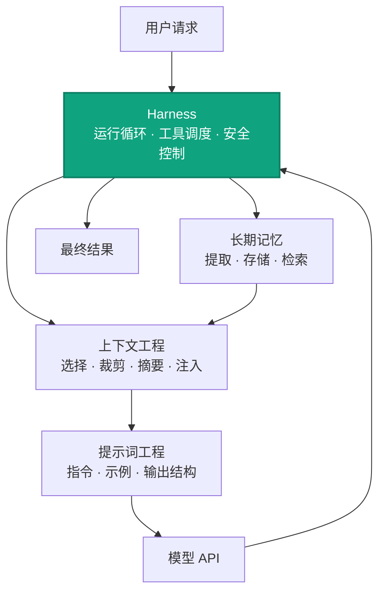
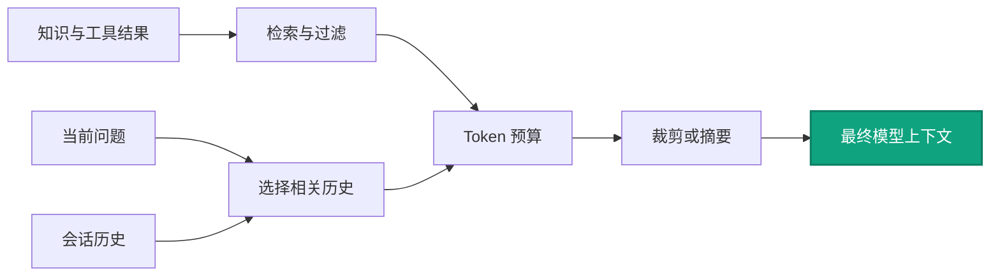
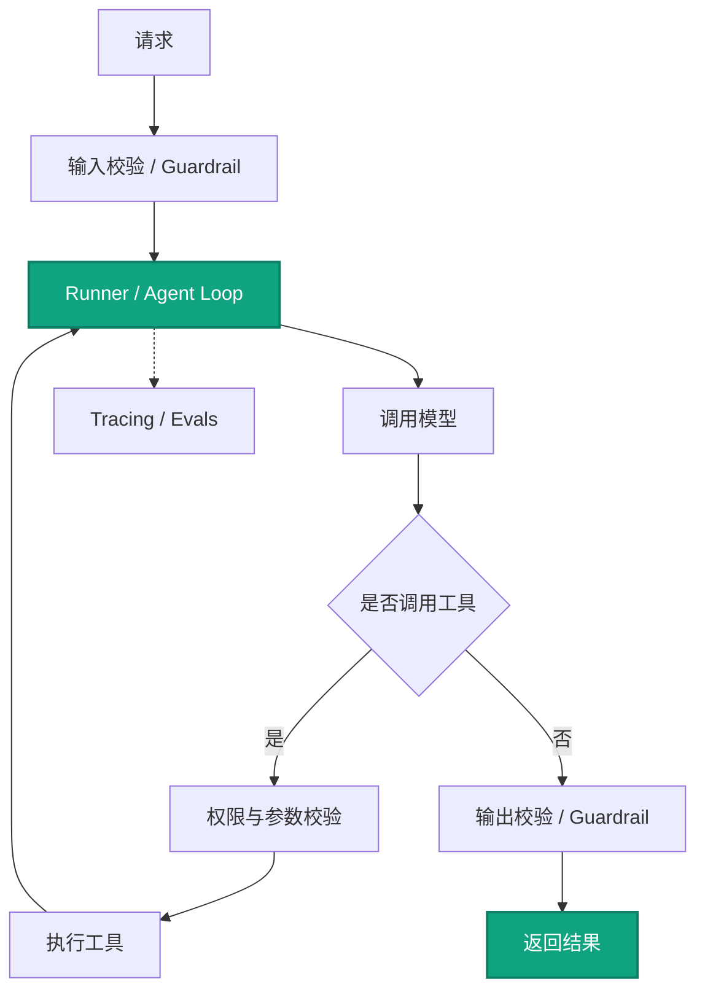

# Agent 工程：提示词、上下文、记忆与 Harness

Agent 应用不只是调用一次模型接口。一个可用的 Agent 系统通常同时包含提示词、上下文、记忆和 Harness 四个工程层次，它们解决的问题不同，也不能简单对应为几个模型参数。

---

## 1. 四类工程问题总览

| 工程概念 | 解决的问题 | 主要工程手段 | OpenAI API / Agents SDK 中的常用入口 |
|---|---|---|---|
| **提示词工程** | 怎样让模型理解任务、遵守规则并按指定格式回答？ | 指令分层、少样本示例、任务边界、输出 Schema、失败示例 | `developer` / `system`、`instructions`、Structured Outputs、`output_type`；`temperature` 只影响采样稳定性 |
| **上下文工程** | 怎样在上下文窗口和成本限制内，为当前调用提供最有价值的信息？ | 历史裁剪、摘要压缩、检索、工具结果筛选、Token 预算、上下文优先级 | `messages`、Responses `input`、`previous_response_id`、Session；`max_completion_tokens` 主要限制输出，不负责压缩输入 |
| **长期记忆** | 怎样跨会话保存并找回用户偏好、事实和任务状态？ | 记忆提取、外部存储、更新与遗忘策略、权限隔离、检索与实时注入 | 数据库、向量库或键值存储；在调用前注入 `messages` / `input`，也可结合 Session 和 RAG |
| **Harness 工程** | 怎样让 Agent 可运行、可停止、可测试、可观察并受到安全约束？ | Agent Loop、工具调度、超时与重试、最大轮数、Guardrails、审批、Tracing、Evals、回归测试 | Agents SDK `Runner`、`max_turns`、Tools、Guardrails、Sessions、Tracing；业务权限仍由后端控制 |

> `seed`、`logit_bias` 和 `logprobs` 是模型调用层参数，不是 Harness 工程的核心构件。Harness 可以在测试或诊断时使用它们，但不能依靠这些参数完成权限控制、安全隔离或自动化评估。

---

## 2. 四层之间的关系



可以将它们理解为：

1. 长期记忆保存可能有用的信息。
2. 上下文工程决定本次调用真正携带哪些信息。
3. 提示词工程告诉模型如何使用这些信息完成任务。
4. Harness 负责组织整个运行过程并处理模型之外的工程约束。

---

## 3. 提示词工程

提示词工程的重点不是堆砌形容词，而是明确任务契约：

- **角色与目标**：模型负责什么，不负责什么。
- **输入边界**：哪些内容可信，哪些属于不可信用户输入。
- **执行规则**：什么时候调用工具，什么时候拒绝或请求补充信息。
- **输出契约**：字段、类型、枚举值和必填项。
- **示例与反例**：展示正确输出以及容易误解的边界。

常见接口入口：

```text
Chat Completions: developer/system + messages + response_format
Responses API:     instructions + input + text.format
Agents SDK:        Agent(instructions=..., output_type=...)
```

`temperature` 可以影响输出的发散程度，但低 `temperature` 不等于更正确，也不能代替 Schema 校验、工具权限和业务规则。

---

## 4. 上下文工程

上下文工程处理的是“本次模型调用应该看到什么”，不只是保存完整聊天记录。

典型处理流程：



核心策略包括：

- 优先保留当前任务、开发者规则和关键工具结果。
- 删除重复、过期和与当前问题无关的历史。
- 长对话使用摘要或 compaction，而不是无限追加消息。
- 检索结果按相关性、权限、时效性和长度过滤。
- 分别控制输入预算和输出预算。

`max_tokens` 已逐步由 `max_completion_tokens` 取代，它限制的是生成输出上限，不会自动缩短 `messages` 或解决上下文超限问题。

---

## 5. 长期记忆

长期记忆不是“把所有聊天记录都放进向量库”。完整流程通常包括：

```text
识别值得记忆的信息
→ 结构化提取
→ 带用户、租户和来源信息存储
→ 根据当前任务检索
→ 过滤冲突、过期和无权限内容
→ 注入本次模型上下文
```

常见记忆类型：

| 类型 | 示例 | 推荐存储方式 |
|---|---|---|
| 用户偏好 | 语言、格式、常用门店 | 结构化数据库或键值存储 |
| 业务事实 | 门店归属、项目状态 | 权威业务数据库，不应由模型自行改写 |
| 对话摘要 | 上次讨论结论、待办事项 | 会话表或摘要表 |
| 非结构化知识 | 文档、制度、案例 | RAG / 向量检索，并保留来源 |

长期记忆必须具备更新、删除、过期、冲突处理和权限隔离机制。RAG 是一种检索手段，不等于完整的长期记忆系统。

---

## 6. Harness 工程

Harness 是包围模型调用的运行与治理层。它通常负责：

- 维护 Agent Loop，判断继续调用工具还是返回最终答案。
- 校验工具名称、参数 Schema、调用权限和工具结果。
- 设置 `max_turns`、超时、重试、并发和成本上限。
- 对高风险写操作增加人工审批、幂等和审计。
- 使用输入、输出和工具 Guardrails 做规则检查。
- 记录模型调用、工具调用、耗时、Token 和异常链路。
- 运行离线 Evals、回归数据集和线上质量监控。



模型不能作为最终安全边界。即使使用 Agents SDK，认证、租户隔离、数据权限、写操作审批和事务控制仍应由业务后端执行。

---

## 7. `seed`、`logit_bias` 与 `logprobs` 应该怎样归类

| 参数 | 准确作用 | 不应该怎样理解 |
|---|---|---|
| `seed` | 尝试提高重复请求的采样一致性，便于部分回归测试 | 已被标记为 deprecated，而且官方不保证完全确定性，不能作为 Harness 测试框架 |
| `logit_bias` | 按 Token ID 调整生成概率 | 不是可靠的业务禁词或安全机制；分词、空格和字符变体都可能绕过单个 Token 限制 |
| `logprobs` | 返回输出 Token 的对数概率，可用于分析候选 Token 和生成分布 | 不能直接当成答案正确率或业务置信度；正确性仍需规则、检索证据或评测数据验证 |

因此，更准确的 Harness 对应关系是：

```text
自动化测试  → 固定测试集 + 断言/Grader + 回归比较
对齐评估    → Evals + 人工标注 + 任务级指标
安全护栏    → Guardrails + 权限校验 + 工具白名单 + 审批
稳定运行    → max_turns + 超时 + 重试 + 幂等 + 限流
问题诊断    → Tracing + 日志 + Token/耗时/错误指标
```

---

## 8. 推荐的落地顺序

1. 先定义业务任务、成功标准和禁止边界。
2. 设计工具及其权限、参数和返回结构。
3. 编写提示词和结构化输出 Schema。
4. 建立上下文裁剪、检索和 Token 预算策略。
5. 按需要增加会话状态和长期记忆。
6. 实现最大轮数、超时、重试、Guardrails 和审批。
7. 建立 Tracing、离线 Evals 和线上质量监控。

---

## 9. 常见问答

### 9.1 提示词工程、上下文工程、长期记忆和 Harness 是同一层吗？

不是。提示词工程定义模型如何完成任务；上下文工程决定本次调用让模型看到什么；长期记忆负责跨会话保存和找回信息；Harness 负责运行循环、工具调度、安全控制、测试和可观测性。四者相互配合，但职责不能混为一谈。

### 9.2 `developer` 是把以前的 `system` 改名了吗？

不是简单改名。Chat Completions 仍定义了 `developer` 和 `system` 两种角色；对于 `o1` 及更新的 OpenAI 模型，优先使用 `developer` 承载开发者指令。第三方 OpenAI-compatible 服务是否支持 `developer`，需要按具体服务商确认。

### 9.3 `messages` 必须按照 `developer → user → assistant` 严格交替吗？

不需要。推荐把稳定的开发者规则放在前部，后续消息按照真实发生顺序排列。工具调用时通常是：

```text
developer → user → assistant(tool_calls) → tool → assistant
```

因此，请求中的最后一条消息不一定是 `user`，继续处理工具结果时通常是 `tool`。详细示例参见 [Chat Completions 消息角色](../openai/chat-completions-responses-agents/index.md#22)。

### 9.4 `stop` 可以用来禁止模型说出敏感词吗？

不建议。`stop` 是生成停止序列，匹配后会提前结束输出，并不是敏感词过滤机制。例如使用 `stop=["}"]` 生成 JSON，可能导致右大括号被截断，最终得到无效 JSON。结构化数据应优先使用 Structured Outputs 和 Schema 校验。

### 9.5 `logit_bias=-100` 能作为可靠的业务禁词吗？

不能。`logit_bias` 调整的是 Token 概率，而不是完整词语的业务规则。空格、大小写、字符变体和不同分词结果都可能对应不同 Token。敏感内容限制应由输入输出过滤、Guardrails 和业务后端共同实现。

### 9.6 `frequency_penalty` 和 `presence_penalty` 能保证模型不重复吗？

不能。它们只是降低部分 Token 再次出现的概率，属于软采样控制。设置过高还可能破坏代码、JSON 字段、专有名词和需要重复出现的业务术语。Harness 仍需通过最大轮数、重复检测和异常终止处理死循环。

### 9.7 `logprobs` 可以当成答案正确率或业务置信度吗？

不能直接等同。`logprobs` 描述模型生成某些 Token 时的相对概率，不代表事实正确、工具结果可信或业务判断可靠。答案质量应通过来源证据、规则校验、固定评测集和任务级指标验证。

### 9.8 `max_tokens` 或 `max_completion_tokens` 能解决上下文过长吗？

不能。它们主要限制模型的生成输出；其中 `max_tokens` 已逐步由 `max_completion_tokens` 取代。输入上下文过长仍需通过历史裁剪、摘要、检索过滤、compaction 和 Token 预算解决。

### 9.9 长期记忆就是把全部历史放进 RAG 吗？

不是。长期记忆需要判断什么值得保存，并处理结构化存储、更新、遗忘、冲突、权限和检索注入。RAG 只是非结构化内容的一种检索方式，用户偏好、会话状态和权威业务事实通常更适合结构化存储。

### 9.10 Harness 工程的核心就是 `seed`、`logit_bias` 和 `logprobs` 吗？

不是。这三个属于模型调用层参数。Harness 的核心是 Agent Loop、工具执行、`max_turns`、超时重试、Guardrails、审批、Tracing、Evals、回归测试和异常处理。`seed` 已被标记为 deprecated，而且只尝试提高采样一致性，不能代替测试框架。

### 9.11 OpenAI Agents SDK 是否只支持 Responses API？

不是。Agents SDK 对 OpenAI 模型默认并推荐使用 Responses API，同时保留 Chat Completions 兼容实现。两条路径能力不完全相同，部分新工具能力只适用于 Responses 路径。SDK 负责 Agent Runtime，但认证、租户隔离、数据权限、事务和高风险操作审批仍由业务系统负责。

---

## 10. 参考资料

- [Chat Completions API 参数](https://developers.openai.com/api/reference/resources/chat/subresources/completions/methods/create)
- [OpenAI Agents SDK](https://openai.github.io/openai-agents-python/)
- [运行 Agents 与 `max_turns`](https://openai.github.io/openai-agents-python/running_agents/)
- [Agents SDK Guardrails](https://openai.github.io/openai-agents-python/guardrails/)
- [Agents SDK Tracing](https://openai.github.io/openai-agents-python/tracing/)
