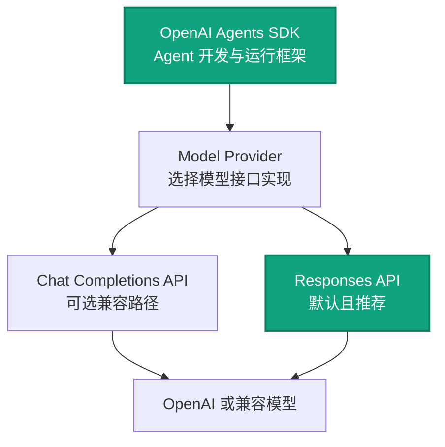
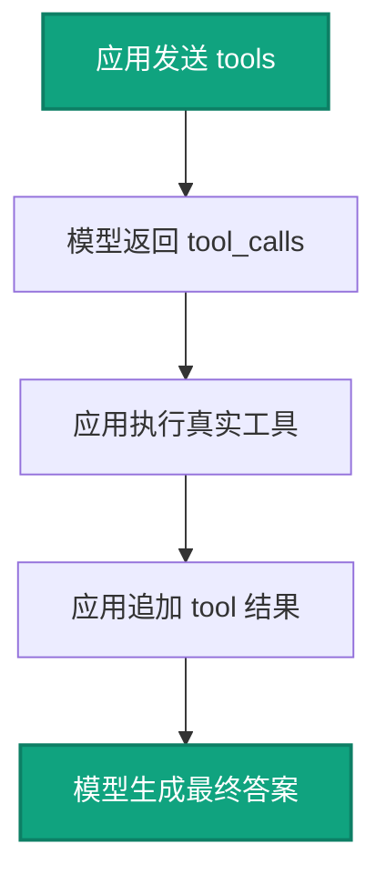
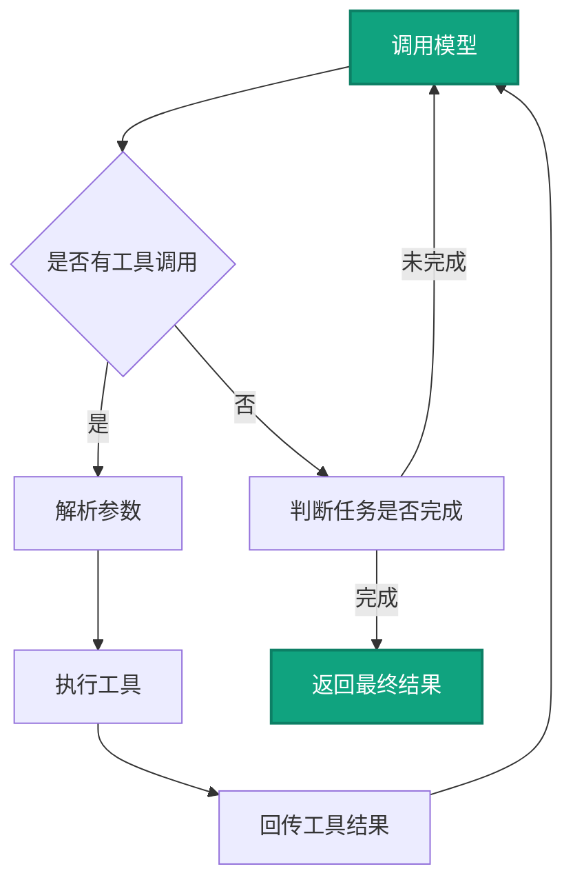
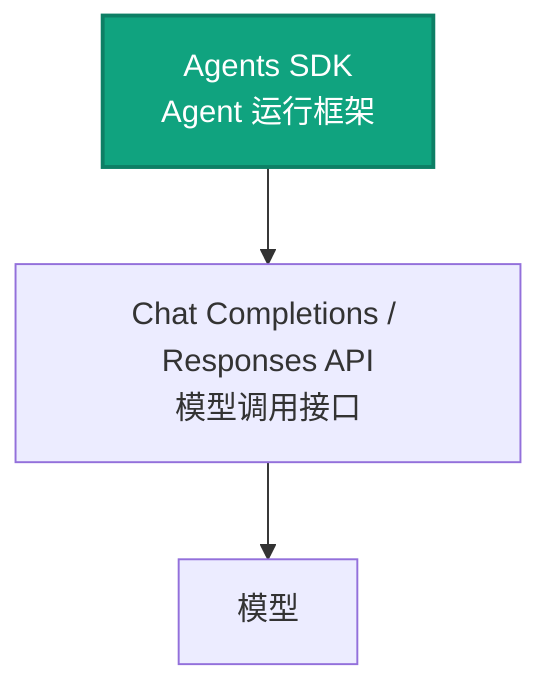
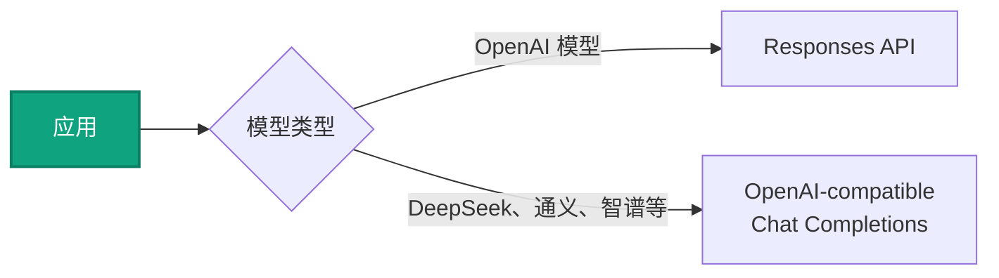
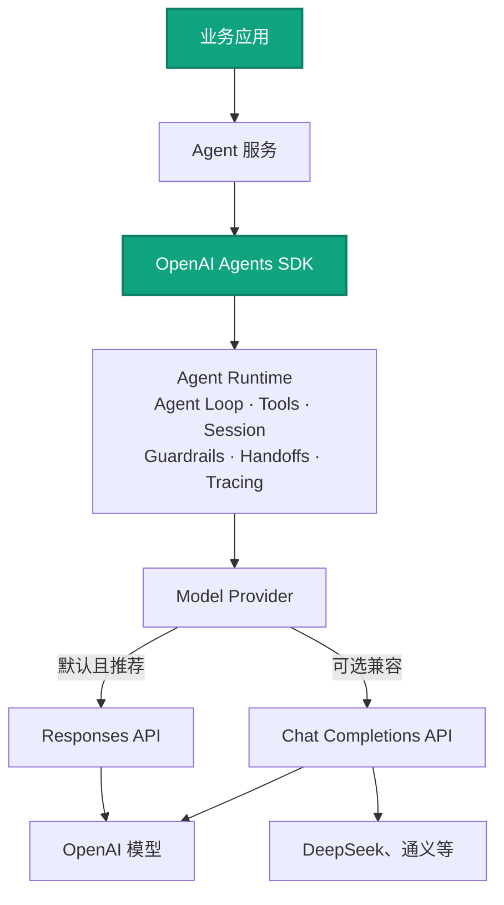

# OpenAI Chat Completions、Responses API 与 Agents SDK

本专题面向团队技术分享，系统介绍 OpenAI 的三种常见开发方式：

- **Chat Completions API**：传统消息式模型接口
- **Responses API**：OpenAI 新一代统一模型接口
- **OpenAI Agents SDK**：建立在模型接口之上的 Agent 运行框架

[打开样式丰富的 HTML 阅读版](./openai_api_team_sharing.html)

---

**阅读目录**

- [1. 三者关系](#1)
- [2. Chat Completions API](#2-chat-completions-api)
- [3. Responses API](#3-responses-api)
- [4. 两种模型 API 的根本差异](#4-api)
- [5. OpenAI Agents SDK](#5-openai-agents-sdk)
- [6. 综合对比与选型](#6)
- [7. 最终架构关系](#7)

---

## 1. 三者处于什么层次



| 技术 | 定位 | 主要作用 |
|---|---|---|
| Chat Completions API | 传统模型接口 | 发送消息历史，获得模型回复或工具调用请求 |
| Responses API | 新一代统一模型接口 | 统一推理、工具、多模态和上下文能力 |
| Agents SDK | Agent 运行框架 | 管理模型调用、工具循环、Session、Tracing 和多 Agent 编排 |

> **核心结论**
>
> Responses API 和 Chat Completions API 都是模型调用接口；Agents SDK 是建立在模型接口之上的 Agent Runtime。当前 Agents SDK 对 OpenAI 模型默认、推荐使用 Responses API，但仍支持通过 `OpenAIChatCompletionsModel` 使用 Chat Completions。
>
> - **默认路径**：Agents SDK → Model Provider → Responses API → OpenAI 模型。
> - **兼容路径**：Agents SDK → Model Provider → Chat Completions API → OpenAI 或兼容模型。
> - **能力边界**：Chat Completions 路径可用，但不能使用仅由 Responses API 提供的新工具能力。

---

## 2. Chat Completions API

### 2.1 基础调用

```python
from openai import OpenAI

client = OpenAI()

response = client.chat.completions.create(
    model="gpt-5.6",
    messages=[
        {
            "role": "developer",
            "content": "你是一个专业的业务分析助手。"
        },
        {
            "role": "user",
            "content": "查询最近7天风险门店。"
        }
    ]
)

print(response.choices[0].message.content)
```

Chat Completions 的核心数据结构是：

```python
messages = [...]
```

每次调用时，应用需要将模型应当知道的上下文按照顺序放入 `messages`。

---

### 2.2 消息角色

常见角色包括：

```text
developer
system
user
assistant
tool
```

#### 2.2.1 developer

`developer` 用于承载开发团队定义的稳定规则：

```json
{
    "role": "developer",
    "content": "你是企业经营数据分析助手。\n\n必须遵守：\n1. 使用中文回答。\n2. 先给管理结论，再给数据依据。\n3. 业务数据必须通过工具查询。\n4. 不允许编造业务数据。\n5. 工具返回权限错误时，不得绕过权限。"
}
```

适合放入：

- 模型身份
- 业务规则
- 输出格式
- 工具调用规则
- 安全限制
- 数据口径
- 禁止事项

#### 2.2.2 system

`system` 是早期 Chat Completions 中常用的系统指令角色：

```json
{
    "role": "system",
    "content": "你是一个专业的业务分析助手。"
}
```

对于 `o1` 及更新的 OpenAI 模型，优先使用 `developer` 承载开发者指令；`developer` 并不是把 `system` 简单改名，两种角色仍分别存在。很多第三方 OpenAI-compatible 接口仍主要使用 `system`，接入时需要按具体模型和服务商确认。

#### 2.2.3 user

`user` 表示用户输入：

```json
{
    "role": "user",
    "content": "查询最近7天的高风险门店。"
}
```

用户输入属于不可信内容，因此不能仅依赖 Prompt 做权限控制。

#### 2.2.4 assistant

`assistant` 表示模型此前的回答，或者模型发起的工具调用。

普通回答：

```json
{
    "role": "assistant",
    "content": "最近7天共发现3家高风险门店。"
}
```

工具调用：

```json
{
    "role": "assistant",
    "content": null,
    "tool_calls": [
        {
            "id": "call_001",
            "type": "function",
            "function": {
                "name": "query_risk_stores",
                "arguments": "{\"days\":7,\"risk_level\":\"high\"}"
            }
        }
    ]
}
```

#### 2.2.5 tool

`tool` 表示应用执行工具后返回给模型的结果：

```json
{
    "role": "tool",
    "tool_call_id": "call_001",
    "content": "{\"total\":3,\"stores\":[{\"store_id\":\"S001\",\"store_name\":\"杭州西湖店\",\"risk_score\":91}]}"
}
```

`tool_call_id` 必须对应模型此前返回的工具调用 ID。

#### 2.2.6 消息顺序与边界

推荐把稳定的开发者规则放在消息数组前部，随后按照实际发生顺序保留 `user`、`assistant` 和 `tool` 消息。但这是一种便于维护和提高提示词稳定性的组织方式，不是“所有消息必须严格交替”的协议约束。

普通问答通常是：

```text
developer → user → assistant → user
```

调用工具时则会出现：

```text
developer → user → assistant(tool_calls) → tool → assistant
```

因此需要注意：

- `user` 与 `assistant` 不要求严格交替，应用可以根据实际上下文组织消息。
- 发起工具调用的 `assistant` 后面，应跟随与 `tool_call_id` 对应的 `tool` 结果。
- 普通问答请求的最后一条消息通常是当前 `user` 问题。
- 工具调用循环中，继续请求模型生成最终回答时，最后一条消息通常是 `tool`，不一定是 `user`。
- 保存完整历史时，最后一条也可能是 `assistant`；收到新问题后，再追加新的 `user` 消息。

具体可用角色和字段以 [Chat Completions API](https://developers.openai.com/api/reference/resources/chat/subresources/completions/methods/create) 及所选模型的支持范围为准。

---

### 2.3 完整多轮历史

```python
messages = [
    {
        "role": "developer",
        "content": "你是企业经营数据分析助手，业务数据必须通过工具查询，禁止编造数据。"
    },
    {
        "role": "user",
        "content": "最近公司的巡店情况怎么样？"
    },
    {
        "role": "assistant",
        "content": "可以从巡店覆盖率、风险门店和整改闭环几个方面分析。"
    },
    {
        "role": "user",
        "content": "先看最近7天风险最高的门店。"
    },
    {
        "role": "assistant",
        "content": None,
        "tool_calls": [
            {
                "id": "call_risk_001",
                "type": "function",
                "function": {
                    "name": "query_risk_stores",
                    "arguments": "{\"start_date\":\"2026-07-08\",\"end_date\":\"2026-07-14\",\"risk_level\":\"high\",\"limit\":10}"
                }
            }
        ]
    },
    {
        "role": "tool",
        "tool_call_id": "call_risk_001",
        "content": "{\"total\":3,\"stores\":[{\"store_id\":\"S001\",\"store_name\":\"杭州西湖店\",\"risk_score\":91}]}"
    },
    {
        "role": "assistant",
        "content": "最近7天共发现3家高风险门店，其中杭州西湖店风险最高。"
    },
    {
        "role": "user",
        "content": "这些门店的整改闭环情况怎么样？"
    }
]
```

“这些门店”之所以能被理解，是因为前面的工具调用、工具结果和模型回答都保留在历史中。

#### 2.3.1 带历史压缩与长期记忆的请求报文

当对话越来越长时，应用通常不会无限追加全部原始消息，而是保留 **历史摘要 + 相关长期记忆 + 最近几轮原文**。下面是一个可直接发送给 Chat Completions API 的 JSON 请求体示例：

```json
{
  "model": "gpt-5.6",
  "messages": [
    {
      "role": "developer",
      "content": "你是企业经营数据分析助手。只能依据给定上下文或工具结果回答；业务数据需要通过工具核实；长期记忆只用于个性化表达，不能作为权限依据。"
    },
    {
      "role": "developer",
      "content": "【历史压缩摘要｜应用生成】\n覆盖范围：msg_0001 至 msg_0048\n生成时间：2026-07-16T09:30:00+08:00\n已确认事实：最近7天共发现3家高风险门店；杭州西湖店风险得分91，主要问题涉及冷链温控和整改超时。\n已完成动作：查询风险门店列表，并查看杭州西湖店的主要风险证据。\n待处理事项：尚未生成面向区域经理的汇报提纲；整改是否闭环仍需后续通过工具核实。"
    },
    {
      "role": "developer",
      "content": "【长期记忆｜外部记忆库检索】\nmemory_id：mem_user_preference_017\n来源：用户明确偏好\n更新时间：2026-06-20T14:10:00+08:00\n置信度：high\n内容：用户偏好先给结论，再列证据、风险和下一步动作；汇报对象通常是区域经理。\n使用限制：仅影响回答结构，不扩大用户的数据范围或工具权限。"
    },
    {
      "role": "assistant",
      "content": "目前已确认杭州西湖店风险最高，风险得分91，主要问题是冷链温控异常和整改超时。"
    },
    {
      "role": "user",
      "content": "按我习惯的格式，把目前已知情况整理成给区域经理的汇报提纲。"
    }
  ]
}
```

这段报文的组织顺序是：

```text
固定规则 → 历史压缩摘要 → 相关长期记忆 → 最近原始消息 → 当前问题
```

需要注意：

- `历史压缩摘要` 和 `长期记忆` 不是 Chat Completions API 的内置顶层字段，而是应用整理后注入 `messages` 的普通上下文。
- 历史摘要应记录覆盖范围、生成时间、已确认事实、已完成动作和待处理事项，避免只保留模糊结论。
- 长期记忆应带有 `memory_id`、来源、更新时间和置信度，便于去重、失效和审计；每次只检索与当前问题相关的少量记忆。
- 最近几轮原始消息仍应保留，避免摘要丢失语气、指代关系、工具调用参数或用户刚刚修正的信息。
- 长期记忆不能决定租户、门店、区域或工具权限。真正的权限必须由后端、Tool Gateway 或 Harness 强制校验。
- 如果当前问题需要最新业务数据，应重新调用工具核实，不能因为摘要或长期记忆中出现过某个数值就直接当成当前事实。

---

### 2.4 工具定义

```python
tools = [
    {
        "type": "function",
        "function": {
            "name": "query_risk_stores",
            "description": "查询指定日期范围内的风险门店。",
            "strict": True,
            "parameters": {
                "type": "object",
                "properties": {
                    "start_date": {
                        "type": "string",
                        "description": "开始日期，YYYY-MM-DD"
                    },
                    "end_date": {
                        "type": "string",
                        "description": "结束日期，YYYY-MM-DD"
                    },
                    "risk_level": {
                        "type": "string",
                        "enum": ["low", "medium", "high", "all"]
                    },
                    "limit": {
                        "type": "integer",
                        "minimum": 1,
                        "maximum": 100
                    }
                },
                "required": ["start_date", "end_date", "risk_level", "limit"],
                "additionalProperties": False
            }
        }
    }
]
```

工具定义本身不会自动执行数据库查询。



---

### 2.5 常用参数

| 参数 | 作用 | 说明 |
|---|---|---|
| `model` | 指定模型 | 不同模型支持的参数和能力不同 |
| `temperature` | 控制随机性 | 数据分析和工具调用通常使用 0～0.3 |
| `top_p` | 核采样 | 通常与 temperature 二选一调整 |
| `stop` | 停止序列 | 不是敏感词过滤，部分模型不支持 |
| `max_completion_tokens` | 限制输出 Token | 不等于字符数 |
| `tool_choice` | 控制工具选择 | 支持 auto、none、强制指定工具 |
| `parallel_tool_calls` | 并行工具调用 | 适合读取，写操作要谨慎 |
| `n` | 候选答案数量 | Agent 场景通常使用 1 |
| `stream` | 流式输出 | 工具参数可能被拆分成多段 |
| `response_format` | 结构化输出 | 优先使用 JSON Schema |
| `store` | 平台存储策略 | 企业应用按合规要求设置 |
| `metadata` | 跟踪元数据 | 不要放敏感信息 |

#### 2.5.1 temperature

```python
temperature=0.2
```

低 temperature 让输出更稳定，但不等于更正确。

#### 2.5.2 top_p

```python
top_p=0.9
```

一般建议与 `temperature` 二选一调整。

#### 2.5.3 stop

更准确的名称是停止序列：

```python
stop=["<END>", "【回答结束】"]
```

它不是敏感词过滤，也不能代替数据脱敏。

#### 2.5.4 max_completion_tokens

```python
max_completion_tokens=1200
```

限制输出 Token，不等于限制中文字数。

#### 2.5.5 tool_choice

```python
tool_choice="auto"
```

```python
tool_choice="none"
```

```python
tool_choice={
    "type": "function",
    "function": {
        "name": "query_risk_stores"
    }
}
```

#### 2.5.6 response_format

```python
response_format={
    "type": "json_schema",
    "json_schema": {
        "name": "risk_store_report",
        "strict": True,
        "schema": {
            "type": "object",
            "properties": {
                "summary": {"type": "string"},
                "risk_store_count": {"type": "integer"}
            },
            "required": ["summary", "risk_store_count"],
            "additionalProperties": False
        }
    }
}
```

`tools.parameters` 约束工具参数；`response_format` 约束最终回答格式。

---

## 3. Responses API

### 3.1 基础调用

```python
from openai import OpenAI

client = OpenAI()

response = client.responses.create(
    model="gpt-5.6",
    instructions="你是一个专业的业务分析助手。",
    input="查询最近7天风险门店。"
)

print(response.output_text)
```

主要变化：

```text
messages → input
developer/system → instructions
choices[0].message.content → output_text
```

Responses API 并不只是参数改名，而是重新设计了输入和输出模型。

---

### 3.2 核心结构：Item

Chat Completions 主要围绕 Message，Responses API 主要围绕 Item。

一个 Response 的输出可能包括：

- reasoning
- function_call
- message
- web_search_call
- file_search_call
- computer_call

```json
{
  "output": [
    {
      "type": "reasoning"
    },
    {
      "type": "function_call",
      "name": "query_risk_stores",
      "call_id": "call_001",
      "arguments": "{\"days\":7}"
    }
  ]
}
```

---

### 3.3 多轮上下文

#### 3.3.1 手工传递 input 历史

```python
response = client.responses.create(
    model="gpt-5.6",
    instructions="你是企业经营数据分析助手。",
    input=[
        {"role": "user", "content": "查询高风险门店。"},
        {"role": "assistant", "content": "共有3家。"},
        {"role": "user", "content": "整改情况怎么样？"}
    ]
)
```

#### 3.3.2 previous_response_id

```python
response1 = client.responses.create(
    model="gpt-5.6",
    instructions="你是企业经营数据分析助手。",
    input="查询最近7天高风险门店。"
)

response2 = client.responses.create(
    model="gpt-5.6",
    instructions="你是企业经营数据分析助手。",
    previous_response_id=response1.id,
    input="这些门店整改闭环怎么样？"
)
```

企业系统仍应保存自己的业务会话、工具记录和审计数据。

---

### 3.4 工具定义

```python
tools = [
    {
        "type": "function",
        "name": "query_risk_stores",
        "description": "查询指定日期范围内的风险门店。",
        "strict": True,
        "parameters": {
            "type": "object",
            "properties": {
                "start_date": {"type": "string"},
                "end_date": {"type": "string"},
                "risk_level": {
                    "type": "string",
                    "enum": ["low", "medium", "high", "all"]
                },
                "limit": {"type": "integer"}
            },
            "required": ["start_date", "end_date", "risk_level", "limit"],
            "additionalProperties": False
        }
    }
]
```

与 Chat Completions 的差异：

```text
Chat Completions: tools[].function.name
Responses API:    tools[].name
```

---

### 3.5 工具调用结果

```python
for item in response.output:
    if item.type == "function_call":
        print(item.name)
        print(item.arguments)
        print(item.call_id)
```

工具执行完成后：

```json
{
    "type": "function_call_output",
    "call_id": "call_001",
    "output": "{\"total\":3,\"stores\":[...]}"
}
```

| Chat Completions | Responses API |
|---|---|
| `role=tool` | `function_call_output` |
| `tool_call_id` | `call_id` |
| `content` | `output` |

---

### 3.6 常用参数

| 参数 | 作用 |
|---|---|
| `instructions` | 开发者稳定规则 |
| `input` | 当前输入、历史消息和其他 Item |
| `max_output_tokens` | 限制输出 Token |
| `reasoning` | 控制推理投入 |
| `tool_choice` | 控制工具选择 |
| `parallel_tool_calls` | 是否允许并行工具调用 |
| `truncation` | 上下文超限策略 |
| `store` | 平台存储策略 |
| `metadata` | 非敏感跟踪信息 |

示例：

```python
response = client.responses.create(
    model="gpt-5.6",
    instructions="你是企业经营数据分析助手。",
    input="查询最近7天风险门店。",
    tools=tools,
    tool_choice="auto",
    parallel_tool_calls=True,
    max_output_tokens=1200,
    reasoning={"effort": "medium"},
    truncation="disabled",
    store=False,
    metadata={"application": "business-agent"}
)
```

Responses API 没有与传统 `stop` 完全等价的参数，通常通过输出长度、instructions、结构化输出或应用层截断控制。

---

### 3.7 参数迁移对照

| Chat Completions | Responses API | 说明 |
|---|---|---|
| `messages` | `input` | 输入历史 |
| `developer/system` | `instructions` | 开发者规则 |
| `choices[0].message.content` | `output_text` | 最终文本 |
| `choices` | `output` | 类型化输出 Item |
| `max_completion_tokens` | `max_output_tokens` | 输出限制 |
| `tools[].function.name` | `tools[].name` | 工具定义位置 |
| `message.tool_calls` | `function_call Item` | 模型发起工具调用 |
| `role=tool` | `function_call_output` | 工具执行结果 |
| `tool_call_id` | `call_id` | 关联工具调用 |
| `response_format` | `text.format` | 结构化输出 |
| `n` | 无直接对应 | Responses 通常一次一份响应 |
| `stop` | 无直接对应 | 通过其他方式控制 |

---

## 4. 两种模型 API 的根本差异

### 4.1 Chat Completions

核心单位：

```text
Message
```

执行过程：


### 4.2 Responses API

核心单位：

```text
Item
```

执行过程：


Responses API 更适合承载推理、多模态、托管工具、MCP 和 Agent 场景。

---

## 5. OpenAI Agents SDK

Agents SDK 不是新的底层模型 API，而是模型接口之上的 Agent 运行框架。

### 5.1 默认接口与兼容接口

当前 OpenAI Agents SDK 的模型支持不是“只支持 Responses API”，也不是“只支持 Chat Completions”：

- `OpenAIResponsesModel`：默认且推荐，使用 Responses API。
- `OpenAIChatCompletionsModel`：可选兼容实现，使用 Chat Completions API。
- 两种模型接口的能力并不完全相同；托管工具、延迟工具加载等部分新能力只适用于 Responses 路径。
- 同一工作流中可以使用不同模型实现，但应先核对各接口支持的工具和上下文能力。

参考：[OpenAI Agents SDK 模型说明](https://openai.github.io/openai-agents-python/models/)、[Agents SDK 与 Responses API 的选择](https://openai.github.io/openai-agents-python/)。

### 5.2 基础示例

```python
from agents import Agent, Runner, function_tool

@function_tool
def query_risk_stores(days: int) -> str:
    return "真实业务查询结果"

agent = Agent(
    name="业务分析助手",
    instructions="业务数据必须通过工具查询，禁止编造。",
    tools=[query_risk_stores]
)

result = Runner.run_sync(
    agent,
    "查询最近7天风险门店，并分析主要问题。"
)

print(result.final_output)
```

Agents SDK 主要提供：

- Agent 定义
- Runner
- Tool
- Session
- Guardrails
- Handoffs
- Tracing
- 生命周期管理
- Human in the Loop
- 多 Agent 编排

---

### 5.3 直接使用 API 与 Agents SDK 的区别

#### 5.3.1 直接使用 API

直接使用 API：



#### 5.3.2 使用 Agents SDK

使用 Agents SDK 时，上面的 Agent Loop 通常由 SDK 协助管理。



---

### 5.4 Agents SDK 不会自动解决什么

即使使用 Agents SDK，以下问题仍需业务系统处理：

- 多租户隔离
- 用户身份认证
- 数据权限
- 工具权限
- 写操作审批
- 数据脱敏
- 审计日志
- 幂等控制
- 限流
- 超时
- 业务事务
- 工作流状态
- 高风险操作确认

Agents SDK 是 Agent Runtime，不是完整业务平台。

关于提示词、上下文、长期记忆、Guardrails、Evals 和运行治理的完整分层，参见 [Agent 工程专题](../../agent-engineering/index.md)。

---

## 6. 综合对比与选型

### 6.1 三者完整对比

| 对比项 | Chat Completions | Responses API | Agents SDK |
|---|---|---|---|
| 定位 | 传统模型接口 | 新一代统一模型接口 | Agent 运行框架 |
| 核心结构 | Message | Item | Agent / Runner / Tool |
| 普通问答 | 支持 | 支持 | 支持 |
| 多轮对话 | 应用传递 messages | input 或 response 链 | Session |
| 工具调用 | 支持 | 支持 | 支持 |
| 工具执行循环 | 应用自己实现 | 应用自己实现 | SDK 管理 |
| 推理模型支持 | 相对传统 | 更完整 | 使用底层模型能力 |
| 托管工具 | 相对有限 | 重点支持 | 可封装使用 |
| MCP | 通常自行接入 | 支持相关能力 | 更方便集成 |
| 多 Agent | 自己实现 | 自己实现 | Handoff / Agent as Tool |
| Guardrail | 自己实现 | 自己实现 | SDK 提供机制 |
| Tracing | 自己实现 | 请求级 | 运行链路级 |
| 第三方模型兼容 | 最好 | 相对较弱 | 依赖 Provider 适配 |
| 开发工作量 | Agent 场景较大 | 中等 | 相对较小 |

---

### 6.2 如何选择

#### 6.2.1 普通聊天与文本生成

选择 Chat Completions API，尤其适合需要兼容多个第三方模型的场景。

#### 6.2.2 新开发的 OpenAI 应用

优先考虑 Responses API。

#### 6.2.3 需要连续调用多个工具

选择 OpenAI Agents SDK。

#### 6.2.4 需要兼容国内模型



---

## 7. 最终架构关系



最终记住四句话：

1. Chat Completions 是传统聊天模型接口。
2. Responses API 是 OpenAI 新一代统一模型接口。
3. Agents SDK 是建立在模型接口之上的 Agent 运行框架，默认使用 Responses API，同时保留 Chat Completions 兼容实现。
4. 企业权限、数据安全和业务执行边界仍然必须由业务系统控制。
