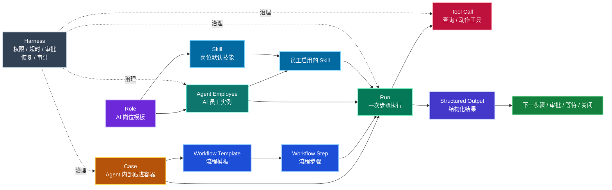
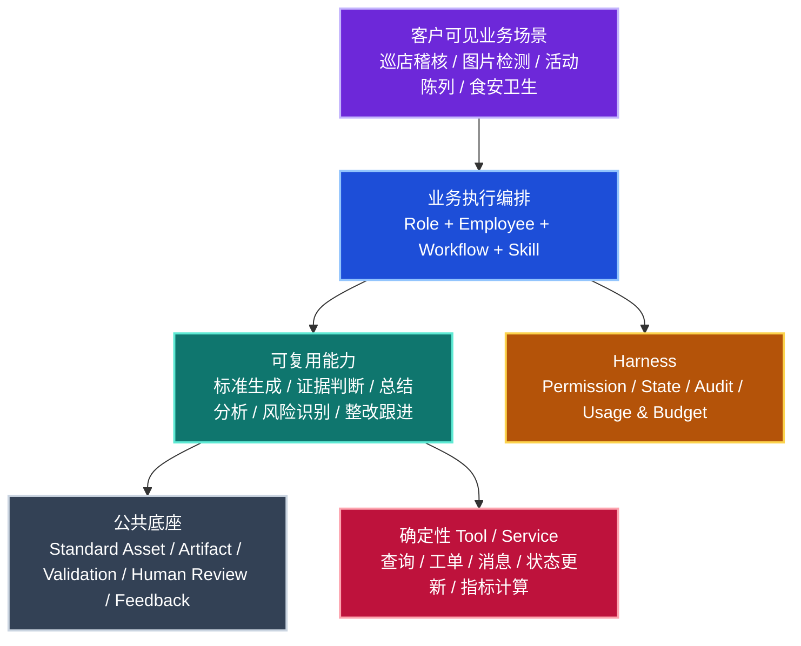
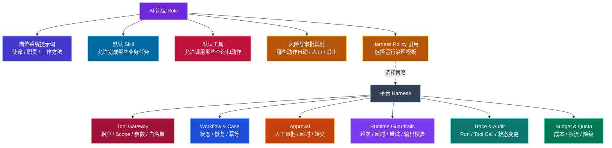
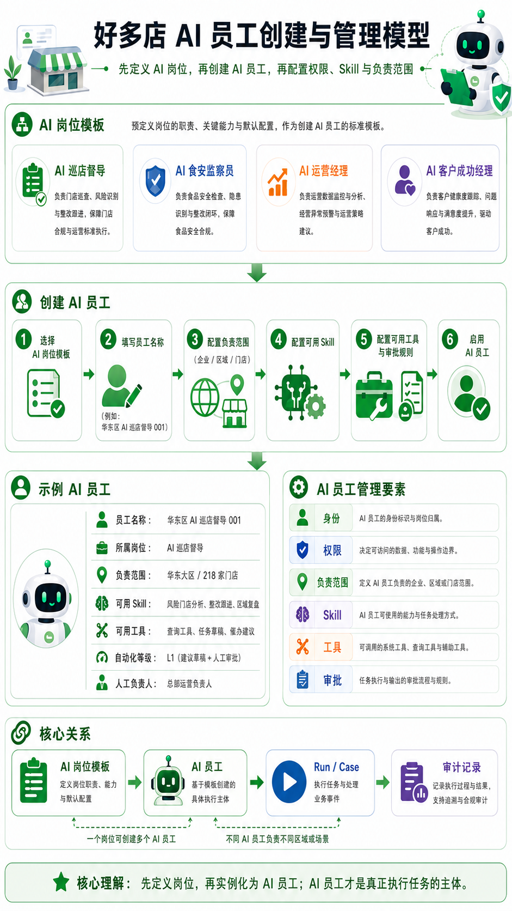
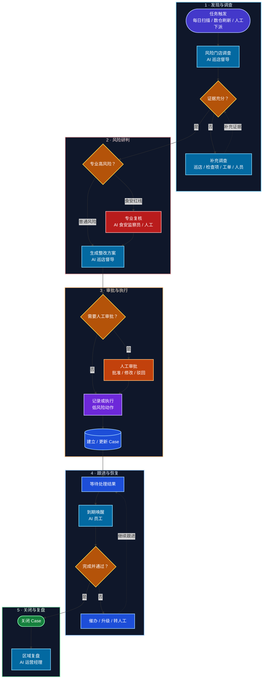

# 好多店 AI Native 业务执行系统需求文档

> **版本**：V0.1  
> **状态**：需求规划初稿  
> **日期**：2026-07-16  
> **适用对象**：产品、架构、研发、测试、数据、交付、运营  
> **第一阶段核心场景**：AI 巡店督导  
> **文档定位**：定义好多店 AI 员工体系的业务目标、核心对象、产品能力、首期范围和验收标准。本文不替代总体架构设计与详细系统设计。

---

## 0. 执行摘要

好多店已经具备门店、区域、人员岗位、巡店、检查项、整改工单、风险门店等业务对象，并通过 Hologres 数仓形成 DIM、DWD、DWS、ADS 分层数据产品。业务系统侧还已沉淀统一任务、Question 整改工单、巡店审核与申诉、AI 图片审核结果与人工复核等运行记录和服务能力，可通过现有 Service/API 适配为 Agent Tool，用于查询实时业务事实，以及在授权和审批通过后创建任务或工单、催办升级；AI 图片原始审核结果可以回写为待复核记录，并关联后续人工复核结果。

因此，Agent 的业务能力不能只建立在数仓查询上：Hologres 负责跨门店分析、历史趋势和聚合证据，现有业务系统接口负责实时对象查询和受控业务写入；Agent Service 负责编排、权限、审计和外部对象跟进，不复制任务、工单、审核或复核状态机。现有 Agent Service POC 已验证模型工具规划、Hologres 只读查询、租户与门店权限、固定 SQL、工具审计、证据检查和最终解读等基础能力，下一阶段需要继续验证业务 Service/API 的 Tool Adapter 与受控写入链路。

下一阶段不再把系统定位为“聊天问数”或“风险分析页面”，而是建设：

> **能够承担业务岗位、由事件唤醒、主动查数、调用工具、持续跟进并推动结果关闭的 AI Native 业务执行系统。**

首期以 **AI 巡店督导** 为第一个 AI 岗位，通过“风险发现—补充调查—生成整改建议—调用现有任务/工单/审批能力—持续跟进—关闭复盘”的完整链路，验证 AI 员工是否能够真正承担好多店组织中的业务责任。


---

## 1. 项目背景

### 1.1 当前业务基础

好多店现有业务系统已经沉淀了较完整的连锁门店管理能力，包括但不限于：

- 企业、品牌、区域、门店；
- 店长、督导、区域经理及岗位关系；
- 巡店任务、巡店记录、检查表、检查项；
- 店务任务、陈列任务及执行记录；
- 不合格问题、整改工单、复核和关闭状态；
- 风险门店、连续未巡、重复不合格、工单超时等管理指标；
- 多租户、区域、门店和用户数据权限。

现有 Hologres 数仓已经形成 ODS、DIM、DWD、DWS、ADS 分层，能够为 Agent 提供稳定、可解释、可下钻的业务数据。

### 1.2 当前 POC 的价值与局限

当前 `risk_store_analysis` POC 可以理解为未来 AI 巡店督导的一项 **“风险门店调查 Skill”**，它已经验证：

- 模型可以选择固定业务工具；
- Hologres 可以作为 Agent 的数据感知来源；
- Tool Gateway 可以限制租户、用户、门店、区域、日期和工具范围；
- 模型不能直接访问数据库或生成自由 SQL；
- Run、Tool Call、最终回答可以被审计和回放；
- 证据获取与最终解释可以分阶段执行。

当前 POC 仍然存在明确边界：

- 主要由用户提问触发；
- 只有一个只读 Skill；
- 不创建工单、不发送消息、不修改业务状态；
- 一次 Run 完成后即结束；
- 没有长期 Case、持续跟进和恢复机制；
- 尚未形成明确的 AI 岗位与 AI 员工体系。

因此，本次规划不会照搬 POC 的边界，而是复用其中已经验证的安全查询、工具治理和审计能力。

---

## 2. 建设目标

### 2.1 总体目标

建设好多店自己的 AI Native 业务执行系统，使 AI 能够以“业务员工”的形式进入组织和业务流程。

系统需要支持：

1. 定义不同 AI 岗位；
2. 基于岗位创建具体 AI 员工；
3. 为 AI 员工配置负责范围、Skill、工具、权限和审批等级；
4. 通过定时任务、业务事件、数仓刷新事件和人工任务唤醒 AI 员工；
5. 在流程步骤中指定 AI 员工使用对应 Skill 完成任务；
6. 通过结构化输出推动流程流转；
7. 对长期业务问题建立 Case，跨多次 Run 持续跟进；
8. 在高风险节点由人工审批或裁决；
9. 对全过程进行权限控制、恢复、审计和评价。

### 2.2 第一阶段目标

第一阶段以 **AI 巡店督导** 为核心，验证以下七项能力：

| 验证项 | 第一阶段目标 |
|---|---|
| AI 业务岗位 | 定义 AI 巡店督导的使命、职责、边界和 KPI |
| AI 员工实例 | 创建指定租户、区域和门店范围的 AI 巡店督导员工 |
| 主动触发 | 支持定时触发、数仓刷新完成触发和人工下派任务 |
| 自主查数 | 按需查询风险门店、巡店记录、检查项、工单和责任人 |
| 流程执行 | 在流程步骤中使用 Skill，输出结构化结果 |
| 持续跟进 | 建立 Case，并在未来时间再次唤醒和推进 |
| 人机协同 | 普通建议可自动生成，高风险动作必须人工审批 |

### 2.3 项目价值

对总部运营和区域管理人员：

- 减少重复查询、汇总、催办和复盘工作；
- 提高风险发现及时性；
- 提高整改闭环率；
- 缩短问题平均处理时间；
- 降低高频问题复发率；
- 让管理过程有证据、有记录、可追溯。

对好多店产品：

- 从“巡店和任务工具”升级为“标准执行与业务闭环平台”；
- 形成可持续扩展的 AI 岗位与 Skill 产品体系；
- 为图片检测、食安、陈列、运营分析、客户成功等场景提供共用底座。

---

## 3. 核心定义

整个项目统一采用以下五句话，不再混用“岗位、Agent、Skill、Workflow、Run、Case”等概念：

> **岗位定义“这个角色能做什么、应该怎么做、不能做什么”。**  
> **员工定义“谁在什么范围内承担这个岗位”。**  
> **流程定义“什么时候让谁完成哪一步”。**  
> **Skill 定义“这一类任务如何完成”。**  
> **Harness 保证执行过程受控、可恢复、可审批和可审计。**

产品展示与内部实现采用不同视角：

> **客户侧按业务场景理解和启用能力，内部按可复用 Skill、能力模块和确定性工具实现，底层由公共治理能力统一托底。**

业务场景是产品规划和导航视图，不是新的执行主体，也不等同于一个独立 Agent。真正承担责任和执行步骤的主体仍然是 Agent Employee；现有巡店、AI 巡检、工单、统一任务等业务域继续保留各自的配置和运行对象。

### 3.1 核心对象

| 对象 | 定义 | 示例 |
|---|---|---|
| Role | AI 岗位模板，定义使命、职责、默认 Skill、工具和规则 | AI 巡店督导 |
| Agent Employee | Role 实例化后的具体执行主体 | 华东区 AI 巡店督导 001 |
| Skill | 完成一类业务任务的方法、提示、工具和输出契约 | 风险门店分析 |
| Workflow | Agent Runtime 内部的确定性编排模板，定义推理、工具、等待、审批引用和恢复步骤 | 风险门店整改跟进流程 |
| Workflow Step | Agent 内部可执行、可校验、可暂停和可恢复的单一步骤 | 补充调查 |
| Case | Agent 对一件长期业务问题的内部跟进容器，用于跨多次 Run 保持上下文 | 西湖店后厨卫生整改跟进 |
| Run | 某个 AI 员工执行某一步的一次运行 | 2026-07-16 09:00 风险调查 |
| Tool | 确定性的数据查询或业务动作 | 查询工单、生成任务草稿 |
| Standard Asset | 可版本化、可验证、可复用的业务标准 | 检查项标准、食安红线、陈列规范 |
| Artifact | Run、Case 和人工处理过程中使用或产生的证据 | 图片、视频、巡店记录、报告、整改照片 |
| Validation | 使用样例集或历史数据验证标准、Skill 和模型版本的过程与结果 | 图片标准发布前回归验证 |
| Human Review | 对低置信度、高风险或策略要求结果进行人工裁决 | 图片改判、整改方案审批 |
| Feedback | 将改判、复检、关闭结果和用户反馈回流到标准与 Skill 优化 | 误判反馈、复发问题反馈 |
| Usage Policy | 对模型调用、媒体处理、抽样和租户额度进行控制的策略 | 每日额度、超量降级、抽样比例 |
| Harness | 包围模型执行的运行治理能力 | 权限、审批、恢复、审计 |

### 3.2 全对象关系



### 3.3 业务场景视图与内部能力边界

好多店面向客户提供的不是内部技术 Agent 列表。以下六类场景用于描述产品能力地图和检查需求覆盖，不预设必须新建统一的“场景中心”或 Scenario 数据模型：

| 场景类型 | 解决的问题 | 典型场景 |
|---|---|---|
| 验标类 | 门店提交的执行证据是否符合标准 | 图片检测、活动陈列、食安卫生、整改复检 |
| 贯标类 | 总部标准是否被正确传达并转为执行任务 | 新品上新、SOP 培训、考试与试制 |
| 稽核类 | 巡店结果如何汇总、预警和追踪 | 巡店稽核闭环、第三方稽核分析 |
| 督办类 | 问题是否持续推进直至关闭 | 整改任务、催办、升级、复核 |
| 反馈类 | 客户反馈和门店执行问题如何关联 | 客诉差评归因、误判反馈、标准优化 |
| 经营类 | 哪些门店或区域长期存在执行问题 | 门店健康度、区域复盘、风险趋势 |

内部实现分为三层：



边界规则：

1. 客户继续在现有业务域配置巡店、AI 巡检、检查项、任务和工单；在 AI 员工侧配置负责范围、Skill、自动化等级和人工负责人，不配置内部子 Agent。
2. 需要理解上下文、处理不确定性并生成判断或建议的能力，才进入 Skill 或能力模块。
3. 权限、状态流转、额度、存储、数据同步、工单、消息和指标计算等确定性能力，应实现为策略、服务或 Tool，不包装成 Agent。
4. 能力只有在跨多个场景复用、输入输出稳定、评估方式独立、权限或失败风险明显不同后，才考虑拆成独立专业 Agent。
5. 新增场景应主要增加领域对象、标准资产和流程模板，不应重复建设 Run、人审、状态、权限、验证、反馈和预算能力。

---

## 4. AI 岗位体系

### 4.1 AI 岗位与 Skill 图谱


### 4.2 首批岗位规划

| 优先级 | AI 岗位 | 岗位使命 | 主要 Skill |
|---|---|---|---|
| P0 | AI 巡店督导 | 发现标准执行问题，推动整改闭环 | 风险门店分析、巡店记录分析、整改跟进、区域复盘 |
| P1 | AI 食安监察员 | 聚焦食品安全红线和高风险问题 | 食安风险识别、红线预警、复检建议、高频问题复盘 |
| P1 | AI 运营经理 | 进行区域执行和经营复盘 | 区域业绩分析、门店健康度、执行趋势、经营复盘 |
| P2 | AI 客户成功经理 | 关注客户活跃、产品价值与续约风险 | 客户健康度、模块使用、流失预警、跟进建议 |
| P2 | AI 标准运营专员 | 维护标准资产和检查项质量 | 标准优化、检查项质量、误判反馈、版本发布建议 |

### 4.3 Role 与 Harness 的关系

Role 中可以配置默认系统提示词和默认运行策略，但 **Harness 不能只存在于提示词中**。



---

## 5. AI 员工创建与管理

### 5.1 基本原则

Role 是岗位模板，Agent Employee 才是实际执行主体。

Agent Employee 是租户内独立的服务身份，不复用、冒充或长期绑定某个真实用户账号。创建人负责创建和首次授权，人工负责人负责管理与升级，但二者都不是 AI 员工的永久执行身份。

一个 Role 可以创建多个 AI 员工，例如：

- 华东区 AI 巡店督导 001；
- 华南区 AI 巡店督导 002；
- 全国直营门店 AI 巡店督导 003。

它们岗位相同，但负责范围、启用 Skill、工具权限、自动化等级和人工负责人可以不同。



### 5.2 创建 AI 员工时必须配置

| 配置项 | 说明 |
|---|---|
| 员工身份 | 系统生成租户内唯一 `employee_id`，不得复用业务用户 `user_id` |
| 员工名称 | 租户内可识别的具体 AI 员工名称 |
| 所属岗位 | 选择 Role 模板 |
| 所属租户 | AI 员工只能服务一个明确租户 |
| 负责范围 | 企业全部、区域集合或门店集合 |
| 启用 Skill | 从岗位默认 Skill 中启用或收窄 |
| 可用工具 | 查询、草稿、消息、任务、复检等白名单 |
| 自动化等级 | 只读、草稿、人审后执行、低风险自动执行 |
| 人工负责人 | AI 员工的业务管理和升级责任人 |
| 运行时间 | 定时计划、事件订阅和工作时间 |
| 状态 | 草稿、启用、暂停、停用 |

### 5.3 Skill 继承与收窄

AI 员工默认继承岗位 Skill，但不能自动扩大能力。

```text
岗位默认 Skill
    ↓ 继承
AI 员工启用 Skill
    ↓ 根据租户、区域、门店和风险策略收窄
流程步骤允许使用的 Skill
```

最终生效能力应取以下交集：

```text
岗位允许
∩ 员工启用
∩ 流程步骤允许
∩ 当前权限允许
∩ 当前风险策略允许
```

### 5.4 独立身份与有效 Scope

AI 员工的静态授权范围由租户管理员或具备授权能力的用户配置。创建人权限只约束首次授予范围，不作为 AI 员工后续定时运行的永久权限来源。

不同触发方式使用不同的 Scope 计算：

```text
定时 / 业务事件 / Case 恢复
  = 租户有效范围
  ∩ Role 允许范围
  ∩ Agent Employee 配置范围
  ∩ 当前权限与风险策略

人工交互触发
  = 上述 AI 员工有效范围
  ∩ 当前发起人的实时数据权限
```

人员离职、区域调整、门店停用、租户权限回收或员工配置变化后，系统必须重新计算有效 Scope。无法得到安全有效范围时暂停 AI 员工，不允许沿用历史 Scope 继续执行。

AI 员工调用业务动作时必须以独立服务身份认证，审计记录至少包含 `actor_type=AI_EMPLOYEE`、`actor_id=employee_id`、`triggered_by`、`approved_by` 和实际业务对象。任何业务接口不得把 AI 员工伪装成当前登录用户。

---

## 6. 第一阶段 AI 岗位：AI 巡店督导

### 6.1 岗位定义

**岗位名称**：AI 巡店督导  
**长期定位**：AI 标准执行督导  
**第一阶段范围**：巡店异常发现与整改跟进

**岗位使命**：

> 在授权的企业、区域和门店范围内，持续发现巡店执行和整改风险，定位责任人，生成或执行受控动作，并持续跟进到业务问题关闭。

### 6.2 服务对象

- 总部运营负责人；
- 区域经理；
- 人工督导；
- 门店店长；
- 食安、稽核等专业人员。

### 6.3 工作职责

1. 扫描风险门店和异常候选；
2. 下钻巡店、检查项、整改和责任关系；
3. 判断风险类型、等级、证据完整性和影响范围；
4. 生成整改任务草稿、催办建议或升级建议；
5. 建立 Case 并持续跟进；
6. 在指定时间重新查询处理状态；
7. 关闭、催办、升级或转人工；
8. 生成日、周、区域复盘。

### 6.4 可做与不可做

| 可以做 | 默认不可直接做 |
|---|---|
| 查询授权范围内的数据 | 跨租户、跨授权区域查询 |
| 定位店长、督导和责任人 | 修改历史巡店事实 |
| 生成风险判断和证据摘要 | 自动处罚、罚款或扣分 |
| 生成整改任务草稿 | 自动停售或重大责任定性 |
| 发送低风险提醒建议 | 修改总部标准 |
| 持续跟进 Case | 绕过业务 API 直接改数据库 |
| 按规则升级人工负责人 | 无证据关闭问题 |

### 6.5 岗位 KPI

| KPI | 说明 |
|---|---|
| 有效风险发现率 | AI 发现的问题中被人工或后续事实确认的比例 |
| 人工改判率 | AI 风险结论被人工修改的比例 |
| 整改关闭率 | AI 跟进 Case 最终关闭比例 |
| 平均关闭时长 | 从 Case 创建到关闭的平均时间 |
| 整改超时率 | AI 管理 Case 中超时比例 |
| 问题复发率 | 关闭后同类问题再次发生比例 |
| 自动化处理率 | 无需人工介入完成的低风险步骤比例 |
| 越权动作数 | 必须为 0 |
| 无依据结论率 | 缺少真实数据支撑的结论比例 |

---

## 7. 业务流程与任务模型

### 7.1 下派任务的定义

本需求必须区分“给 AI 员工下派执行任务”和“给业务人员下发整改任务”：

> **给 AI 员工下派执行任务，是根据平台预置 Workflow 创建内部流程实例，并在需要持续跟进时建立内部 Case。**

> **给门店、督导或责任人下发整改任务，必须调用现有 UnifyTask、Question 工单或对应业务域能力。**

Workflow 定义 Agent “应该怎样调查、判断、等待和恢复”，流程实例表示“这一次 Agent 编排正在运行”，Case 保存跨 Run 的内部跟进上下文。三者都不替代业务任务和工单。

### 7.2 流程步骤执行模型

Agent Workflow 中的每一步必须明确：

- 步骤目标；
- 执行者：具体 AI 员工、岗位动态路由或确定性系统步骤；
- 使用 Skill；
- 输入数据；
- 可用工具；
- 输出 Schema；
- 成功和失败条件；
- 审批条件和外部审批引用；
- 下一步路由；
- 超时、重试和升级策略。


### 7.3 第一阶段示例流程



---

## 8. 功能需求

以下编号作为后续架构、设计、研发和验收的统一引用。

### 8.1 AI 岗位管理

#### FR-ROLE-001 创建 AI 岗位

系统应支持创建 AI 岗位模板，并维护：

- 岗位名称、编码和说明；
- 岗位使命、职责和服务对象；
- 默认系统提示词；
- 默认 Skill；
- 默认工具白名单；
- 默认风险与审批规则；
- 默认 Harness Policy；
- 适用场景和状态。

#### FR-ROLE-002 岗位版本管理

岗位定义发生变化时应保留版本，已运行的 Run 和 Case 必须能够追溯到当时使用的岗位版本。

#### FR-ROLE-003 岗位启停

岗位可处于草稿、启用、暂停和停用状态。停用岗位不得创建新员工，既有 Case 的处理方式由停用策略决定。

---

### 8.2 AI 员工管理

#### FR-EMP-001 基于岗位创建 AI 员工

系统应支持从 Role 创建具体 AI 员工，并保存岗位版本关系。

#### FR-EMP-002 配置负责范围

支持：

- 企业全量；
- 区域集合；
- 门店集合；
- 后续可扩展品牌、加盟商或业务域。

员工实际数据范围不能超过创建人和租户允许的权限范围。

#### FR-EMP-003 配置 Skill 和工具

AI 员工只能从所属岗位允许的 Skill 和工具中启用子集，不得扩大岗位边界。

#### FR-EMP-004 配置自动化等级

建议支持：

| 等级 | 行为 |
|---|---|
| L0 | 只读分析，不生成业务动作 |
| L1 | 生成建议或业务草稿，必须人工确认 |
| L2 | 普通低风险动作可自动执行，高风险人审 |
| L3 | 自动催办和按规则升级，关键动作人审 |
| L4 | 高自动化，仅限明确授权的低风险场景 |

第一阶段默认 L1，部分纯提醒类动作可灰度到 L2。

#### FR-EMP-005 人工负责人

每个启用的 AI 员工必须配置人工负责人，用于审批、升级、异常处理和停用接管。

#### FR-EMP-006 独立服务身份

每个 AI 员工必须拥有租户内唯一且不可复用业务用户 ID 的 `employee_id`。服务凭证由后端安全管理，只用于 Agent Service 与受信业务系统之间的认证，不进入模型上下文、前端页面或 Tool 参数。

#### FR-EMP-007 有效 Scope 计算

定时、事件和 Case 恢复任务使用 AI 员工的实时有效 Scope；人工交互触发还必须与发起人实时权限取交集。每次 Run 应保存 Scope 快照、Scope 版本或计算依据，但写动作执行前必须再次校验当前权限。

#### FR-EMP-008 身份生命周期

AI 员工暂停或停用后不得创建新 Run 和执行新业务动作。租户、Role、负责范围、人工负责人或服务凭证失效时，应暂停调度、阻断工具调用并进入人工接管流程。

---

### 8.3 Skill 管理

#### FR-SKILL-001 Skill 定义

每个 Skill 应包含：

- Skill 名称、编码和版本；
- 任务目标和适用条件；
- 输入 Schema；
- 执行指令和上下文组装规则；
- 可用工具；
- 必需证据规则；
- 输出 Schema；
- 失败、降级和转人工规则；
- 质量评价指标。

#### FR-SKILL-002 结构化输出

Skill 不应只返回自由文本。关键结果必须满足 JSON Schema 或等价结构化契约。

#### FR-SKILL-003 Skill 复用

同一 Skill 可以被多个岗位复用，但不同岗位可以配置不同提示、工具、输出策略和审批规则。

#### FR-SKILL-004 当前 POC 能力迁移

现有 `risk_store_analysis` 应作为 **风险门店调查 Skill** 纳入体系，而不是继续作为系统最高层。

---

### 8.4 流程管理

#### FR-WF-001 流程模板

系统应支持由平台维护 Agent Workflow Template，定义：

- 触发类型；
- 流程步骤；
- 步骤顺序和分支；
- 执行者绑定方式；
- Skill；
- 输入输出；
- 审批节点；
- 超时和升级；
- 结束条件。

Workflow Template 默认由平台预置和版本化发布。租户可以启用或停用模板，并在允许范围内配置执行员工、时间、阈值、审批策略和通知策略，但不得通过自由拖拽或脚本改造成通用低代码业务流程。

#### FR-WF-002 执行者绑定

流程步骤支持以下执行者：

- 指定 AI 员工；
- 按岗位和负责范围动态选择 AI 员工；
- Agent Runtime 的确定性规则、等待或 Tool 步骤。

需要人工参与时，Workflow 只创建 Agent 专属审批记录，或保存现有业务审批/复核待办引用并进入等待状态。人工人员不在 Agent Workflow 中承担一套与业务系统平行的任务状态。

#### FR-WF-003 流程版本

已启动的流程实例继续使用创建时的模板版本，新版本不得无审计地改变正在执行的流程。

#### FR-WF-004 条件流转

步骤完成后，系统应基于结构化输出、规则和审批结果决定：

- 进入下一步骤；
- 返回补充调查；
- 等待未来事件；
- 等待人工审批；
- 升级；
- 关闭；
- 失败终止。

#### FR-WF-005 与业务流程边界

`agent_workflow_*` 只负责 Agent 内部推理、工具调用、结构化路由、人工等待、外部状态等待、恢复、重试和升级。UnifyTask 继续负责业务任务运行，Question 继续负责问题整改工单，各业务域继续负责自身审批、复核和状态流转。

Agent Workflow 不保存业务任务明细，不重新实现转交、重分配、处理、复核、工单关闭和消息送达状态。需要这些动作时必须通过 Tool Adapter 调用业务系统并保存外部对象引用。

#### FR-WF-006 步骤实例与 Run

`agent_workflow_step_instance` 保存确定性步骤状态、尝试次数、等待原因和外部引用；`agent_run` 保存一次 AI 模型执行。一个步骤实例可以没有 Run，也可以因重试产生多个 Run，两者不得合并为同一状态对象。

---

### 8.5 Case 与持续跟进

#### FR-CASE-001 建立内部跟进 Case

当问题需要跨时间和多次 Run 持续推进时，应建立 Case。Case 只属于 Agent Runtime，不是新的工单、任务或业务处理入口。Case 至少保存：

- 业务类型和业务键；
- 企业、区域、门店；
- Agent 内部跟进状态和当前步骤；
- 关联业务对象引用；
- 风险与证据摘要及其来源时间；
- AI 员工和人工负责人；
- 已执行动作引用和幂等键；
- 下一次检查时间；
- 关闭和升级条件；
- 关联 Run。

处理人、责任人、工单状态、任务状态、审批状态、复检结果和业务关闭结果仍以业务系统为准。Case 只能保存引用或带来源时间的快照，不得成为这些字段的权威数据源。

#### FR-CASE-002 Case 去重与关联

同一业务问题不能因数仓重复快照、重复事件或重复人工触发无限创建 Case。系统应通过 `enterprise_id + business_type + business_key`、事件关联键和未结束状态判断创建、恢复或合并。

首期风险门店 Case 使用 `enterprise_id + store_id + rule_id` 作为业务去重键，不包含 `stat_date`。MySQL 和 Hologres 中每天产生的 `stat_date + store_id + rule_id` 风险命中记录必须分别保留，并各自写为独立 `agent_case_event`；同一门店连续多天命中同一规则时，恢复同一个未关闭 Case，不重复创建 Case、任务或工单。

Case 已关闭后再次命中同一规则时，应创建新的复发 Case，并通过 `previous_case_id` 或等价关系关联上一次 Case，供复发率统计和历史调查复用。

#### FR-CASE-003 定时恢复

到达 `next_check_at` 后，系统应重新唤醒对应 AI 员工，先查询关联业务对象的最新状态，再结合 Case 上下文执行下一次 Run。

#### FR-CASE-004 Case 状态

Case 状态只描述 Agent 的内部跟进进度，不映射或替代工单、任务和审批状态。建议支持：

```text
OPEN
INVESTIGATING
WAITING_APPROVAL
WAITING_EXTERNAL
FOLLOWING_UP
ESCALATED
READY_TO_CLOSE
CLOSED
CANCELLED
FAILED
```

#### FR-CASE-005 业务对象关联与关闭

一个 Case 可以关联一个主业务对象和多个辅助业务对象，例如风险记录、巡店记录、检查项、工单、统一任务和复检记录。关联关系必须保存来源系统、对象类型、对象 ID 和最后同步时间。

Case 进入 `READY_TO_CLOSE` 或 `CLOSED` 必须由明确规则和业务系统事实驱动。模型只能提出关闭建议，不能仅根据生成文本认定工单完成、复检通过或问题关闭。业务对象未满足关闭条件时，即使某次 Workflow 已完成，Case 仍保持待跟进状态。

首期风险门店 Case 的默认关闭条件为：

1. 如 Case 已关联统一任务、Question 工单、审核或复核对象，这些对象均已达到业务系统定义的完成终态；
2. 同一 `enterprise_id + store_id + rule_id` 连续 3 个有效统计日未再出现在风险命中记录中；
3. 对应 3 个统计日的数仓刷新均已成功，数据未刷新或数据质量失败不得计为“未命中”；
4. 关闭前重新查询业务系统事实，并记录确定性关闭证据。

未创建外部业务对象的 `ANALYZE_ONLY` Case，仅需满足连续 3 个有效统计日未命中及关闭前事实核验。关闭内部 Case 不修改业务系统中的风险记录、任务或工单状态。

---

### 8.6 事件与触发

#### FR-TRIGGER-000 租户风险规则与 Agent 策略

风险门店定义以 Java 业务系统中当前租户的风险预警规则为准。每个租户可以独立配置规则条件、风险等级、区域范围、通知动作和接收人；Agent 不维护第二套风险定义，也不得重新计算或覆盖规则命中结果。

风险规则的 `actions_json` 增加可选 `agentPolicy` 节点，至少支持：

```json
{
  "agentPolicy": {
    "agentEnabled": true,
    "workflowCode": "risk_store_followup_analysis",
    "actionMode": "CREATE_QUESTION",
    "approvalMode": "HUMAN_REQUIRED",
    "approvalSlaHours": 4,
    "rectificationSlaHours": 24,
    "caseFollowupIntervalHours": 24,
    "questionPolicy": {
      "handlerStrategy": "STORE_MANAGER_POSITION",
      "reviewerStrategy": "CURRENT_STORE_SUPERVISOR",
      "ccStrategy": "NONE"
    }
  }
}
```

首期 `actionMode` 仅支持 `ANALYZE_ONLY` 和 `CREATE_QUESTION`：

- `ANALYZE_ONLY`：只生成分析、Case Event 和后续复查计划，不创建业务对象；
- `CREATE_QUESTION`：生成 Question 工单草稿，人工审批后由业务系统一次性创建 `QUESTION_ORDER` 统一任务载体、父工单和子工单。

现有 Question 创建链路本身已经使用 UnifyTask 作为任务载体，因此首期不再单独定义 `CREATE_TASK` 或 `TASK_THEN_QUESTION`，避免重复创建任务。后续如果确认需要“先轻量任务、超时再升级工单”，应新增明确的 Agent 跟进任务类型和升级模式，不能复用当前首期枚举。没有 `agentPolicy` 或 `agentEnabled != true` 的存量规则保持原有行为，不触发 AI 员工；试点租户由管理员显式开启。Agent Workflow 必须按规则策略路由，模型不得自由改变动作类型或审批模式。

`approvalSlaHours` 是 AI 工单草稿等待创建审批的时限；`rectificationSlaHours` 是正式 Question 创建后留给整改人的处理时限；`caseFollowupIntervalHours` 是 Case 查询外部状态的默认唤醒间隔。三者不得复用同一个模糊 SLA 字段。

#### FR-TRIGGER-001 定时触发

支持每日风险扫描、Case 到期复查、每周区域复盘等定时任务。首期默认由 Agent Service 在每天 07:00（Asia/Shanghai，可配置）扫描前一统计日风险记录。

#### FR-TRIGGER-002 数仓触发

首期采用 Agent 定时拉取，不修改数仓刷新主链路。风险门店清单主查 `ads_store_execute_day` 中 `risk_rule_count > 0` 的前一统计日记录，规则命中明细和原因下钻查 `dws_risk_store_warning_hit`；规则定义和 `agentPolicy` 通过 Java 业务系统读取。

Agent 必须先校验 `ads_update_time`、统计日和刷新完整性。数据未就绪时进入延迟重试，不得将“未刷新”解释为“无风险”。单条日触发事件幂等键固定为 `enterprise_id + stat_date + store_id + rule_id`。

#### FR-TRIGGER-003 业务事件

后续支持：

- 巡店提交；
- 红线项命中；
- 工单即将或已经超时；
- 整改证据提交；
- 整改驳回；
- 复检失败；
- 人工要求继续调查。

#### FR-TRIGGER-004 人工下派

人工可以选择流程模板、业务对象和负责 AI 员工创建流程实例或 Case。

---

### 8.7 数据查询与业务系统 Tool

#### FR-TOOL-001 Tool 分类

Agent Tool 按权威数据源和业务影响分为四类，不得把全部能力简化为 Hologres 查询：

| Tool 类型 | 权威来源 | 主要用途 | 写入能力 |
|---|---|---|---|
| 数仓分析 Tool | Hologres | 跨门店分析、历史趋势、聚合指标和候选筛选 | 只读 |
| 业务查询 Tool | Java 业务系统 | 查询实时任务、工单、审批、巡店、AI 图片审核和复核状态 | 只读 |
| 业务动作 Tool | Java 业务系统 | 创建任务/工单、催办、提交审批、受控状态更新和消息触达 | 受控写入 |
| AI 图片 Tool | 现有 AI 巡检体系 | 图片调用、原始审核结果记录、复核路由、额度和反馈 | 按结果类型受控写入 |

每个 Tool 必须声明 `tool_type`、`source_system`、读写属性、自动化等级、审批策略、幂等策略和结果 Schema。Skill 只声明可使用的 Tool 白名单，不拥有业务系统数据和状态。

#### FR-DATA-001 数据查询边界

Agent 不得直接连接数据库，不得生成自由 SQL。所有查询必须通过固定业务工具或受控查询服务。

#### FR-DATA-002 业务问题式工具

工具应按业务问题设计，而不是按表名设计，例如：

- `get_authorized_store_scope`
- `get_store_responsible_people`
- `get_high_risk_stores`
- `get_store_risk_context`
- `get_store_recent_patrols`
- `get_store_repeated_failures`
- `get_open_remediations`
- `get_overdue_remediations`
- `get_supervisor_risk_summary`
- `get_common_failed_items`

#### FR-DATA-003 数据新鲜度

每个数据工具应返回：

- 数据截止时间；
- 数仓层级或数据源；
- 刷新状态；
- 是否部分数据；
- 是否截断；
- 查询追踪 ID。

数据过期、刷新失败或结果不完整时，不得自动执行高风险动作。

#### FR-DATA-004 分层使用原则

- 高频总览和候选筛选优先 ADS；
- 明细、证据和下钻优先 DWS；
- 维度、责任关系和检查标准使用 DIM；
- Agent 不直接扫描 ODS 大表。

#### FR-DATA-005 数据质量标记

数据工具除返回刷新时间外，还必须识别并返回 `data_quality_flags`，至少覆盖：

- `stat_date` 晚于当前业务日期；
- 事实表与维度表刷新时间不一致；
- 企业、门店、区域或责任人映射缺失；
- 数据窗口不完整或存在异常未来记录；
- 结果因 Scope、超时或行数上限而不完整。

存在未来日期、关键映射缺失或刷新异常时，工具不得把 `MAX(stat_date)` 直接表述为“最新有效数据”，模型必须在结论中展示数据质量提示，并禁止据此自动执行写动作。

#### FR-DATA-006 实时业务事实查询

任务、Question 工单、审批、巡店审核、申诉、AI 图片审核结果和人工复核等实时状态，应优先通过业务查询 Tool 调用现有 Service/API 获取。不得仅依据 Hologres 延迟快照判定业务对象已创建、已审批、已复核或已关闭。

业务查询 Tool 也必须返回来源系统、业务对象 ID、状态版本或更新时间、查询追踪 ID 和结果完整性标记，并执行与数仓工具相同的租户和 Scope 校验。

---

### 8.8 业务动作、AI 结果回写与人工审批

#### FR-ACTION-001 动作能力范围

业务动作 Tool 分阶段支持：

- 生成 Question 整改工单草稿；
- 生成催办消息草稿；
- 提交人工审批；
- 创建复检建议；
- Case 升级建议；
- 查询业务动作状态；
- 将 AI 图片原始审核结果写入现有业务记录并进入待复核状态；
- 在授权和审批通过后创建 Question 工单；Question 领域同时生成对应的 `QUESTION_ORDER` 统一任务载体，不重复发起独立 UnifyTask；
- 在授权策略允许时执行催办、消息触达和低风险状态更新。

具体业务 API 在详细设计阶段与现有业务系统映射。

#### FR-ACTION-002 写动作安全

所有写动作必须经过 Tool Gateway，并实施：

- 租户与 Scope 校验；
- 工具权限；
- 参数校验；
- 幂等键；
- 影响预览；
- 审批判断；
- 执行审计；
- 失败补偿或人工接管。

#### FR-ACTION-003 AI 结果记录与正式业务生效分离

AI 图片审核的原始结果、置信度、证据引用、模型/Skill 版本、Run/Case 标识和限制说明，可以由 Tool Gateway 校验后自动回写为业务系统中的“AI 原始结果”或“待复核记录”。该回写用于保留算法事实和发起既有复核流程，不等同于人工确认后的正式业务结论。

以下正式生效动作必须依据 AI 员工自动化等级、场景风险和业务审批策略决定是否执行：

- 覆盖正式巡店或检查结论；
- 将问题定性为重大食安责任；
- 创建、转交、关闭任务或 Question 工单；
- 修改整改、复检、申诉或审批状态；
- 对外发送正式消息；
- 修改标准、处罚、扣分、停售或其他高风险限制。

模型文本不得直接触发正式生效。业务系统必须区分 AI 原始结果、人工复核结果和最终业务状态，并保留三者的关联关系。

#### FR-ACTION-004 Question 处理人、流程与 SLA

首期风险 Question 使用固定的两节点业务流程：

1. 节点 1“待整改”：按门店动态解析店长岗位 `position=50000000`；
2. 节点 2“待审批”：创建前查询当前门店责任督导，并以具体人员身份写入流程；
3. 两个节点默认 `approveType=any`；
4. 默认不设置 Question 抄送人，风险规则的 `receiversJson`、`subscriptionGroupsJson` 继续只用于消息通知，不得直接转为工单处理人或审批人；
5. Question 截止时间为正式业务对象创建时间加 `rectificationSlaHours`；
6. 风险日记录中的督导只作为历史快照和审计证据，不能替代创建时的实时人员关系查询。

店长或当前责任督导无法解析时，不得自动降级到管理员、规则通知接收人或历史督导。Workflow 应进入 `WAITING_MANUAL_ASSIGNMENT`，保留已批准参数和缺失原因，由有权限的审批人补充人员后重新校验并创建。

`approvalMode=HUMAN_REQUIRED` 控制的是 Question 创建前的 Agent 动作审批；Question 节点 2 控制的是门店整改完成后的业务验收。两套审批必须分别记录，不能合并为一个状态。

#### FR-ACTION-005 风险 Question 字段与来源模板

风险 Case 创建的整改工单使用独立目标类型 `agentRisk`（AI 风险整改工单），不得复用已经具有巡店检查项语义的 `AI` 或具有图片巡检、样本回流等专用逻辑的 `aiInspection`。业务系统完成 `QuestionTypeEnum`、列表筛选、详情、导出和报表适配前，`AgentQuestionFacade` 可以临时将有效类型映射为 `common`，但必须在来源元数据中同时保存 `requestedQuestionType=agentRisk` 和 `effectiveQuestionType=common`；完成适配后停止该映射。

一个风险 Case 默认只创建一个父 Question 和一个子 Question。字段模板如下：

| 字段 | 规则 |
|---|---|
| 父/子标题 | `[AI风险整改][{riskLevel}] {storeName} - {ruleName}`；由后端确定性生成，并按业务字段长度安全截断 |
| `questionType` | 目标值 `agentRisk`；适配期有效值可为 `common` |
| `taskInfo.createType` | 固定为 `2`，表示自动创建 |
| `taskInfo` | 必须是非空对象；图片只允许已校验且业务端可访问的 URL |
| `businessId`、`dataColumnId`、`metaColumnId` | 仅在确有对应业务对象时填写，禁止伪造 `0` 或无效 ID 表示 Agent 来源 |
| 截止时间 | 正式创建时间加 `rectificationSlaHours` |
| 来源 | `sourceType=AGENT_RISK_CASE`，并记录 `caseId`、`runId`、`agentEmployeeId`、`approvalId`、`ruleId`、`statDate` |
| 幂等键 | `agent-question:{enterpriseId}:{caseId}:v1`；同一 Case 重试、恢复或跨 Run 执行均返回同一业务对象 |

描述由后端模板和 Agent 建议两部分组成，至少包含风险日期、规则、等级、命中原因、指标摘要、整改要求、证据摘要和 Case 标识。事实字段不得由模型改写；AI 生成内容只能进入“整改建议”，并受长度和敏感信息校验限制。

完整证据保存在 Agent 证据记录中，Question 只保存有限摘要、校验后的图片 URL、`evidenceCount` 和 `evidenceDigest`。`extraParam` 使用稳定字段顺序的规范 JSON 保存来源元数据，不承载大段模型文本或完整证据。业务系统必须用独立命令审计表或唯一键落实幂等，不能仅依赖 `extraParam` 字符串相等查询。

#### FR-APPROVAL-001 人工审批

人工审批应支持：

- 批准；
- 修改后批准；
- 驳回；
- 要求补充调查；
- 转交；
- 关闭；
- 超时升级。

#### FR-APPROVAL-002 强制审批范围

以下动作第一阶段必须人工审批：

- 处罚、罚款和扣分；
- 停售、停业或重大业务限制；
- 重大食安责任定性；
- 修改总部标准；
- 影响员工考核；
- 跨区域或跨权限范围动作；
- 数据不完整或结论冲突的动作。

---

### 8.9 Run、Trace 与审计

#### FR-RUN-001 Run 记录

每次 Run 必须记录：

- 触发来源；
- Role、Employee、Skill、Workflow、Step、Case；
- 输入和权限 Scope 快照；
- 岗位、Skill、模型和提示版本；
- 数据截止时间；
- 工具调用；
- 结构化输出；
- 状态、耗时、成本和错误。

#### FR-TRACE-001 可观察 Trace

Trace 展示的是应用可观察事件，不是模型隐藏思维链，包括：

- 触发；
- 上下文装配；
- 模型请求；
- 明确工具调用；
- Gateway 校验；
- 工具执行；
- 输出校验；
- 审批；
- Case 状态变化；
- 最终结果。

#### FR-AUDIT-001 审计要求

所有成功、失败和被拦截的工具调用都必须审计。任何跨租户或越权行为必须能够追溯。

---

### 8.10 标准、证据、验证与反馈

#### FR-STANDARD-001 标准资产管理

Agent 系统不得另建一套与现有检查项体系平行的标准主数据。检查项标准、SOP、红线规则、AI 检查项和适用范围继续由业务系统维护，当前主要锚点包括 `TbMetaQuickColumn`、`TbMetaTable`、`TbMetaStaTableColumn` 及 AI 巡检模板和企业启用配置。

Agent Runtime 只保存 `source_system`、`source_object_type`、`source_object_id`、版本或内容快照引用，保证 Run 能追溯当时使用的业务标准。若现有对象没有显式版本号，先保存不可变快照或摘要，不以新增标准中心替代原系统。

#### FR-ARTIFACT-001 证据资产管理

巡店图片、AI 巡检抓拍、整改照片、巡店记录、工单附件和报告等原始 Artifact 继续存放在现有业务系统或对象存储。Agent Runtime 只登记受权限控制的证据引用、来源业务对象、内容摘要、使用目的和 Trace 关系，不复制原始文件，不改变既有保留和删除策略。

#### FR-VALIDATION-001 发布前验证

可影响自动判断或业务动作的标准、Skill、提示和模型版本，在发布前应支持使用样例集或历史数据进行验证。图片和 AI 巡检场景优先复用现有模型测试、人工打标、准确率趋势、复核结果和负样本能力；Agent 专属 Skill 再由 Agent Runtime 补充回归评测。

验证结果至少包括测试集或数据窗口、标准与模型版本、关键指标、失败样例、人工结论和是否允许发布。

验证门槛按场景配置，不在通用需求中虚构统一准确率。高风险场景必须支持强制人工确认发布。

#### FR-VALIDATION-002 AI 检查项关联验证实验

系统应在现有 AI 检查项旁提供“规则效果验证与优化”入口。验证实验通过 `enterprise_id + quick_column_id` 关联业务系统检查项，但属于独立旁路能力：

- 不修改现有巡检策略、时段、门店拆分、设备抓拍、周期聚合、人工复核和 Question 发单逻辑；
- 不直接更新检查项当前生效的 Prompt、标准图、模型或结果项配置；
- 不回写历史图片的 `aiResult`、`finalResult`、复核状态或工单状态；
- 只读取授权范围内的历史图片、人工标注和检查项配置，并保存 Agent 侧验证引用与实验结果；
- 候选配置仅作为优化建议展示；只有业务人员明确选择某个验证版本并执行“同步到检查项”后，才通过受控业务接口进入原检查项配置和发布流程。

#### FR-VALIDATION-003 历史评测数据集

正式规则效果验证基于用户已经沉淀的检查项数据集执行。数据集成员优先由用户从现有 AI 巡店历史抓拍和人工结果中选择、补标并确认，不要求重新上传图片；同一数据集可被多个验证版本重复使用。数据来源应通过业务系统只读 Service/API 获取，原图继续保存在原业务系统或对象存储，Agent 仅保存数据集、图片记录 ID、受控引用、内容摘要、人工预期结果和成员版本快照。

数据集必须区分优化集和验收集：

- **优化集**用于误判归因、生成或修改 Prompt、选择标准图和形成模型候选方案；
- **验收集**不得参与 Prompt 生成、误判优化或标准图选择，只用于同一数据集快照下的 Baseline 与候选版本最终对比；
- 单次正式验收集至少包含 **50 张有效图片**，默认要求 `PASS >= 15`、`FAIL >= 15`；检查项支持 `INAPPLICABLE` 时，该类别至少 5 张，其余样本覆盖真实业务分布和光线、角度、遮挡等困难情况；
- 有效图片必须满足租户和检查项一致、设备抓拍成功、图片仍可访问、AI 分析完成，并具有可解释的可信人工预期结果；
- 真值必须明确为 `PASS`、`FAIL` 或 `INAPPLICABLE`。仅标记“AI 不准确”但没有纠正结果的历史记录不能直接作为候选模型的评测真值，应先补充人工标注；
- 首期由具备该 AI 检查项管理权限的用户确认真值，不额外要求第二人审批；
- 数据集进入正式验证后冻结。新增、删除图片或修改真值时必须创建新的数据集版本，已经完成的验证版本继续引用原快照。

标准示例图和用于生成 Prompt 的误判样本只能进入优化集，不能同时进入验收集，避免数据泄漏。上传新图片只作为历史数据不足时的补充能力，不是主流程；补充图片同样需要完成人工真值确认和数据集版本管理。

#### FR-VALIDATION-004 验证版本与可重复运行

每次调试测试创建一个不可变验证版本，不覆盖前次结果。版本至少快照：

- 关联租户、AI 检查项和创建人；
- 数据集版本、样本 ID、预期结果和来源时间窗口；
- 检查对象、合格标准、不合格情形、不适用情形；
- `systemPrompt`、`userPrompt`、固定 Prompt 和特殊 Prompt；
- 合格/不合格标准图引用；
- 模型供应商、模型编码及可影响结果的推理参数；
- 逐图 AI 判断、原因、置信度、错误信息、耗时和用量；
- 汇总指标、失败样例、优化建议和操作审计。

首个版本使用检查项当前生效配置形成 Baseline，例如历史基线准确率为 80%；后续版本可分别调整 Prompt、标准图或模型，并在同一数据集快照上复跑，报告应显示绝对准确率和相对 Baseline 的百分点变化。页面不得把示例中的 80% 写成系统真实数据。

#### FR-VALIDATION-005 指标与优化建议

验证报告不能只显示总准确率。至少应提供：总样本数、有效数、失败数、总体准确率、`PASS/FAIL/INAPPLICABLE` 混淆矩阵、各类别 Precision/Recall/F1、误报数、漏判数、不可判断率、模型错误率、平均耗时和图片/Token 成本。

对业务风险更高的 `FAIL` 漏判应单独展示并允许配置发布门槛。Agent 可基于误判样本生成 Prompt、标准图选择或模型切换建议，但建议本身必须作为新的候选验证版本重新运行；不得根据同一次输出自动修改当前生效规则。

候选版本默认满足以下条件时标记为“推荐采用”：

1. 冻结的正式验收集已经完整执行；
2. 总体准确率相对 Baseline 提升至少 6 个百分点，或达到该检查项配置的目标准确率；
3. `FAIL` Recall 不低于 Baseline；
4. 模型错误率不超过 2%，使用 50 张最低验收集时最多允许 1 张模型错误。

“推荐采用”是帮助用户选择版本的产品标识，不等同于自动同步。未达到推荐门槛的版本能否同步，以及高风险检查项是否采用更严格硬门槛，继续作为后续评审项。

#### FR-VALIDATION-006 选择版本并同步检查项

用户可从已完成的 Baseline 和候选验证版本中选择一个版本，同步到所关联检查项的 AI 规则配置。同步是显式人工动作，不是验证任务完成后的自动动作。

同步必须通过 Java 业务系统提供的受控 Service/API 完成，不允许 Agent Service 直接更新检查项业务表。请求至少携带 `enterprise_id`、`quick_column_id`、验证版本 ID、基础配置版本或摘要以及幂等键；服务端重新校验租户、检查项管理权限、版本归属、版本完成状态和字段白名单。

允许同步的候选字段包括检查对象、合格标准、不合格情形、不适用情形、可编辑 Prompt、标准图和模型配置；结果项、工单流程、策略时段、门店范围等非实验字段不得被附带覆盖。同步前必须保存检查项当前配置快照；如果检查项自 Baseline 创建后已经被其他人修改，应阻断同步并要求用户基于最新配置重新比较或明确解决冲突。

同步成功后记录操作者、验证版本、同步前后配置摘要、时间和业务结果，并将验证版本标记为已采用。原 AI 巡店运行逻辑保持不变，只在后续业务系统按原规则读取该检查项配置时使用新配置；历史 `aiResult/finalResult` 不回算、不覆盖。

#### FR-REVIEW-001 人工裁决队列

Human Review 应优先复用业务系统已经存在的队列和审批链：AI 巡检复核待办负责 AI 结果确认，巡店审核和申诉负责巡店结果纠正，Question 工单流程负责处理与审批。Agent Runtime 保存外部待办引用和等待状态，在业务系统裁决完成后恢复 Workflow 或更新 Case。

只有现有业务域无法承载的 Agent 专属决策，才新增 Agent 审批记录。结果改判和业务动作审批必须使用不同的裁决类型和权限策略，不建设替代全部业务待办的统一人审中心。

#### FR-FEEDBACK-001 反馈闭环

系统应从现有巡店复核、AI 巡检误报与负样本、工单整改、Case 关闭、问题复发和用户评价中接收结构化 Feedback，并关联原始 Run、Case、业务标准引用、Skill 和模型版本。反馈用于生成优化建议，不得未经验证直接覆盖已发布标准或自动修改生产策略。

#### FR-USAGE-001 用量与预算控制

系统应按租户、员工、Skill、模型和媒体类型统计 Agent 用量与成本，并支持额度、抽样、并发、频率和超量处理策略。图片 AI 调用必须复用业务系统现有企业图片额度、调用前预占和失败回滚能力；Agent Runtime 只补充模型 Token、Run 和非图片工具成本，不另建冲突的图片额度主账。

超出额度时应按配置执行拒绝、排队、抽样、降级或转人工，并在 Trace 和审计中记录策略命中原因。

---

### 8.11 现有业务能力复用

#### FR-INTEGRATION-001 业务对象引用

Agent 的 Case、Run、Tool Call 和审批记录必须保存业务系统对象引用，至少包括来源系统、对象类型、对象 ID、企业 ID 和必要的状态版本。Agent 自身 ID 不得替代巡店记录、任务、工单、检查项和 AI 巡检记录的业务主键。

#### FR-INTEGRATION-002 业务动作适配

工单创建、催办、任务转交、复核、消息触达、AI 图片原始审核结果回写和人工复核结果查询，必须通过现有业务 Service 或稳定 API 适配。当前代码已经存在 AI 发起工单、工单催办、风险督导催办、统一任务操作、AI 图片审核结果和 AI 巡检复核等能力，需求不得默认要求 Agent Service 重新实现其业务规则。

#### FR-INTEGRATION-003 等待与回调

Agent 调用业务动作后，应保存外部对象 ID 和幂等键，并通过业务事件、受控轮询或人工恢复获取最终结果。业务系统状态是最终事实，Agent 不根据模型文本自行判定工单、任务、审批或复检已经完成。

#### FR-INTEGRATION-004 服务间身份传递

Agent Service 调用 Java 业务系统时必须使用正式的服务间认证和专用 Tool Adapter，不复用浏览器 Session，不依赖临时 `UserHolder` 冒充人工用户。业务系统接收并校验 `enterprise_id`、`employee_id`、Scope 摘要、Run/Case 标识、幂等键和审批信息，并在业务审计中保留 AI 执行主体。

---

## 9. Harness 需求

Harness 是平台级运行治理能力，必须通过后端强制执行。

### 9.1 运行控制

- 最大模型轮次；
- 单次和整条流程超时；
- 同 Provider 重试；
- 模型降级策略；
- Token、成本和调用额度；
- 并发和速率限制；
- 重复工具调用检测；
- 终止条件。

### 9.2 权限与 Guardrails

- AI 员工服务身份、租户身份和服务凭证由后端注入；
- 浏览器用户 Token 与 AI 员工服务凭证严格分离；
- AI 员工负责范围固化；
- 写动作执行前重新校验实时 Scope 和员工状态；
- 工具白名单；
- 保留参数拦截；
- 输入和输出 Schema；
- 敏感动作拦截；
- 数据完整性和新鲜度检查；
- 需要审批时阻断自动执行。

### 9.3 持久化与恢复

- Run 状态持久化；
- Case 状态持久化；
- 流程步骤状态持久化；
- 等待审批和等待事件时暂停；
- 服务重启后恢复；
- 工具幂等；
- 重复事件去重；
- 失败重试和人工接管。

### 9.4 可观测与评测

- Trace；
- 业务审计；
- 运行指标；
- 单次成本；
- 线上质量；
- 人工改判；
- 业务结果；
- 回归评测。

---

## 10. 数据与系统边界

### 10.1 Hologres 的角色

Hologres 是 Agent 的主要 **分析型业务感知层**，负责：

- 门店、区域、人员和岗位；
- 巡店、店务、检查项；
- 整改工单和风险命中；
- 门店日执行、风险画像和趋势；
- Agent 候选触发数据；
- 后续 Agent 效果分析。

Hologres 适合分析和候选筛选，不是所有 Agent Tool 的唯一数据来源。需要实时状态和业务动作时，必须使用业务系统 Service/API。

### 10.2 Hologres 不承担

- 业务动作的权威写入；
- 流程实时状态机；
- Case 实时持久化；
- 审批状态；
- 工具执行事务。

### 10.3 业务系统的角色

现有业务系统仍是以下对象的权威源：

- 检查项、检查表、SOP、AI 检查项和巡检策略；
- 巡店计划、巡店任务、巡店记录和申诉；
- 任务；
- 工单；
- 消息；
- 巡店和整改状态；
- 审批；
- 复检；
- AI 巡检复核、误报负样本和图片调用额度；
- AI 图片原始审核结果、人工复核结果及两者关联；
- 业务最终结果。

Agent Service 通过业务查询 Tool、业务动作 Tool、AI 图片 Tool 和 Internal Adapter 调用这些能力并保存引用，不复制其主数据、运行状态机和业务规则。实时任务、工单、审批、审核和复核状态以业务 Service/API 返回为准，不以数仓快照替代。

### 10.4 Agent Runtime 数据

建议由 MySQL 或等价事务数据库保存：

- Role 和版本；
- Agent Employee、独立身份状态和凭证引用；
- Employee Scope 配置、计算依据和版本；
- Skill 和版本；
- Workflow 和版本；
- Case；
- Run；
- Tool Call；
- Approval；
- Trace 索引；
- 触发和调度。

### 10.5 当前能力证据基线

截至 2026-07-16，本需求已通过当前 Demo、Hologres 只读查询和业务系统源码确认以下事实。后续设计如与本表冲突，应回到最新代码和实际数据重新核验：

| 能力 | 已确认现状 | 需求处理 |
|---|---|---|
| 风险感知 | Hologres 已存在 `ads_store_execute_day`、`dws_risk_store_warning_hit`、`dws_check_item_result`、`dws_question_record` | 复用现有 ADS/DWS 固定查询，不新建自由 SQL 能力 |
| 门店和人员 Scope | 已存在 `dim_store_current`、`dim_user_scope`、`dim_store_user_post_current`，当前 Demo 已固化到 Run | 继续由后端计算和注入，模型与请求体不得扩大范围 |
| 检查标准 | 业务系统已有 SOP 检查项素材库、检查表、表内检查项、结果/原因/申诉和 AI 检查项 | 作为权威标准源，Agent 仅保存引用或快照 |
| 巡店执行 | 已有自主巡店、任务巡店、AI 审核、人工审批、申诉纠正、图片和统计 | Agent 负责调查、判断和推动，不重建巡店执行域 |
| 任务与工单 | UnifyTask 已支持按店/按人任务、转交、重分配、催办；Question 已支持父子工单、AI 发起、审批、催办和报表 | 业务动作优先适配现有 Service/API，不在 Agent Runtime 复制流程 |
| 风险催办 | 业务系统已有按督导查看风险门店和一键催办能力 | 先评估直接复用，再决定是否新增 Agent 专用动作 |
| AI 巡检闭环 | 已有 AI 场景/策略、图片与周期结果、复核待办、工单分流、负样本、日报和准确率能力 | 图片类场景复用现有链路，不另建平行底座 |
| AI 图片结果回写 | 业务系统已保存 AI 图片审核结果、人工复核和后续工单分流记录 | 通过专用 AI 图片 Tool 写入原始结果并发起现有复核链路，不直接覆盖最终业务结论 |
| 图片额度 | 已有企业图片额度、调用前预占、并发控制和失败回滚 | Agent 复用图片额度，只补充 Agent 模型与 Run 成本治理 |
| 当前 Demo | 已实现 `risk_store_analysis`、固定业务工具、Tool Gateway、权限 Scope、审计和草稿输出 | 作为风险调查 Skill 演进，不推倒重写 |
| 数据质量 | 实时核验发现部分 ADS 和工单事实存在未来 `stat_date` | 工具必须输出数据质量标记，异常数据不得驱动自动写动作 |

### 10.6 MySQL 表命名规范

Agent Service 自有 MySQL 表统一使用 `agent_` 前缀，采用小写 `snake_case`。不再为新表引入 `ai_agent_`、`workflow_`、`case_` 等并列前缀。

现有对象按以下规则处理：

| 类型 | 规则 |
|---|---|
| Agent Service 新 MySQL 表 | 必须使用 `agent_` 前缀 |
| 当前 POC 表 | 保留 `agent_run`、`agent_tool_call`、`agent_final_answer`、`agent_feedback`，后续兼容扩展 |
| 共享认证历史表 | `ai_agent_auth_token`、`ai_agent_web_session` 暂时兼容，不作为新表命名示例；迁移方案另行设计 |
| POC 数仓对象 | `agent_poc_*` 只用于临时 Hologres 对象，不用于生产 MySQL 领域表 |
| 业务系统既有表 | 保持原表名，由业务系统继续维护，不因接入 Agent 改名 |

规划中的 Agent MySQL 表统一如下：

| 分组 | 规划表名 |
|---|---|
| 岗位与员工 | `agent_role`、`agent_role_version`、`agent_employee`、`agent_employee_scope`、`agent_employee_skill`、`agent_employee_credential` |
| Skill | `agent_skill`、`agent_skill_version` |
| Workflow | `agent_workflow`、`agent_workflow_version`、`agent_workflow_step`、`agent_workflow_instance`、`agent_workflow_step_instance` |
| Case | `agent_case`、`agent_case_event`、`agent_case_business_ref`、`agent_followup_schedule` |
| 运行与审计 | `agent_run`、`agent_tool_call`、`agent_final_answer`、`agent_approval`、`agent_audit_log`、`agent_idempotency_record`、`agent_usage_meter`、`agent_feedback` |
| 触发事件 | `agent_trigger_event` |

命名约束：

- 表名使用单数业务名，不增加环境、租户或版本后缀；
- 主键优先使用 `{entity}_id`，既有 POC 表主键保持兼容；
- 普通索引使用 `idx_{table_without_agent_prefix}_{fields}`；
- 唯一索引使用 `uk_{table_without_agent_prefix}_{fields}`；
- 外键使用 `fk_{source_without_agent_prefix}_{target_without_agent_prefix}`；
- 所有标识符必须控制在 MySQL 64 字符限制内；
- `agent_workflow_step_instance` 表示确定性流程步骤实例，`agent_run` 表示一次 AI 执行，两者不得合并为含义不清的 `agent_step_run`。

---

## 11. 非功能需求

### 11.1 安全

- 多租户完全隔离；
- 所有业务查询显式绑定 `enterprise_id`；
- 普通用户和 AI 员工不得通过请求参数扩大 Scope；
- 定时任务不得依赖已过期的创建人或登录用户 Session；
- 人工触发任务不得突破当前用户与 AI 员工 Scope 的交集；
- AI 员工不得复用真实用户 `user_id` 或伪造人工操作人；
- 原始 Token 不进入模型和工具参数；
- 写操作必须审计和幂等；
- 越权动作数量必须为 0。

### 11.2 可靠性

- 长流程可暂停和恢复；
- 服务重启不丢 Case；
- 重复事件不重复执行高风险动作；
- 工具失败可重试、降级或转人工；
- 模型失败不能破坏业务状态；
- 业务动作执行结果必须以业务系统返回为准。

### 11.3 性能

第一阶段建议目标：

- 常规只读 Skill P95 在可接受演示和业务使用范围内；
- 大范围查询优先使用 ADS 候选筛选；
- 工具结果严格控制行数和大小；
- 不允许模型扫描全量明细；
- 长耗时任务支持异步执行和状态查询。

具体性能数值在架构设计中结合部署规格确定。

### 11.4 可扩展性

新增岗位或 Skill 时，不应重复建设：

- 权限；
- Tool Gateway；
- Case；
- Run；
- 审批；
- Trace；
- 调度；
- 数据新鲜度；
- 成本控制。

### 11.5 可解释性

每个业务结论必须能说明：

- 使用了哪些数据；
- 数据截至什么时候；
- 命中了什么规则或证据；
- 哪个 AI 员工和 Skill 生成；
- 哪些动作由人工批准；
- 最终业务结果是什么。

---

## 12. 第一阶段范围

### 12.1 本期必须完成

- AI 岗位基础定义；
- AI 员工创建、启停和负责范围；
- AI 巡店督导岗位；
- 风险门店调查 Skill；
- 巡店记录补充调查 Skill；
- 整改跟进 Skill；
- 流程模板和步骤执行；
- Case 创建、状态和定时恢复；
- Hologres 只读查询工具；
- 业务系统实时查询 Tool；
- Tool Adapter 的读写属性、自动化等级和审批策略；
- 任务草稿和催办建议；
- 人工审批；
- Run、Tool Call、Case、审批和 Trace 审计；
- 数据新鲜度和权限校验。
- 与现有 AI 检查项关联的规则效果验证：优先使用历史图片，支持不少于 50 张有效样本的 Baseline、候选版本复跑和逐图对比，且不影响当前生产巡检逻辑。

### 12.2 本期建议灰度验证

- 低风险提醒自动发送；
- 普通 Question 整改工单的真实创建；
- AI 图片原始审核结果自动回写为待复核记录；
- 现有 AI 巡检复核队列恢复 Workflow；
- 数仓刷新完成事件触发；
- AI 食安监察员参与专业复核；
- AI 运营经理完成区域复盘。

### 12.3 本期不做

- 通用低代码 Agent 平台；
- 通用低代码业务工作流和对现有 UnifyTask / Question 的替代；
- 客户自由编写任意 Prompt 和任意 SQL；
- 大规模多 Agent 自治协商；
- 自动处罚、罚款、扣分和停售；
- 让模型直接修改数据库；
- 全部业务系统写接口一次性接入；
- 用一个长期聊天 Session 代替 Case；
- 把每个确定性步骤拆成独立 Agent。

---

## 13. POC 建议场景

### 13.1 场景名称

**AI 巡店督导：风险门店整改跟进**

### 13.2 触发

首期支持：

- 每日指定时间；
- Hologres ADS 刷新成功后；
- 人工选择区域或门店下派；
- Case 到期复查。

### 13.3 风险候选

- 连续多日未巡；
- 最近巡店得分明显下降；
- 同一检查项重复不合格；
- 红线或否决项；
- 未关闭整改工单；
- 整改工单超时；
- 整改后再次复发；
- 督导负责范围内风险门店集中增加。

### 13.4 核心步骤

| 步骤 | 执行者 | Skill | 结构化输出 |
|---|---|---|---|
| 风险筛选 | AI 巡店督导 | 风险门店分析 | 风险门店候选 |
| 补充调查 | AI 巡店督导 | 巡店记录分析 | 风险原因与证据 |
| 专业复核 | AI 食安监察员或人工 | 食安风险识别 | 红线判断和复检建议 |
| 整改方案 | AI 巡店督导 | 整改跟进 | 任务草稿和截止时间 |
| 审批 | 人工负责人 | 审批裁决 | 批准、修改或驳回 |
| 跟进 | AI 巡店督导 | Case 跟进 | 状态、催办或升级 |
| 复盘 | AI 运营经理 | 区域复盘 | 区域总结报告 |

---

## 14. 验收标准

### 14.1 业务验收

1. 能创建 AI 巡店督导岗位；
2. 能创建至少一个具体 AI 员工；
3. AI 员工有明确租户、区域和门店负责范围；
4. 能通过定时、人工或数仓事件创建流程实例；
5. 流程步骤能绑定具体 AI 员工和 Skill；
6. AI 能自主选择必要数据工具完成调查；
7. 每一步产生满足 Schema 的结构化结果；
8. 高风险结果能进入人工审批；
9. Case 可以跨多次 Run 继续推进；
10. Case 能够关闭、升级、取消或转人工；
11. 整个过程可在 Trace 和审计中还原；
12. 任意越权工具调用均被阻断并记录。
13. Agent 调用巡店、任务、工单、复核或消息能力时，能够关联现有业务对象并保留外部 ID；
14. Run、Case、Validation 和 Human Review 使用的关键证据引用可授权、可追溯，且不复制业务系统原始文件；
15. 影响自动判断或业务动作的版本可执行发布前验证，图片类验证能够复用现有打标、准确率和负样本结果；
16. 低置信度或高风险结果可路由到对应业务域的复核或审批队列，裁决后能够恢复流程；
17. 人工改判、复检和关闭结果可形成结构化反馈，但不会直接覆盖生产标准；
18. 图片调用复用现有企业额度，Agent 模型和 Run 用量由 Harness 治理，超量处理结果可审计；
19. 未来业务日期、映射缺失或刷新异常会显示数据质量提示，并阻断自动写动作；
20. 每个 AI 员工拥有独立 `employee_id`，不复用真实用户 `user_id`；
21. 创建人 Session 失效后，启用状态的 AI 员工仍可按自身有效 Scope 执行定时任务；
22. 人工触发任务的实际 Scope 不超过发起人与 AI 员工权限交集；
23. 员工停用、Scope 回收或服务凭证失效后，新 Run 和业务动作立即被阻断；
24. 业务动作审计能够同时还原 AI 员工、触发人、审批人、Run、Case 和外部业务对象；
25. Case 只保存 Agent 跟进状态和业务对象引用，不复制工单、任务、审批或复检状态机；
26. 重复数仓快照、业务事件和人工触发能够恢复同一未结束 Case；
27. Case 关闭前会重新核验业务系统事实，模型文本不能单独触发关闭；
28. 所有新增 Agent Service MySQL 表均使用 `agent_` 前缀，且不存在新的 `ai_agent_*`、`workflow_*` 或 `case_*` 并列前缀；
29. Agent Workflow 只编排推理、工具、等待、恢复和升级，不复制 UnifyTask、Question 或业务审批状态；
30. 给业务人员创建任务、工单或复核待办时，实际对象只在业务系统产生，Agent 只保存引用；
31. Workflow Step Instance 与 Run 可独立查询，一个步骤重试产生多个 Run 时状态和审计关系正确；
32. Agent 能通过业务查询 Tool 获取任务、工单、审批、AI 图片审核和人工复核的实时状态，不使用数仓延迟快照替代权威业务状态；
33. AI 图片原始审核结果可自动回写为待复核记录，并关联 Employee、Run、Case、模型/Skill 版本、置信度和证据；
34. AI 原始结果、人工复核结果和最终业务状态可分别查询和追溯，原始结果不会直接覆盖最终业务结论；
35. 正式业务生效动作按 Tool 权限、自动化等级和审批策略执行，Tool Gateway 拒绝的写动作也会完整审计；
36. 风险 Case 创建的 Question 目标类型为 `agentRisk`，来源、证据摘要和幂等键符合统一模板；同一 Case 跨 Run 重试不会重复创建父工单。
37. 每个 AI 检查项可关联独立的规则效果验证任务，创建和运行验证任务不会修改现有巡店策略、历史结果、复核状态或工单状态；
38. 正式验证可从现有 AI 巡店历史记录选择不少于 50 张有效且具有可信人工预期结果的图片，无需重新上传；
39. Baseline 与候选版本使用同一数据集快照运行，每个版本可追溯 Prompt、标准图、模型、推理参数和逐图输出；
40. 报告能够展示总准确率、相对 Baseline 的百分点变化、分类混淆矩阵、`FAIL` 漏判、误报、不可判断、模型错误、耗时和成本；
41. Agent 生成的优化建议必须创建新候选版本重新验证，不能直接覆盖检查项当前生效配置；
42. 用于 Prompt/标准图优化的样本与最终验收保留集可区分，避免用同一批误判图片同时完成优化和验收。
43. 用户可明确选择一个已完成验证版本，通过受控业务接口将白名单 AI 规则字段同步到原检查项；同步过程具有权限、幂等、基础版本冲突和前后快照审计；
44. 规则同步不会修改巡检策略、时段、门店范围、历史图片结果、复核状态或 Question，原 AI 巡店代码链路保持不变。
45. 正式验收集与优化集严格隔离，验收集不少于 50 张，并满足默认类别最低分布；数据集冻结后修改成员或真值会生成新版本；
46. 验收图片具有明确人工预期结果，真值确认人具备关联 AI 检查项管理权限，所有真值变更可审计。
47. 候选版本达到“准确率提升至少 6 个百分点或达到检查项目标、`FAIL` Recall 不下降、模型错误率不超过 2%”时可标记为推荐采用；50 张最低验收集最多允许 1 张模型错误。

### 14.2 数据验收

- 查询结果仅限当前租户和有效 Scope；
- 数据工具返回截止时间和刷新状态；
- 空结果不会被直接解释为“没有风险”；
- DWS 和 ADS 查询口径与现有数仓一致；
- 实时业务状态与业务 Service/API 返回一致，并包含对象 ID、状态版本或更新时间；
- Agent 不直接查询 ODS 和生成自由 SQL。

### 14.3 安全验收

必须通过：

- 跨租户查询测试；
- 超范围门店查询测试；
- 非白名单工具测试；
- 模型传入保留参数测试；
- AI 员工伪造真实 `user_id` 测试；
- 人工发起人超出 AI 员工 Scope 测试；
- AI 员工超出人工发起人 Scope 测试；
- 员工停用、Scope 回收和凭证失效测试；
- 浏览器 Token 与服务凭证混用测试；
- 重复事件幂等测试；
- 人工审批绕过测试；
- 高风险动作直接执行测试；
- 服务重启后的 Case 恢复测试。

### 14.4 业务效果评估

POC 上线后统计：

- 有效风险发现率；
- 人工改判率；
- Case 关闭率；
- 平均关闭时长；
- 整改超时率；
- 问题复发率；
- 人工操作节省量；
- 单 Case 模型成本；
- 单 Artifact 或单业务判断成本；
- Validation 通过率和失败样例分布；
- AI 检查项 Baseline 准确率、候选版本准确率及提升百分点；
- `FAIL` 漏判率、误报率、分类 Precision/Recall/F1 和模型错误率；
- 单次 50 张图片验证的耗时与成本；
- 人审进入率、改判率和积压时长；
- Feedback 采纳率和问题复发变化；
- 预算命中、抽样、降级和拒绝次数；
- 工具成功率；
- 越权和错误动作数。

第一轮目标值由试点客户和历史基线共同确定，本需求文档不虚构未经验证的百分比指标。

---

## 15. 分阶段路线

### 阶段 0：需求与底座收敛

- 固定对象定义和术语；
- 完成岗位、员工、Skill、流程、Run、Case、Harness 设计；
- 盘点 Hologres 数据工具；
- 盘点业务实时查询和写入 API；
- 盘点 AI 图片结果、人工复核和工单分流接口；
- 选择试点租户和范围。

### 阶段 1：只读 AI 员工

- 创建 AI 巡店督导；
- 由定时或人工任务触发；
- 使用风险门店调查和巡店分析 Skill；
- 通过业务查询 Tool 获取实时任务、工单、审批和复核状态；
- 创建 Case；
- 输出建议和跟进计划；
- 不执行真实写动作。

### 阶段 2：人审闭环

- 生成 Question 整改工单草稿；
- 将 AI 图片原始审核结果自动写入待复核记录；
- 复用现有 AI 巡检复核、巡店审核申诉和 Question 审批队列；
- 人工批准后调用业务接口；
- 记录动作结果；
- Case 到期持续复查；
- 支持催办和升级。

### 阶段 3：低风险自动执行

- 普通提醒自动发送；
- 明确规则下创建 `agentRisk` Question 整改工单；
- 高风险继续人工审批；
- 建立业务效果评价。

### 阶段 4：岗位与 Skill 扩展

- AI 食安监察员；
- AI 运营经理；
- 图片检测 Skill；
- 陈列验收 Skill；
- 客户成功与标准运营场景。

---

## 16. 待确认事项

以下内容需要在总体架构和详细设计前进一步确认：

1. 第一批试点租户、区域和门店规模；
2. AI 巡店督导的人工负责人如何确定；
3. 哪些业务动作已有稳定 API；
4. 首期是否允许真实发送消息；
5. 实时业务事件后续阶段何时接入；
6. Role 和 Skill 是否允许客户自定义；Workflow 已确认由平台预置，客户只配置受控参数；
7. Agent Service 与 Java 业务系统采用哪种服务间认证协议和专用接口入口；
8. 当前 POC Runtime 是逐步改造还是替换；
9. 模型 Provider 和运行时适配策略；
10. 未达到“推荐采用”门槛的普通检查项版本是否允许用户在风险提示并填写原因后同步，高风险检查项需要哪些不可绕过的硬门槛；
11. 检查项 AI 规则同步是否还需要除检查项管理权限以外的二次审批，以及同步后从下一个周期还是下一次模型调用开始生效。

---

## 17. 术语表

| 术语 | 中文含义 |
|---|---|
| Role | AI 岗位模板 |
| Agent Employee | AI 员工实例 |
| Service Identity | AI 员工用于定时、事件和业务动作的独立服务身份 |
| Skill | 业务技能 |
| Workflow | Agent Runtime 内部的确定性编排模板 |
| Workflow Instance | 一次 Agent 内部编排实例 |
| Workflow Step | Agent 内部流程步骤 |
| Case | Agent 内部的长期业务问题跟进容器 |
| Run | 一次步骤执行 |
| Tool | 数据查询或业务动作工具 |
| Standard Asset | 可版本化的业务标准资产 |
| Artifact | 输入、输出和业务过程证据 |
| Validation | 标准、Skill 或模型版本的验证过程 |
| Human Review | 人工审核、改判或业务裁决 |
| Feedback | 与原始执行和版本关联的结构化反馈 |
| Usage Policy | 用量、额度、抽样和降级策略 |
| Harness | 运行治理体系 |
| Scope | 租户、区域、门店等数据范围 |
| Human-in-the-loop | 人工审批或裁决 |
| Structured Output | 结构化输出 |
| Trace | 可观察执行轨迹 |

---

## 18. 文档结论

好多店 AI Native 业务执行系统的核心不是建设更多聊天入口，也不是把每个业务步骤拆成一个 Agent，而是建立清晰的组织与执行模型：

> **岗位定义能力与边界，员工承担具体责任，流程安排员工完成步骤，Skill 提供完成任务的方法，Case 保存跨 Run 的内部跟进上下文，Run 表示一次执行，Harness 保证全过程安全、可恢复、可审批和可审计。**

第一阶段应以 **AI 巡店督导** 为核心，同时使用 Hologres 分析型数据能力和现有业务系统的实时查询、任务、Question 工单、AI 图片结果回写与人工复核能力，在 POC 已验证的 Tool Gateway、权限 Scope、固定工具和审计基础上补齐事件、流程、Case、审批和受控业务动作，真正验证 AI 员工能否推动门店问题从发现走向关闭。

---

## 参考材料

- 《HDD Hologres 数仓总体设计文档》
- 《好多店 Agent Service POC 项目总体大杂烩问答》
- 《好多店 Agent 场景地图与内部子 Agent 梳理》
- 《Agent 底座抽象与验证指南》
- 《Harness Engineering 思路下的好多店 Agent Native 产品底座初始化设计》
