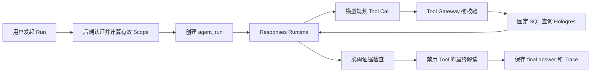
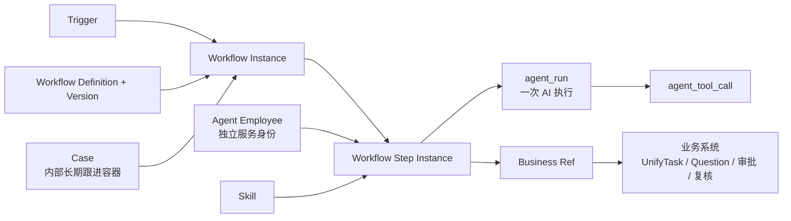
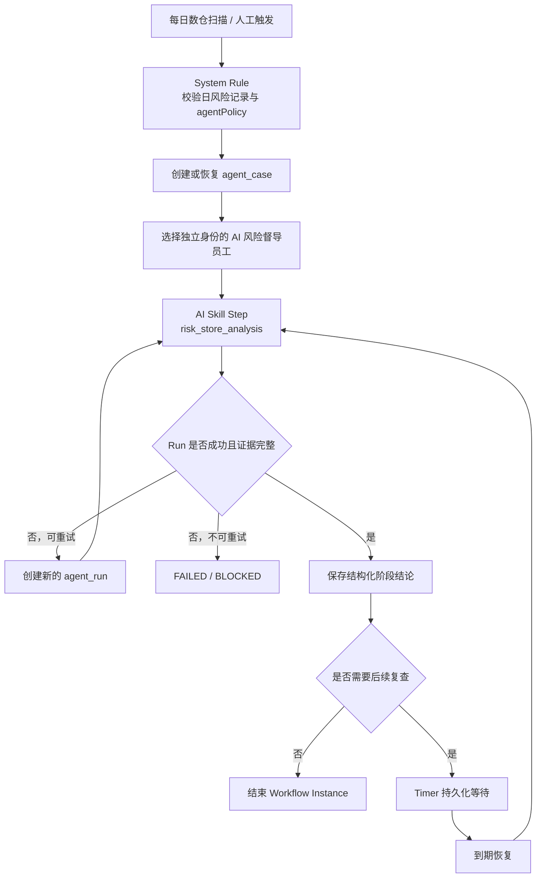
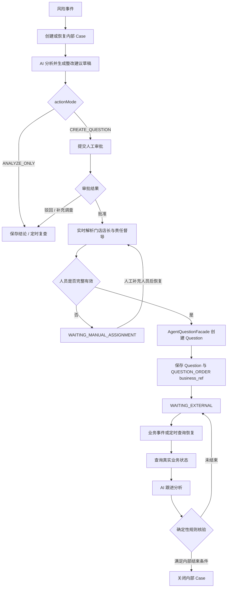

# 好多店 AI Native Workflow 内部编排详细设计文档 V0.1

> **版本**：V0.1  
> **状态**：需求评审重写稿  
> **日期**：2026-07-16  
> **事实来源**：当前 `coolstore-agent-openai` Demo 代码、好多店业务系统代码、当前数仓能力  
> **适用对象**：产品、架构、后端、前端、数据、测试、业务负责人

---

## 1. 结论先行

好多店 Workflow 的定位是：

> **平台预置的 Agent 内部确定性编排，不是通用低代码业务流程。**

它负责：

- 什么时候启动或恢复 AI 员工；
- 当前应该执行哪个内部步骤；
- 哪个 AI 员工以独立身份执行哪个 Skill；
- 何时调用 Tool、等待、重试、升级或结束；
- 如何把多次 `agent_run` 组织成一个长期跟进过程；
- 如何保存外部任务、工单、审批和复核对象的引用。

它不负责：

- 复制 UnifyTask 的任务处理流程；
- 复制 Question 的整改工单流程；
- 复制巡店审核、申诉、AI 结果复核和其他业务审批；
- 保存业务任务明细或把 Agent Case 当成业务工单；
- 让租户自由拖拽流程、写脚本、写 Prompt 或写 SQL；
- 让模型自行决定权限、业务状态和关闭条件。

当前 Demo **尚未实现 Workflow Engine**。当前已实现的是单次同步 Run。下一阶段应先把现有 `risk_store_analysis` 封装成一个只读、可持久化、可定时恢复的内部 Workflow，再考虑接入真实业务写动作。

---

## 2. 当前 Demo 事实基线

### 2.1 当前已经实现

当前真实执行链路：



当前能力包括：

| 能力 | 当前状态 |
|---|---|
| Skill | 只有 `risk_store_analysis` |
| Runtime | 自研 Responses Runtime，单次同步 Run |
| 模型执行 | 一个 Run 内最多进行受限轮次的 Tool Call 循环 |
| Tool | 固定 Function Tools，不开放自由 SQL |
| 数据 | 通过固定 SQL 模板只读查询 Hologres |
| 权限 | Tool Gateway 校验租户、用户、Skill、Tool、门店、区域、日期和数量限制 |
| 证据 | Runtime 检查必需证据，缺失时继续补查 |
| 审计 | 保存 `agent_run`、`agent_tool_call`、`agent_final_answer` |
| 页面 | 回放 `model_steps`、Tool Call 和最终回答 |

当前 Tool：

```text
query_knowledge_base
query_risk_stores
query_common_issues
query_rectification_progress
generate_followup_plan_draft
```

其中 `generate_followup_plan_draft` 只生成草稿，不写业务系统。

### 2.2 当前尚未实现

```text
agent_workflow_*
agent_case
Workflow Step Instance
跨 Run 自动恢复
定时器恢复
外部业务事件恢复
Agent 专属审批
业务任务 / 工单 / 消息写动作
```

当前 `model_steps` 是单次 Run 内的可观察 Trace，不是持久化 Workflow Step，也不能直接改名当作 Workflow Engine 使用。

---

## 3. 设计目标与非目标

### 3.1 下一阶段目标

下一阶段只验证内部编排底座：

1. 平台预置 Workflow Definition 和版本；
2. Workflow Instance 持久化；
3. Workflow Step Instance 持久化；
4. AI 员工独立身份与有效 Scope 固化；
5. Case 跨多次 Run 长期跟进；
6. 一个 AI Step 重试产生多个 Run；
7. System Rule、Timer、暂停和恢复；
8. 幂等、租约、失败恢复和完整 Trace；
9. 保持当前 Tool Gateway 安全边界；
10. 不增加真实业务写动作。

### 3.2 后续目标

完成真实业务 API、权限、状态和幂等能力核验后，再增加：

- Tool Action 调用已有业务系统；
- 外部任务、工单、审批和复核对象引用；
- `wait_external`；
- 外部事件恢复；
- Agent 专属 `agent_approval`；
- 基于真实业务状态的 Case 结束判断。

### 3.3 明确不做

- 通用 BPMN 引擎；
- 面向客户的自由流程画布；
- 客户自定义任意节点代码；
- AI 动态修改流程定义；
- 多 Agent 自由协商；
- Agent 内部人工任务中心；
- 对 UnifyTask、Question 或业务审批流的替代；
- 模型生成 SQL；
- 无审批、无授权的高风险写动作。

---

## 4. 统一对象模型



### 4.1 Workflow Definition

由平台研发维护并版本化发布的内部编排模板，定义：

- 允许的触发来源；
- Step 集合；
- Step 输入输出；
- 执行员工选择规则；
- Skill 和 Tool 白名单；
- 结构化路由；
- 超时、重试、等待和结束规则。

租户只能：

- 启用或停用模板；
- 在白名单范围内绑定 AI 员工；
- 配置允许开放的时间、阈值、审批和通知参数。

租户不能直接修改已发布的 Step 图和执行代码。

### 4.2 Workflow Instance

一次内部编排实例，固定绑定启动时的 Workflow Version。它记录整个编排的运行状态，不保存外部业务流程的权威状态。

### 4.3 Workflow Step 与 Step Instance

- Workflow Step：模板中的节点定义；
- Workflow Step Instance：某次 Workflow Instance 中该节点的确定性状态；
- Step Instance 保存输入、输出、尝试次数、等待原因、外部引用和错误；
- Step Instance 不是 Run。

### 4.4 Run

`agent_run` 表示一次 AI 模型执行。

- 只有 `ai_skill` Step 才创建 Run；
- 一个 AI Step Instance 可以因重试产生多个 Run；
- System Rule、Timer、Wait、Tool Action 和 End 不创建 Run；
- Run 内的 `model_steps` 继续表示模型规划、证据检查和最终解读 Trace。

### 4.5 Case

Case 只是 Agent 跨多次 Run 的长期跟进容器。

Case 保存：

- 跟进主题和业务键；
- 当前调查阶段；
- 已确认的结构化结论；
- 最近一次 Run；
- 下一次跟进时间；
- 外部业务对象引用；
- 创建、恢复、升级和结束事件。

Case 不保存：

- 任务处理明细；
- Question 工单处理流程；
- 业务审批流；
- 巡店结果权威状态；
- 消息送达状态；
- 业务对象最终关闭状态。

### 4.6 Business Ref

Agent 需要跟进业务对象时，只保存引用：

```json
{
  "source_system": "question",
  "business_type": "rectification_question",
  "business_id": "Q123456",
  "latest_status_code": "PROCESSING",
  "status_snapshot_at": "2026-07-16T10:00:00+08:00"
}
```

`latest_status_code` 只是最近快照。路由、升级和结束前必须重新查询业务系统事实。

---

## 5. 内部 Step 类型

| Step 类型 | 编码 | 是否进入下一个 MVP | 说明 |
|---|---|---:|---|
| AI Skill | `ai_skill` | 是 | 指定 AI 员工执行一个 Skill，创建 `agent_run` |
| System Rule | `system_rule` | 是 | 后端确定性判断和路由，不调用模型 |
| Read Tool Action | `tool_action` | 是 | 必要时执行固定只读 Tool，不创建 Run |
| Timer | `timer` | 是 | 持久化等待到指定时间 |
| Wait External | `wait_external` | 后续 | 等待外部任务、工单、审批或复核 |
| Agent Approval | `agent_approval` | 后续 | 仅处理业务系统无法承载的 Agent 专属判断 |
| End | `end` | 是 | 结束当前 Workflow Instance |

不定义 `human_task`。需要给人下发任务时，通过 Tool Adapter 调用已有业务系统。

### 5.1 AI Skill Step

AI Skill Step 不拆分当前 Runtime 内部已有的 Tool 规划和证据检查。Workflow Engine 只负责：

1. 选择 AI 员工；
2. 固化 Employee、Role、Skill、Credential 和 Scope 版本；
3. 创建 `agent_run`；
4. 调用现有 Responses Runtime；
5. 接收结构化结果和 Run 状态；
6. 更新 Step Instance；
7. 执行确定性路由。

### 5.2 System Rule

System Rule 只能读取结构化字段并执行预置条件，不读取模型隐藏思维链。

示例：

```text
如果 run_status = succeeded 且 evidence_complete = true
  -> 保存阶段结论

如果 evidence_complete = false 且 attempt_count < max_attempts
  -> 重试 AI Skill Step

如果 permission_error = true
  -> BLOCKED

如果 next_followup_at 存在
  -> Timer
```

### 5.3 Timer

Timer 必须持久化，不能依赖进程内存。至少保存：

- `next_run_at`；
- 时区；
- 唤醒原因；
- 计划版本；
- 去重键；
- 实际唤醒时间。

### 5.4 Wait External

Wait External 后续支持两种恢复方式：

1. 业务系统发送状态事件；
2. Scheduler 到期后通过只读 Tool 查询最新状态。

不得仅根据模型上一次回答判断外部对象已经完成。

---

## 6. 状态模型

### 6.1 Workflow Instance 状态

```text
CREATED
RUNNING
WAITING_TIMER
WAITING_EXTERNAL
WAITING_APPROVAL
WAITING_MANUAL_ASSIGNMENT
COMPLETED
FAILED
BLOCKED
CANCELLED
```

### 6.2 Workflow Step Instance 状态

```text
PENDING
READY
RUNNING
WAITING_TIMER
WAITING_EXTERNAL
WAITING_APPROVAL
WAITING_MANUAL_ASSIGNMENT
SUCCEEDED
FAILED
BLOCKED
SKIPPED
CANCELLED
```

### 6.3 Case 内部状态

```text
OPEN
INVESTIGATING
WAITING_TIMER
WAITING_EXTERNAL
WAITING_APPROVAL
WAITING_MANUAL_ASSIGNMENT
FOLLOWING_UP
ESCALATED
READY_TO_CLOSE
CLOSED
CANCELLED
FAILED
```

Case 状态只表达 Agent 内部跟进阶段。Workflow Instance、Step Instance、Run、Case 和外部业务对象必须分别保存状态。

---

## 7. AI 员工身份与权限

AI 员工是独立身份，不是创建人的别名。

### 7.1 启动时

Workflow Engine 必须：

1. 根据 Workflow 配置选择 AI 员工；
2. 检查员工是否启用；
3. 检查 Role 和 Skill 是否匹配；
4. 计算当前有效 Scope；
5. 固化 Employee、Credential、Role、Skill 和 Scope 版本；
6. 创建 Run 时把后端上下文注入 Tool Gateway。

### 7.2 后台恢复时

- 不借用最初触发人的登录会话；
- 使用 AI 员工独立服务身份；
- 重新检查身份是否有效；
- 使用固化 Scope 与当前有效 Scope 的交集；
- Scope 缩小时立即收缩；
- Scope 扩大时不得自动扩大正在运行的 Case；
- 身份被停用或凭证失效时进入 `BLOCKED`。

### 7.3 Tool Gateway 不变

所有 Tool 仍必须经过 Tool Gateway。模型和 Trigger 请求体均不能决定：

- `enterprise_id`；
- 有效 Employee Identity；
- 有效门店/区域 Scope；
- `allowed_tools`；
- SQL；
- 写动作授权结果。

被拒绝的 Tool Call 也必须写入 `agent_tool_call`。

---

## 8. 首个目标 Workflow：风险门店持续分析

### 8.1 Workflow 定义

```text
workflow_code: risk_store_followup_analysis
目标: 把当前 risk_store_analysis 从单次问答升级为可定时恢复的长期只读分析
业务写动作: 无
外部审批: 无
外部任务/工单创建: 无
```

### 8.2 流程



### 8.3 Case 业务键

首期风险门店 Workflow 固定使用：

```text
enterprise_id + store_id + rule_id + workflow_code
```

例如：

```text
E001:S1001:R2001:risk_store_followup_analysis
```

Hologres 中每天一条 `stat_date + store_id + rule_id` 命中记录，每条记录生成独立 Trigger Event；相同业务键存在未结束 Case 时恢复旧 Case，并把日记录追加为 `agent_case_event`。已关闭 Case 再次命中时创建复发 Case，并关联上一 Case。

### 8.4 AI Step 输入

- Case 主题；
- 本次触发原因；
- 企业和门店 Scope；
- 上次结构化结论摘要；
- 上次数据截止时间；
- 当前问题；
- Workflow 允许的 Tool 集合。

不得把历史完整模型上下文无限累积到新 Run。跨 Run 只传递经过裁剪的结构化 Case 上下文和必要证据引用。

### 8.5 AI Step 输出

除最终 Markdown 外，Workflow 需要一个稳定的结构化摘要：

```json
{
  "evidence_complete": true,
  "risk_store_ids": ["S1001"],
  "common_issue_codes": ["ITEM_001"],
  "rectification_summary": {
    "open_count": 3,
    "overdue_count": 1
  },
  "followup_required": true,
  "recommended_next_check_at": "2026-07-17T09:00:00+08:00",
  "limitations": []
}
```

`recommended_next_check_at` 只是模型建议，最终时间必须经过 Workflow 预置规则裁剪。

### 8.6 结束条件

只读 MVP 结束的是当前内部 Workflow Instance。Case 可以：

- 因无需继续跟进而关闭；
- 因配置了下一次复查而保持 `WAITING_TIMER`；
- 因权限或数据问题进入 `BLOCKED`；
- 因超过最大尝试次数进入 `FAILED`。

风险门店 Case 只有在关联业务对象均已完成、同一门店与规则连续 3 个有效统计日未再命中、且这些统计日均已确认数仓刷新成功时，才能进入 `READY_TO_CLOSE` 并执行确定性关闭。未刷新不得视为未命中；`ANALYZE_ONLY` Case 不要求存在外部业务对象。

关闭内部 Case 不修改任何业务系统状态。

---

## 9. 后续 Workflow：整改跟进

`risk_rectification_followup` 只能在业务系统适配完成后实现。



### 9.1 业务能力归属

| 业务动作 | 权威承载系统 | Agent Workflow 行为 |
|---|---|---|
| 风险问题整改和审批 | Question + UnifyTask | 首期只调用 `AgentQuestionFacade`；Question 创建链路同步生成 `QUESTION_ORDER` 任务载体，并分别保存工单与任务引用 |
| 独立轻量跟进任务 | UnifyTask | 首期不创建；后续需先新增明确的 Agent 跟进任务类型和升级规则 |
| AI 巡检结果确认 | 现有 AI 复核待办 | 保存待办引用并等待结果 |
| 巡店审核和申诉 | 现有巡店业务域 | 保存审核/申诉引用并等待结果 |
| 转交、重分配、处理、复核 | 对应业务系统 | 不在 Agent 内复制状态机 |
| Agent 专属判断 | `agent_approval` | 仅在现有业务域无法承载时使用 |

### 9.2 Question 人员与 SLA 策略

首期固定为两节点业务流程：节点 1 由门店上下文解析店长岗位 `50000000`，节点 2 在创建时查询当前责任督导并写入具体人员，节点均使用 `approveType=any`。风险记录中的督导快照只用于历史证据，不作为实时派单依据。

风险规则的 `receiversJson`、区域订阅接收人和机器人群属于通知配置，不得自动映射为 Question 处理人、审批人或抄送人。默认 `ccStrategy=NONE`。

`approvalSlaHours` 控制创建前 Agent 审批，`rectificationSlaHours` 控制 Question 截止时间，`caseFollowupIntervalHours` 控制 Case 定时恢复。缺少店长或督导时进入 `WAITING_MANUAL_ASSIGNMENT`，不得静默回退到管理员或历史责任人。

### 9.3 Question 字段与幂等策略

风险 Case 的目标 Question 类型为 `agentRisk`。在 Java 业务系统完成类型枚举、查询、详情和报表适配前，Adapter 可临时映射为 `common`，但来源元数据必须同时记录请求类型和实际类型，不得复用 `AI` 或 `aiInspection`。

Workflow 在草稿阶段生成确定性字段：

- 标题：`[AI风险整改][{riskLevel}] {storeName} - {ruleName}`；
- 描述事实区：风险日期、规则、等级、命中原因、指标摘要、整改要求、证据摘要和 Case 标识；
- 描述建议区：Agent 生成的整改建议，必须与事实区分离并经过长度与敏感信息校验；
- `taskInfo.createType=2`，且 `taskInfo` 始终是可解析的非空对象；
- `businessId`、`dataColumnId`、`metaColumnId` 只引用真实业务对象；
- `extraParam` 保存 `sourceType=AGENT_RISK_CASE`、Case、Run、AI 员工、审批、规则、统计日期、证据摘要和类型映射信息；
- 幂等键固定为 `agent-question:{enterpriseId}:{caseId}:v1`。

一个 Case 默认只允许一个主整改 Question。步骤重试、Workflow 恢复或新的 Run 再次执行创建动作时，必须按幂等键返回已存在的父工单、子工单和 `QUESTION_ORDER` 引用。完整证据留在 Agent 侧，业务工单只保存受控摘要和可访问的媒体引用。

### 9.4 写动作前置条件

每个写类型 Tool 必须先确认：

- 真实 Service/API；
- 调用身份；
- 租户和数据 Scope；
- 必填字段和校验规则；
- 业务审批策略；
- 幂等键；
- 成功、失败和状态不确定的返回；
- 查询已创建对象的接口；
- 事件或轮询恢复方式；
- 回滚或人工补偿方式。

未核验完成前，Workflow 只能生成草稿。

---

## 10. Workflow Engine 执行规则

### 10.1 启动或恢复

```text
1. 验证 Trigger 来源和 enterprise_id
2. 使用 event_id 做事件去重
3. 根据 business_key 创建或恢复 Case
4. 读取已发布 Workflow Version
5. 创建或恢复 Workflow Instance
6. 获取当前 Step Instance 租约
7. 执行 Step
8. 在同一状态迁移边界持久化结果
9. 计算下一 Step
10. 继续执行或进入持久化等待
```

### 10.2 并发控制

- 同一个 Step Instance 同时只能有一个 Worker 持有有效租约；
- Worker 崩溃后允许租约过期接管；
- 状态更新使用版本号或乐观锁；
- 旧 Worker 恢复后不得覆盖新 Worker 结果；
- 同一事件重复投递不得重复推进状态。

### 10.3 重试

| 失败类型 | 处理 |
|---|---|
| 模型临时错误 | 按 Step 策略退避重试，创建新 Run |
| 模型输出不符合 Schema | 允许有限修复，超过次数失败 |
| 只读 Tool 超时 | Tool 级有限重试 |
| 权限拒绝 | 不重试，进入 `BLOCKED` |
| AI 员工停用/凭证失效 | 不重试，进入 `BLOCKED` |
| 数据尚未刷新 | Timer 等待后重新查询 |
| 写动作状态不确定 | 先按幂等键查询外部对象，禁止盲目重写 |
| 服务重启 | 从 Step Instance 持久化状态恢复 |

### 10.4 幂等键

```text
Trigger:
enterprise_id + stat_date + store_id + rule_id

Case:
enterprise_id + store_id + rule_id + workflow_code

Step Instance:
workflow_instance_id + step_code + execution_sequence

外部写动作:
enterprise_id + case_id + action_type + action_version
```

---

## 11. MySQL 持久化规划

所有 Agent Service 新表统一使用 `agent_` 前缀，不新增 `ai_agent_*`、裸 `workflow_*` 或裸 `case_*` 命名。

### 11.1 表清单

| 领域 | 表 |
|---|---|
| Workflow 定义 | `agent_workflow`、`agent_workflow_version`、`agent_workflow_step` |
| Workflow 运行 | `agent_workflow_instance`、`agent_workflow_step_instance` |
| Case | `agent_case`、`agent_case_event`、`agent_case_business_ref`、`agent_followup_schedule` |
| 运行与审计 | `agent_run`、`agent_tool_call`、`agent_final_answer`、`agent_approval`、`agent_audit_log`、`agent_idempotency_record`、`agent_usage_meter`、`agent_feedback` |
| Trigger | `agent_trigger_event` |

### 11.2 核心关系

```text
agent_workflow
  1 -> N agent_workflow_version

agent_workflow_version
  1 -> N agent_workflow_step

agent_case
  1 -> N agent_workflow_instance
  1 -> N agent_case_event
  1 -> N agent_case_business_ref

agent_workflow_instance
  1 -> N agent_workflow_step_instance

agent_workflow_step_instance
  1 -> N agent_run    仅 ai_skill Step

agent_run
  1 -> N agent_tool_call
  1 -> N agent_final_answer
```

### 11.3 `agent_workflow_step_instance` 关键字段

```text
step_instance_id
enterprise_id
workflow_instance_id
case_id
workflow_step_id
step_code
step_type
executor_type
executor_id
skill_version_id
status
input_json
output_json
attempt_count
wait_type
wait_reason
external_ref_type
external_ref_id
next_run_at
lease_owner
lease_expires_at
started_at
finished_at
error_code
error_message
version_no
created_at
updated_at
```

`agent_run` 增加可空的 `workflow_step_instance_id`。当前直接由用户发起的 Run 可以为空；由 Workflow 发起的 Run 必须填写。

不得使用含义混合的 `agent_step_run`。

---

## 12. Trigger 与 API 边界

### 12.1 Trigger 类型

```text
manual.workflow.start
schedule.followup.due
warehouse.risk.daily.hit
business.risk.alert.created          后续实时事件
business.object.status.changed    后续
```

事件必须包含：

- 全局唯一 `event_id`；
- `source_system`；
- `enterprise_id`；
- `event_type`；
- 业务对象类型和 ID；
- 发生时间；
- Schema 版本。

`warehouse.risk.daily.hit` 还必须包含 `stat_date`、`store_id`、`rule_id`、风险等级、命中原因、数仓刷新时间、规则定义快照和 `agentPolicy` 快照。Agent Service 默认每天 07:00 拉取前一统计日；数据未就绪时延迟重试。

模型不能修改事件中的租户和业务对象标识。

### 12.2 规划 API

以下接口尚未实现：

```text
GET  /api/v1/workflow-definitions
POST /api/v1/admin/workflow-definitions/{id}/versions
POST /api/v1/admin/workflow-definitions/{id}/versions/{version}/validate
POST /api/v1/admin/workflow-definitions/{id}/versions/{version}/publish

PUT  /api/v1/tenant-workflows/{workflow_code}/settings

POST /api/v1/workflow-instances
GET  /api/v1/workflow-instances/{id}
GET  /api/v1/workflow-instances/{id}/steps
POST /api/v1/workflow-instances/{id}/resume
POST /api/v1/workflow-instances/{id}/cancel

POST /api/v1/triggers/events
GET  /api/v1/cases/{case_id}
POST /api/v1/cases/{case_id}/manual-resume
```

Definition 的创建、校验和发布只开放给平台管理端。租户接口只允许修改受控参数。

---

## 13. Trace、审计和页面

每个 Workflow Instance 必须能回答：

- 谁或什么事件触发；
- 使用哪个 Workflow Version；
- 创建或恢复哪个 Case；
- 使用哪个 AI 员工独立身份；
- 固化了哪个 Role、Skill、Credential 和 Scope 版本；
- 执行了哪些 Step Instance；
- 哪个 AI Step 产生了哪些 Run；
- 每个 Run 调用了哪些 Tool；
- 哪些 Tool 被 Gateway 拦截；
- 当前为什么等待、失败或阻塞；
- 关联了哪些外部业务对象；
- 根据什么结构化事实结束内部跟进。

页面分两层展示：

1. Workflow 层：Step Instance、等待、恢复、重试和外部引用；
2. Run 层：当前已有的 `model_steps`、Tool Call、证据检查和最终回答。

不得展示或推断模型隐藏思维链。

---

## 14. 分阶段交付

### 阶段 A：当前 Demo

状态：已完成。

- 单次 `risk_store_analysis`；
- Tool Gateway；
- Hologres 只读查询；
- MySQL Run/Tool/Answer 审计；
- Trace 页面。

### 阶段 B：只读 Workflow MVP

建议作为下一开发阶段：

- `risk_store_followup_analysis`；
- Workflow Definition/Version；
- Workflow Instance；
- Step Instance；
- Case；
- AI 员工独立身份；
- AI Skill、System Rule、Timer、End；
- Step 与 Run 一对多；
- 定时恢复、租约、重试、幂等和 Trace；
- 不写业务系统。

### 阶段 C：外部业务状态跟进

- `agent_case_business_ref`；
- `wait_external`；
- 业务事件和状态查询；
- 只读跟进 UnifyTask、Question、审批和复核；
- 基于真实业务状态结束内部 Case。

### 阶段 D：受控业务动作

- 经过核验的写类型 Tool Adapter；
- Agent 专属审批；
- 人工授权；
- 外部幂等、状态不确定恢复和补偿；
- 仍不复制业务系统状态机。

---

## 15. 验收标准

只读 Workflow MVP 至少通过：

1. 平台可发布不可变 Workflow Version；
2. 租户只能启停和修改白名单参数；
3. 人工、定时或风险事件能创建 Workflow Instance；
4. 相同业务键能恢复同一未结束 Case；
5. AI 员工以独立身份运行；
6. 后台恢复不依赖原触发人的 Web Session；
7. Scope 缩小时正在运行的 Case 不能越权；
8. AI Skill Step 能调用现有 `risk_store_analysis`；
9. 一个 Step Instance 重试能关联多个 Run；
10. System Rule、Timer 和 End 不创建 Run；
11. Timer 在服务重启后仍能恢复；
12. 并发 Worker 不会重复执行同一 Step；
13. 重复 Trigger 不会重复创建 Case；
14. Tool Gateway 拒绝仍会落审计；
15. Case、Workflow Instance、Step Instance、Run 和 Tool Call 可独立查询；
16. 页面能从 Workflow 下钻到 Run Trace；
17. 当前 MVP 不创建任务、工单、审批或消息；
18. 所有新增 MySQL 表使用 `agent_` 前缀。

外部业务动作阶段追加：

19. 业务对象只在原业务系统创建；
20. Agent 只保存外部对象引用和最近状态快照；
21. 已有审批链时不创建平行 Agent 审批；
22. 重复写请求返回同一外部对象；
23. 状态不确定时先查询，不盲目重写；
24. Case 结束前重新核验业务系统事实。

---

## 16. 已确认事项与进入开发前仍需确认

已确认：

1. 风险定义来自每个租户自己的 Java 风险预警规则；
2. 存量规则没有 `agentPolicy` 时默认不启用 Agent；
3. 首期由 Agent 每日定时拉取 Hologres 风险日记录，不改造数仓回调；
4. 日 Trigger 按 `enterprise_id + stat_date + store_id + rule_id` 去重；
5. Case 按 `enterprise_id + store_id + rule_id + workflow_code` 归并；
6. Case 关闭后再次命中创建复发 Case；
7. 默认关闭条件为关联业务完成且连续 3 个有效统计日未命中；
8. 首期 `actionMode` 只支持 `ANALYZE_ONLY`、`CREATE_QUESTION`，不单独创建 UnifyTask；Question 创建链路负责生成 `QUESTION_ORDER` 任务载体；
9. 风险 Question 默认由门店店长整改、当前责任督导审批，缺少人员时进入 `WAITING_MANUAL_ASSIGNMENT`；创建审批、整改截止和 Case 跟进分别使用独立 SLA；
10. 风险 Question 目标类型为 `agentRisk`，适配期可映射为 `common`；字段、证据摘要、来源元数据和 Case 级幂等键使用统一模板。

只读 Workflow MVP 需要确认：

1. Case 进行期间的默认复查周期；
2. AI 员工 Scope 缩小后的历史 Case 展示规则；
3. Workflow Definition 使用数据库还是代码内 JSON/YAML 作为首个实现。

业务动作阶段另行确认：

1. `AgentQuestionFacade` 的真实创建、查询、转交、复核和关闭 API；
2. 业务审批入口和权限；
3. Question 与 `QUESTION_ORDER` 的外部状态码和终态；
4. 状态事件来源；
5. 失败补偿机制。

上述信息未确认前，不开发写类型 Tool。

---

## 17. 最终设计结论

```text
当前 Responses Runtime
  = 单次 AI Run 内的模型与 Tool 编排

目标 Workflow Engine
  = 跨 Run 的确定性内部编排

Case
  = Agent 内部长期跟进容器

UnifyTask / Question / 业务审批与复核
  = 真实业务执行和状态权威来源
```

下一步不是建设一套大而全的 Workflow 平台，而是把当前已经测试通过的 `risk_store_analysis` 安全地放进一个最小、可持久化、可恢复的内部 Workflow。这个最小闭环稳定后，再逐项接入真实业务系统能力。
