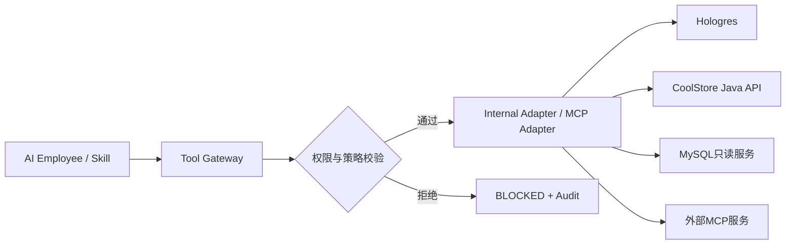
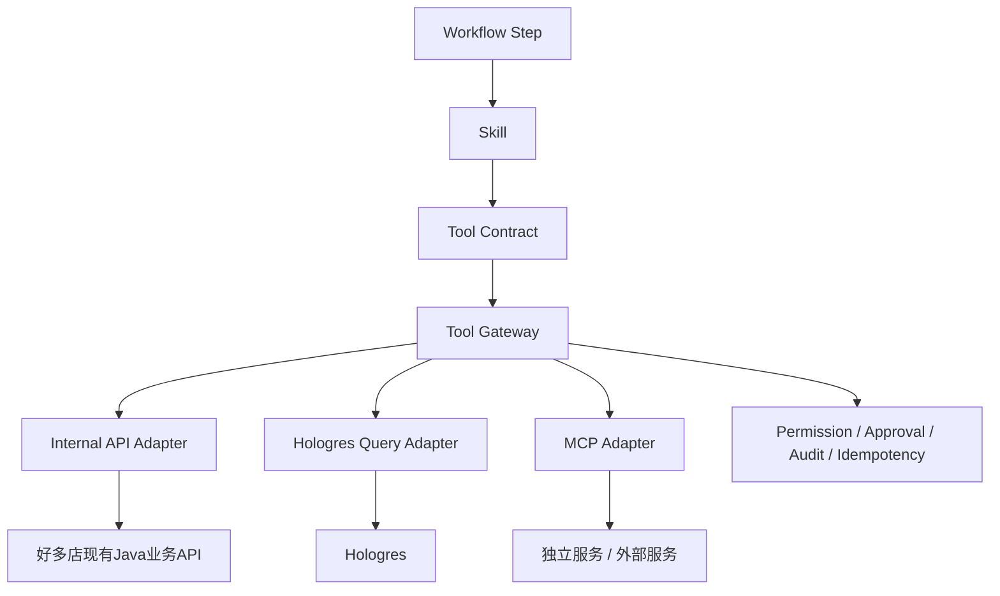
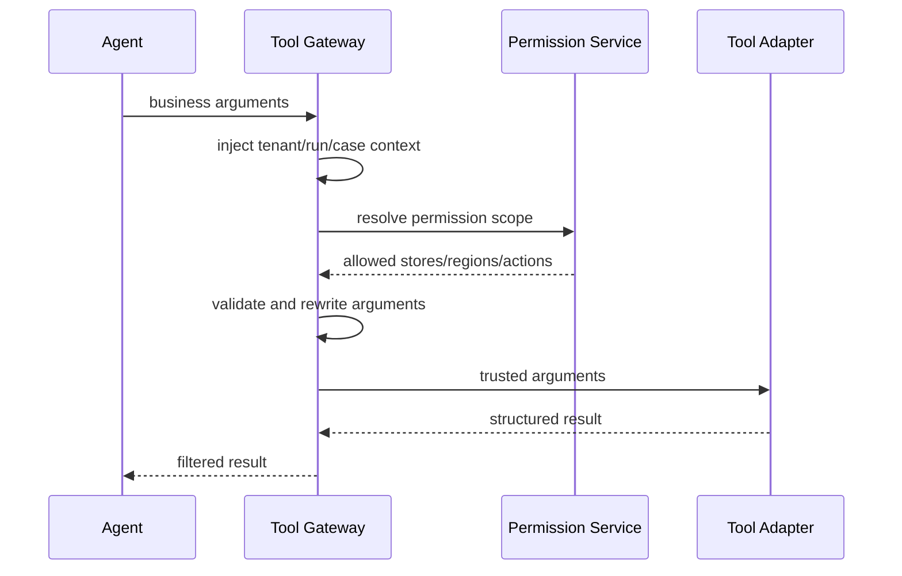
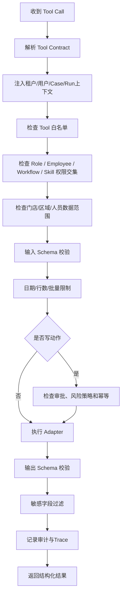
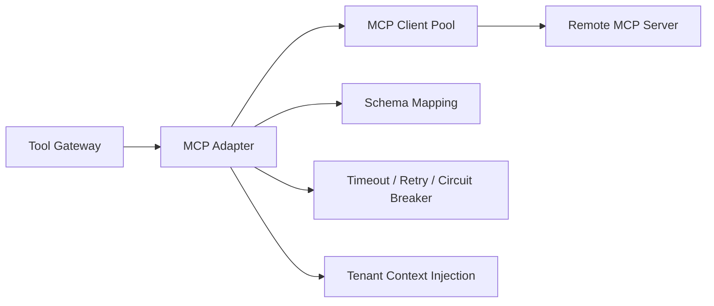

# 好多店 AI Native MCP Tool 设计规范 V0.1

> **版本**：V0.1  
> **状态**：需求与技术联合设计初稿  
> **日期**：2026-07-16  
> **适用对象**：架构、后端、数据、Agent 研发、安全、测试  
> **上游文档**：
> - 《好多店 AI Native 业务执行系统需求文档 V0.1》
> - 《好多店 AI Native 业务执行系统总体设计文档 V0.1》
> - 《好多店 AI Native Agent Service 详细设计文档 V0.1》
> - 《好多店 AI Native Skill 体系详细设计文档 V0.1》
> - 《好多店 AI Native Workflow 流程详细设计文档 V0.1》
>
> **首期范围**：巡店检查结果、风险规则与风险记录、门店、区域、责任人员、整改任务、工单闭环  
> **首期不接入**：视频 AI、业绩、客流、财务

---

## 1. 文档目标

本文定义好多店 AI Native 系统中 Tool、Tool Gateway 和 MCP Adapter 的统一设计规范，重点回答：

1. Agent 可以调用哪些业务能力；
2. Tool、Skill、Workflow、MCP 和业务 API 的边界是什么；
3. 多租户、门店范围和人员权限如何强制执行；
4. Tool 输入输出如何结构化；
5. 查询类和动作类 Tool 如何区分；
6. Hologres、MySQL 和现有 Java API 分别如何接入；
7. 写动作如何审批、幂等、审计和恢复；
8. MCP 是否必须使用；
9. 本地 Codex 应如何盘点真实业务接口并映射成 Tool。

---

## 2. 核心结论

### 2.1 Tool 是 Agent 可调用的确定性业务能力

Tool 不是 Prompt，也不是完整业务流程。

Tool 应完成明确、可校验、可审计的单一能力，例如：

```text
查询风险记录详情
查询门店责任人
查询检查项历史
创建 Question 整改工单草稿
查询 Question 整改工单状态
```

### 2.2 Tool Gateway 是统一安全边界

所有模型发起的 Tool Call 必须经过 Tool Gateway。



### 2.3 MCP 是协议适配方式，不是内部强制架构

首期不应为了使用 MCP 而把所有内部 Java API 再包装一遍。

推荐：

```text
内部稳定业务 API
    ↓
Internal Tool Adapter
    ↓
Tool Gateway
```

外部能力或独立部署能力：

```text
远程 MCP Server
    ↓
MCP Adapter
    ↓
Tool Gateway
```

因此：

> **Tool 是统一业务能力抽象，MCP 是 Tool 的一种接入协议。**

### 2.4 Agent 不得直接访问数据库

禁止模型生成并执行任意 SQL。

Agent 只能调用经过审核的业务 Tool。

Hologres 查询也必须封装成固定 Tool，内部使用参数化 SQL 或存储查询模板。

---

## 3. 体系关系



关系定义：

- Workflow 决定何时调用 Skill；
- Skill 决定完成业务任务需要哪些 Tool；
- Tool Contract 定义输入输出；
- Tool Gateway 强制执行权限和策略；
- Adapter 负责连接具体系统；
- 业务系统仍是业务事实和动作结果的权威来源。

---

## 4. Tool 分类

### 4.1 按业务风险分类

| 类型 | 编码 | 说明 | 首期策略 |
|---|---|---|---|
| 查询类 | `read` | 只读查询 | 可自动执行 |
| 草稿类 | `draft` | 创建草稿，不形成正式业务动作 | 可配置自动执行 |
| 动作类 | `write` | 创建或修改正式业务对象 | 默认人工审批 |
| 高风险类 | `high_risk` | 处罚、关店、改分、删除等 | 首期禁止 |
| 通知类 | `notify` | 对外发送正式通知 | 默认人工审批 |

### 4.2 按接入来源分类

```text
hologres_query
internal_api
internal_service
mcp_remote
knowledge_query
```

首期重点：

- `hologres_query`
- `internal_api`
- `mcp_remote` 预留

`knowledge_query` 在首期不是核心，不建设复杂 RAG 平台。

### 4.3 按业务域分类

```text
risk
store
organization
patrol
check_item
rectification
task
workorder
case
notification
```

---

## 5. Tool Contract

### 5.1 基本结构

```json
{
  "tool_code": "get_risk_alert_detail",
  "name": "查询风险记录详情",
  "version": "1.0.0",
  "domain": "risk",
  "operation_type": "read",
  "adapter_type": "hologres_query",
  "description": "根据风险记录ID查询规则结果、门店、风险等级和关联业务对象",
  "input_schema": {},
  "output_schema": {},
  "permission_policy": {},
  "data_policy": {},
  "approval_policy": {},
  "timeout_policy": {},
  "retry_policy": {},
  "audit_policy": {}
}
```

### 5.2 Tool Code 命名

统一使用：

```text
动词_业务对象_补充说明
```

示例：

```text
get_risk_alert_detail
list_store_risk_history
get_store_responsible_people
get_check_item_failure_history
draft_question_order
create_question_order
get_question_order_status
```

避免：

```text
query_data
execute_sql
process_business
handle_task
```

### 5.3 版本规则

- Tool Contract 必须版本化；
- 修改字段语义需要升级主版本；
- 新增可选字段可以升级次版本；
- Workflow 和 Skill 应绑定 Tool 版本范围；
- 线上运行必须记录实际 Tool 版本。

---

## 6. 输入设计规范

### 6.1 模型可填写参数

模型只能填写业务参数，例如：

```json
{
  "risk_alert_id": "RA10001",
  "date_range": {
    "start_date": "2026-06-16",
    "end_date": "2026-07-16"
  },
  "limit": 50
}
```

### 6.2 后端强制注入参数

以下字段不能由模型提供或覆盖：

```text
enterprise_id
authenticated_user_id
agent_employee_id
role_code
case_id
workflow_instance_id
run_id
tool_context_id
permission_scope
trace_id
request_time
```

调用过程：



### 6.3 输入限制

查询 Tool 至少支持：

```text
明确业务对象ID
或
日期范围 + 分页/limit
```

禁止无边界查询：

```text
查询这个租户所有历史巡店
查询全部检查项
查询整个企业所有工单明细
```

建议默认限制：

```text
limit <= 100
日期范围 <= 90天
批量对象ID <= 100
返回文本字段长度受控
```

具体限制由真实业务量核验后调整。

### 6.4 日期语义

Tool 输入应明确：

- 自然日还是业务日；
- 时区；
- 是否包含结束时间；
- 数据截止时间；
- 数仓刷新周期。

店务业务日需要沿用现有好多店业务日定义，不能由 Agent 自行计算口径。

---

## 7. 输出设计规范

### 7.1 统一输出包

```json
{
  "success": true,
  "tool_code": "get_risk_alert_detail",
  "tool_version": "1.0.0",
  "data": {},
  "meta": {
    "enterprise_id": "E001",
    "data_as_of": "2026-07-16T08:00:00+08:00",
    "source": "hologres.ads_risk_alert_day",
    "refresh_status": "completed",
    "partial": false,
    "truncated": false,
    "record_count": 1,
    "trace_id": "TRACE001"
  },
  "warnings": []
}
```

### 7.2 数据新鲜度

Hologres Tool 必须返回：

```text
data_as_of
refresh_status
source_layer
partial
truncated
```

当数据过期、刷新失败或只返回部分数据时：

- AI 必须在结论中说明；
- 高风险写动作不得自动执行；
- Workflow 可以转人工或等待数据刷新。

### 7.3 证据引用

关键 Tool 应输出可追踪证据：

```json
{
  "evidence_ref": {
    "source_type": "patrol_record",
    "source_id": "PR10001",
    "source_time": "2026-07-15T14:30:00+08:00",
    "summary": "制冰机卫生检查项不合格"
  }
}
```

不要求将全部原始数据暴露给模型。

---

## 8. Tool Gateway 处理流程



### 8.1 权限交集

实际可调用权限应为：

```text
Role允许Tool
∩
AI员工启用Tool
∩
Workflow Step允许Tool
∩
Skill声明Tool
∩
租户与人员数据权限
∩
风险策略
```

任意一项不满足，Gateway 拒绝调用。

### 8.2 Store Scope 拦截

当模型传入 `store_id` 时，Gateway 必须验证：

```text
store_id 是否属于 enterprise_id
+
当前执行上下文是否有权访问该门店
```

不能只依赖模型 Prompt 约束。

### 8.3 Reserved Parameters

模型输入中出现以下参数时，Gateway 应忽略或拒绝：

```text
enterprise_id
tenant_id
user_id
permission_scope
role
is_admin
approval_status
trace_id
```

---

## 9. Hologres Query Tool 设计

### 9.1 定位

Hologres 提供：

- 风险上下文；
- 巡店历史；
- 多维统计；
- 趋势；
- 关联证据。

Hologres 不负责：

- 创建任务；
- 修改工单；
- 修改业务状态；
- Case 状态；
- 审批状态。

### 9.2 查询实现

推荐：

```text
Tool Contract
    ↓
Query Template Registry
    ↓
参数化 SQL
    ↓
Hologres
```

禁止：

```text
模型生成SQL
    ↓
直接执行
```

### 9.3 Query Template

```yaml
tool_code: get_check_item_failure_history
query_id: risk_check_item_failure_history_v1
parameters:
  - enterprise_id
  - store_id
  - check_item_id
  - start_date
  - end_date
  - limit
sql_file: queries/risk/check_item_failure_history_v1.sql
```

### 9.4 数据层选择

建议：

- 明细证据优先 DWD；
- 聚合与趋势优先 DWS/ADS；
- 基础信息优先 DIM；
- 不直接把 ODS 暴露给 Agent。

---

## 10. Internal API Tool 设计

### 10.1 定位

真实业务写动作必须调用现有好多店业务 API。

例如：

```text
创建 Question 整改工单
查询任务状态
提交复核
发送系统消息
```

### 10.2 业务系统权威性

Agent Service 不复制任务和工单主状态。

Agent 侧只保存：

- 关联业务对象 ID；
- 最近一次查询状态；
- Workflow 和 Case 推进状态；
- 调用审计。

业务系统仍是任务和工单的最终权威来源。

### 10.3 租户上下文

后台调用必须明确传递：

```text
enterprise_id
database_name / datasource_route（如现有接口需要）
operator_user_id
trace_id
idempotency_key
```

不能依赖 HTTP ThreadLocal 中隐式租户上下文。

---

## 11. MCP Adapter 设计

### 11.1 使用场景

MCP 适用于：

- 独立部署的数据服务；
- 外部 SaaS；
- 需要跨语言复用的能力；
- 已经存在标准 MCP Server 的系统；
- 后续开放给 CodeBuddy、Codex 或其他 Agent 平台的统一能力。

### 11.2 不建议使用场景

以下场景首期不必强制 MCP：

- Agent Service 和内部 Tool 在同一代码库；
- 已有稳定 Java API；
- 只是为了协议而新增一层转发；
- 业务动作需要复杂的内部鉴权上下文。

### 11.3 MCP Client 结构



### 11.4 MCP 工具发现

生产环境不建议模型在运行时自由发现所有 MCP Tool。

推荐：

1. 系统管理员配置 MCP Server；
2. 平台同步 Tool Schema；
3. 研发或管理员审核；
4. 注册到 Tool Catalog；
5. 绑定 Skill；
6. 才允许 Agent 调用。

### 11.5 MCP 鉴权

MCP Server 不应直接信任模型传递的 Token。

推荐：

```text
Agent Runtime
    ↓
Tool Gateway
    ↓
通过 tool_context_id 获取后端凭据
    ↓
MCP Adapter 注入 auth token
    ↓
MCP Server
```

---

## 12. 第一批查询类 Tool

以下 Tool 为目标清单，最终名称、字段和数据源需要 Codex 扫描真实系统后确认。

### 12.1 `get_risk_alert_detail`

用途：

查询数仓中已经产生的租户每日风险命中记录。风险门店列表主查 `ads_store_execute_day`，规则命中明细主查 `dws_risk_store_warning_hit`；Tool 不重新计算租户风险规则。

输入：

```json
{
  "stat_date": "2026-07-16",
  "store_id": "S1001",
  "rule_id": "R2001"
}
```

输出重点：

- 风险规则；
- 风险类型；
- 风险等级；
- 门店；
- 命中结果；
- 关联业务对象；
- 创建时间；
- 当前状态；
- 数据来源。

日风险记录的实际唯一键为 `enterprise_id + stat_date + store_id + rule_id`，其中 `enterprise_id` 来自后端 `ToolExecutionContext`，不得由模型提供。相同门店和规则的多日记录必须分别返回，供 Case Event 追加和连续未命中判断。

### 12.2 `get_risk_rule_definition`

用途：

通过 Java 业务系统查询当前租户风险规则的业务定义、启用状态和处理策略，包括可选的 `actions_json.agentPolicy`。

注意：

AI 不重新定义规则。

没有 `agentPolicy` 或 `agentEnabled != true` 的规则不得触发 Agent。Tool 返回结果需包含规则读取时间和规则快照摘要，Trigger 创建时将其固化到 `agent_case_event`，避免后续规则修改影响历史审计。

### 12.3 `get_store_profile`

输出：

- 门店；
- 区域链；
- 状态；
- 时区；
- 负责人；
- 基础运营属性。

首期不得包含业绩、客流和财务。

### 12.4 `get_store_responsible_people`

输出：

```text
店长
督导
区域负责人
岗位
责任关系来源
生效时间
```

### 12.5 `get_patrol_record_detail`

用途：

查询风险关联的巡店记录和检查结果。

### 12.6 `get_check_item_failure_history`

用途：

查询同一门店或同一检查项的历史不合格情况。

### 12.7 `get_rectification_history`

用途：

查询历史整改任务、整改结果和复核信息。

### 12.8 `get_open_workorders`

用途：

查询与本次风险相关的未关闭工单。

### 12.9 `get_question_order_status`

用途：

供 Workflow 跟进已创建的 Question 整改工单及其 `QUESTION_ORDER` 统一任务载体。

---

## 13. 第一批动作类 Tool

### 13.1 `draft_question_order`

用途：

创建 Question 整改工单草稿。草稿只保存在 Agent Service，包含标题、问题描述、门店、证据、建议处理人、流程节点和截止时间，不写业务系统。首期人员策略由后端确定性解析：节点 1 为门店店长岗位 `50000000`，节点 2 为创建时查询到的当前责任督导，默认不抄送。

风险等级：

```text
draft
```

可以由 AI 自动生成草稿，但不直接形成正式工单或统一任务。

### 13.2 `create_question_order`

用途：

将审批通过且参数摘要未变化的草稿提交给 `AgentQuestionFacade`。Facade 复用现有 Question 创建链路，一次性生成 `QUESTION_ORDER` 统一任务载体、父工单和子工单；Tool 不再额外创建独立 UnifyTask。

风险等级：

```text
write
```

要求：

- 必须关联有效审批；
- 必须幂等；
- 必须重新验证门店、店长岗位和当前责任督导；风险记录中的督导快照不得直接作为派单依据；
- 必须验证 `approvalSlaHours` 未超时，并以业务对象创建时间加 `rectificationSlaHours` 计算 Question 截止时间；
- 店长或督导无法解析时，Java 返回 `ASSIGNEE_NOT_FOUND`，Adapter 映射为 `TOOL_ASSIGNEE_NOT_FOUND`；Workflow 进入 `WAITING_MANUAL_ASSIGNMENT`，不得回退到管理员或通知接收人；
- 必须同时返回真实 `unify_task_id`、`question_parent_id` 和必要的子工单标识；
- 必须把业务对象引用写入 `agent_case_business_ref`。

### 13.3 风险 Question 字段契约

`draft_question_order` 输出和 `create_question_order` 输入必须使用同一份已审批字段快照。目标业务类型为 `agentRisk`；业务系统未完成该类型适配时，Adapter 可将 `effective_question_type` 临时设置为 `common`，但 `requested_question_type` 必须保持 `agentRisk`。

```json
{
  "requested_question_type": "agentRisk",
  "effective_question_type": "agentRisk",
  "parent_title": "[AI风险整改][高] 上海徐汇店 - 连续整改超时",
  "child_title": "[AI风险整改][高] 上海徐汇店 - 连续整改超时",
  "description": {
    "risk_stat_date": "2026-07-16",
    "risk_level": "HIGH",
    "rule_id": "RISK_RULE_001",
    "rule_name": "连续整改超时",
    "hit_reason": "连续两个统计日存在逾期整改",
    "metric_summary": "逾期工单 3 个，最长逾期 48 小时",
    "rectification_requirement": "完成逾期问题整改并提交证明",
    "agent_suggestion": "优先处理食安相关问题，并核对责任人排班",
    "evidence_count": 5,
    "evidence_digest": "sha256:..."
  },
  "task_info": {
    "createType": 2,
    "photos": []
  },
  "source": {
    "sourceType": "AGENT_RISK_CASE",
    "caseId": "case_xxx",
    "runId": "run_xxx",
    "agentEmployeeId": "employee_xxx",
    "approvalId": "approval_xxx",
    "ruleId": "RISK_RULE_001",
    "statDate": "2026-07-16"
  },
  "idempotency_key": "agent-question:{enterpriseId}:{caseId}:v1"
}
```

约束：

- 标题和事实描述由后端确定性模板生成，模型只能提供 `agent_suggestion`；
- `task_info` 必须是可解析的非空对象；`createType=2`；
- `photos` 只传经过协议、域名、数量和可访问性校验的 URL；
- `businessId`、`dataColumnId`、`metaColumnId` 只有存在真实来源对象时才传；
- 完整证据保存在 Agent 侧，Tool 只向业务系统传摘要、数量、摘要哈希和必要媒体；
- `extraParam` 使用规范 JSON 保存 `source`、类型映射、`evidence_count`、`evidence_digest` 和幂等键，不保存大段模型输出；
- 幂等必须由 Java 命令审计或唯一键兜底，不能只用 `extraParam` 字符串等值查询；
- 同一 Case 跨 Run 重试必须返回同一 Question，不得因 `runId` 变化重复创建。

### 13.4 `actionMode` 映射

| `actionMode` | Tool 行为 | 正式业务对象 |
|---|---|---|
| `ANALYZE_ONLY` | 不调用写 Tool，仅保存分析和复查计划 | 无 |
| `CREATE_QUESTION` | `draft_question_order` → 人工审批 → `create_question_order` | Question 工单及其 `QUESTION_ORDER` 任务载体 |

首期不支持 `CREATE_TASK`、`TASK_THEN_QUESTION`。未来如需轻量跟进任务，必须先在业务系统定义独立任务类型、状态和升级契约。

创建前的 `approval_id` 只证明 Agent 写动作已获批准；Question 节点 2 是整改完成后的业务审批，二者必须使用不同记录和状态。风险规则的 `receiversJson`、`subscriptionGroupsJson` 和机器人配置只控制通知，不得自动注入 Question 流程。

### 13.5 首期禁止的动作

```text
直接修改风险等级
直接关闭风险
直接关闭工单
处罚员工
修改巡店分数
删除业务记录
自动关店
自动扣款
```

---

## 14. 审批策略

### 14.1 默认策略

```text
read：无需审批
draft：可配置无需审批
write：必须审批
notify：正式外发默认审批
high_risk：首期禁止
```

### 14.2 审批校验

Tool Gateway 在执行写动作前必须校验：

```text
approval_id
approval_status
approved_action
approved_parameters_hash
approval_expire_at
approver_permission
```

审批通过后如果关键参数发生变化，必须重新审批。

---

## 15. 幂等设计

### 15.1 幂等键

```text
enterprise_id
+
case_id
+
tool_code
+
target_business_key
+
action_version
```

### 15.2 写动作状态不确定

当业务 API 超时但可能已成功时：

1. 不立即再次提交；
2. 使用业务查询 Tool 查询是否已创建；
3. 找到业务对象则关联已有结果；
4. 无结果且确认未执行后再重试。

---

## 16. 错误模型

### 16.1 统一错误结构

```json
{
  "success": false,
  "error": {
    "code": "TOOL_PERMISSION_DENIED",
    "message": "当前AI员工无权访问该门店",
    "retryable": false,
    "details": {}
  },
  "meta": {
    "trace_id": "TRACE001"
  }
}
```

### 16.2 错误码分类

```text
TOOL_NOT_ALLOWED
TOOL_INPUT_INVALID
TOOL_PERMISSION_DENIED
TOOL_STORE_SCOPE_DENIED
TOOL_APPROVAL_REQUIRED
TOOL_APPROVAL_EXPIRED
TOOL_ASSIGNEE_NOT_FOUND
TOOL_DATA_STALE
TOOL_DATA_NOT_FOUND
TOOL_TIMEOUT
TOOL_PROVIDER_UNAVAILABLE
TOOL_OUTPUT_INVALID
TOOL_IDEMPOTENCY_CONFLICT
TOOL_BUSINESS_REJECTED
```

---

## 17. 超时、重试和熔断

### 17.1 查询 Tool

建议：

- 可对临时网络错误重试；
- 不对权限和参数错误重试；
- 返回部分数据时明确标记；
- 对同一查询做短期缓存需包含租户和权限维度。

### 17.2 写 Tool

建议：

- 不能盲目自动重试；
- 优先查询业务结果；
- 使用幂等键；
- 记录请求和响应摘要；
- 失败后交由 Workflow 决定恢复或转人工。

### 17.3 MCP 熔断

独立 MCP Server 连续失败时：

- 熔断；
- Workflow 转等待或人工；
- 不让模型在多个同类 Tool 间无限尝试。

---

## 18. 审计与 Trace

每次 Tool Call 至少记录：

```text
tool_call_id
enterprise_id
agent_employee_id
role_code
case_id
workflow_instance_id
step_run_id
skill_code
tool_code
tool_version
adapter_type
input_summary
injected_context_summary
permission_result
approval_id
idempotency_key
started_at
finished_at
status
error_code
business_object_id
trace_id
```

敏感 Token、密码、完整个人信息不能写入日志。

---

## 19. Tool Catalog

### 19.1 Catalog 职责

Tool Catalog 保存：

- Tool Contract；
- 版本；
- 状态；
- Adapter；
- 风险级别；
- 所属业务域；
- 依赖系统；
- 数据新鲜度；
- 权限策略；
- 所属 Skill；
- 测试状态。

### 19.2 状态

```text
DRAFT
TESTING
PUBLISHED
DEPRECATED
DISABLED
```

### 19.3 发布校验

发布 Tool 前必须验证：

- 输入输出 Schema；
- 多租户隔离；
- 门店范围；
- 行数限制；
- 时间范围；
- 错误处理；
- 审批策略；
- 幂等；
- 审计；
- 模拟测试；
- 真实业务系统回归测试。

---

## 20. 配置示例

```yaml
tool_code: get_store_responsible_people
name: 查询门店责任人员
version: 1.0.0
domain: organization
operation_type: read
adapter:
  type: internal_api
  service: coolstore-org-service
  endpoint: /internal/stores/{store_id}/responsible-people
input_schema:
  type: object
  required:
    - store_id
  properties:
    store_id:
      type: string
permission_policy:
  require_enterprise_match: true
  require_store_scope: true
data_policy:
  max_records: 20
timeout_policy:
  timeout_ms: 3000
retry_policy:
  max_attempts: 2
output_schema:
  type: object
```

上例 Endpoint 为设计示例，不代表现有系统已经存在该接口。

---

## 21. Tool 开发目录建议

```text
app/tool/

├── catalog/
│   ├── models.py
│   ├── repository.py
│   └── service.py
│
├── gateway/
│   ├── gateway.py
│   ├── permission_guard.py
│   ├── approval_guard.py
│   ├── scope_guard.py
│   ├── idempotency_guard.py
│   └── output_filter.py
│
├── adapters/
│   ├── base.py
│   ├── hologres.py
│   ├── internal_api.py
│   └── mcp.py
│
├── contracts/
│   ├── risk/
│   ├── store/
│   ├── patrol/
│   ├── rectification/
│   └── workorder/
│
├── queries/
│   ├── risk/
│   └── patrol/
│
└── audit/
    └── repository.py
```

---

## 22. 测试要求

首期至少覆盖：

1. 模型不能传入 `enterprise_id` 覆盖后端上下文；
2. 跨租户 `store_id` 被拒绝；
3. 无门店权限被拒绝；
4. Workflow 未授权 Tool 被拒绝；
5. Skill 未声明 Tool 被拒绝；
6. 查询超过日期范围被拒绝；
7. 查询超过行数限制被截断或拒绝；
8. Hologres 返回数据截止时间；
9. 数仓数据过期时写动作进入审批或阻断；
10. 写动作无审批被拒绝；
11. 审批后参数被修改需要重新审批；
12. 重复提交写 Tool 返回原业务结果；
13. MCP Token 不暴露给模型；
14. MCP Server 超时触发重试和熔断；
15. Tool 输出不符合 Schema 被标记失败；
16. 业务 API 超时后先查询结果而不是重复创建；
17. Tool Call 全链路可审计。

---

## 23. Codex 真实系统盘点任务

本地 Codex 在连接源码、MySQL、Hologres 和业务接口后，应输出以下内容。

### 23.1 现有能力证据表

| 候选 Tool | 现有代码路径 | API/方法 | 表/视图 | 权限入口 | 可直接复用 |
|---|---|---|---|---|---|

每一项必须提供真实证据。

### 23.2 重点核验

1. 风险记录真实表、主键和生成逻辑；
2. 风险记录按天输出到 Hologres 的真实表；
3. 风险数据刷新延迟；
4. 门店责任人、督导、区域负责人来源；
5. 巡店记录和检查项结果查询接口；
6. 整改任务与统一任务的关系；
7. 工单创建和状态查询接口；
8. 业务系统租户上下文传递方式；
9. 后台异步任务是否能显式传递 enterprise_id；
10. 当前 API 的幂等能力；
11. 当前权限校验组件；
12. 是否已经存在可复用的消息通知接口；
13. 哪些接口只能内部调用；
14. 哪些能力适合 Internal Adapter；
15. 哪些能力值得独立为 MCP Server。

### 23.3 输出状态

每个候选 Tool 必须标注：

```text
已存在，可直接封装
已存在，需要改造
数据存在，缺少API
当前不存在
需要业务确认
不建议首期实现
```

不能直接根据本文示例创建虚构 API 或表名。

---

## 24. 第一阶段实施建议

### P0：只读 Tool

先完成：

```text
get_risk_alert_detail
get_risk_rule_definition
get_store_profile
get_store_responsible_people
get_patrol_record_detail
get_check_item_failure_history
get_rectification_history
get_rectification_task_status
```

验证：

- 多租户；
- 权限；
- 数据新鲜度；
- 结构化输出；
- Trace。

### P1：草稿与审批

增加：

```text
draft_question_order
```

验证：

- AI 生成结构化整改方案；
- 人工可以修改和审批；
- 不直接写入正式业务对象。

### P2：正式业务动作

增加：

```text
create_question_order
```

验证：

- 审批；
- 幂等；
- `agentRisk` 类型或 `common` 兼容映射；
- 标题、描述、证据摘要、`taskInfo` 和来源字段契约；
- 真实 Question 和 `QUESTION_ORDER` 业务对象 ID；
- Workflow 等待和跟进；
- Case 闭环。

---

## 25. 设计结论

好多店 AI Native 的 Tool 体系应遵循：

```text
AI Employee
    ↓
Skill
    ↓
Tool Contract
    ↓
Tool Gateway
    ↓
权限 / 范围 / 审批 / 幂等 / 审计
    ↓
Internal Adapter 或 MCP Adapter
    ↓
Hologres / 好多店业务API / 独立服务
```

最重要的边界是：

1. Tool 是统一业务能力抽象；
2. MCP 只是其中一种接入方式；
3. 模型不能直接操作数据库；
4. 租户和权限必须由后端注入并强校验；
5. Hologres 负责分析上下文，不负责真实业务写动作；
6. 正式业务动作必须调用现有好多店业务系统；
7. 首期所有真实写动作默认人工审批；
8. Tool 名称、接口和表结构必须由 Codex 基于真实系统证据确认。
