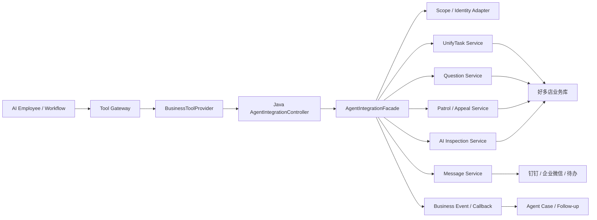
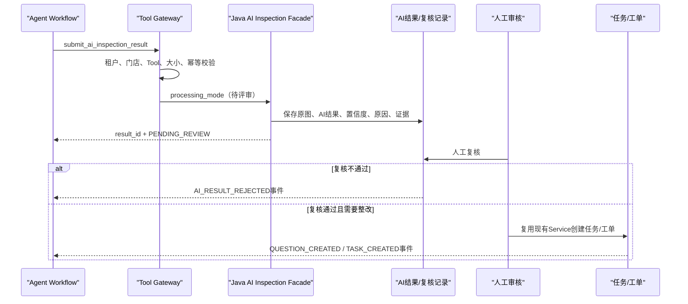

# 好多店 AI Native 业务系统对接规划 V0.1

> **版本**：V0.1  
> **状态**：需求评审与技术规划初稿  
> **日期**：2026-07-17  
> **适用对象**：产品、架构、Agent 研发、Java 后端、测试、安全、数据、交付  
> **对接系统**：好多店 Agent Service、`coolcollege-intelligent` Java 业务系统  
> **文档定位**：在现有业务系统代码基础上，规划 Agent 如何查询实时业务事实、回写 AI 结果、创建或催办任务/工单，并持续跟进业务状态。本文不替代具体接口文档和数据库变更脚本。

---

## 0. 执行摘要

好多店 Agent 不能只连接 Hologres 数仓。数仓适合跨门店分析、趋势聚合和历史证据，但统一任务、Question 工单、巡店审核、稽核申诉、AI 图片结果、人工复核、消息催办等实时状态仍由 Java 业务系统维护。

本次代码核验确认，`coolcollege-intelligent` 已存在以下可复用业务能力：

- 统一任务的创建、查询、处理、转交、重分配和催办；
- Question 工单的创建、AI 辅助创建、查询、处理和催办；
- 巡店检查项的 AI 审核处理、人工审核衔接和稽核申诉；
- AI 巡检结果开放回传，支持 HMAC 签名、租户校验和基于 `msgId` 的幂等；
- 风险门店分析、督导列表和一键催办；
- 钉钉、企业微信、待办等消息发送能力。

但这些能力当前主要服务于 Web 页面和既有业务流程：大量 Controller 直接读取 `UserHolder` 浏览器登录态，并在请求中切换租户数据源。Agent 是独立身份，不能伪造普通用户登录态，也不能让 Agent Service 直接写业务数据库。

因此，推荐的正式对接方式是：

> **Agent Runtime → Tool Gateway → BusinessToolProvider → Java AgentIntegrationFacade → 现有业务 Service。**

`AgentIntegrationFacade` 是新增的服务间适配边界，统一处理服务认证、租户、AI 员工身份、人员代理关系、门店范围、审批凭证、幂等、审计和标准错误码。现有 Web Controller 只作为能力证据和页面入口，不直接等同于 Agent Tool API。

---

## 1. 目标与范围

### 1.1 建设目标

1. 让 Agent 能读取比数仓更实时的任务、工单、审核和申诉状态；
2. 让 AI 图片识别结果安全回写业务系统，并进入已有人工复核流程；
3. 让经过审批的 Agent 动作复用现有统一任务、Question 工单和消息能力；
4. 保持业务对象和状态机的唯一事实源，不在 Agent Service 复制任务/工单状态机；
5. 建立可审计、可重试、可恢复、可追责的服务间调用链路；
6. 支持 Case 跨多次 Run 持续跟进同一个业务问题。

### 1.2 首期对接范围

首期围绕“AI 巡店督导”建设：

- 门店、区域、岗位和人员范围校验；
- 巡店记录、检查项、AI 审核、人工复核、申诉状态查询；
- 统一任务和 Question 工单查询；
- AI 图片原始结果回写；
- 风险门店责任人查询和催办；
- 审批后创建 Question 整改工单，并复用其内置的 `QUESTION_ORDER` 统一任务载体；
- Case 与业务对象关联、状态轮询和后续事件接入。

### 1.3 暂不纳入首期

- Agent 直接操作业务数据库；
- Agent 直接调用自由 SQL；
- Agent 自动通过人工审核或申诉审批；
- Agent 自动删除、转交、重分配或关闭任务；
- 视频 AI、业绩、客流、财务业务写入；
- 为了协议形式而强制把所有内部 Java API 改造成 MCP Server。

---

## 2. 事实源与职责边界

| 数据或对象 | 唯一事实源 | Agent Service 的职责 | 禁止做法 |
|---|---|---|---|
| 租户风险规则与 Agent 动作策略 | Java `riskwarning` 领域 | 查询规则定义和 `actions_json.agentPolicy`，固化触发快照 | Agent 自建第二套风险定义 |
| 每日风险门店和规则命中事实 | Hologres `ads_store_execute_day` / `dws_risk_store_warning_hit` | 定时拉取、生成 Trigger Event、归并 Case | Agent 重算或覆盖规则命中 |
| 历史趋势、风险聚合、跨门店指标 | Hologres DIM/DWD/DWS/ADS | 固定 SQL Tool 查询并形成证据 | 模型生成 SQL |
| 门店、区域、人员、岗位、业务权限 | Java 业务系统及同步数据 | 发起范围校验，保存 Run 范围快照 | 仅相信模型传入的门店或人员 |
| 统一任务及节点状态 | Java `unifytask` 领域 | 查询、经审批发起命令、持续跟进 | 在 `agent_` 表复制任务状态机 |
| Question 工单及整改状态 | Java `question` 领域 | 查询、经审批创建/催办、关联 Case | Agent 直接更新工单表 |
| 巡店记录、审核、申诉 | Java `patrolstore` 领域 | 查询状态、提交受控结果或申请 | Agent 自动代替人工审批 |
| AI 图片原始结果和人工复核结果 | Java `inspection` / `patrolstore` 领域 | 调用回写 Tool、读取复核结论 | 只在模型上下文中保存结果 |
| Agent 岗位、员工、Skill、Case、Run、审批与工具审计 | Agent Service MySQL，统一使用 `agent_` 前缀 | 创建和维护 Agent 自身运行事实 | 写入 Java 业务表代替 Agent 审计 |

核心原则：

1. Java 业务系统管理业务对象和业务状态机；
2. Agent Service 管理 AI 员工、Case、Run、Workflow、审批和 Tool 审计；
3. Hologres 提供分析证据，不承担业务写入；
4. 所有写动作都调用 Java Service/API，不直接写 MySQL；
5. 所有 Tool Call 都必须先经过 Tool Gateway。

---

## 3. 当前代码能力盘点

### 3.1 租户风险规则与每日风险记录

当前 Java 代码已确认每个租户拥有独立风险规则表 `risk_warning_rule_${enterpriseId}`，支持规则新增、编辑、复制、启停和删除。规则可独立配置条件、风险等级、全国/区域范围、通知动作、接收人和订阅组。

规则命中结果按 `stat_date + store_id + rule_id` 写入租户 MySQL `risk_store_warning_history_${enterpriseId}`，并同步形成：

```text
risk_store_warning_history_${enterpriseId}
→ ods_risk_store_warning_history
→ dwd_risk_store_warning_history
→ dws_risk_store_warning_hit
→ ads_store_execute_day
```

`dws_risk_store_warning_hit` 保留每日门店与规则命中明细；`ads_store_execute_day` 按门店和统计日汇总风险规则数、最高风险等级、规则摘要和命中原因。首期 Agent 每天定时读取前一统计日 ADS/DWS 数据，不要求数仓主动回调。

风险规则的 `actions_json` 增加可选 `agentPolicy`。存量规则没有该节点时默认不启用 Agent，避免改变现有租户行为。

```json
{
  "includeRiskReport": true,
  "pushMessageCenter": true,
  "enableNotify": true,
  "notifyHour": 9,
  "pushPerson": true,
  "pushGroup": false,
  "agentPolicy": {
    "agentEnabled": true,
    "workflowCode": "risk_store_followup_analysis",
    "actionMode": "CREATE_QUESTION",
    "approvalMode": "HUMAN_REQUIRED",
    "approvalSlaHours": 4,
    "rectificationSlaHours": 24,
    "caseFollowupIntervalHours": 24,
    "questionPolicy": {
      "handlerStrategy": "STORE_MANAGER_POSITION",
      "reviewerStrategy": "CURRENT_STORE_SUPERVISOR",
      "ccStrategy": "NONE"
    }
  }
}
```

首期 `actionMode` 只支持 `ANALYZE_ONLY`、`CREATE_QUESTION`。`CREATE_QUESTION` 经人工审批后调用 Question 创建链路，该链路会同步生成 `TaskParent(task_type=QUESTION_ORDER)`、父工单和子工单，因此不得再创建一个独立 UnifyTask。`CREATE_TASK`、`TASK_THEN_QUESTION` 延后到业务系统存在明确的 Agent 跟进任务类型和升级契约后再评审。新增节点不得覆盖现有消息通知字段；规则查询和 Trigger Event 均需保存读取时的策略快照。

### 3.2 统一任务 `unifytask`

当前代码已提供任务创建、列表、详情、处理、转交、重分配、刷新和催办等能力。

主要证据：

- `UnifyTaskController`：`/v2|v3/enterprises/{enterprise-id}/unifytask`；
- `UnifyTaskDealController`：任务处理和批量处理；
- `UnifyTaskStoreController`：门店任务列表、状态、处理人和重分配候选人；
- `UnifyTaskAgencyController`：待办、经办和提醒相关查询；
- `UnifyTaskQuestionController`：任务关联问题查询；
- `UnifyTaskService` 及其实现：任务状态、消息和待办等核心业务逻辑。

可复用结论：统一任务仍是任务执行和节点状态的事实源，但首期风险整改不直接调用普通任务创建接口。Question 创建链路已经内置 `QUESTION_ORDER` 统一任务载体，Agent 应通过 Question 入口一次完成创建，避免重复任务。

对接限制：任务 Controller 普遍依赖 `UserHolder.getUser()`，不能直接作为 Agent 服务间接口。

### 3.3 Question 工单

当前代码已提供父工单列表、详情、创建、AI 辅助创建、删除、巡店关联完成状态和工单催办等能力。

已确认入口：

- `QuestionParentInfoController.buildQuestion`；
- `QuestionParentInfoController.buildQuestionAI`；
- `QuestionRecordController` 的工单详情、处理和多种催办入口；
- `QuestionOrderController` 的工单详情；
- `QuestionParentInfoService`、`QuestionRecordService` 及其实现。

现有 `/buildQuestion/ai` 只能作为 POC 参考，不能直接成为正式 Agent API，原因包括：

- 使用浏览器 `UserHolder` 作为创建人；
- 请求字段较少；
- 默认任务名称包含 `aiAgent发起工单`；
- 默认指派店长岗位；
- 默认截止时间为当天结束；
- 没有 `case_id`、`run_id`、`approval_id`、`idempotency_key` 和独立 AI 员工身份。

正式方案应由 `AgentQuestionFacade` 接收标准命令，再调用现有 `QuestionParentInfoService`。

#### 3.3.1 首期风险 Question 流程映射

| 项目 | 首期规则 | 业务系统映射 |
|---|---|---|
| 整改人 | 当前门店店长岗位 | Question 节点 1，`position=50000000` |
| 审批人 | 创建时查询到的当前责任督导 | Question 节点 2，具体人员 ID |
| 节点模式 | 任意一人完成 | `approveType=any` |
| 抄送 | 默认无 | `ccStrategy=NONE` |
| 工单截止 | 创建时间 + `rectificationSlaHours` | `BuildQuestionDTO.endTime` |
| 创建审批超时 | `approvalSlaHours` | Agent `agent_approval`，不等同于 Question 审批 |
| Case 复查 | `caseFollowupIntervalHours` | `agent_followup_schedule` |

风险日记录的 `supervisorUserId` 是历史快照，用于证据和审计。创建正式 Question 前必须重新查询当前门店责任督导；缺少店长或督导时返回 `ASSIGNEE_NOT_FOUND`，Workflow 进入 `WAITING_MANUAL_ASSIGNMENT`，由有权限的审批人补充后重新校验。不得自动回退到管理员、历史督导或风险通知接收人。

`receiversJson`、`subscriptionGroupsJson` 和机器人群是风险消息配置，不承担 Question 流程配置职责。创建前 Agent 审批与整改完成后的 Question 节点 2 审批必须分别记录。

#### 3.3.2 风险 Question 类型与字段映射

正式方案新增 `QuestionTypeEnum.AGENT_RISK("agentRisk", "AI风险整改工单")`。`AI` 已具有 AI 检查项工单语义，`aiInspection` 还关联图片巡检详情、周期工单状态和样本回流逻辑，二者均不得用于风险 Case。Java 未完成类型、列表筛选、详情、导出和报表适配前，`AgentQuestionFacade` 可以临时将有效类型映射为 `common`；来源元数据必须保留 `requestedQuestionType=agentRisk` 与 `effectiveQuestionType=common`，避免兼容值成为长期业务口径。

| Agent 命令字段 | Question 创建映射 | 约束 |
|---|---|---|
| `parent_title` | `BuildQuestionRequest.taskName` | `[AI风险整改][{riskLevel}] {storeName} - {ruleName}`，后端生成并安全截断 |
| `child_title` | `BuildQuestionDTO.taskName` | 默认与父标题一致 |
| `description` | `BuildQuestionDTO.taskDesc` | 事实模板与 AI 整改建议分区；兼容现有实现按 500 字以内控制 |
| `question_type` | `BuildQuestionRequest.questionType` | 目标 `agentRisk`，适配期 `common` |
| `task_info.createType` | `QuestionTaskInfoDTO.createType` | 固定 `2`，表示自动创建 |
| `task_info.photos` | `QuestionTaskInfoDTO.photos` | 只传业务端可访问且通过安全校验的 URL |
| 真实来源对象 ID | `businessId/dataColumnId/metaColumnId` | 有真实关联才填写，禁止使用伪造 ID 标识 Agent 来源 |
| `source` 与幂等信息 | `TaskParentDO.extraParam` + Java 命令审计 | 使用规范 JSON；命令审计/唯一键为幂等事实源 |

`taskInfo` 必须始终序列化为非空对象，否则现有 Question 消费链存在解析和空指针风险。`extraParam` 至少记录 `sourceType=AGENT_RISK_CASE`、`caseId`、`runId`、`agentEmployeeId`、`approvalId`、`ruleId`、`statDate`、请求/有效类型、`evidenceCount`、`evidenceDigest` 和 `idempotencyKey`，不保存完整证据或大段模型文本。

幂等键固定为 `agent-question:{enterpriseId}:{caseId}:v1`。同一 Case 的步骤重试、服务超时恢复和跨 Run 再执行必须返回同一父工单、子工单和 `QUESTION_ORDER`，不能把 `runId` 作为创建唯一性的一部分。完整证据继续保存在 Agent 侧，业务工单只持有摘要和必要的媒体引用。

### 3.4 AI 图片结果、AI 审核与人工复核

当前代码中存在三条相邻但不能混为一谈的能力链路：

1. **平台自调度 AI 巡店**：策略和时段驱动门店拆分、设备抓拍、模型检测、周期聚合，并按策略进入人工复核或 Question 创建；
2. **第三方结果回传**：`AiInspectionOpenApiController.POST /open/aiInspection/results` 接收外部系统已经完成的 AI 检测结果；
3. **巡店图片 AI 审核**：`PatrolStoreAiAuditServiceImpl` 处理巡店检查项图片审核、失败原因、人工审批衔接和任务完成。

平台自调度链路是当前 AI 巡店业务的主流程。它由 `AiInspectionFacade` 启动，经 `AI_INSPECTION_DATA_DEAL`、`AI_INSPECTION_STORE_TASK` 两段 MQ 完成策略拆分和门店执行，落单图与周期记录，兼容同步/异步模型结果，再聚合生成复核待办、负样本或 Question。完整代码、对象、事务和数据分析见 [10-AI 巡店业务代码与事务数据分析](10-好多店_AI巡店业务代码与事务数据分析_V0.1.md)。

现有平台链路已经通过 `ticketCreateMode`、置信度阈值和 `ticketCreateRule` 控制“不发单、人工复核、自动发单”等行为，并通过 `aiResult/finalResult`、`aiPeriodResult/finalResult` 区分 AI 原始判断与最终业务判断。这些是现状事实，不等同于未来 Agent 图片结果回写的 `processing_mode`，两者如何映射需要单独评审。

第三方开放回传入口已确认具备：

- `appId + timestamp + requestJson` 的 HMAC-SHA256 签名；
- `tenantId` 与当前企业一致性检查；
- `msgId` 必填；
- 通过 `captureTaskId = msgId` 查询实现重复提交幂等；
- 策略、门店、媒体类型、结果和置信度校验；
- AI 原始 JSON、结果、置信度、原因、图片明细和 `reviewStatus=0` 等记录；
- 后续结果处理和工单创建逻辑。

需要特别评审的现状：当前 `AiInspectionOpenApiResultServiceImpl.handlePostProcess` 在保存第三方结果后会继续调用 `handleInspectionResultAndCreateTicket`。这意味着该相邻链路中的“原始 AI 结果回写”和“产生正式业务工单”目前可能处于同一条后处理链路，但不能据此推导 Agent 应直接复用此入口或采用相同默认行为。

目标需求是：

- 原始 AI 结果可以自动写入待复核记录；
- 正式结果生效、创建工单、改变任务状态等动作按企业自动化等级和审批策略执行。

未来 Agent 专用入口可评估显式处理模式，例如：

```text
RECORD_ONLY          仅保存原始结果，进入待复核
REVIEW_THEN_ACTION   保存结果，人工通过后再创建工单
SMART_ROUTING        按企业策略、检查项、置信度和风险等级路由
AUTO_ACTION          满足企业策略和置信度门槛后自动创建工单
```

上述模式均为后续评审候选项。本阶段不确定默认模式，不改变平台自调度 AI 巡店、第三方开放回传或巡店图片审核的现有运行策略。

#### 3.4.1 AI 检查项规则效果验证与配置同步

规则效果验证是与现有 AI 检查项通过 `quickColumnId` 关联的旁路能力，不进入平台自调度 AI 巡店运行状态机。Agent 从业务系统只读获取用户已经从历史抓拍中沉淀并完成人工真值确认的数据集，在 Agent 侧保存数据集快照、Baseline 和每次调试版本；复跑过程不得修改历史图片、周期、复核待办或 Question。

用户最终选择一个验证版本后，Agent Service 可调用新增的业务配置适配命令，将该版本中的 AI 规则白名单字段同步到原检查项。该命令必须复用 Java 检查项领域 Service 的校验和保存逻辑，不允许直接更新 `tb_meta_quick_column_*` 等租户表；请求必须绑定租户、检查项、验证版本、基础配置版本/摘要和幂等键，并执行管理权限、版本冲突、字段白名单及前后快照审计。

配置同步只允许影响检查对象、合格/不合格/不适用标准、可编辑 Prompt、标准图和明确选择的模型配置，不得夹带修改结果项、巡检策略、时段、门店范围、工单流程或历史业务结果。同步后的配置由现有 AI 巡店在后续正常调用中读取，现有调度、抓拍、聚合、复核和发单代码路径保持不变。

### 3.5 巡店申诉

`DataColumnAppealController` 已提供：

- 发起申诉；
- 申诉列表；
- 申诉审批；
- 申诉历史；
- 申诉详情。

首期 Agent 仅开放申诉状态和历史查询；发起申诉可作为后续审批类动作；申诉审批必须保留人工权限，不作为 Agent 自动动作。

### 3.6 风险分析与催办

`RiskAiAnalysisController` 已提供：

- 首页风险门店 AI 解读；
- 风险门店按督导展示；
- 一键催办督导；
- 风险门店明细导出。

内部由 `RiskAiAnalysisService` 和 `MessageCenterService` 承担分析与消息能力。Agent 可复用责任人查询和催办 Service，但必须增加幂等、防重复提醒、频控和动作审计。

### 3.7 当前认证与租户上下文

当前 Web API 主要通过：

- `access_token`；
- Redis 中的 `CurrentUser`；
- `UserHolder`；
- URL 中的 `enterprise-id` 与登录企业一致性校验；
- `DataSourceHelper` 动态数据源切换。

开放 AI 巡检结果接口位于 Token 白名单中，使用独立 HMAC 签名。

结论：现有认证机制能证明系统已有服务间开放接口基础，但 Agent 对接需要独立的服务身份和 AI 员工上下文，不能长期复用浏览器 Token，也不能把 `/open/**` 简单放入白名单后只依赖模型参数。

---

## 4. 推荐总体架构



### 4.1 Agent Service 侧

新增 `BusinessToolProvider`，职责包括：

- 将 Tool Contract 转换为 Java 内部 API 请求；
- 传递可信 `ToolExecutionContext`；
- 控制超时、重试和最大响应体；
- 对查询和命令使用不同重试策略；
- 将 Java 错误码映射为 Agent Tool 错误；
- 写入 `agent_tool_call`、`agent_audit_log` 和业务对象关联。

### 4.2 Java 业务系统侧

新增 `AgentIntegrationController` 和 `AgentIntegrationFacade`，职责包括：

- 验证 Agent Service 身份和请求签名；
- 校验 `enterprise_id`、AI 员工和代理人员；
- 解析并固化租户数据源；
- 二次校验门店、区域、人员和岗位范围；
- 校验 `approval_id` 与命令类型；
- 处理幂等、业务审计和标准错误；
- 调用现有领域 Service，不复制领域逻辑；
- 返回稳定、面向 Tool 的 DTO；
- 后续发布业务状态事件。

### 4.3 不直接复用 Web Controller 的原因

1. Web Controller 与页面 DTO、浏览器 Token、`UserHolder` 耦合；
2. 页面接口返回结构可能随 UI 变化；
3. 服务间调用需要独立认证、幂等、审批凭证和调用方审计；
4. Agent 需要明确区分 AI 员工身份、代理人员身份和审批人身份；
5. Tool 响应必须稳定且有大小限制；
6. 直接复用会把权限安全建立在临时登录态和模型入参上。

---

## 5. Tool Adapter 规划

以下为 Tool 规划名，不代表当前 Java 已存在同名 API。

### 5.1 查询类 Tool

| Tool code | Java 领域 | 用途 | 首期 |
|---|---|---|---|
| `list_daily_risk_store_hits` | Hologres ADS/DWS | 查询前一统计日风险门店及规则命中明细 | 是 |
| `get_risk_rule_definition` | riskwarning | 查询租户规则定义及 `agentPolicy` | 是 |
| `get_store_operating_context` | store / org | 查询门店、区域、岗位和责任人 | 是 |
| `get_unify_task_detail` | unifytask | 查询任务、门店任务、节点、处理人和状态 | 是 |
| `list_unify_tasks` | unifytask | 按 Case 范围查询任务 | 是 |
| `get_question_detail` | question | 查询父工单、明细、处理进度和整改状态 | 是 |
| `list_questions` | question | 查询门店或 Case 相关工单 | 是 |
| `get_patrol_record_detail` | patrolstore | 查询巡店记录和检查项 | 是 |
| `get_ai_review_result` | inspection / patrolstore | 查询 AI 原始结果、人工复核和最终结果 | 是 |
| `get_appeal_status` | patrolstore | 查询申诉详情、历史和状态 | 是 |
| `list_risk_store_supervisors` | homepage / messagecenter | 查询风险门店责任督导 | 是 |

查询类 Tool 默认仍需：租户校验、门店范围校验、字段脱敏、分页和响应大小限制。

`list_daily_risk_store_hits` 只能通过固定 SQL 查询 `ads_store_execute_day` 和 `dws_risk_store_warning_hit`。`get_risk_rule_definition` 通过 Java 专用 Facade 查询当前租户规则；两者合并形成 Trigger Event，模型不能修改租户、统计日、门店或规则标识。

### 5.2 草稿类 Tool

| Tool code | 结果 | 说明 |
|---|---|---|
| `draft_question_order` | Agent 草稿 | 形成工单标题、问题、证据、处理人和时限建议 |
| `draft_supervisor_reminder` | Agent 草稿 | 生成提醒对象与内容，不发送 |

草稿记录保存在 Agent Service，并关联 `case_id`、`run_id` 和证据快照。

### 5.3 动作类 Tool

| Tool code | 复用领域 | 默认控制等级 |
|---|---|---|
| `submit_ai_inspection_result` | inspection | 原始结果可自动；业务生效按策略 |
| `create_question_order` | question + unifytask | 必须审批；一次生成 Question 和 `QUESTION_ORDER` 任务载体 |
| `remind_task_handler` | unifytask / message | 可配置低风险自动化，但必须频控 |
| `remind_question_handler` | question / message | 可配置低风险自动化，但必须频控 |
| `remind_risk_store_supervisor` | messagecenter | 可配置低风险自动化，但必须频控 |

首期不开放：

```text
approve_task
approve_appeal
close_question
delete_task
delete_question
transfer_task
reallocate_task
update_store_status
```

---

## 6. 服务间认证、身份与权限

### 6.1 三种身份必须分离

| 身份 | 含义 | 来源 |
|---|---|---|
| Service Identity | 哪个 Agent Service 实例在调用 | 服务凭据、`client_id`、签名或 mTLS |
| AI Employee Identity | 哪个独立 AI 员工在执行 | `agent_employee_id` 和版本快照 |
| Human Delegation / Approval Identity | 谁授权范围或批准动作 | `delegated_user_id`、`approval_id`、审批记录 |

AI 员工作为独立身份，不冒充普通员工。业务审计需同时记录 AI 员工和最终授权人。

### 6.2 建议请求头

```http
X-Agent-Client-Id: coolstore-agent-service
X-Agent-Timestamp: 1784227200000
X-Agent-Nonce: 7f9d...
X-Agent-Signature: hmac-sha256(...)
X-Agent-Request-Id: req_...
```

签名文本建议覆盖：HTTP method、path、timestamp、nonce、body hash。Java 侧需校验时间窗和 nonce 防重放，密钥按环境和调用方管理。

### 6.3 可信执行上下文

```json
{
  "request_id": "req_20260717_001",
  "idempotency_key": "agent:question:create:case_102:proposal_3",
  "enterprise_id": "E10001",
  "agent_employee_id": "ae_risk_supervisor_01",
  "case_id": "case_102",
  "run_id": "run_309",
  "tool_call_id": "tc_901",
  "delegated_user_id": "U2001",
  "approval_id": "ap_771",
  "scope_snapshot_id": "scope_20260717_09",
  "source": "AI_EMPLOYEE"
}
```

约束：

- `enterprise_id` 必须同时存在于签名上下文、请求体和业务对象中并保持一致；
- `agent_employee_id` 必须启用且属于当前企业；
- `delegated_user_id` 只代表权限来源，不等于执行人；
- Java 侧必须重新计算或验证资源范围，不能只信任 `scope_snapshot_id`；
- 写动作必须验证 `approval_id` 的动作类型、对象、参数摘要、有效期和审批状态；
- 所有业务 SQL 或 Service 查询必须显式绑定企业。

---

## 7. 接口契约规划

### 7.1 建议内部路径

```text
/internal/agent/v1/enterprises/{enterprise-id}/queries/*
/internal/agent/v1/enterprises/{enterprise-id}/commands/*
/internal/agent/v1/enterprises/{enterprise-id}/callbacks/*
```

`/internal/agent/**` 不复用浏览器 `access_token` 白名单逻辑，应配置独立认证 Filter/Interceptor。

### 7.2 标准响应

```json
{
  "request_id": "req_20260717_001",
  "success": true,
  "code": "OK",
  "message": "success",
  "data": {},
  "business_refs": [
    {
      "object_type": "QUESTION_ORDER",
      "object_id": "1908821",
      "status": "PROCESSING"
    }
  ],
  "occurred_at": "2026-07-17T10:30:00+08:00"
}
```

### 7.3 标准错误码

| 错误码 | 含义 | Agent 处理方式 |
|---|---|---|
| `AUTH_FAILED` | 服务身份或签名无效 | 不重试，告警 |
| `REPLAY_REJECTED` | timestamp/nonce 重放 | 不重试 |
| `TENANT_MISMATCH` | 租户不一致 | 不重试，审计 |
| `AGENT_EMPLOYEE_DISABLED` | AI 员工停用 | 终止 Run |
| `PERMISSION_DENIED` | 门店、区域、人员或动作越权 | 阻断并审计 |
| `APPROVAL_REQUIRED` | 缺少审批 | Workflow 转审批等待 |
| `APPROVAL_INVALID` | 审批与命令参数不匹配 | 重新生成审批请求 |
| `ASSIGNEE_NOT_FOUND` | 当前门店店长或责任督导无法解析 | 进入 `WAITING_MANUAL_ASSIGNMENT`，等待有权限人员补充 |
| `IDEMPOTENT_REPLAY` | 重复命令，返回原结果 | 视为成功 |
| `BUSINESS_CONFLICT` | 状态已变化或不能执行 | 重新查询业务状态 |
| `RATE_LIMITED` | 催办或调用过频 | 延迟重试 |
| `DEPENDENCY_TIMEOUT` | 下游超时 | 按命令策略重试或转人工 |
| `RESULT_TOO_LARGE` | 查询结果超限 | 缩小范围或分页 |

---

## 8. 幂等、事务与重试

### 8.1 幂等键

所有写动作必须携带 `idempotency_key`。建议组成：

```text
{enterprise_id}:{tool_code}:{case_id}:{business_intent_version}
```

Java 侧按 `enterprise_id + command_type + idempotency_key` 唯一处理，并保存请求摘要、业务结果和最终状态。

### 8.2 现有能力复用

第三方 AI 巡检回传已使用 `msgId` 作为幂等键。若后续确认 Agent 复用或适配这条链路，可令：

```text
msgId = idempotency_key 或由其稳定派生
```

但需要补充并发唯一约束或原子占位机制，避免“先 count 再 insert”在并发下产生竞态；具体约束需结合现有表索引核验后设计。

平台自调度 AI 巡店不是以开放接口 `msgId` 为全链路幂等事实源。当前代码主要使用 MQ `messageId` Redis 锁、周期/日期维度 Question Redis 锁以及 `ticketId` 状态检查抑制重复处理，尚未核验到覆盖全链路的数据库唯一命令。其并发与重试风险见第 10 份专项分析。

### 8.3 重试规则

- 查询类：网络超时可指数退避重试；
- 写命令：只有携带稳定幂等键时才允许自动重试；
- `PERMISSION_DENIED`、`APPROVAL_INVALID`、参数错误不得重试；
- `BUSINESS_CONFLICT` 先重新读取对象状态，再决定是否生成新命令；
- 催办类必须同时满足幂等、频控和最短提醒间隔。

### 8.4 事务边界

Java 领域 Service 负责业务事务；Agent Service 不发起跨库分布式事务。

Agent Service 使用最终一致性：

1. 写 `agent_tool_call` 为执行中；
2. 调用 Java 命令；
3. Java 在本地事务内落业务对象和命令审计；
4. 返回业务引用；
5. Agent 写 `agent_case_business_ref` 并结束 Tool Call；
6. 超时但结果未知时，以幂等键查询命令结果，不盲目重复创建。

以上是 Agent 业务命令的目标事务边界，不代表现有平台自调度 AI 巡店已经具备相同边界。当前抓拍、模型调用、周期聚合、复核确认和 MQ 发单跨 MySQL、Redis、RocketMQ 与外部模型服务，未形成一个本地事务，实际采用分段事务和最终一致性；不得把任一 MQ 消费成功等同于整个业务链路完成。

---

## 9. AI 图片结果回写待评审方案

本节描述未来 Agent 图片结果回写的候选方案，不是现有平台自调度 AI 巡店的实现说明，也不代表已经决定复用 `/open/aiInspection/results`。

### 9.1 候选流程



候选 `processing_mode` 包括 `RECORD_ONLY`、`REVIEW_THEN_ACTION`、`SMART_ROUTING`、`AUTO_ACTION`。默认值、企业适用范围以及与现有 `ticketCreateMode` 的映射均待需求评审。

### 9.2 候选补充字段

在不破坏现有 DTO 的前提下，Agent 专用请求至少需要：

- `source = AI_EMPLOYEE`；
- `agent_employee_id`；
- `case_id`、`run_id`、`tool_call_id`；
- `idempotency_key`；
- 原图/证据对象地址和内容摘要；
- 模型、模型版本、Prompt/Skill 版本；
- 结构化检查项、结果、置信度和原因；
- `processing_mode`；
- 业务策略版本；
- 需要人工复核的原因。

### 9.3 复核结果回流

人工复核后至少回流：

- 原 AI 结果 ID；
- 最终结果；
- 复核状态；
- 复核人和时间；
- 修改原因；
- 关联任务/工单；
- 当前业务状态。

该数据既用于 Case 跟进，也用于 AI 结果准确率评估和后续 Skill 评测。

### 9.4 与现有平台自调度 AI 巡店的边界

- Agent 不得绕过现有策略、时段、门店范围、检查项和租户校验直接触发设备抓拍；
- Agent 结果不得直接覆盖单图或周期 `finalResult`，除非进入现有复核语义或新增了明确、可审计的专用命令；
- Agent 创建 Question 时必须复用既定的业务 Service、审批角色、缺人阻断和 Case 级幂等约束；
- 是否复用现有单图、周期、复核待办和负样本表，必须在核验实际 DDL、索引和生产调用方后决定；
- 平台自调度链路、第三方回传链路和 Agent 回写链路需要分别定义认证、幂等、事务与兼容策略。

---

## 10. 业务事件与 Case 跟进

### 10.1 首期策略

当前代码已大量使用消息队列发送任务通知和待办，但尚未核验出一套稳定、面向 Agent 的“任务/工单状态变更事件契约”。首期采用：

1. 创建业务对象后保存 `agent_case_business_ref`；
2. `agent_followup_schedule` 定时唤醒；
3. 查询类 Tool 拉取最新状态；
4. 状态变化写入 `agent_case_event`；
5. 满足关闭条件后关闭 Case。

### 10.2 后续事件化

P2 以后建议由 Java 侧通过 MQ 或回调发布统一事件：

```text
TASK_CREATED
TASK_STATUS_CHANGED
TASK_OVERDUE
QUESTION_CREATED
QUESTION_STATUS_CHANGED
QUESTION_CLOSED
AI_RESULT_REVIEWED
APPEAL_STATUS_CHANGED
REMINDER_SENT
```

事件必须包含：`event_id`、`enterprise_id`、对象类型、对象 ID、前后状态、操作人/AI 员工、发生时间和业务版本。Agent 以 `event_id` 幂等消费。

---

## 11. Agent Service MySQL 关联规划

继续使用已经统一的 `agent_` 表前缀。业务对接主要复用：

- `agent_case`：长期业务问题容器；
- `agent_case_business_ref`：关联统一任务、Question 工单、巡店记录、AI 结果、申诉；
- `agent_case_event`：保存业务状态变化；
- `agent_run`：一次执行；
- `agent_tool_call`：每次查询或动作调用；
- `agent_approval`：动作审批；
- `agent_idempotency_record`：写动作幂等；
- `agent_audit_log`：权限、审批和业务命令审计；
- `agent_followup_schedule`：定时回访业务对象。

`agent_case_business_ref` 建议至少包含：

```text
enterprise_id
case_id
object_type
object_id
object_code
relation_type
current_status
status_version
source_tool_call_id
last_synced_at
```

这些表只保存 Agent 关联和运行事实，不替代 Java 业务表。

### 11.1 每日触发、Case 归并与关闭

首期由 Agent Service 默认每天 07:00（Asia/Shanghai，可配置）读取前一统计日数据，并先校验 `ads_update_time` 和刷新完整性。数据未就绪时延迟重试，不把缺数解释为无风险。

```text
Trigger Event 幂等键：enterprise_id + stat_date + store_id + rule_id
Case 业务键：enterprise_id + store_id + rule_id + workflow_code
```

同一门店与规则的多日命中记录分别写入 `agent_case_event`，但归并到同一个未关闭 Case。Case 已关闭后再次命中时创建复发 Case并关联上一 Case。

默认关闭条件为：如有关联业务对象则全部达到业务终态，同时连续 3 个已确认完成数仓刷新的统计日未再命中同一规则。未刷新不得计入连续未命中天数；关闭前必须重新核验业务事实。

---

## 12. 分阶段实施计划

### P0：只读对接与契约基线

目标：让 Agent 能读取实时业务状态，不产生业务写入。

- 建立 `AgentIntegrationController/Facade`；
- 建立服务认证、租户上下文和标准错误码；
- 接入门店/人员范围、任务、工单、巡店、AI 复核、申诉查询；
- 建立 `BusinessToolProvider`；
- 接入 Hologres 日风险扫描、刷新校验、Trigger 幂等和 Case 归并；
- 接入 Java 租户风险规则与 `agentPolicy` 查询；
- 建立接口契约测试和越权测试；
- Agent Case 使用轮询持续跟进。

验收：同一风险门店的数仓分析结果可下钻到业务系统中的任务、工单和审核实时状态。

### P1：AI 原始结果回写与人工复核

目标：AI 图片结果可进入业务系统记录，是否自动产生正式整改动作由显式、可审计的处理策略决定。

- 复用 AI 巡检开放接口的数据结构和签名思路；
- 增加 Agent 身份、Case/Run 关联和 `processing_mode`；
- 将保存结果与创建工单解耦；
- 对照现有平台 `ticketCreateMode` 评审 `RECORD_ONLY`、`REVIEW_THEN_ACTION`、`SMART_ROUTING`、`AUTO_ACTION` 的语义和兼容边界，默认值暂不确定；
- 人工复核结果可由轮询或事件回流；
- 验证重复回写、并发幂等和失败恢复。

验收：同一 `idempotency_key` 重复回写不产生重复结果；人工复核能追溯到 AI 员工、Case、Run 和证据。

### P2：审批后创建 Question 工单

目标：Agent 草稿经人工审批后复用现有 Service 创建业务对象。

- 新增 `create_question_order` 命令，通过 `AgentQuestionFacade` 一次创建 Question 和 `QUESTION_ORDER` 任务载体；
- 新增 `agentRisk` Question 类型并适配查询、详情、导出和报表；未完成前由 Facade 显式兼容映射为 `common`；
- 按统一模板映射标题、描述、`taskInfo`、来源元数据和 Case 级幂等键；
- 审批参数摘要绑定；
- 返回业务对象 ID 并写 `agent_case_business_ref`；
- 增加状态查询、超时跟进和催办草稿；
- 禁止 Agent 自动审批或删除业务对象。

验收：审批通过后只创建一次业务对象；越权门店、过期审批、参数被修改均被拒绝并审计。

### P3：低风险动作自动化与事件驱动

目标：在企业策略允许时自动执行有限的低风险动作。

- 对催办开放自动化等级、频控和静默时段；
- Java 侧发布任务、工单、审核和申诉状态事件；
- Case 从轮询逐步切换到事件唤醒；
- 支持失败补偿、运营控制台和一键停用。

---

## 13. 研发工作拆分

### 13.1 Java 业务系统

建议新增或改造：

```text
controller/agentintegration/AgentIntegrationController
service/agentintegration/AgentIntegrationFacade
service/agentintegration/AgentIdentityService
service/agentintegration/AgentScopeService
service/agentintegration/AgentCommandService
config/AgentServiceAuthFilter
model/agentintegration/request/*
model/agentintegration/response/*
```

工作项：

- 服务间认证与防重放；
- AI 员工和代理人员上下文；
- 统一租户数据源切换；
- 范围校验；
- 稳定 DTO 和错误码；
- 写命令幂等；
- AI 结果 `processing_mode`；
- 复用 `UnifyTaskService`、`QuestionParentInfoService`、`PatrolStoreAiAuditService`、`AiInspectionOpenApiResultService`、`MessageCenterService`；
- 业务对象状态事件或命令结果查询。

### 13.2 Agent Service

建议新增：

```text
tools/providers/business_tool_provider.py
integrations/coolcollege/client.py
integrations/coolcollege/auth.py
integrations/coolcollege/contracts.py
integrations/coolcollege/error_mapping.py
services/business_reference_service.py
services/business_followup_service.py
```

工作项：

- Tool Contract 与 Java DTO 映射；
- 请求签名、超时、重试、熔断；
- Tool Gateway 资源级校验；
- 审批绑定和幂等；
- `agent_case_business_ref` 维护；
- 轮询和事件消费；
- 返回大小控制和敏感字段清理。

### 13.3 测试

- Java Facade 单元测试；
- Service 复用集成测试；
- Agent 与 Java 契约测试；
- 多租户隔离和数据源切换测试；
- 门店/区域/人员越权测试；
- 幂等和并发重复提交测试；
- 审批被篡改、过期和重复执行测试；
- AI 图片回写与人工复核全链路测试；
- 下游超时、业务冲突、消息失败和恢复测试。

---

## 14. 首期验收标准

1. Agent 可使用独立服务身份调用 Java 内部接口；
2. Java 能识别 `enterprise_id`、`agent_employee_id`、`case_id`、`run_id` 和 `tool_call_id`；
3. AI 员工作为独立执行人，审计中同时保留授权人/审批人；
4. 不依赖浏览器 `access_token` 或伪造 `UserHolder`；
5. 非授权门店和区域返回 `PERMISSION_DENIED`；
6. Agent 能查询统一任务、Question 工单、巡店检查项、AI 复核和申诉实时状态；
7. AI 图片原始结果可幂等回写为待复核记录；
8. 默认模式下，原始结果回写不会绕过审批直接形成正式业务结论；
9. 创建任务/工单必须携带有效且参数匹配的 `approval_id`；
10. 同一幂等键重复请求只产生一个业务对象；
11. 创建成功后保存业务对象引用，Case 可跨多次 Run 跟进；
12. 所有成功、失败、越权和被拦截调用均可审计；
13. Agent Service 不直接写 Java 业务数据库；
14. Java 领域状态机不复制到 Agent Service；
15. 业务系统不可用时，命令状态可恢复，不产生重复工单或消息。

---

## 15. 已确认事项与需求评审待确认项

已确认：

1. 风险门店定义来自每个租户自己的 Java 风险预警规则；
2. 风险日记录来自租户 MySQL，并同步到 Hologres ADS/DWS；
3. 首期由 Agent 每日定时拉取，不改造数仓主动回调；
4. 存量规则没有 `agentPolicy` 时默认不启用 Agent；
5. 日风险记录独立保留，同一门店与规则归并到同一未关闭 Case；
6. Case 关闭后再次命中创建复发 Case；
7. 默认关闭条件为关联业务完成且连续 3 个有效统计日未命中；
8. 首期 `actionMode` 只保留 `ANALYZE_ONLY`、`CREATE_QUESTION`，不单独创建 UnifyTask；
9. 风险 Question 默认由门店店长整改、当前责任督导审批，缺人时阻断创建；创建审批、整改截止和 Case 跟进使用三个独立 SLA；
10. 风险 Question 目标类型为 `agentRisk`，适配期可映射为 `common`；字段、来源、证据摘要和 Case 级幂等键使用统一模板；
11. AI 员工是独立业务身份，不复用真实用户身份；
12. AI 检查项规则效果验证以用户从历史巡店结果沉淀的数据集为基础，单次正式验证不少于 50 张有效真值图片；验证旁路运行、每次调试形成版本，用户最终选择版本后通过受控业务接口同步 AI 规则配置；
13. 验证数据集区分优化集和冻结的验收集。验收集不参与优化，至少 50 张，默认 `PASS >= 15`、`FAIL >= 15`，支持 `INAPPLICABLE` 时该类别至少 5 张；真值由具备检查项管理权限的用户确认，成员或真值变化创建新数据集版本。
14. 候选版本在正式验收集完整执行，且“总体准确率提升至少 6 个百分点或达到检查项目标、`FAIL` Recall 不低于 Baseline、模型错误率不超过 2%”时标记为推荐采用；50 张最低验收集最多允许 1 张模型错误。

以下问题需要在接口详细设计前确认：

1. Agent 图片结果在业务上属于原始检测结果、辅助意见还是复核建议，允许写入哪些现有对象；
2. `RECORD_ONLY`、`REVIEW_THEN_ACTION`、`SMART_ROUTING`、`AUTO_ACTION` 与现有 `ticketCreateMode` 如何映射，默认模式和企业适用范围是什么；
3. 第三方 AI 巡检回传接口的现有调用方是否依赖“回写后自动创建工单”，兼容策略如何配置；
4. Java 现有创建人、操作人等必填字段如何承载 AI 员工独立身份和人工同步操作者，且不伪装为真实用户；
5. 权限继承自岗位、具体授权人，还是 AI 员工独立授权范围；
6. 催办最短间隔、每日上限、静默时段和升级规则；
7. 首期采用轮询的状态清单和频率；
8. Java 侧是否已有可复用的命令审计表和唯一键；
9. 后续事件通过现有 RocketMQ、HTTP 回调还是统一事件总线发布；
10. 检查项 AI 规则同步是否需要二次审批，以及同步后从下一次模型调用还是下一个巡检周期开始生效。
11. 未达到推荐门槛的普通检查项版本是否允许说明原因后同步，以及高风险检查项需要哪些不可绕过的硬门槛。

---

## 16. 代码核验依据

本规划以 `D:\dev\project\ku\coolcollege-intelligent` 当前代码为事实来源。平台自调度 AI 巡店的代码与事务数据证据已单独沉淀在 [10-AI 巡店业务代码与事务数据分析](10-好多店_AI巡店业务代码与事务数据分析_V0.1.md)，本规划重点核验文件包括：

```text
coolcollege-intelligent-web/.../controller/unifytask/UnifyTaskController.java
coolcollege-intelligent-web/.../controller/unifytask/UnifyTaskDealController.java
coolcollege-intelligent-web/.../controller/unifytask/UnifyTaskStoreController.java
coolcollege-intelligent-web/.../controller/unifytask/UnifyTaskAgencyController.java
coolcollege-intelligent-web/.../controller/question/QuestionParentInfoController.java
coolcollege-intelligent-web/.../controller/question/QuestionRecordController.java
coolcollege-intelligent-web/.../controller/patrolstore/DataColumnAppealController.java
coolcollege-intelligent-web/.../controller/openApi/AiInspectionOpenApiController.java
coolcollege-intelligent-web/.../controller/homepage/RiskAiAnalysisController.java
coolcollege-intelligent-web/.../config/TokenValidateFilter.java
coolcollege-intelligent-web/.../config/RequestInterceptor.java
coolcollege-intelligent-service/.../service/inspection/impl/AiInspectionOpenApiResultServiceImpl.java
coolcollege-intelligent-service/.../service/inspection/impl/AiInspectionCapturePictureServiceImpl.java
coolcollege-intelligent-service/.../service/patrolstore/impl/PatrolStoreAiAuditServiceImpl.java
coolcollege-intelligent-service/.../service/messagecenter/impl/MessageCenterServiceImpl.java
coolcollege-intelligent-service/.../service/question/impl/QuestionRecordServiceImpl.java
coolcollege-intelligent-service/.../service/unifytask/UnifyTaskService.java
```

`docs/domain` 只用于业务导航；若文档描述与代码不一致，以 Controller → Service → DAO 当前实现为准。具体接口参数、表索引、MQ Topic、状态枚举和部署认证方式，进入详细设计时继续逐项核验。

---

## 17. 最终结论

好多店业务系统已经具备 Agent 落地需要的大部分业务执行底座，当前主要缺口不是重写任务、工单或审核系统，而是补齐一条面向 AI 员工的稳定服务间边界。

首期应优先完成：

```text
独立 AI 员工身份
+ Agent 专用 Integration Facade
+ 现有 Service 复用
+ 实时业务查询
+ AI 结果待复核回写
+ 审批后任务/工单创建
+ 幂等与审计
+ Case 持续跟进
```

完成这些能力后，Agent 才能从“基于数仓生成分析结论”升级为“连接真实业务系统并推动闭环的 AI 员工”。
