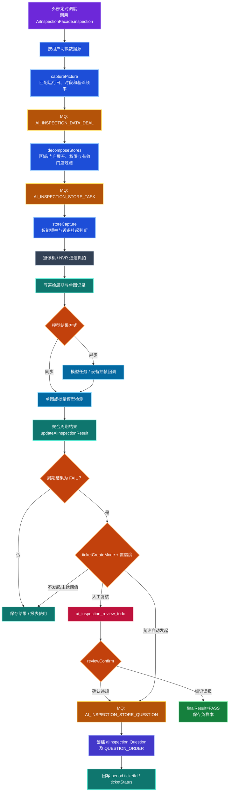
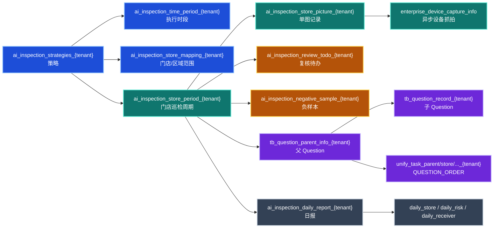

# 好多店 AI 巡店业务代码与事务数据分析（V0.1）

> **版本**：V0.1  
> **状态**：代码事实核验稿  
> **日期**：2026-07-17  
> **代码基线**：`D:\dev\project\ku\coolcollege-intelligent`，`master@3847998dd208cd17a2bb8278e4933cdfe4291acd`  
> **分析范围**：平台自调度 AI 巡店  
> **不在范围**：第三方 `/open/aiInspection/results` 结果回传链路的详细设计、Agent 图片回写策略决策、代码或数据库改造

---

## 0. 执行摘要

本文所说的 **AI 巡店**，特指好多店业务系统内部已经运行的平台自调度链路：

```text
策略配置
→ 按日期和时段触发
→ 将区域/门店范围拆成单店任务
→ 对门店摄像机或 NVR 通道抓拍
→ 调用配置的 AI 模型
→ 聚合为门店某次巡检周期结果
→ 按策略进入人工复核或创建 Question 工单
```

这不是一个单体 Service 内的同步事务。当前实现由 SOFA Facade、租户动态数据源、多个 MySQL 表、两个抓拍 MQ 阶段、模型同步/异步调用、设备回调、Redis 状态和 Question MQ 共同组成，是一个 **最终一致的业务流程**。

当前代码已经区分：

- AI 单图原始结果与单图最终结果；
- AI 周期聚合结果与人工复核后的最终结果；
- 图片级人工标注与周期级人工复核；
- AI 违规工单与设备离线异常工单；
- 巡检事实表与日报派生表。

因此，后续 Agent 对接不能简单理解为“调用图片模型后直接写 Question”。在决定 `REVIEW_THEN_ACTION`、`SMART_ROUTING` 或 `AUTO_ACTION` 前，必须先明确 Agent 是复用现有策略分流、只提交新的证据来源，还是创建一条独立的结果处理链路。

---

## 1. 范围与事实源

### 1.1 本文分析的主链路

主入口为 `AiInspectionFacadeImpl.inspection()`，核心编排在 `AiInspectionCapturePictureServiceImpl`，主要业务阶段为：

1. `capturePicture`：匹配当天启用的策略和执行时段；
2. `AI_INSPECTION_DATA_DEAL`：按策略解析区域和门店；
3. `decomposeStores`：校验创建人门店权限和门店有效状态，生成单店任务；
4. `AI_INSPECTION_STORE_TASK`：执行单店抓拍；
5. `storeCapture`：创建巡检周期和图片记录，调用同步或异步模型；
6. `updateAiInspectionResult`：聚合单图结果并更新周期结果；
7. `handleInspectionResultAndCreateTicket`：按置信度和策略分流；
8. `reviewConfirm`：人工确认违规或标记误报；
9. `AI_INSPECTION_STORE_QUESTION`：异步创建 `aiInspection` Question 工单；
10. Question 处理完成后，将工单状态同步回巡检周期。

### 1.2 相邻但独立的链路

2026 年 6 月新增了第三方任务下发及 `/open/aiInspection/results` 回传能力。它会复用巡检周期、图片、复核和工单能力，但其触发方、签名、入参和幂等入口不同。

本文只在系统边界处标明这条链路，不把它纳入平台自调度主流程，也不根据它确定 Agent 图片结果的默认处理模式。

### 1.3 证据等级

| 证据 | 本文使用方式 |
|---|---|
| 当前 Java 代码 | Controller、Facade、Service、Listener、DAO、Mapper、Entity 和 Enum 的实现事实 |
| Git 历史 | 解释业务能力的演进和代码为何分散 |
| Mapper SQL | 确认逻辑表名、字段映射、读写方向和租户后缀 |
| 实体类 | 辅助说明字段语义，不用于推断实际库索引、默认值和长度 |
| 实际 MySQL DDL | 本轮未连接数据库，索引、唯一键、外键、字符集和字段长度均待后续只读核验 |

---

## 2. 卞亚东相关提交演进

AI 巡店不是一次提交完成，而是从策略配置逐步演进为抓拍、模型、复核、工单、报表和设备异常闭环。

| 时间 | 提交 | 主要变化 |
|---|---|---|
| 2025-09-25 | `6bdde3c8a5` | 初始 AI 巡检：策略、时段、门店映射、图片记录、模型配置等基础结构 |
| 2025-10 至 2025-12 | 多次 `bianyadong` 提交 | 抓拍任务、NVR/国标设备、异步回调、结果汇总、自动工单、报表和重复执行控制 |
| 2026-03-18 | `c79b8e1349` | 批量识别与巡检记录查询收口 |
| 2026-03-18 | `6f15968e05` | 人工复核待办与确认闭环 |
| 2026-03-19 | `6b5be89769` | 设备异常告警、挂起与智能抓拍频率闭环 |
| 2026-03-24 | `003448f97a` | 补齐当前 AI 巡检后端主流程、记录详情和报表关联 |
| 2026-06-04 | `156aebcda1` | 调整第三方结果进入现有工单处理的衔接能力 |
| 2026-06 至 2026-07 | 多次 `byd` 提交 | 图片标注、记录详情、导出、工单删除及效果验证优化 |

结论：阅读当前实现时不能只看 `AiInspectionOpenApiResultServiceImpl`。平台自调度 AI 巡店的主干仍在 `AiInspectionFacadeImpl`、`AiInspectionCaptureListener`、`AiInspectionCapturePictureServiceImpl`、`AiInspectionStrategiesServiceImpl` 及其 Mapper 中。

---

## 3. 当前业务对象

| 对象 | 业务含义 | 主要代码/存储 |
|---|---|---|
| AI 巡检策略 | 绑定 AI 快捷检查项，定义运行日、场景标签、人员和扩展策略 | `AiInspectionStrategiesDO` / `ai_inspection_strategies_${enterpriseId}` |
| 执行时段 | 定义某策略的开始、结束和基础抓拍间隔 | `AiInspectionTimePeriodDO` / `ai_inspection_time_period_${enterpriseId}` |
| 门店范围 | 将策略配置到具体门店或区域 | `AiInspectionStoreMappingDO` / `ai_inspection_store_mapping_${enterpriseId}` |
| 快捷检查项 | 提供检查项名称、模型配置、整改和审批流程 | `TbMetaQuickColumnDO` 及模型配置域 |
| 巡检周期 | 一家门店在某个策略、某个抓拍时间的一次汇总执行 | `AiInspectionStorePeriodDO` / `ai_inspection_store_period_${enterpriseId}` |
| 单图记录 | 一台摄像机或通道的一张图及其抓拍、AI、人工标注结果 | `AiInspectionStorePictureDO` / `ai_inspection_store_picture_${enterpriseId}` |
| 设备抓拍任务 | 记录需要异步查询的设备抓拍任务 | `EnterpriseDeviceCaptureInfoDO` / `enterprise_device_capture_info` |
| 复核待办 | 周期结果进入人工确认时，按复核人生成的待办 | `AiInspectionReviewTodoDO` / `ai_inspection_review_todo_${enterpriseId}` |
| 负样本 | 人工判定误报后保存的图片和 AI 结果快照 | `AiInspectionNegativeSampleDO` / `ai_inspection_negative_sample_${enterpriseId}` |
| Question | 确认违规或策略允许自动发起后创建的整改工单 | `QuestionTypeEnum.AI_INSPECTION`、Question 与 UnifyTask 领域 |
| 日报 | 对巡检周期和工单状态形成的接收人、门店、风险汇总 | `ai_inspection_daily_report_*` 等派生表 |

### 3.1 策略扩展配置

`AiInspectionStrategiesExtendInfo` 当前承载多类策略：

| 字段 | 当前语义 |
|---|---|
| `reviewers` | 人工复核人，可配置人员或岗位并按门店解析 |
| `ticketCreateMode` | `0` 智能分流、`1` 全人工复核、`2` 全自动发起、`3` 不发起 |
| `autoIssueThreshold` | 智能分流直接发单置信度阈值，默认 90 |
| `reviewThreshold` | 进入复核或全自动模式的最低置信度阈值，默认 60 |
| `ticketCreateRule` | `0` 不自动发起、`1` 每次、`2` 当前时段一次、`3` 当天一次 |
| `enableFrequencyScheduling` | 是否根据连续合格次数动态延长抓拍间隔 |
| `failHandleType` | 不合格后继续检测、当前时段停止或当天停止 |
| `enableDeviceOfflineProtect` | 是否启用设备异常计数、挂起、探测和恢复闭环 |

`ticketCreateMode` 目前使用数字常量和 DTO 注释表达，没有独立 Enum；`ticketCreateRule` 已有 `TicketCreateRuleEnum`。

---

## 4. 端到端运行流程



### 4.1 调度和时段匹配

`AiInspectionFacadeImpl.inspection()` 接收企业和抓拍时间，先从企业配置库取得租户数据库名，再切换到租户数据源调用 `capturePicture()`。

`capturePicture()`：

- 将传入时间解析为星期和 `HH:mm`；
- 查询当前启用策略与匹配时段；
- 再用 `isInPeriodRound()` 判断是否命中基础抓拍间隔；
- 每个匹配时段发送一条 `AI_INSPECTION_DATA_DEAL` 消息。

调度系统本身不在当前仓库内；本仓库通过 SOFA Facade 提供被调度入口。

### 4.2 门店拆分

`decomposeStores()` 根据策略的门店映射：

- 将区域展开为门店；
- 合并直接配置的门店；
- 按策略创建人的可见范围过滤；
- 过滤无效门店；
- 为每家门店发送 `AI_INSPECTION_STORE_TASK`。

这意味着当前 AI 巡店 Scope 继承的是 **策略创建人的门店权限**，不是独立 AI 员工权限。

### 4.3 单店抓拍

`storeCapture()` 依次处理：

1. 特殊检查项跳过规则；
2. 设备离线挂起与探测节奏；
3. 智能抓拍频率；
4. 不合格后当前时段/当天是否继续抓拍；
5. 门店是否营业；
6. 场景标签对应的摄像机和 NVR 通道；
7. 设备抓拍或抽帧；
8. 创建巡检周期和图片记录；
9. 同步或异步调用模型。

周期记录先插入以取得 `inspectionPeriodId`，图片再绑定该 ID。需要异步查询的设备抓拍还会写 `enterprise_device_capture_info`。

### 4.4 模型处理

模型来自快捷检查项绑定的企业模型配置。当前支持：

- 同步单图检测；
- 火山/百炼等模型的批量图片检测；
- 异步模型任务和回调；
- 设备抓拍异步完成后再触发模型；
- 部分模型首次不合格时重新检测一次。

无论模型返回 summary，周期业务结果都以单图明细和抓拍状态重新聚合，summary 只保留在 `ai_result_json` 中用于审计。

---

## 5. 结果与状态口径

### 5.1 图片级字段

| 字段 | 含义 |
|---|---|
| `aiStatus` | 抓拍/模型执行状态：未执行、分析中、已完成、失败、抓拍失败、抓拍中、抓拍成功待检测 |
| `aiResult` | AI 原始业务结果：`PASS`、`FAIL`、`INAPPLICABLE` 或异常结果 |
| `finalResult` | 当前最终图片结果，初始等于 AI 结果，图片级人工标注后可变化 |
| `aiConfidence` | AI 置信度 |
| `aiReason` | AI 判断原因 |
| `aiCropHint` | 模型给出的区域提示 |
| `manualTag*` | 图片级人工标注状态、结果、备注、操作人和时间 |

### 5.2 周期级字段

| 字段 | 含义 |
|---|---|
| `aiPeriodResult` | 本次门店巡检周期的 AI 聚合结果 |
| `finalResult` | 周期最终结果，初始等于聚合结果，人工判定误报后改为 `PASS` |
| `finalConfidence` | 周期分流使用的最终置信度 |
| `finalReasons` | 周期原因摘要 |
| `aiResultJson` | 模型批量结果或原始结果审计信息 |
| `reviewStatus` | `0` 未进入/未完成复核、`1` 待复核、`2` 已复核 |
| `reviewResult` | `1` 确认违规、`2` 标记误报 |
| `ticketId/ticketStatus` | 已创建 Question 的父工单 ID 和当前状态快照 |
| `isMisreport/negSampleId` | 误报标记和首个负样本引用 |

### 5.3 周期聚合规则

`calculatePeriodResult()` 当前规则为：

1. 图片列表为空：`INAPPLICABLE`；
2. 全部设备抓拍失败：`ERROR`；
3. 任意图片 `FAIL`：周期 `FAIL`；
4. 否则任意图片 `PASS`：周期 `PASS`；
5. 否则存在 `INAPPLICABLE`：周期 `INAPPLICABLE`；
6. 其他情况：`INAPPLICABLE`。

该规则是周期结果的权威代码口径，不能用模型生成的自然语言总结代替。

---

## 6. 人工复核与工单分流

### 6.1 进入分流的前提

只有周期 AI 结果为 `FAIL` 且策略存在 `extendInfo` 时，才进入复核/工单分流。

| `ticketCreateMode` | 当前行为 |
|---|---|
| `0` 智能分流 | 置信度达到 `autoIssueThreshold` 时准备发单；达到 `reviewThreshold` 但未达到自动阈值时创建复核待办 |
| `1` 全人工复核 | 达到 `reviewThreshold` 时创建复核待办 |
| `2` 全自动发起 | 达到 `reviewThreshold` 时准备发单 |
| `3` 不发起 | 不创建复核待办和工单 |

准备发单后仍需检查 `ticketCreateRule`。值为 `0` 时不发单；`1/2/3` 分别表示每次、当前抓拍时段一次、当天一次。

### 6.2 复核人解析

`createReviewTodo()` 从策略 `reviewers` 解析人员和岗位：

- 具体人员必须具有当前门店权限；
- 岗位会在当前门店范围内解析为实际人员；
- 每位复核人生成一条待办；
- 待办创建后发送“AI巡检复核”工作通知；
- 如果没有解析到复核人，当前实现记录警告并返回，不自动回退到管理员。

### 6.3 复核确认

`AiInspectionStrategiesServiceImpl.reviewConfirm()`：

- `reviewResult=1`：确认违规，周期 `finalResult=FAIL`，完成待办并发送 Question 创建消息；
- `reviewResult=2`：标记误报，周期 `finalResult=PASS`、`isMisreport=1`，保存负样本，不创建工单；
- 复核人、原因、图片、视频和时间写回周期记录；
- 同一周期的待办通过 `finishByInspectionPeriodId` 一并完成。

### 6.4 Question 创建

`AiInspectionQuestionListener` 消费 `AI_INSPECTION_STORE_QUESTION` 后调用 `aiInspectionQuestionBuild()`：

- 根据快捷检查项读取整改、审批和抄送流程；
- `questionType=aiInspection`；
- `QuestionTaskInfoDTO.businessId=inspectionPeriodId`；
- 工单图片来自失败图片；
- Question 创建链路同步生成 `QUESTION_ORDER` 统一任务载体；
- 创建后把父 Question ID 和状态回写到巡检周期；
- Question 状态变化时，`QuestionRecordServiceImpl.syncAiInspectionPeriodTicketStatus()` 再同步 `ticketStatus`。

---

## 7. MySQL 事务数据模型

### 7.1 表关系



图中 `{tenant}` 表示代码中的 `${enterpriseId}` 物理表后缀。`enterprise_device_capture_info` 是共享表，通过 `enterprise_id` 字段隔离。

### 7.2 配置类表

| 表 | 主关系 | 关键字段 |
|---|---|---|
| `ai_inspection_strategies_${enterpriseId}` | 一条策略绑定一个快捷检查项 | `quick_column_id`、`status`、`run_date`、`tags`、`reviewers`、`extend_info` |
| `ai_inspection_time_period_${enterpriseId}` | 多条时段属于一条策略 | `inspection_id`、`begin_time`、`end_time`、`period` |
| `ai_inspection_store_mapping_${enterpriseId}` | 多条门店/区域映射属于一条策略 | `inspection_id`、`mapping_id`、`type` |

策略 `add`、`update`、`delete` 标注了 `@Transactional(rollbackFor=Exception.class)`，覆盖策略、时段和映射的本地数据库修改。第三方任务同步发生在这些方法附近，但是否与本地事务提交严格一致仍需单独评估。

### 7.3 执行类表

| 表 | 作用 | 关键关系/字段 |
|---|---|---|
| `ai_inspection_store_period_${enterpriseId}` | 一次门店巡检的汇总事实 | `inspection_id`、`store_id`、`capture_time`、AI/最终结果、复核和工单字段 |
| `ai_inspection_store_picture_${enterpriseId}` | 周期内每台设备/通道的图片事实 | `inspection_period_id`、设备、图片、抓拍状态、AI/最终结果、人工标注字段 |
| `enterprise_device_capture_info` | 设备异步抓拍查询记录 | `enterprise_id`、`business_type=AI_INSPECTION`、`business_id=pictureId`、`capture_task_id`、`task_result` |

### 7.4 复核类表

| 表 | 作用 | 关键关系/字段 |
|---|---|---|
| `ai_inspection_review_todo_${enterpriseId}` | 每位复核人的待办 | `inspection_period_id`、`handler_user_id`、`status`、`review_result`、`review_time` |
| `ai_inspection_negative_sample_${enterpriseId}` | 误报图片快照 | `inspection_period_id`、`picture_id`、图片 URL、AI 结果/置信度/原因、复核人 |

### 7.5 Question 与统一任务表

AI 巡检工单复用现有 Question 领域，至少涉及：

- `tb_question_parent_info_${enterpriseId}`；
- `tb_question_record_${enterpriseId}`；
- `tb_question_record_expand_${enterpriseId}`；
- `unify_task_parent_${enterpriseId}`；
- `unify_task_parent_item_${enterpriseId}`；
- `unify_task_store_${enterpriseId}` 及执行明细。

巡检周期只保存父 Question ID 和状态快照，不复制 Question 处理过程。

### 7.6 派生日报表

- `ai_inspection_daily_report_${enterpriseId}`：日报头和总体指标；
- `ai_inspection_daily_receiver_${enterpriseId}`：接收人及推送/阅读状态；
- `ai_inspection_daily_store_${enterpriseId}`：门店风险和待处理工单汇总；
- `ai_inspection_daily_risk_${enterpriseId}`：检查项风险汇总。

这些表是面向推送和查询的派生数据，不应取代周期、图片、复核和 Question 的实时事实。

### 7.7 现有准确率、人工打标与临时测试能力

当前代码已经为使用历史图片进行准确率观察提供了基础能力：

- `AiInspectionAccuracyController` 提供历史抓拍图片分页、人工打标、准确率汇总和按天/周趋势接口；
- `AiInspectionAccuracyServiceImpl` 按当前用户区域权限查询图片，支持把人工最终结果与原 `aiResult` 比较并计算准确/不准确；
- `ai_inspection_store_picture_${enterpriseId}` 已保存 `aiResult`、`finalResult`、`manualTagStatus`、`manualTagResult`、备注、操作人和操作时间；
- `DisplayAiController.aiPatrolResolveTestForImages` 可使用一份尚未保存的检查项配置和图片列表做一次巡店 AI 汇总测试；
- `AIServiceImpl.optimizeAiCheckStd` 可把误判案例、合格/不合格示例和当前规则提交给模型，生成检查对象、合格标准、不合格情形和不适用情形的优化建议；
- `AiInspectionModelConfigDTO` 已覆盖 `systemPrompt`、`userPrompt`、合格/不合格/不适用标准、特殊/固定 Prompt、标准图和模型编码。

这些能力尚未组成完整的规则效果验证系统。当前临时测试请求仍要求直接传 `imageList`，一次调用只返回总体结果和原因；代码中尚未看到“用户沉淀数据集、数据集快照、验证任务、不可变调试版本、逐图结果、同数据集 Baseline 对比、选择版本并同步检查项配置”的完整领域对象和持久化链路。

历史打标记录也不天然等于可复用真值：`manualTagResult=1` 可以说明原 AI 结果正确；`manualTagResult=0` 仅说明原结果不准确，如果没有同时保存纠正后的 `finalResult`，仍无法得知候选模型应该输出 `PASS`、`FAIL` 还是 `INAPPLICABLE`。构建正式评测数据集时必须补齐明确的人工预期结果。

---

## 8. 写入顺序与事务边界

| 场景 | 主要写入 | 当前事务情况 |
|---|---|---|
| 新增/修改/删除策略 | 策略、时段、门店映射 | Service 方法有 Spring 本地事务 |
| 生成单店抓拍 | 巡检周期、单图记录、可选设备抓拍记录 | `storeCapture` 未标注整体事务，存在模型/设备调用和数据源切换 |
| 更新模型结果 | 多条单图、周期汇总、智能频率 Redis | 未形成单一事务；同步和异步分支写入顺序不同 |
| 创建复核待办 | 多条待办、周期 `reviewStatus`、消息通知 | 未形成单一事务 |
| 人工复核 | 周期最终结果、全部待办、可选负样本、Question MQ | `reviewConfirm` 未标注整体事务 |
| 创建 Question | Redis 频率锁、Question/UnifyTask 多表、周期工单引用 | MQ 消费阶段执行；巡检表与 Question 表未形成统一事务 |
| 工单状态同步 | Question 状态、周期 `ticketStatus` | Question 处理后单独回写 |
| 人工图片打标 | 单图人工结果、周期最终结果、可选待办取消与工单删除 | `manualTag` 有 Spring 本地事务，但影响范围跨图片、周期、待办和 Question Service，仍需以实际数据源事务传播核验 |

当前正确的系统理解是：

```text
MySQL 本地写入
+ RocketMQ 至少一次投递
+ Redis 临时状态/频率锁
+ 设备厂商与模型调用
= 最终一致流程
```

不能把其中任何一个 Service 方法视为覆盖全链路的 ACID 事务。

---

## 9. 一致性与幂等风险

以下为当前代码观察，不代表已经发生生产事故，也不在本文中直接修改。

### 9.1 重复抓拍消息

`AiInspectionCaptureListener` 使用 MQ `messageId` 建 Redis 锁，消费结束或异常都会删除锁。相同业务任务如果以不同消息 ID 再次投递，或者异常后重试，数据库没有在代码层显示出一个统一的“策略 + 门店 + 抓拍时间”幂等命令。

实际库是否存在防重唯一索引，本轮未连接数据库，待核验。

### 9.2 周期与图片分步写入

`storeCapture` 先插入周期取得 ID，再批量插入图片；中间还可能执行设备、模型和数据源切换。异常可能留下只有周期、部分图片或图片状态未聚合的中间态。

### 9.3 Redis 锁早于 Question 创建

按时段一次或当天一次的工单规则会先取得 Redis 锁，再创建 Question。创建失败时锁可能仍然存在，后续消息可能被当作已发起而跳过；反之，`ticketCreateRule=AUTO` 没有同类频率锁，重复 MQ 需要依赖其他业务判断避免重复创建。

### 9.4 人工复核并发

`reviewConfirm` 先读取周期，再更新周期和全部待办，确认违规后发送 Question MQ。多个复核人并发提交时，代码未显示基于版本号或条件更新的单次确认控制；`ticketId` 在 Question 异步创建后才回写，存在并发消息窗口。

### 9.5 MQ 与数据库提交不绑定

抓拍拆分、单店执行、Question 创建均通过普通消息发送衔接，当前未看到事务消息或 Outbox。数据库已写但消息未发、消息已发但数据库后续失败，需要依靠补偿查询、重试和人工排查处理。

### 9.6 多租户表名安全

Mapper 使用 `${enterpriseId}` 拼接物理表名，这不是普通 `#{}` 参数绑定。当前入口会通过企业配置切库，但后续对 Agent 开放 Tool 时，`enterpriseId` 必须来自服务端认证上下文和企业配置映射，禁止接受模型或请求体自由传入的表后缀。

### 9.7 实际库待核验清单

需要在明确的非生产租户数据库上只读执行 `SHOW CREATE TABLE` / `SHOW INDEX` 后确认：

- 周期的业务唯一键；
- 图片 `capture_task_id`、`inspection_period_id` 索引和唯一性；
- 复核待办的周期 + 处理人唯一性；
- 负样本的周期 + 图片唯一性；
- Question 与周期关联字段的索引；
- 各 JSON/文本字段实际类型和长度；
- 逻辑删除字段、时间字段的默认值；
- 多表是否全部为 InnoDB，以及租户表结构是否一致。

---

## 10. 对 Agent 规划的直接含义

本轮只形成事实边界，不决定 Agent 图片回写模式。

1. Agent 不应直接更新 `ai_inspection_store_picture_*`、`ai_inspection_store_period_*` 或 Question 表，应通过业务 Service/API 适配器进入。
2. Agent 原始结果、现有 AI 巡店原始结果、图片级人工标注、周期级人工复核和最终 Question 状态是不同事实，不能压缩成一个 `status`。
3. 如果 Agent 复用当前 AI 巡店策略，必须明确绑定哪个 `inspectionId/quickColumnId`、门店、周期和证据，不能只传图片 URL。
4. 如果 Agent 只提供额外判断，需明确它是新原始结果、辅助意见还是人工复核建议，不能覆盖 `finalResult`。
5. `REVIEW_THEN_ACTION`、`SMART_ROUTING`、`AUTO_ACTION` 是否沿用 `ticketCreateMode`，需要后续单独评审。
6. 第三方 `/open/aiInspection/results` 虽复用部分业务能力，但不是平台自调度 AI 巡店的唯一或主入口。
7. 当前 AI 巡店 Scope 取自策略创建人的可见门店；未来 AI 员工独立身份如何与该 Scope 交集，需要后续权限专题确认。
8. 规则效果验证应作为 `quickColumnId` 关联的旁路能力，从业务系统只读获取用户沉淀的历史数据集，不参与当前调度、抓拍、聚合、复核或发单状态机。
9. Baseline 与候选版本必须保存数据集和配置快照；Agent 的优化建议只能生成新版本，不能覆盖历史图片结果或当前检查项配置。
10. 用户选择已验证版本后，可通过受控 Java Service/API 同步 AI 规则白名单字段；必须校验基础配置版本、权限和幂等并保存前后快照，Agent 不得直接更新租户物理表。
11. 用户沉淀的数据集必须在 Agent 侧区分优化集和冻结验收集。验收集不得用于生成 Prompt 或标准图，正式验证至少 50 张并满足类别最低分布；现有业务系统提供历史图片和人工结果事实，不承担新的验证版本状态机。
12. 候选版本“推荐采用”由 Agent 验证域根据固定数据集结果计算：准确率提升至少 6 个百分点或达到检查项目标、`FAIL` Recall 不下降、模型错误率不超过 2%；该标识不改变现有 AI 巡店运行代码。

---

## 11. 代码核验入口

```text
coolcollege-intelligent-facade/.../inspection/AiInspectionFacadeImpl.java
coolcollege-intelligent-facade/.../consumer/listener/AiInspectionCaptureListener.java
coolcollege-intelligent-facade/.../consumer/listener/AiInspectionQuestionListener.java
coolcollege-intelligent-service/.../inspection/impl/AiInspectionCapturePictureServiceImpl.java
coolcollege-intelligent-service/.../inspection/impl/AiInspectionStrategiesServiceImpl.java
coolcollege-intelligent-web/.../inspection/AiInspectionAccuracyController.java
coolcollege-intelligent-service/.../inspection/impl/AiInspectionAccuracyServiceImpl.java
coolcollege-intelligent-web/.../tbdisplay/DisplayAiController.java
coolcollege-intelligent-service/.../ai/impl/AIServiceImpl.java
coolcollege-intelligent-model/.../ai/AiPatrolResolveTestDTO.java
coolcollege-intelligent-model/.../ai/AiInspectionModelConfigDTO.java
coolcollege-intelligent-web/.../inspection/AiInspectionController.java
coolcollege-intelligent-dao/.../mapper/inspection/*.xml
coolcollege-intelligent-model/.../inspection/entity/*.java
coolcollege-intelligent-common/.../enums/inspection/AiStatusEnum.java
coolcollege-intelligent-common/.../enums/inspection/TicketCreateRuleEnum.java
coolcollege-intelligent-service/.../question/impl/QuestionRecordServiceImpl.java
```

---

## 12. 本轮结论与下一步评审

### 已确认事实

1. AI 巡店是平台自调度、按策略和时段运行的业务流程，不是单次图片接口；
2. 两个抓拍 MQ 阶段分别负责策略/时段拆分和单店执行，Question 创建还有独立 MQ；
3. 门店巡检周期和单图记录是实时事实核心；
4. AI 原始结果与最终结果已经在图片和周期两个层级分离；
5. 人工复核确认违规后可创建 `aiInspection` Question，误报会改为 `PASS` 并沉淀负样本；
6. 当前流程跨 MySQL、Redis、RocketMQ、设备和模型，是最终一致链路；
7. 实际索引、唯一键和字段长度尚未通过真实租户 DDL 核验。
8. 当前已经能查询历史图片、人工打标、统计准确率、临时复跑模型和根据误判生成规则建议；
9. 当前尚无持久化的数据集、验证任务、调试版本、逐图对比和选择版本同步检查项的完整闭环；
10. 未来规则效果验证已确认不改现有 AI 巡店业务链路，只以检查项关联旁路运行；用户在沉淀数据集上完成多版本测试后，明确选择一个版本再同步 AI 规则配置。
11. 正式验收集已确认与优化集隔离，至少 50 张并冻结版本；真值由具备检查项管理权限的用户确认，修改成员或真值创建新数据集版本。
12. 候选版本推荐门槛已确认：准确率提升至少 6 个百分点或达到检查项目标，`FAIL` Recall 不低于 Baseline，模型错误率不超过 2%；50 张最低验收集最多允许 1 张模型错误。

### 后续再评审

1. Agent 图片判断在现有 AI 巡店中扮演“原始结果”“辅助意见”还是“复核建议”；
2. Agent 是否复用现有 `ticketCreateMode` 和 `ticketCreateRule`；
3. 哪些租户和检查项允许 `SMART_ROUTING` 或 `AUTO_ACTION`；
4. Agent 结果写入的幂等键、命令审计和失败补偿；
5. AI 员工独立 Scope 与现有策略创建人 Scope 的关系；
6. 在指定非生产租户库核验实际 DDL 和索引。
