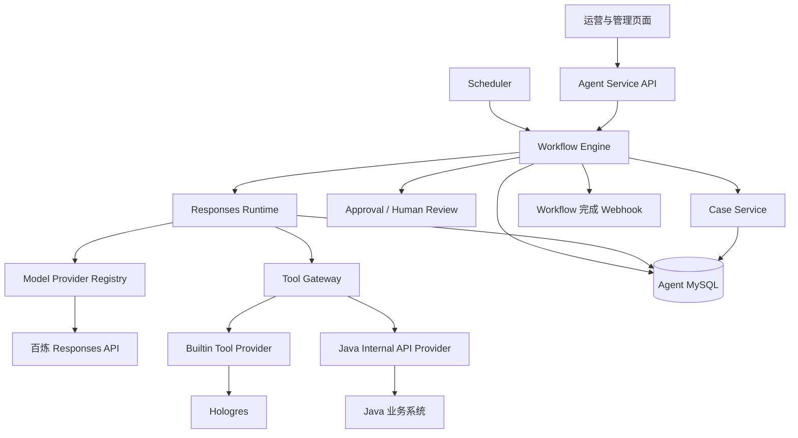

# 总体技术设计

> **版本**：V0.1
> **状态**：设计基线
> **日期**：2026-07-17
> **业务代码事实基线**：`coolcollege-intelligent master@3847998dd2`

## 1. 设计目标

在现有 Python Agent Service POC 上增加 AI 员工、Workflow、Case、审批和 Java 业务系统适配能力。系统复用当前 `RunnerService`、自研 `ResponsesRuntime`、`ToolGateway` 和 `ModelProviderRegistry`，不推倒重写已经验证的 Tool Loop、权限、审计和证据检查。

产品需求见[产品需求](需求-01-产品需求.md)，领域对象见[AI 岗位与领域模型](需求-02-AI岗位与领域模型.md)。

## 2. 总体架构



### 2.1 职责边界

| 组件 | 权威职责 |
|---|---|
| Agent Service | AI 员工、Workflow、Run、Case、审批、辅助判断、验证版本、审计和用量 |
| Java 业务系统 | 组织权限、风险规则、巡店、任务、Question、审批和业务状态 |
| Hologres | 分析数据、历史趋势、风险日记录和知识表 |
| 百炼 Responses API | 模型推理和 Tool Calling |
| Webhook 接收方 | 消费 Workflow 完成摘要，不参与 Workflow 状态提交 |

## 3. 运行层次

```text
Workflow Engine
  -> AI Skill Step
     -> RunnerService
        -> ResponsesRuntime
           -> Model Provider
           -> Tool Gateway
```

- Workflow Engine 管理跨 Run 的步骤、状态、等待、审批、重试和恢复。
- Responses Runtime 只管理一次 Run 内的模型请求、Tool Loop、证据检查和最终输出。
- 一个 Workflow Step 可因重试产生多个 Run。
- Run 完成不等于 Workflow、Case 或外部业务对象完成。

Workflow Definition 首期存放在代码仓库的版本化 YAML 中，随应用发布。服务启动时校验 Schema、Step 引用和 Tool 白名单。租户启停、员工绑定、时间、阈值和审批等受控参数存数据库。

创建 Workflow Instance 时固化 `workflow_code`、版本、完整 Definition 快照和 SHA-256。后续执行和恢复只读取实例快照，新 YAML 只影响新实例。首期不建设 Definition 数据库编辑发布中心。

## 4. 模型 Provider

所有模型调用通过内部 `ResponsesProvider` 契约和 `ModelProviderRegistry`。

首期模型：

- `qwen3.7-max`；
- `qwen3.7-plus`；
- `deepseek-v4-pro`。

三个模型共用百炼 OpenAI-compatible Responses Provider Adapter。Run 创建时固化 Provider、模型、能力参数和配置版本；同一次请求重试保持原模型。跨模型降级只能由后端显式策略触发，并记录原模型、目标模型和原因。

首期不使用 OpenAI Agents SDK Runner，不接百炼 Agent 编排，也不接外部 MCP。OpenAI、Kimi、Claude、本地模型和 MCP 仅保留 Adapter 扩展边界。

## 5. Tool 与安全边界

模型只看到 Function Tool Schema，不接触数据库、租户凭证或自由 API。所有 Tool 执行前经过 Tool Gateway，至少校验：

- Run、租户、AI 员工、Skill 和 Workflow；
- Tool 是否在允许集合；
- 门店和区域是否在有效 Scope；
- 日期范围、结果大小和调用额度；
- 数据新鲜度和写动作风险；
- 审批、参数摘要和幂等条件。

后端注入的 `enterprise_id`、员工、用户、Scope 和审批上下文不可由模型覆盖。成功、失败和被拦截调用都持久化。

Tool 详细契约见[Tool 与 Gateway 设计](技术-05-Tool与Gateway设计.md)。

## 6. 数据与持久化

### 6.1 Agent MySQL

新增表统一使用 `agent_` 前缀。首期保留当前 POC 表并渐进扩展：

- `agent_run`；
- `agent_tool_call`；
- `agent_final_answer`；
- `agent_feedback`。

规划新增：

- AI 员工、凭证和 Scope 版本；
- Workflow 与 Step Instance；
- Case、Case Event 和 Business Reference；
- 审批、审计和幂等记录；
- 定时恢复计划；
- 模型用量明细；
- Agent 图片结果与人工复核；
- 规则验证数据集、版本、逐图结果和同步记录。

Agent MySQL 只保存自身运行事实和外部对象引用，不复制任务、Question、审批、巡店或申诉状态机。

### 6.2 Hologres

业务工具使用固定 SQL 模板查询现有 DWS、ADS 和知识表。SQL 必须显式绑定 `enterprise_id`，非管理员 Scope 必须由后端计算。禁止 `free_sql_query` 和模型生成 SQL。

### 6.3 Java 业务系统

实时业务查询和写动作通过新的 `/internal/agent/**` Facade。Agent 不调用第三方 `/open/aiInspection/results`，也不直接写 Java MySQL。

## 7. 身份与权限

系统区分三类身份：

- AI 员工服务身份：用于后台调度、恢复和业务动作；
- 人工触发人：限制交互式任务的实际 Scope；
- 审批或裁决人：对具体动作和参数负责。

Agent Service 是员工状态、Credential 和 Scope 的事实源。Java 不复制员工配置，也不反向调用 Agent 鉴权；Java 独立校验服务签名、租户、对象归属、审批、幂等和业务规则。

Scope 变化不修改历史快照，但写动作执行前必须使用当前权限重新校验。

## 8. 状态、幂等与恢复

- Trigger、Workflow、Step、Run、Case、审批、业务命令和 Webhook Event 均使用稳定幂等键。
- Worker 使用租约或等价机制避免同一实例并发执行。
- 状态迁移与对应输出在同一持久化边界提交。
- 调用 Java 超时或结果未知时，先按幂等键查询命令结果，不直接重发写动作。
- Case 默认每 6 小时查询 Question、`QUESTION_ORDER` 和 Java 命令记录。
- RocketMQ 业务状态事件仅作为未来优化；即使后续事件化，查询权威事实仍作为漏消息补偿。

## 9. 可观测性与用量

Trace 串联 Workflow、Step、Run、模型请求、Tool Call、审批、Case Event 和业务命令。

每次实际 Provider 请求分别记录：

- Provider 和模型；
- 输入、输出和总 Token；
- 开始时间、结束时间和耗时；
- Run、Step、用途和重试序号；
- Usage 是否缺失及原因；
- 跨模型降级信息。

不根据文本长度估算上游缺失的 Token。

## 10. Workflow 完成 Webhook

每个 AI 员工最多绑定一个 HTTPS URL 和独立 Secret。Workflow 首次提交 `COMPLETED` 后投递后台异步任务，状态事务不等待对端响应。

首期规则：

- 只发送 `workflow.completed`；
- 使用 Workflow 固化的 `employee_id` 查找配置；
- 请求总超时 5 秒；
- 失败不重试，只写运行日志；
- 不因失败回滚、重开或改变 Workflow/Case；
- Payload 只包含事件、租户、员工、Workflow、Case、结果摘要、业务引用和完成时间；
- 不发送完整 Prompt、原始模型输出或图片内容。

## 11. 规则验证与巡检执行快照

规则验证数据集、Baseline 和候选版本在 Agent Service 保存不可变快照。生产配置同步必须通过 Java 受控接口完成，并进行权限、审批、当前配置摘要、候选摘要和幂等校验。

平台创建巡检 Period 时固化当时实际生效的 AI 配置快照和摘要。首次调用、异步结果、设备回调、重试、重新检测和聚合都读取同一 Period 快照。同步后的新配置只用于新建 Period；存量 Period 不漂移。首期不增加策略级 `inspection_batch_id`。

## 12. 部署关系

Agent Service 作为独立 Python/FastAPI 服务部署，与 Java 业务系统和 Hologres 解耦。至少需要：

- Agent API/Worker；
- Scheduler；
- MySQL；
- Hologres 连接；
- 百炼 Responses API 连接；
- Java 内部接口连接。

服务重启后从持久化状态恢复，不依赖进程内 Session。页面只持有 Web Session Token，底层 AI 员工凭证和服务间 Secret 不返回前端。
