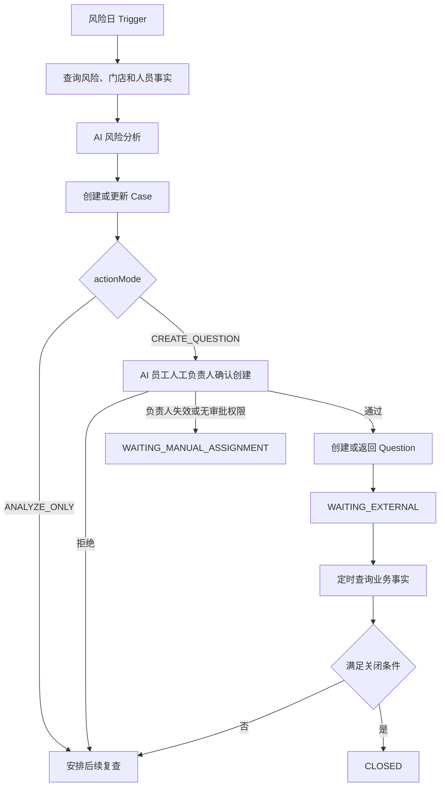

# Workflow 流程设计

> **版本**：V0.1
> **状态**：设计基线
> **日期**：2026-07-17

## 1. 设计边界

Workflow Engine 管理 Agent Service 内跨 Run 的确定性编排、等待和恢复。它位于 `AgentRuntime` 上层，不替代 Java 的 UnifyTask、Question、审批、巡店复核或申诉状态机。

```text
Workflow Instance
  -> Step Instance
     -> AI Skill Step
        -> Run 1..N
           -> AgentRuntime / Tool Call
  -> System Rule / Timer / Wait External / Human Review
  -> Case Event / Business Reference
```

## 2. Workflow Definition

首期 Definition 是代码仓库内的版本化 YAML，由平台研发维护并随应用发布。

```yaml
workflow_code: risk_store_followup
version: 1.0.0
trigger_types:
  - schedule.risk.daily.scan
steps:
  - code: analyze_risk
    type: AI_SKILL
    skill_code: risk_store_analysis
    allowed_tools:
      - query_risk_stores
      - query_common_issues
      - query_rectification_progress
  - code: decide_action
    type: SYSTEM_RULE
  - code: approval
    type: HUMAN_REVIEW
  - code: create_question
    type: TOOL_ACTION
  - code: wait_business_result
    type: WAIT_EXTERNAL
```

启动校验至少包括：

- `workflow_code + version` 唯一；
- Step Code 唯一且引用存在；
- Skill、Tool 和输出 Schema 存在；
- 路由没有悬空目标；
- 等待和终态路径明确；
- Tool 白名单不超过 Role/Skill 上限。

创建实例时保存 `workflow_code`、版本、完整 `definition_snapshot_json` 和 `definition_sha256`。重试和恢复只读取实例快照。

## 3. 核心对象

### 3.1 Workflow Instance

关键字段：

```text
workflow_instance_id
enterprise_id
workflow_code / workflow_version
definition_snapshot_json / definition_sha256
employee_id / employee_snapshot
scope_snapshot / scope_version
primary_store_id?
profile_snapshot_id?
trigger_type / trigger_id
case_id?
status / current_step_code
lock_version / lease_owner / lease_until
started_at / completed_at / next_wakeup_at
```

### 3.2 Step Instance

关键字段：

```text
step_instance_id
workflow_instance_id
step_code / step_type
status / attempt_count
input_snapshot / output_snapshot
run_ids
started_at / completed_at / next_retry_at
error_code / error_message
```

### 3.3 Run

Run 是 AI Skill Step 的执行记录。一个 Step 每次重试创建新 Run，不覆盖前次 Run。非 AI Step 不创建伪 Run。Run 至少保存：

```text
run_id
step_instance_id
runtime_input_sha256
provider / model
attempt_no
status
```

`runtime_input_sha256` 是该 Run 使用的不可变业务输入快照摘要。

### 3.4 Case 与 Business Reference

Case 保存长期跟进状态和事件；Business Reference 保存 Java 业务对象类型、ID、幂等键和最近查询快照。外部对象状态始终以 Java 为准。

## 4. Step 类型

| 类型 | 职责 | 是否调用模型 |
|---|---|---|
| `AI_SKILL` | 执行 Skill 和 Tool Loop | 是 |
| `SYSTEM_RULE` | 确定性判断和路由 | 否 |
| `TOOL_QUERY` | 调用固定查询 Tool | 否 |
| `TOOL_ACTION` | 执行审批后的写 Tool | 否 |
| `HUMAN_REVIEW` | 等待审批、改判或人员补充 | 否 |
| `TIMER` | 等待指定时间 | 否 |
| `WAIT_EXTERNAL` | 等待 Java 业务事实变化 | 否 |

模型不能创建未知 Step、修改 Definition 或自由选择终态。

## 5. 状态模型

### 5.1 Workflow Instance

```text
CREATED -> RUNNING -> WAITING -> RUNNING
                    -> BLOCKED
                    -> FAILED
                    -> CANCELLED
RUNNING/WAITING -> COMPLETED
```

- `WAITING`：等待定时、人工或外部事实；
- `BLOCKED`：缺少人员、权限、配置或数据质量，需要人工处理；
- `FAILED`：不可自动恢复的技术失败；
- `COMPLETED`：本次 Workflow 目标完成，不等于 Case 关闭。

### 5.2 Step Instance

```text
PENDING -> RUNNING -> SUCCEEDED
                   -> WAITING -> RUNNING
                   -> FAILED
                   -> SKIPPED
                   -> CANCELLED
```

### 5.3 Case

```text
OPEN
ANALYZING
WAITING_APPROVAL
WAITING_MANUAL_ASSIGNMENT
WAITING_EXTERNAL
FOLLOWING_UP
READY_TO_CLOSE
CLOSED
BLOCKED
CANCELLED
```

Case 状态只表达 Agent 内部进度，不映射 Question 或任务状态。

## 6. Engine 执行规则

每次启动或恢复按以下顺序执行：

1. 按 ID 读取实例并校验租户；
2. 获取实例租约和乐观锁版本；
3. 加载 Definition、员工和 Scope 快照；
4. 重新校验员工状态，并以“实例 Scope 快照 ∩ 员工当前独立 Scope”计算恢复范围和必要权限；
5. 选择唯一可执行 Step；
6. 创建 Step Attempt 或 Run；
7. 执行 AI、System Rule、Tool 或等待逻辑；
8. 在事务内提交输出和状态；
9. 计算下一 Step、唤醒时间或终态；
10. 释放租约并记录 Trace。

禁止同一实例并行执行两个会修改状态的 Step。读取型分支只有在 Definition 明确允许、输出归并规则确定时才能并行。

## 7. 重试与幂等

| 对象 | 幂等键 |
|---|---|
| 风险日 Trigger | `enterprise_id + stat_date + store_id + rule_id` |
| 未关闭 Case | `enterprise_id + store_id + rule_id + workflow_code` |
| Question 创建 | `agent-question:{enterpriseId}:{caseId}:v1` |
| Tool Action | 由动作类型和业务对象生成稳定键 |
| Webhook | `workflow_instance_id + workflow.completed` |

重试规则：

- AI 请求和查询 Tool 可在限定次数内使用指数退避；
- 每次 AI 重试创建新 Run，并分别记录 `input_tokens`、`output_tokens`、`total_tokens`；
- 写 Tool 超时或 `RESULT_UNKNOWN` 时只查询原命令，不直接重发；
- 同一幂等键参数不同返回冲突；
- 业务拒绝、审批失效和权限不足不自动重试。

AI Step 第一次执行前，Workflow 按 Skill Input Schema 校验业务输入，并将结果保存为 Step 的 `input_snapshot` 和摘要。该 Step 的模型重试必须复用同一快照和 `runtime_input_sha256`，不得在重试中静默重新查询或修改业务输入。业务输入确需重新读取或更新时，Workflow 必须显式进入新的 Step，或生成新的输入版本和摘要。

## 8. 风险门店 Workflow

### 8.1 Trigger

系统每日 07:00 统一扫描前一有效统计日风险记录。刷新未完成时扫描记录 `DATA_NOT_READY`，不创建风险 Trigger 或 Case；只有规则显式 `agentEnabled=true` 且存在有效 Agent 策略时才创建 Trigger。刷新和补数口径见[业务系统对接](技术-06-业务系统对接.md#71)。

风险记录按租户、统计日、门店和规则去重。相同门店和规则的多日命中归并到同一未关闭 Case。

每次扫描都保存一个轻量 `ScheduleScanRecord`，用于证明调度、未就绪、零数据和补跑事实，不发展为通用调度平台：

```text
enterprise_id
schedule_code
stat_date
dataset_code
status
attempt_count
readiness_snapshot
source_row_count
eligible_row_count
created_trigger_count
duplicate_trigger_count
started_at
completed_at
error_code
```

稳定业务键为 `enterprise_id + schedule_code + stat_date`。状态只允许 `RUNNING`、`DATA_NOT_READY`、`SUCCEEDED`、`FAILED`。`source_row_count` 是刷新成功后按数据集条件读到的源记录数；`eligible_row_count` 是通过 Agent 规则、业务过滤和有效范围判断、进入 Trigger 幂等处理前的记录数；`created_trigger_count` 是本次新建 Trigger 数；`duplicate_trigger_count` 是命中既有 Trigger 幂等键的记录数。零风险、未就绪和成功零数据都必须有记录；重复调度或人工补跑复用同一记录并增加 `attempt_count`，每次尝试的详细过程进入 Trace。只有 `refresh_status=SUCCESS` 且 `source_row_count=0` 才能判定成功零业务数据；`created_trigger_count=0` 不能单独证明没有源数据。漏调度通过缺失扫描记录识别。

### 8.2 流程



### 8.3 人员与 SLA

- Question 创建前由 AI Employee 当前配置的人工负责人确认；
- 负责人失效或无动作审批权限只阻断当前写动作，不停用员工或影响其他分析；
- 整改节点实时解析门店店长岗位 `50000000`；
- 审批节点实时解析当前责任督导；
- 两节点默认 `approveType=any`，不默认抄送；
- 缺人不回退管理员、历史督导或通知接收人；
- 创建审批、整改截止和 Case 跟进使用三个独立 SLA。

### 8.4 Case 关闭

关闭前必须重新查询 Java 业务事实，并同时满足：

- 所有关联对象达到业务终态；
- 连续 3 个有效统计日未再命中同一规则；
- 3 个统计日均已确认数仓刷新成功。

关闭后再次命中创建复发 Case。

## 9. Question 动作

AI Employee 人工负责人确认创建后，由 `TOOL_ACTION` 调用 Java。请求参数由后端根据已批准草稿确定性构造，模型不能直接填写业务身份、审批或幂等字段。Java 创建 Question 后再进入店长整改、当前责任督导审批的业务流程，两类审批不能合并。

Question 要求：

- 目标语义为正式的 `agentRisk`，不映射为 `common`；
- 同一 Case 默认一个父 Question 和一个子 Question；
- Question 自身产生 `QUESTION_ORDER`，不额外创建独立 UnifyTask；
- 事实字段和来源由后端模板生成；
- 模型只提供受控整改建议；
- Java 返回已有对象时只关联，不重复创建。

## 10. Agent 图片辅助判断

图片 Workflow 固定 `REVIEW_THEN_ACTION`：

1. 明确选择员工 Scope 内已有 `inspection_period_id/picture_id`；
2. AI 逐图分析并保存独立结果、证据、模型、版本和 Token；
3. 只有 `FAIL` 候选进入 Period 级人工复核；
4. 从策略 `reviewers` 按门店解析复核人并固化快照，解析失败进入 `WAITING_MANUAL_ASSIGNMENT`；
5. 同一租户和 Period 只允许一条复核链，处理中可补充结果引用，终态不自动重开；
6. 多人采用任一人确认，首个有效提交产生终态并关闭其余待办；
7. 人工裁决为确认违规、确认无违规、无法判断；
8. 只有确认违规调用 Java 创建或关联唯一 `aiInspection` Question。

该流程不上传新图、不触发抓拍，不修改平台图片、Period、`aiResult`、`finalResult`、现有复核待办或已有 Question 内容。

## 11. 规则同步与 Period 快照

规则同步 Workflow 执行：

1. 读取不可变验证版本；
2. 校验租户、检查项、完成状态和发布门槛；
3. 校验普通推荐、普通例外或高风险审批；
4. 根据验证版本确定性构造白名单候选配置和摘要；
5. 调用 Java 校验当前配置摘要和幂等；
6. 保存同步前后配置、审批和业务结果。

生产巡检创建 Period 时固化实际生效配置快照和摘要。首次模型调用、异步结果、设备回调、失败重试、重新检测和周期聚合都按 `inspection_period_id` 读取同一快照。

新配置只影响同步后新建 Period，存量 Period 保持原快照。首期不创建 `inspection_batch_id`，不保证同一次调度拆分的全部门店原子切换。

## 12. AI 店长与门店记忆

`store_manager_weekly_report` 绑定 `AI_STORE_MANAGER` 和 `store_manager_review` Skill，按系统统一周报调度生成主门店“门店运营执行复盘”草稿，也支持人工触发。其 `stat_date` 固定表示统计周结束日 `stat_week_end_date`；统计周起止日期单独保存。Workflow 只查询主门店事实、固定历史窗口、门店画像快照和隐私排行投影，不读取其他门店明细。

周报至少包含本周情况、历史变化、异常事项、门店返回/最终复审摘要、误报记忆、待关注事项、数据来源和统计范围。草稿保存为 Agent Artifact，页面可查看和下载，不自动推送、不创建 Question、不发送消息。同一 `employee_id + primary_store_id + stat_week + workflow_code` 使用幂等键，重复运行返回同一草稿版本。

“突发事情”首期只查询已存在的风险或异常事实，不接事件推送。非关键历史或记忆数据不足时输出限制说明；当前权威数据不可用时 Workflow 进入 `WAITING` 并记录 `DATA_NOT_READY`，不得编造结论。发现需整改风险时只生成转交 Artifact，不直接启动风险 Workflow。

### 12.1 门店记忆事件

风险 Case、门店返回、人工图片/Question 复审和 Case 关闭通过确定性服务追加 `PATROL` 领域 `Store Memory Event`，必要时由已确认事件生成 `TAG`。模型输出只能引用记忆，不能直接写入记忆、标签或把临时判断提升为长期事实。最终复审确认误报时追加 `REVIEW_FALSE_POSITIVE`，生成新的门店画像分区并保留原判断、复审证据和操作人；每个 Run 固化 `profile_snapshot_id`。

## 13. 外部状态跟进

首期只使用定时轮询，轮询只做确定性业务状态查询，不默认创建模型 Run：

- 默认间隔 6 小时；
- 只查询未关闭 Case 关联的 Question、`QUESTION_ORDER` 和 Java 命令记录；
- 查询失败不改变 Case 结论；
- 状态变化写 Case Event；
- RocketMQ 业务状态事件不属于当前实现。

## 14. Workflow 完成 Webhook

Workflow Instance 首次进入 `COMPLETED` 后，在状态事务提交完成后异步投递一次 Best Effort Webhook。失败不重试、不重放、不阻塞、不回滚，也不改变 Workflow 或 Case。其他终态首期不回调。

事件 ID 必须稳定，接收方可据此去重。目标 URL 来自固化员工绑定配置，模型不能提供或修改。

## 15. 持久化关系

```text
agent_workflow_instance 1---N agent_workflow_step_instance
agent_workflow_step_instance 1---N agent_run
agent_workflow_instance N---0..1 agent_case
agent_case 1---N agent_case_event
agent_case 1---N agent_case_business_ref
agent_workflow_instance 1---N agent_approval
```

所有表包含 `enterprise_id`、创建更新时间和必要版本字段。实例、步骤、Case、审批、幂等和租约必须有支持业务唯一性的索引；实际 DDL 在实现前结合 MySQL 版本和数据量评审。

## 16. Trace

每次状态迁移记录前后状态、触发原因、执行者、Definition/Skill 版本、关联 Run、Tool、审批、业务引用和错误。页面按 Workflow 时间线展示，不能把内部等待状态误显示为外部业务完成。
