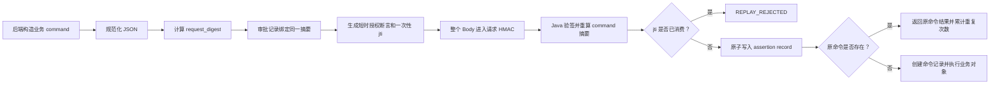
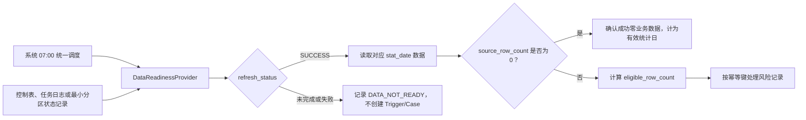

# 业务系统对接设计

> **版本**：V0.1
> **状态**：设计基线
> **日期**：2026-07-17
> **代码事实基线**：`coolcollege-intelligent master@3847998dd2`

## 1. 对接目标

Agent Service 通过稳定的 Java 内部边界查询实时业务事实，并在审批通过后复用现有 Service 创建或关联业务对象。

职责边界：

- Java 管理组织、风险规则、巡店、Question、任务载体、审批和业务状态；
- Agent Service 管理员工、Workflow、Run、Case、门店记忆/画像、动作审批、辅助判断和验证版本；
- Hologres 提供分析数据，不承担业务写入；
- 所有 Agent 写动作经过 Tool Gateway 和 Java 分层校验：Agent 校验员工/Scope/审批，Java 校验签名断言、对象归属、幂等和领域规则；
- Agent 不直接写 Java MySQL，也不伪造浏览器登录态。

平台 AI 巡店代码事实见[AI 巡店代码与数据分析](参考-01-AI巡店代码与数据分析.md)。

## 2. 现有链路边界

必须区分：

1. 平台自调度 AI 巡店：策略、时段、门店拆分、抓拍、模型、Period 聚合、复核和 Question；
2. 第三方结果回传：`POST /open/aiInspection/results`；
3. 巡店图片 AI 审核与人工申诉；
4. Agent 图片辅助判断和规则效果验证。

Agent 不调用或修改 `/open/aiInspection/results`。该接口的认证、结果保存和自动发单行为保持原样。Agent 只使用新的 `/internal/agent/**`。

## 3. Java 适配层

建议新增独立包，避免直接复用页面 Controller：

```text
controller/internal/agent/*
service/agentintegration/AgentQueryService
service/agentintegration/AgentCommandService
service/agentintegration/AgentQuestionFacade
service/agentintegration/AgentInspectionFacade
config/AgentServiceAuthFilter
model/agentintegration/request/*
model/agentintegration/response/*
```

Facade 复用现有领域 Service，不复制 Question、UnifyTask、巡店或人员解析逻辑。页面 DTO、浏览器 Token 和 `UserHolder` 不进入服务间契约。

## 4. 身份与请求签名

### 4.1 身份

| 身份 | 用途 | 来源 |
|---|---|---|
| Service Identity | 识别 Agent Service | `client_id + secret` |
| AI Employee | 识别实际执行员工 | `agent_employee_id` |
| Human Identity | 触发、授权或审批 | `delegated_user_id / approval_id` |

AI 员工不冒充真实用户。旧业务字段必须填创建人时使用保留技术值 `AI`，真实员工、触发人和审批人保存在命令记录和扩展元数据中。

### 4.2 HMAC

```http
X-Agent-Client-Id: coolstore-agent-service
X-Agent-Timestamp: 1784227200000
X-Agent-Nonce: 7f9d...
X-Agent-Signature: <hex hmac sha256>
X-Agent-Request-Id: req_...
```

签名原文覆盖 HTTP Method、Path、Timestamp、Nonce 和 Body SHA-256。Java 专用 Filter 校验：

- `client_id` 和环境 Secret；
- 时间窗；
- Nonce 防重放；
- Body 完整性；
- Request ID 格式。

首期不使用浏览器 Bearer Token、现有 `/open/**` 白名单或 mTLS。Secret 按环境隔离并支持轮换。

### 4.3 写动作授权断言

HMAC 只证明请求来自 Agent Service，不能让 Java 自行推断员工 Scope 或审批内容。每次写动作由 Agent Service 生成一次性、短时有效的授权断言。请求 Body 最外层固定分为 `command` 和 `authorization_assertion` 两部分；断言作为 Body 的一部分，由 4.2 的请求 HMAC 覆盖，因此任何字段变化都会导致验签失败。以下为 `authorization_assertion` 示例：

```json
{
  "enterprise_id": "E10001",
  "employee_id": "AE001",
  "action": "CREATE_QUESTION",
  "target_store_id": "S100",
  "case_id": "CASE001",
  "approval_id": "AP001",
  "approved_by": "U001",
  "approved_at_ms": 1784346000000,
  "expires_at_ms": 1784349600000,
  "scope_version": 12,
  "request_digest": "sha256...",
  "jti": "assertion-uuid"
}
```

Java 先校验请求 HMAC，再校验断言 `expires_at_ms`、`jti` 防重放、`request_digest`、租户和目标对象归属，并执行 Question/业务领域规则。Java 不保存 AI Employee、Scope 或 Approval 主数据；断言是 Agent 对这些事实判断的不可篡改证明，不能替代 Java 对象和业务状态校验。

首期只保留一个命令摘要 `request_digest`，不再同时维护第二个审批摘要字段。申请审批时，Agent 审批记录保存待执行命令的 `request_digest`；批准、生成断言和实际调用时都必须使用同一摘要。Java 对请求 Body 中授权断言之外的 `command` 对象重新计算摘要并比较，只有三者一致才继续执行。

`request_digest` 的规范化规则固定为：UTF-8；对象字段名按字典序排列；不输出空格或换行；未赋值字段省略且禁止显式 `null`；JSON 数字只允许整数，需要小数的业务值按 Schema 使用规范化十进制字符串，不允许浮点数、科学计数法、`NaN` 或无穷值；数组保持业务顺序，无序 ID 集合在构造命令前排序；中文直接使用 UTF-8，不转义为 `\u`；摘要结果使用小写十六进制 `SHA-256`。Python 与 Java 必须使用同一组契约样例验证摘要。整个 HTTP Body（业务命令和授权断言）再统一进入 4.2 的 Body SHA-256 和请求 HMAC。

`jti` 是一次性授权消费键，不能只依赖主命令记录中的单个 `assertion_jti` 字段。Java 侧增加独立的 `agent_authorization_assertion_record_${enterpriseId}`，以 `agent_client_id + assertion_jti` 建立唯一约束，并在接收命令的同一本地事务内先原子占用断言，再处理命令幂等。相同 `jti` 即使改用不同 `idempotency_key` 也返回 `REPLAY_REJECTED`；合法的网络重试应生成新 `jti`，继续使用原 `idempotency_key` 查询或返回原命令结果。



## 5. 可信执行上下文

```json
{
  "request_id": "req_20260717_001",
  "idempotency_key": "agent:question:create:case_102:v1",
  "enterprise_id": "E10001",
  "agent_employee_id": "ae_risk_supervisor_01",
  "case_id": "case_102",
  "run_id": "run_309",
  "tool_call_id": "tc_901",
  "delegated_user_id": "U2001",
  "approval_id": "ap_771",
  "scope_snapshot_id": "scope_20260717_09",
  "source": "AI_EMPLOYEE"
}
```

约束：

- 路径、签名上下文、请求体和业务对象中的 `enterprise_id` 必须一致；
- Agent Service 调用前校验员工和 Scope，并把上下文纳入签名；
- Java 不复制员工主数据，也不反向调用 Agent Service；
- Java 校验请求签名、授权断言中的 `request_digest`/有效期、租户、目标对象、幂等和领域规则，不反查 Agent 审批主数据；
- `delegated_user_id` 只表示权限或人工来源，不等于执行人；
- Java Service 和 SQL 必须显式绑定企业。

## 6. API 结构

规划路径：

```text
/internal/agent/v1/enterprises/{enterprise-id}/queries/*
/internal/agent/v1/enterprises/{enterprise-id}/commands/*
```

首期只有 Agent 调用 Java 的 Query 和 Command。Java 向 Agent 推送业务事件不在范围内。Workflow 完成 Webhook 由 Agent Service 直接投递，不经过 Java。

### 6.1 标准响应

```json
{
  "request_id": "req_20260717_001",
  "success": true,
  "code": "OK",
  "message": "success",
  "data": {},
  "business_refs": [
    {
      "object_type": "QUESTION_ORDER",
      "object_id": "1908821",
      "status": "PROCESSING"
    }
  ],
  "occurred_at": "2026-07-17 10:30:00"
}
```

Java 返回原始业务状态值和稳定引用，Agent 不要求 Java 映射内部 Workflow 状态。

### 6.2 标准错误

| 错误码 | 语义 | Agent 行为 |
|---|---|---|
| `AUTH_FAILED` | 签名或服务身份无效 | 不重试，告警 |
| `REPLAY_REJECTED` | 请求 Nonce 或授权断言 `jti` 重放 | 不重试 |
| `TENANT_MISMATCH` | 租户不一致 | 阻断并审计 |
| `PERMISSION_DENIED` | 对象或动作越权 | 阻断并审计 |
| `APPROVAL_REQUIRED` | 缺少审批 | 转审批等待 |
| `APPROVAL_INVALID` | 审批与命令不匹配 | 重新申请审批 |
| `ASSIGNEE_NOT_FOUND` | 店长或责任督导缺失 | `WAITING_MANUAL_ASSIGNMENT` |
| `IDEMPOTENT_REPLAY` | 重复命令 | 使用原结果 |
| `IDEMPOTENCY_CONFLICT` | 同键摘要不同 | 阻断并审计 |
| `BUSINESS_CONFLICT` | 对象状态变化 | 重新查询事实 |
| `DEPENDENCY_TIMEOUT` | 下游超时 | 查询命令结果 |
| `RESULT_UNKNOWN` | 命令结果不确定 | 按幂等键查询，不重发 |
| `RESULT_TOO_LARGE` | 查询结果超限 | 缩小范围 |

## 7. Query API

首批 Query 按业务事实组织：

| 能力 | 返回内容 |
|---|---|
| 风险规则与 Agent Policy | 规则、等级、Scope、`agentEnabled`、动作模式 |
| 风险日记录 | 统计日、门店、规则、命中原因和历史快照 |
| 门店和人员 | 门店状态、区域、店长、当前责任督导 |
| 巡店与检查项 | 记录、检查项、图片和人工结果引用 |
| Question 查询 | 父子 Question、任务载体、处理人、审批和状态 |
| Agent 命令查询 | 幂等键、请求摘要、状态和业务引用 |
| AI 规则配置查询 | 当前实际生效配置和摘要 |
| Period 配置查询 | 指定 Period 固化的配置快照和摘要 |

Query 只返回 Agent 所需字段，支持对象数量和结果大小限制，不返回无关个人信息或内部配置。

### 7.1 调度、刷新与补数

每日 Trigger 由系统在 07:00 统一调度。Agent Service 通过逻辑接口查询数据集分区是否就绪：

```text
DataReadinessProvider.get_readiness(
  enterprise_id,
  dataset_code,
  stat_date
) -> DataReadiness
```

首期 `dataset_code` 只定义 `RISK_STORE_DAILY` 和 `STORE_MANAGER_WEEKLY`。`DataReadiness` 返回：

```text
dataset_code
stat_date
data_as_of
refresh_batch_id
refresh_status
refresh_completed_at
reason
```

`refresh_status` 只允许以下固定枚举：

```text
RUNNING
SUCCESS
PARTIAL
FAILED
NOT_FOUND
```

只有 `SUCCESS` 才表示该 `stat_date` 是有效统计日；`SUCCESS` 且结果为零行仍然是有效统计日。`PARTIAL`、`FAILED`、`NOT_FOUND` 和仍处于 `RUNNING` 的数据不得作为“没有风险”的结论。`STORE_MANAGER_WEEKLY.stat_date` 固定表示统计周结束日 `stat_week_end_date`，统计周的起止日期另存为 `stat_week_start_date` 和 `stat_week_end_date`，不使用同一字段表达调度日。



`refresh_status` 未完成时不得将“没有风险”作为结论；无业务数据必须与刷新未完成区分。补数完成后由定时任务按 `enterprise_id + stat_date + store_id + rule_id` 重新检查原 Trigger 幂等键，风险来源 `risk_record_id` 或规范化风险摘要只用于识别同日独立事实和审计，不改变 Case 业务归并键。

有效统计日由数据就绪事实映射：只有 `refresh_status=SUCCESS` 的 `stat_date` 才计入 Case 连续未命中天数；成功刷新但无业务数据仍是有效统计日，刷新未完成不是。当前代码和数仓材料只确认表级同步水位及行级 `sync_batch_id`，尚未确认“租户 + 数据集 + stat_date”的分区级成功事实；实施前先映射现有控制表或任务日志，若仍无法表达零行成功分区，再增加最小数据集分区状态记录。

## 8. Question Command

### 8.1 创建前校验

Java 必须重新校验：

- 服务身份和租户；
- Case 和签名授权断言上下文；
- 门店属于租户；
- 店长岗位 `50000000` 和当前责任督导；
- 授权断言中的审批动作类型、`request_digest` 和有效期；
- Question 类型、SLA 和幂等键；
- 同一 Case 是否已有业务对象。

### 8.2 业务映射

- 请求目标类型为正式的 `agentRisk`，不映射为 `common`；
- 默认店长整改、当前责任督导审批；
- 两节点默认 `approveType=any`；
- 默认不抄送；
- Question 创建链路自行生成 `QUESTION_ORDER`；
- 标题、事实、来源和证据摘要由后端模板生成；
- 模型建议经过长度和敏感信息校验后进入整改建议字段。

缺少处理人或审批人时返回 `ASSIGNEE_NOT_FOUND`，不得降级到管理员、历史督导或规则通知人。

## 9. Agent 图片辅助判断对接

逐图分析结果和 Period 级人工复核保存在 Agent Service。Java 只接收人工确认违规后的确定性命令：

1. 校验租户、Period、图片和人工裁决；
2. 查询该 Period 是否已有 `aiInspection` Question；
3. 已有时返回原对象引用，不修改其内容；
4. 没有时使用人工确认图片创建唯一 Question；
5. 保存 Agent 命令和业务引用。

Java 不接收 Agent 的 `PASS/FAIL` 作为平台 `aiResult/finalResult`，不创建平行复核待办，也不修改历史 Period。

## 10. AI 规则配置同步

同步命令至少携带：

- `enterprise_id`；
- 检查项 ID；
- 验证版本 ID；
- Baseline 配置摘要；
- 候选配置白名单字段；
- 候选配置摘要；
- 审批引用；
- 幂等键。

Java 校验当前配置摘要、候选 Schema/摘要、字段白名单、操作者权限和发布审批。允许同步的候选字段包括检查对象、合格标准、不合格情形、不适用情形、可编辑 Prompt、标准图和模型配置。结果项、Question 流程、策略时段和门店范围不得被覆盖。

同步在本地事务中保存前配置、后配置、字段差异、来源验证版本、审批和业务结果。历史结果不回算。

## 11. Period 配置快照

平台自调度 AI 巡店创建 Period 时，保存当时解析出的实际生效配置快照和摘要。以下路径必须改为按 Period 读取快照：

- 首次模型调用；
- 异步模型结果处理；
- 设备回调；
- 失败重试；
- 重新检测；
- 周期聚合。

新建 Period 使用同步后的当前配置，存量 Period 保持原快照。首期不增加策略级 `inspection_batch_id`。

## 12. Java 命令记录与幂等

Java 侧新增租户业务库命令记录，建议表名 `agent_command_record_${enterpriseId}`，以 `command_type + idempotency_key` 唯一。断言消费由独立表 `agent_authorization_assertion_record_${enterpriseId}` 负责，不在命令表上用单个 `assertion_jti` 字段承载多次合法重试。

记录至少包含：

```text
command_type
idempotency_key
request_digest
enterprise_id
agent_client_id
agent_employee_id
case_id / run_id / tool_call_id
approval_id
authorization_assertion_digest / last_assertion_jti
scope_version
status
business_object_type / business_object_id
error_code / error_message
attempt_count / duplicate_count
created_at / updated_at
```

状态：

```text
RECEIVED
PROCESSING
SUCCEEDED
REJECTED
FAILED
RESULT_UNKNOWN
```

同键同摘要返回原结果并累计重复次数；同键不同摘要返回冲突。原键进入 `REJECTED`、`FAILED` 或 `RESULT_UNKNOWN` 后不得再次真正执行业务。

`agent_authorization_assertion_record_${enterpriseId}` 至少包含：

```text
agent_client_id
assertion_jti
command_type
idempotency_key
request_digest
received_at
result
```

并建立 `UNIQUE(agent_client_id, assertion_jti)`。每次写请求按以下顺序处理：

1. 在本地事务中占用新 `jti`；已存在则返回 `REPLAY_REJECTED`；
2. 按 `command_type + idempotency_key` 查询原命令；原命令已存在且摘要一致时返回原结果并累计重复次数，摘要不同返回冲突；
3. 原命令不存在时创建命令记录并执行业务对象；
4. 将断言消费结果、命令结果和业务对象写入同一事务。

主命令记录中的 `last_assertion_jti` 仅用于关联最近一次成功尝试，不能替代独立断言消费记录。

## 13. 事务与恢复

Java 业务对象和命令 `SUCCEEDED` 必须在同一本地事务提交。Agent Service 不发起跨库事务：

1. Agent Tool Call 进入执行中；
2. 调用 Java Command；
3. Java 在本地事务提交业务对象和命令结果；
4. Agent 保存 Business Reference 并结束 Tool Call；
5. 超时或结果未知时按幂等键查询命令记录。

权限拒绝和业务失败也必须保留命令审计。Agent 同时记录每次 HTTP 尝试，Java 命令记录是业务侧幂等和执行结果事实。

## 14. Case 状态跟进

首期默认每 6 小时查询未关闭 Case 关联的 Question、`QUESTION_ORDER` 和 Java 命令记录。查询失败不改变 Case 状态，按退避策略恢复。

RocketMQ 状态事件只作为后续优化，不直接消费现有内部 Task Tag。未来即使增加事件，Agent 仍查询 Java 权威事实并保留轮询补偿。

## 15. Webhook 边界

Workflow 完成 Webhook 由 Agent Service 直接发送，不调用 Java `/internal/agent/**`，也不作为模型 Tool。Java Question 创建后的原有节点通知保持不变，两者互不替代；投递规则以 [Agent Service 设计](技术-02-Agent-Service设计.md#12-workflow-webhook) 为准。

## 16. 待实施核验

实现前必须基于授权租户环境确认：

- 风险规则和 Agent Policy 的真实查询入口；
- 门店、店长和责任督导的稳定 Service；
- Question 与 `QUESTION_ORDER` 创建、查询和终态；
- `agentRisk` 类型的枚举、创建/查询、PC/H5 展示与跳转、任务与消息来源、统计报表兼容；当前代码基线未发现该类型，不能按已有能力直接调用；
- 审批入口及真实权限校验；
- Python 与 Java 对 `request_digest` 规范化样例的计算结果；
- `agent_authorization_assertion_record_${enterpriseId}` 的唯一索引和同事务原子消费方案；
- `RISK_STORE_DAILY`、`STORE_MANAGER_WEEKLY` 的分区级数据就绪事实来源；现有事实不足时采用最小状态记录；
- 相关租户表 DDL、唯一索引和字段长度；
- Period 配置快照的落表位置和迁移方式；
- Java 命令记录表的租户路由和索引。

上述是实施证据核验，不改变本设计的职责和安全边界。
