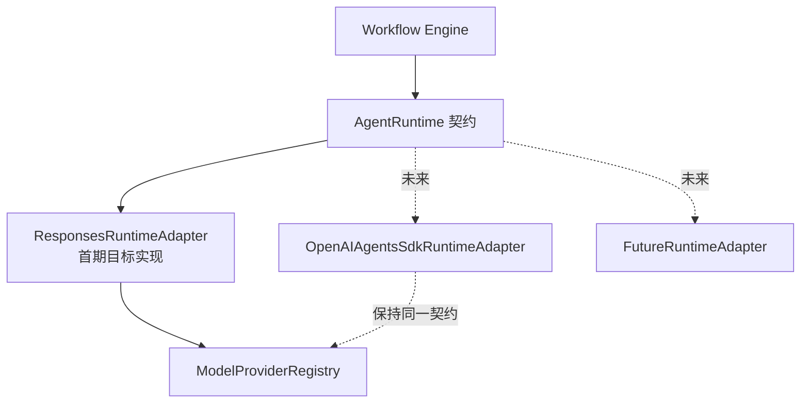

# ADR-001 Agent Runtime 首期路线与适配边界

> **版本**：V0.1  
> **状态**：已确认，首期实现前置设计  
> **日期**：2026-07-18

## 1. 决策

首期继续使用当前自研 `ResponsesRuntime`，通过百炼 OpenAI-compatible Responses API 连接 Qwen 和 DeepSeek。业务层不得直接依赖具体 Runtime 类，统一依赖内部 `AgentRuntime` 契约。

当前 POC 的 `RunnerService` 仍直接创建 `ResponsesRuntime`，尚不存在 Runtime 抽象。首期实施时以 `ResponsesRuntimeAdapter` 包装现有实现，并由 `RuntimeFactory` 或构造注入向 `RunnerService` 提供 `AgentRuntime`；未来可增加 `OpenAIAgentsSdkRuntimeAdapter` 或其他 `FutureRuntimeAdapter`。首期不使用 OpenAI Agents SDK Runner，也不接百炼 Agent 编排。



## 2. 背景与问题

当前 POC 的 `RunnerService`、Responses Runtime、Tool Loop、Trace 和 Usage 已经验证可行，但 `RunnerService` 直接依赖并创建具体 `ResponsesRuntime`。若业务 Workflow 继续调用具体 Runtime，后续迁移 Agents SDK 会同时改动步骤执行、工具循环、结构化输出、观测和用量记录，无法用同一 Skill 做行为、成本和可靠性对比。

因此本 ADR 只定义替换边界，不在首期引入新的运行时或重写已经验证的代码。

## 3. 公共契约

公共契约由业务层和所有 Runtime 实现共同使用：

```python
class AgentRuntime(Protocol):
    async def run(
        self,
        context: RunContext,
        skill: SkillSnapshot,
        input: RuntimeInput,
        tools: list[ToolDefinition],
    ) -> RuntimeResult:
        ...
```

契约中的对象职责如下：

| 对象 | 约束 |
|---|---|
| `RunContext` | 租户、AI Employee、Workflow/Step/Run、Scope 快照、触发人、Case、审批和可选 `profile_snapshot_id`；由后端构造，模型不能覆盖 |
| `SkillSnapshot` | Skill 版本、输入输出 Schema、Prompt 摘要、允许 Tool 和风险策略的不可变快照 |
| `RuntimeInput` | Workflow 按 `SkillSnapshot` 的 Input Schema 校验并固化的实际业务输入，例如风险记录、门店、规则、统计日期、历史窗口或 `profile_snapshot_id`；不可变，不能承载或覆盖身份权限字段 |
| `ToolDefinition` | 模型可见的 Tool 名称、Schema、用途和风险级别；执行仍必须经过 Tool Gateway |
| `RuntimeResult` | 结构化业务输出、状态、证据引用、Provider/模型、Trace 引用、Usage 引用和错误原因 |

Runtime 不拥有 Workflow 状态、Case 关闭、审批结论、员工 Scope 或 Java 业务状态；它只负责一次 Run 内的模型请求、Tool Loop、结构化解析和运行级观测。

## 4. 适配约束

所有实现必须满足：

1. 同一个 `SkillSnapshot` 在不同 Runtime 下使用相同 `RuntimeInput`、`runtime_input_sha256`、Tool 白名单和输出 Schema；同一 Step 的重试不得静默更换输入快照；
2. 工具调用统一经过 Tool Gateway，Runtime 不能绕过权限、范围、大小和幂等校验；
3. 每次实际 Provider 请求都写入统一 `agent_usage_meter`，包含 Provider、模型、耗时、状态和 `input_tokens`、`output_tokens`、`total_tokens`；Provider 未返回 Usage 时保留空值和原因，不估算；
4. Trace、Tool Call、结构化输出、错误码和 `RuntimeResult` 语义不因 Runtime 改变；
5. 模型不能切换模型或扩大 Scope。跨模型降级只能由后端显式策略执行并审计；
6. 完整 Provider 请求、原始响应和图片默认不进入生产长期持久化；结构化业务结果、摘要、哈希、受控引用和必要脱敏结果按统一审计契约保存。

## 5. 迁移与比较

首期 Runtime 改造只包含以下兼容性工作：

1. 新增 `AgentRuntime` Protocol 和稳定输入输出契约；
2. 新增 `ResponsesRuntimeAdapter`，内部复用现有 `ResponsesRuntime`、Tool Loop、Provider 和审计逻辑；
3. `RunnerService` 通过 `RuntimeFactory` 或构造注入获得 Runtime，不再直接创建具体实现；
4. 为 Adapter、测试替身和 `RunnerService` 注入增加契约测试；
5. 保持现有 Tool Gateway、安全校验、Trace、Usage 和结构化输出语义不变。

未来引入第二个 Runtime 时，先建立同一 `SkillSnapshot`、同一 `RuntimeInput` 和同一 Tool 数据的离线对比，再进行小范围灰度。比较至少覆盖：结构化结果一致性、事实引用完整性、Tool 越权拦截、失败恢复、延迟、`input_tokens`/`output_tokens`/`total_tokens` 和成本。比较结果保存为 Runtime 评估记录，不改变运行中实例已经固化的 Runtime 和模型配置。

## 6. 非目标

- 首期不引入 OpenAI Agents SDK Runner；
- 首期不把 Agent Runtime 抽象扩展为租户可编排的低代码引擎；
- 首期不接外部 MCP，仍由 `ToolProvider`/`McpToolProvider` 作为未来边界；
- 不重写现有 `ResponsesRuntime`、Tool Loop、Provider、Tool Gateway 和审计实现；本轮仍只修改规划文档，代码改造在正式实施阶段按本 ADR 最小落地。
