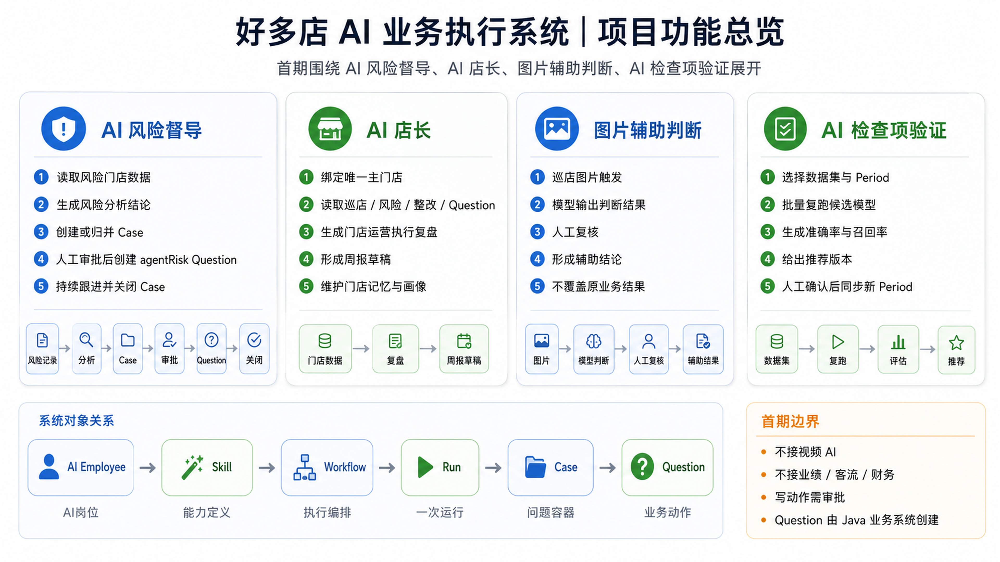
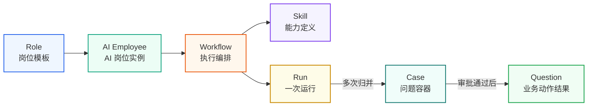
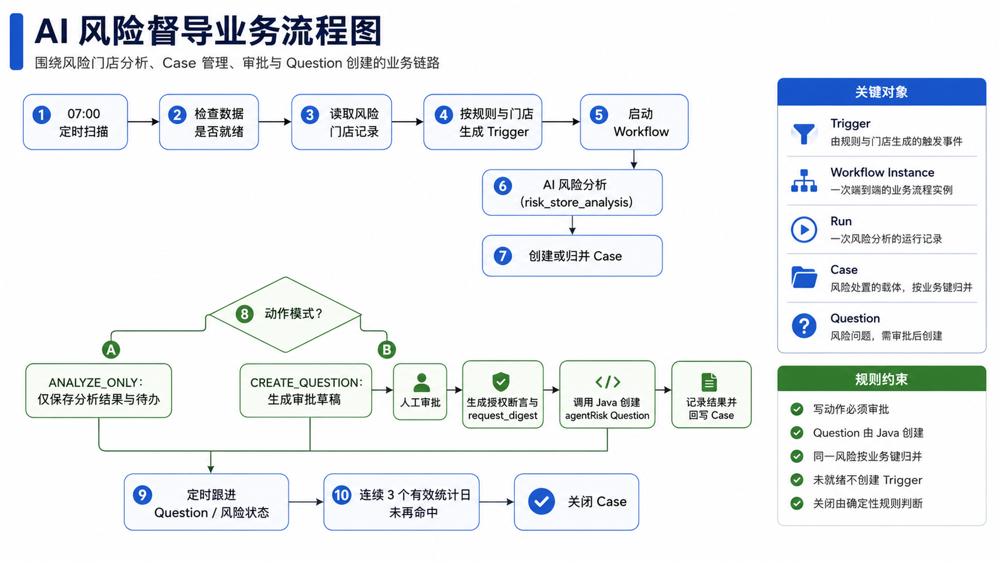
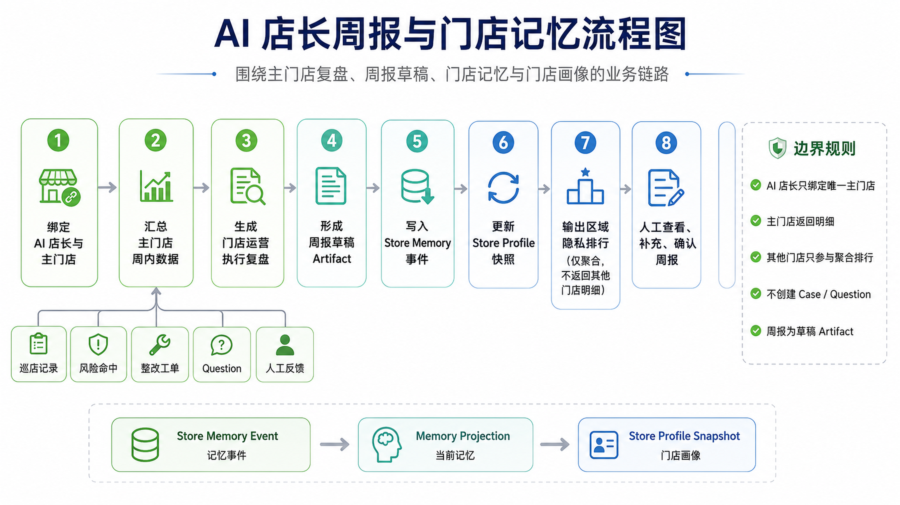
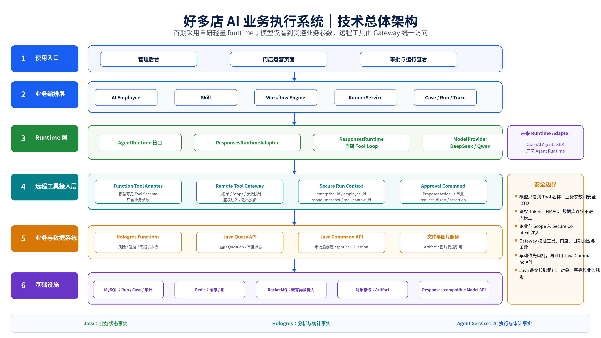
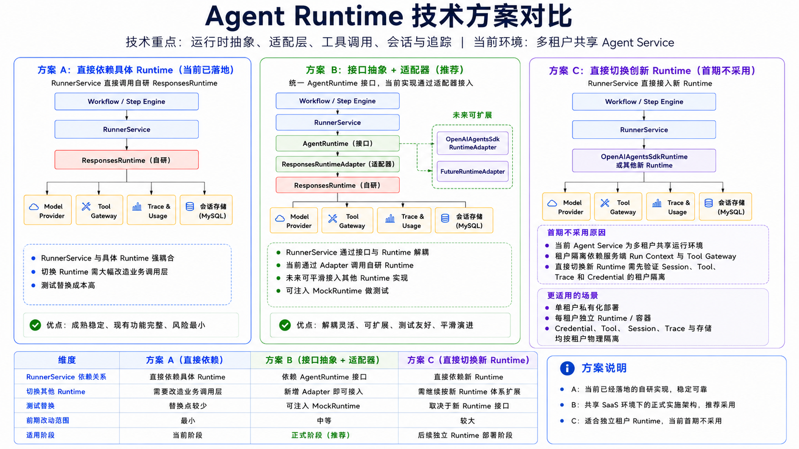
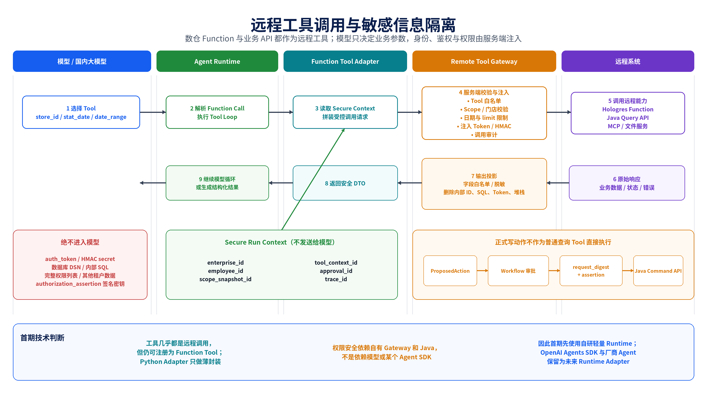
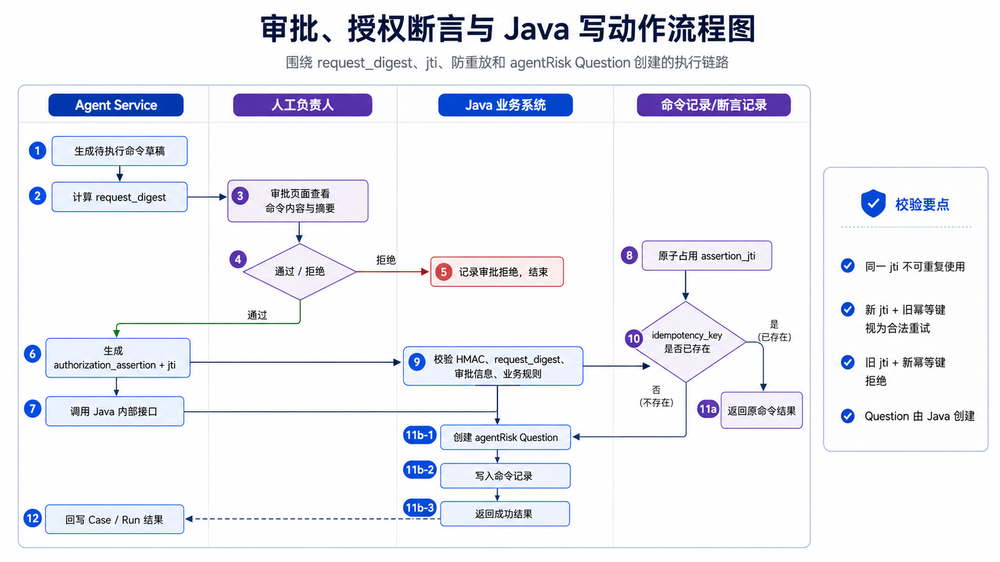
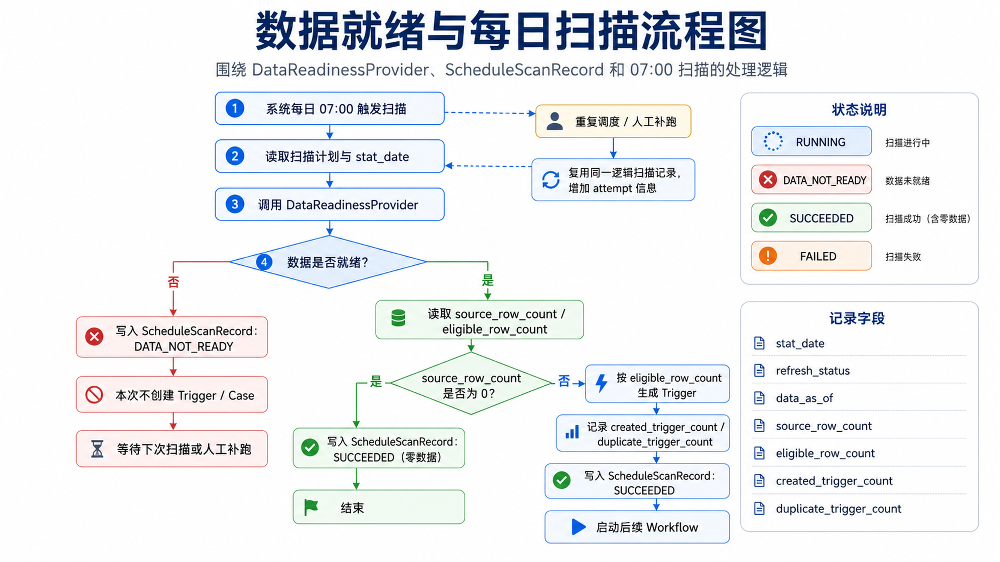

# 好多店 AI 业务执行系统：项目功能与技术架构介绍

> 版本：V1.1  
> 日期：2026-07-18  
> 文档重点：业务逻辑、技术架构、Runtime 技术路线、远程工具与安全边界

## 1. 文档说明

本文档用于介绍“好多店 AI 业务执行系统”的首期功能范围、核心业务逻辑、关键对象关系与技术架构。

---

## 2. 项目概述

好多店 AI 业务执行系统面向门店运营与巡店场景，首期围绕四类能力展开：

1. **AI 风险督导**：对风险门店进行分析、建档、跟进与关闭；
2. **AI 店长**：围绕主门店生成门店运营执行复盘、周报草稿、门店记忆与门店画像；
3. **图片辅助判断**：对巡店图片进行模型辅助判断，并提供人工复核后的辅助结论；
4. **AI 检查项验证**：围绕数据集、Period 和候选模型进行批量复跑与评估。

系统不替代现有 Java 业务系统，而是在其之上增加 AI 业务执行层：

- Java 业务系统继续负责组织、权限、门店、巡店、店务、Question、审批与消息等核心业务事实；
- Hologres 负责分析与统计事实；
- Agent Service 负责 AI Employee、Skill、Workflow、Run、Case、Trace 与 AI 执行审计事实。

---

## 3. 项目功能总览

下图给出首期项目功能、系统对象关系与首期边界。



### 3.1 首期功能模块

#### 3.1.1 AI 风险督导

AI 风险督导围绕风险门店数据运行，核心逻辑包括：

- 读取风险门店数据；
- 生成风险分析结论；
- 创建或归并 Case；
- 在需要写动作时进入审批；
- 审批通过后由 Java 业务系统创建 `agentRisk Question`；
- 持续跟进风险状态，满足关闭规则后关闭 Case。

#### 3.1.2 AI 店长

AI 店长围绕“唯一主门店”运行，核心逻辑包括：

- 绑定 AI 店长与唯一主门店；
- 读取主门店相关的巡店、风险、整改、Question 等数据；
- 生成门店运营执行复盘；
- 形成周报草稿；
- 维护门店记忆与门店画像。

#### 3.1.3 图片辅助判断

图片辅助判断围绕巡店图片运行，核心逻辑包括：

- 由巡店图片触发判断；
- 模型输出辅助判断结果；
- 人工复核；
- 形成辅助结论；
- 不覆盖原业务系统已有结论，只作为附加信息。

#### 3.1.4 AI 检查项验证

AI 检查项验证围绕数据集和 Period 运行，核心逻辑包括：

- 选择数据集与 Period；
- 批量复跑候选模型；
- 统计准确率、召回率等指标；
- 生成推荐版本；
- 人工确认后同步到新的 Period。

### 3.2 核心对象关系

首期系统的核心对象链路如下：

- **AI Employee**：AI 岗位实例；
- **Skill**：能力定义；
- **Workflow**：执行编排；
- **Run**：一次运行；
- **Case**：问题容器；
- **Question**：业务动作结果。



其中：

- AI Employee 绑定岗位、负责人和 Scope；
- Workflow 调用 Skill；
- Workflow 执行会产生 Run；
- 多次 Run 可归并到一个 Case；
- 需要业务写动作时，最终由 Java 业务系统创建 Question。

### 3.3 首期边界

首期边界如下：

- 不接视频 AI；
- 不接业绩、客流、财务；
- 所有写动作均需要审批；
- Question 由 Java 业务系统创建。

---

## 4. AI 风险督导业务流程

AI 风险督导是首期核心主链路。



### 4.1 主流程

流程图展示了执行步骤，本节补充图中不易表达的运行口径：

- **数据就绪是硬门槛**：风险快照未完成或统计周期不可用时，只记录未就绪原因，不创建 Trigger；数据补齐后允许补跑。
- **扫描需要可重复执行**：同一统计周期重复扫描时，应通过业务键识别已有 Trigger、Workflow Instance 和 Case，避免重复启动或重复建档。
- **Case 是持续跟进的聚合边界**：一次分析产生一个 Run，多次 Run 按同一风险业务键归并到 Case；后续跟进应复用原 Case，而不是为每次命中创建新问题。
- **关闭不是模型结论**：模型只提供分析证据和建议，Case 是否关闭由风险命中状态、有效统计周期和未完成动作等确定性条件共同判断。

### 4.2 动作模式

#### A. ANALYZE_ONLY

该模式只产生分析 Artifact 和待办建议，不进入业务写动作链路，适合作为首期灰度和模型效果评估模式。其结果可以用于后续人工判断，但不能被视为已经执行的业务动作。

#### B. CREATE_QUESTION

该模式的关键不是“让模型直接写入业务系统”，而是把建议转换为受控命令：

- 审批对象必须绑定目标门店、动作内容、风险上下文和有效期；
- 审批通过后生成授权断言，并使用 `request_digest` 固化本次请求内容；
- Java 业务系统在执行前重新校验租户、权限、授权有效期和幂等键；
- 执行成功、拒绝、过期或失败都要回写 Case 和审计轨迹，不能只保存模型文本。

### 4.3 关键业务规则

| 规则 | 具体要求 |
|---|---|
| 数据门槛 | 数据未就绪时不创建 Trigger，并保留未就绪原因和补跑依据。 |
| 归并口径 | 同一风险按业务键归并到同一个 Case，避免重复问题和重复催办。 |
| 写动作边界 | Agent 只能提交受控命令，不能绕过审批直接调用 Java 写接口。 |
| 执行校验 | Java 侧重新执行权限、Scope、授权断言、有效期和幂等校验。 |
| 关闭判定 | 由确定性规则判断，不由模型自由决定；关闭前必须确认未完成动作和复查状态。 |

---

## 5. AI 店长：周报、门店记忆与门店画像

AI 店长围绕主门店执行复盘和门店记忆沉淀运行。



### 5.1 AI 店长主流程

1. 绑定 AI 店长与主门店；
2. 汇总主门店周内数据；
3. 生成门店运营执行复盘；
4. 形成周报草稿 Artifact；
5. 写入 Store Memory 事件；
6. 更新 Store Profile 快照；
7. 输出区域隐私排行；
8. 人工查看、补充并确认周报。

### 5.2 输入数据来源

AI 店长使用的数据主要包括：

- 巡店记录；
- 风险命中；
- 整改工单；
- Question；
- 人工反馈。

### 5.3 门店记忆与门店画像

AI 店长的数据沉淀过程为：

- **Store Memory Event**：记录一次记忆事件；
- **Memory Projection**：形成当前记忆；
- **Store Profile Snapshot**：生成门店画像快照。

### 5.4 边界规则

- AI 店长只绑定唯一主门店；
- 主门店返回明细；
- 其他门店只参与聚合排行，不返回明细；
- AI 店长链路不创建 Case / Question；
- 周报输出为草稿 Artifact，不直接发布为正式业务结果。

---

## 6. 技术总体架构

下图给出前端、Agent Service、Runtime、远程工具、Java 业务系统、数仓与基础设施之间的总体关系。



### 6.1 分层说明

#### 6.1.1 使用入口

- 管理后台；
- 门店运营页面；
- 审批与运行查看页面。

#### 6.1.2 业务编排层

业务编排层由 Agent Service 承担，核心模块包括：

- **AI Employee**：AI 员工与岗位实例；
- **Skill**：能力定义；
- **Workflow Engine**：确定性业务流程；
- **RunnerService**：运行入口；
- **Case / Run / Trace**：问题、执行与跟踪记录。

Workflow Engine 负责 Trigger、Case、审批、等待、恢复、重试和关闭等业务生命周期，不把这些职责交给模型。

#### 6.1.3 Runtime 层

首期 Runtime 结构为：

```text
AgentRuntime
  -> ResponsesRuntimeAdapter
  -> ResponsesRuntime
  -> ModelProvider
```

其中：

- `AgentRuntime` 是业务层依赖的统一接口；
- `ResponsesRuntimeAdapter` 将统一接口适配到现有自研 Runtime；
- `ResponsesRuntime` 管理单个 AI Step 内部的模型调用和 Tool Loop；
- `ModelProvider` 接入 DeepSeek、Qwen 等国内模型；
- OpenAI Agents SDK Runtime 和厂商 Agent Runtime 保留为未来 Adapter，不是首期主运行时。

#### 6.1.4 远程工具接入层

本项目基本没有承载业务数据的本地工具。模型调用的工具主要是：

- Hologres 数仓查询 Function；
- Java Query API；
- Java Command API；
- 文件与图片服务；
- 后续可选 MCP Tool。

这些能力统一通过以下链路调用：

```text
Model Function Call
  -> Function Tool Adapter
  -> Remote Tool Gateway
  -> Hologres / Java API / 文件服务 / MCP
```

`Function Tool Adapter` 只是薄封装，不直接承载复杂权限和业务逻辑。

`Remote Tool Gateway` 负责：

- Tool 白名单；
- 企业与 Scope 注入；
- 门店权限校验；
- 日期范围、limit 和参数限制；
- 鉴权 Token / HMAC 注入；
- 返回字段投影与脱敏；
- Tool Call 审计与错误映射。

#### 6.1.5 业务与数据系统

- **Hologres Functions**：风险、巡店、周报和排行等分析数据；
- **Java Query API**：门店、Question、人员、审批状态等实时事实；
- **Java Command API**：审批后创建 `agentRisk Question`；
- **文件与图片服务**：Artifact 和受控图片引用。

#### 6.1.6 基础设施

- MySQL：Run、Case、审计与配置；
- Redis：缓存与锁；
- RocketMQ：既有异步能力；
- 对象存储：Artifact；
- Responses-compatible Model API：DeepSeek、Qwen 等模型访问入口。

### 6.2 数据职责边界

- **Java**：业务状态事实；
- **Hologres**：分析与统计事实；
- **Agent Service**：AI 执行与审计事实。

---

## 7. Agent Runtime 技术路线对比

本项目的 Runtime 方案需要同时满足：

- 国内模型接入；
- 远程数仓 Function 和 Java API 调用；
- 企业与 Scope 强校验；
- 鉴权信息不进入模型；
- Workflow、Case、审批和恢复由自有业务流程控制；
- 后续能够切换 Runtime 实现。



### 7.1 方案 A：自研轻量 Runtime + AgentRuntime 接口

首期采用该方案。图片已展示其分层和调用关系，正文只记录决策依据：

- 当前 POC 已经具备 ResponsesRuntime 和 Tool Loop，改造量集中在 `AgentRuntime` 接口、Adapter 和契约测试；
- Workflow 已经负责 Trigger、Case、审批、等待和恢复，Runtime 只处理单个 AI Step 的模型循环，避免出现两套业务生命周期；
- DeepSeek、Qwen 等模型继续通过现有 ModelProvider 接入，远程工具继续统一经过自有 Gateway；
- Token、HMAC、企业、Scope 和审批上下文仍保留在服务端，模型只接触受控参数和安全 DTO。

### 7.2 方案 B：OpenAI Agents SDK Runtime

OpenAI Agents SDK 可以通过 `ModelProvider`、兼容端点或第三方 Adapter 接入非 OpenAI 模型，也可以调用远程工具。[1][2] 首期不采用它作为主 Runtime，主要不是能力不足，而是需要先解决两类适配问题：

- **兼容矩阵**：逐项验证 Responses、Tool Calling、Structured Output、Usage、并行工具调用和错误语义在目标模型上的实际表现；
- **业务映射**：将 Runner、Session、Trace、暂停审批和恢复能力映射到现有 Run、Step、Case、审批记录和 MySQL 审计模型。

后续保留 `OpenAIAgentsSdkRuntimeAdapter`，只有当相同的 `RuntimeInput`、`Tool Contract`、权限校验和契约测试全部通过时，才允许替换首期 Runtime，且不改动 Workflow 业务层。

### 7.3 方案 C：厂商 Agent 平台或厂商 Agent 框架

厂商平台可以作为模型 Provider、专用模型服务或独立验证环境，但首期不承载核心业务 Workflow。接入前必须确认：

- Tool 注册、鉴权注入、数据回传和错误语义能否通过自有 Gateway 隔离；
- 授权断言、审批、命令幂等、Java 事务和审计是否能够保留在自有边界内；
- Runtime、Session、Trace 和 Tool 数据是否支持导出、回放和故障迁移；
- 更换厂商时，业务状态、Case 和审计记录是否无需迁移到厂商私有模型。

### 7.4 首期技术结论

首期选择自研轻量 Runtime，并保留标准化 Adapter：

```text
AgentRuntime
  + ResponsesRuntimeAdapter
  + 自研 ResponsesRuntime
  + Remote Tool Gateway
```

OpenAI Agents SDK 和厂商 Agent 平台都不是被永久排除，而是暂不作为首期主运行时。

无论未来采用哪种 Runtime，以下边界不变：

| 边界 | 固定责任 |
|---|---|
| 身份与范围 | `enterprise_id`、`employee_id`、Scope 由服务端上下文提供，不由模型决定。 |
| 敏感信息 | Token、HMAC、数据库连接信息不进入模型上下文。 |
| 工具安全 | Tool Gateway 负责权限、参数、返回结果和审计校验。 |
| 业务写入 | Java 业务系统负责授权断言、事务、幂等和最终状态校验。 |
| 业务生命周期 | Workflow 继续管理业务状态、Case、审批、等待和恢复。 |

---

## 8. 远程工具调用与敏感信息隔离

下图说明数仓 Function、Java API 等远程工具的实际调用路径，以及模型能看到和不能看到的数据。



### 8.1 工具的实际形态

虽然 SDK 或 Runtime 侧将工具注册为 Function Tool，但工具本身大多是远程能力：

```text
Function Tool Adapter
  -> Remote Tool Gateway
  -> Hologres Function / Java API / MCP / 文件服务
```

Function Tool Adapter 负责：

1. 接收模型提供的业务参数；
2. 读取服务端 Secure Run Context；
3. 调用 Remote Tool Gateway；
4. 返回安全 DTO；
5. 将标准错误交回 Runtime。

它不负责：

- SQL 拼接；
- 租户权限计算；
- HMAC 密钥管理；
- Java 领域规则；
- 审批和幂等；
- 正式业务状态机。

### 8.2 模型可见内容

模型可以看到：

- Tool 名称和参数 Schema；
- `store_id`；
- `stat_date`；
- 日期范围；
- 经过权限过滤的业务证据；
- 经过字段投影的安全 DTO；
- 可解释业务错误。

### 8.3 模型不可见内容

以下信息保留在 Agent Service、Gateway 或 Java 中：

- `auth_token`；
- HMAC Secret；
- 数据库 DSN；
- 内部 SQL；
- 完整权限列表；
- 其他租户数据；
- `authorization_assertion` 签名密钥；
- Java 内部调用密钥；
- 内部异常堆栈。

### 8.4 Secure Run Context

可信上下文由服务端构造，至少包括：

```text
enterprise_id
employee_id
scope_snapshot_id
tool_context_id
approval_id
trace_id
```

模型不能创建、覆盖或修改这些字段。

### 8.5 查询工具流程

1. 模型选择 Tool 并提供业务参数；
2. Runtime 解析 Function Call；
3. Adapter 读取 Secure Run Context；
4. Gateway 校验 Tool 白名单、Scope、门店、日期和 limit；
5. Gateway 注入 Token 或 HMAC；
6. 调用 Hologres Function 或 Java Query API；
7. Gateway 对原始结果做字段投影和脱敏；
8. 返回安全 DTO；
9. Runtime 继续模型循环或生成结构化结果。

### 8.6 写动作流程

正式写动作不作为普通查询 Tool 让模型直接执行。

正确流程为：

```text
模型生成 ProposedAction
  -> Workflow 保存命令草稿
  -> 人工审批
  -> request_digest
  -> authorization_assertion
  -> Java Command API
```

---

## 9. 审批、授权断言与 Java 写动作

需要业务写动作时，系统通过审批与授权断言控制调用链路。



### 9.1 执行流程

1. Agent Service 生成待执行命令草稿；
2. 计算 `request_digest`；
3. 人工负责人在审批页查看命令内容与摘要；
4. 负责人选择通过或拒绝；
5. 若拒绝，记录审批拒绝并结束；
6. 若通过，生成 `authorization_assertion + jti`；
7. 调用 Java 内部接口；
8. Java 原子占用 `assertion_jti`；
9. Java 校验 HMAC、`request_digest`、审批信息与业务规则；
10. 检查 `idempotency_key` 是否已存在；
11. 若不存在，创建 `agentRisk Question` 并写入命令记录；若存在，则返回原命令结果；
12. Agent Service 回写 Case / Run 结果。

### 9.2 校验要点

- 同一 `jti` 不可重复使用；
- 新 `jti + 旧幂等键` 视为合法重试；
- 旧 `jti + 新幂等键` 直接拒绝；
- Question 由 Java 创建。

### 9.3 核心控制字段

- `request_digest`：审批内容与实际命令的一致性摘要；
- `jti`：授权断言一次性标识；
- `idempotency_key`：命令幂等键；
- `authorization_assertion`：审批通过后的授权断言。

---

## 10. 数据就绪与每日扫描

风险督导等自动流程依赖数据是否就绪的判断。



### 10.1 扫描主流程

1. 系统每日 07:00 触发扫描；
2. 读取扫描计划与 `stat_date`；
3. 调用 `DataReadinessProvider`；
4. 判断数据是否就绪。

### 10.2 未就绪分支

如果数据未就绪：

- 写入 `ScheduleScanRecord = DATA_NOT_READY`；
- 本次不创建 Trigger / Case；
- 等待下次扫描或人工补跑。

### 10.3 已就绪分支

如果数据已就绪：

- 读取 `source_row_count / eligible_row_count`；
- 若 `source_row_count = 0`，写入零数据成功记录并结束；
- 若 `source_row_count > 0`，根据 `eligible_row_count` 生成 Trigger；
- 记录 `created_trigger_count / duplicate_trigger_count`；
- 写入 `SUCCEEDED` 状态；
- 启动后续 Workflow。

### 10.4 调度与补跑

对重复调度或人工补跑，系统复用同一逻辑扫描记录并增加 attempt 信息。

### 10.5 主要记录字段

- `stat_date`
- `refresh_status`
- `data_as_of`
- `source_row_count`
- `eligible_row_count`
- `created_trigger_count`
- `duplicate_trigger_count`

### 10.6 状态枚举

- `RUNNING`：扫描进行中；
- `DATA_NOT_READY`：数据未就绪；
- `SUCCEEDED`：扫描成功，包含零数据；
- `FAILED`：扫描失败。

---

## 11. 图纸更新说明

本轮重新绘制：

1. `01-AgentRuntime-技术路线对比-4K.png`  
   重新定义三种技术路线，明确首期采用自研轻量 Runtime，并解释暂不采用 OpenAI Agents SDK 和厂商 Agent 的原因。

2. `05-技术总体架构-4K.png`  
   增加 Runtime 层、Function Tool Adapter、Remote Tool Gateway、Secure Run Context 和远程 API 分层。

3. `08-远程工具调用与敏感信息隔离-4K.png`  
   新增图纸，说明数仓 Function、Java API 的调用方式，以及 Token、HMAC、Scope 等信息如何与模型隔离。

以下图纸业务逻辑没有变化，仅转换为 4K：

- 项目功能总览；
- AI 风险督导业务流程；
- AI 店长周报与门店记忆；
- 审批、授权断言与 Java 写动作；
- 数据就绪与每日扫描。

---

## 12. 结论

首期技术结构为：

```text
Workflow Engine
  -> RunnerService
  -> AgentRuntime
  -> ResponsesRuntimeAdapter
  -> ResponsesRuntime
  -> Function Tool Adapter
  -> Remote Tool Gateway
  -> Hologres / Java API / 文件服务
```

核心判断如下：

- OpenAI Agents SDK 可以接入非 OpenAI 模型，也可以调用远程 Function Tool；
- 首期不采用它，是因为当前系统已经有独立 Workflow、Case、审批、恢复和审计体系，只需轻量模型 Tool Loop；
- 厂商 Agent 平台首期不采用，是因为 Tool、Session、Trace、鉴权和数据路径会增加厂商化适配；
- 国内模型继续通过自有 ModelProvider 接入；
- 权限安全依赖 Agent Service、Remote Tool Gateway 和 Java 业务系统，不依赖模型自觉或某个 Agent SDK；
- OpenAI Agents SDK 和厂商 Agent Runtime 都保留为未来 Adapter，后续通过契约测试决定是否接入。

---

## 参考资料

[1] OpenAI Agents SDK — Agents：Agent 与 Runner 管理 turns、tools、guardrails、handoffs 和 sessions。  
https://openai.github.io/openai-agents-python/agents/

[2] OpenAI Agents SDK — Models：支持非 OpenAI Provider 和兼容端点，同时要求验证不同 Provider 的功能差异。  
https://openai.github.io/openai-agents-python/models/

[3] OpenAI Agents SDK — Tools：Function Tool 可以包装 Python 函数，函数内部可调用远程 API。  
https://openai.github.io/openai-agents-python/tools/

[4] OpenAI Agents SDK — Guardrails：Tool Guardrail 可在 Function Tool 执行前后进行校验，但不替代业务权限事实源。  
https://openai.github.io/openai-agents-python/guardrails/

[5] 阿里云百炼 Model Studio：模型、智能体应用、工具调用和应用开发文档。  
https://help.aliyun.com/zh/model-studio/

[6] OpenAI Agents SDK — Running agents：Runner、`run`、turns 和运行循环。  
https://openai.github.io/openai-agents-python/running_agents/

[7] 腾讯 CodeBuddy：AI 编程助手产品与使用文档。  
https://www.codebuddy.ai/docs
