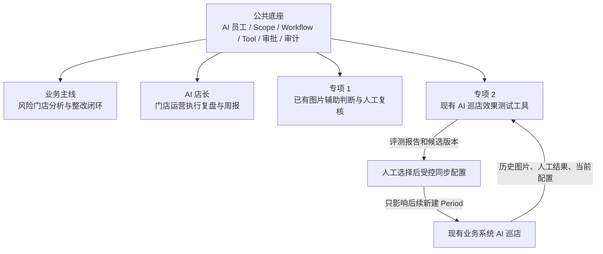
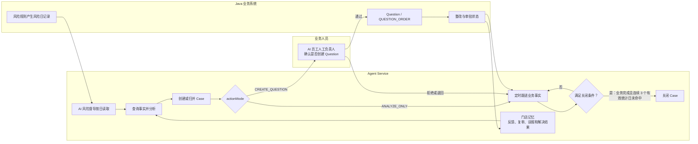
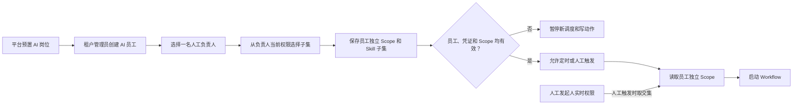
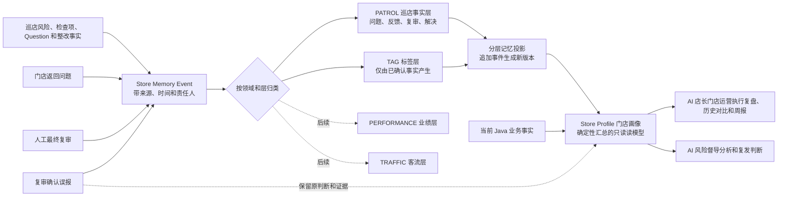

# 好多店 AI Native 业务执行系统产品需求

> **版本**：V0.1
> **状态**：评审基线
> **日期**：2026-07-17
> **适用对象**：产品、架构、研发、测试、数据、交付、运营
> **代码事实基线**：`coolcollege-intelligent master@3847998dd2`

## 1. 文档目标

本文定义系统为什么建设、首期做什么、业务边界是什么，以及如何判断交付成功。对象关系见[AI 岗位与领域模型](需求-02-AI岗位与领域模型.md)，实现方式见技术类文档，验证步骤见测试类文档。

系统的目标不是增加聊天入口，而是让 AI 以独立业务员工身份进入现有组织和流程，在明确 Scope、权限、审批和审计约束下持续推动业务问题闭环。

## 2. 建设目标与范围

### 2.1 首期目标

首期落地 AI 风险督导和 AI 店长两个岗位，能力分为一条业务主线、两个独立专项和一套公共底座：

- **业务主线：风险门店闭环**。从租户已有风险记录发现门店，调查业务事实，建立 Case，形成整改建议，经人工批准后创建或关联 Question，并持续跟进到关闭。
- **AI 店长：门店运营执行复盘**。查看当前绑定门店的当前情况、历史变化和异常事项，按周生成报告草稿，并只返回当前门店在规定区域范围内的排名，不展示其他门店信息；发现风险时转交风险督导主线。
- **专项 1：图片辅助判断**。对授权范围内已有巡店图片提供独立判断和人工复核，不覆盖平台原始结果；只有人工确认违规后才创建或关联 Question。
- **专项 2：现有 AI 巡店效果测试工具**。面向当前业务系统已经存在的 AI 巡店功能，为业务人员提供历史图片数据集、人工真值、Baseline、候选配置复跑和效果对比工具，方便验证 Prompt、标准图、模型或规则配置的实际效果。该工具不参与生产巡检执行，也不自动优化或发布配置。
- **公共底座**。提供 AI 员工身份、Scope、Skill、Workflow、Tool、审批、Token 用量、Trace 和审计。

专项 2 的使用者是 AI 检查项管理员或相关业务人员，不要求由 AI 风险督导自动发起。用户完成评测并明确选择版本后，系统才允许通过受控接口把白名单配置同步到原检查项。

### 2.2 首期边界

业务主线、AI 店长、专项 1 和专项 2 可以独立启用和验收。图片辅助判断不是风险 Case 的必经步骤；效果测试工具也不订阅生产巡检任务。

首期包含：

- AI 岗位与 AI 员工管理；
- AI 风险督导和 AI 店长两个首期 Role；
- 平台预置 Skill 和 Workflow；
- 风险门店分析、Case 跟进和受控 Question 创建；
- Hologres 分析查询与 Java 实时业务事实查询；
- Agent 图片辅助判断与人工裁决；
- AI 检查项规则效果验证和受控同步；
- Workflow 完成 Webhook；
- Token 用量、Trace、审计和人工审批。

首期不包含：

- 通用低代码 Agent 或 Workflow 平台；
- 租户自定义 Prompt、Skill、Tool 白名单或执行代码；
- 自动处罚、罚款、扣分、停售等高风险动作；
- Agent 主动催办或独立消息推送；
- 外部 MCP 调用、百炼 Agent 编排或 OpenAI Agents SDK Runner；
- RocketMQ 业务状态事件和突发事件推送；
- 视频 AI、业绩、客流和财务场景；
- 用 Agent Case 替代现有任务、Question、审批、申诉或复核状态机。

### 2.3 业务事实边界

- Java 业务系统是组织、权限、风险规则、任务、Question、审批、巡店结果和业务状态的事实源。
- Hologres 提供跨门店分析、历史趋势和风险日记录，不承担实时业务状态或业务写入。
- Agent Service 管理 AI 员工、Workflow、Run、Case、审批引用、辅助判断、验证版本和审计，不复制业务状态机。
- 业务人员负责 AI 员工授权、人工审批、图片裁决、数据集真值确认、例外原因和最终配置发布选择；模型不能替代这些决策。
- 代码和旧文档冲突时以当前业务代码为事实；新的产品取舍以本需求为准。

## 3. 核心业务模型

系统使用以下对象：

| 对象 | 产品职责 |
|---|---|
| Role | 定义岗位使命、能力、默认 Skill 和禁止事项 |
| AI Employee | Role 在指定租户和 Scope 下的独立业务实例 |
| Skill | 完成一类业务任务的方法和结构化输出契约 |
| Workflow | 安排确定性步骤、AI 判断、等待、审批和恢复 |
| Run | 一次 AI 执行，包含模型调用和 Tool Loop |
| Case | 跨多次 Run 跟进同一业务问题的容器 |
| Store Memory | 系统根据门店问题、门店反馈和最终复审沉淀的、分层且带来源的门店长期事实与摘要 |
| Store Profile | 由分层门店记忆和当前业务事实生成的门店画像读模型，不是新的业务事实源 |
| Tool | 受权限和契约约束的数据查询或业务动作能力 |
| Artifact | 输入、输出、证据和业务过程产物 |
| Validation | 使用冻结图片数据集比较现有 AI 检查项配置与候选版本的效果 |

Role、Skill 和 Workflow Definition 首期由平台预置；租户管理员只能创建 AI 员工、配置员工属性和启用 Role 允许的 Skill 子集。

## 4. 首期业务流程

第三方 `/open/aiInspection/results` 回传属于既有独立链路。Agent 不调用该入口，也不改变其接口、签名、结果保存或自动发单行为。

## 5. 功能需求

### 5.1 Role

#### FR-ROLE-001 平台预置 AI 岗位

平台可定义岗位编码、名称、使命、职责、默认 Skill、允许的 Tool、风险边界和版本。首期岗位只由平台预置。

#### FR-ROLE-002 岗位版本管理

岗位变更形成新版本；运行中的 Workflow 继续使用启动时固化的岗位版本。

#### FR-ROLE-003 岗位启停

停用岗位后不得创建新员工或启动新 Workflow，历史记录仍可审计。

#### FR-ROLE-004 AI 店长岗位

首期平台预置 `AI_STORE_MANAGER` Role，负责员工所绑定主门店的现状复盘、历史比较、异常查看、周报草稿和区域排名。该 Role 不直接创建 Question、发送消息、修改任务或改变业务状态。

### 5.2 AI Employee

#### FR-EMP-001 基于岗位创建 AI 员工

租户管理员可基于已发布 Role 创建 AI 员工，员工拥有独立 `employee_id`，不复用真实用户 `user_id`。

#### FR-EMP-002 配置负责范围

员工 Scope 使用互斥的 `ALL`、`REGIONS`、`STORES`。`REGIONS` 动态包含下级区域和当前有效门店，`STORES` 只包含明确选择的门店。

创建员工时必须先选择一名人工负责人，再从该负责人当时拥有的数据范围中选择子集作为员工 Scope，例如选择某个区域或若干门店；只有负责人当时拥有全租户范围时才能选择 `ALL`。保存后该 Scope 归员工独立所有，不随负责人后续调岗、离职或权限变化自动改变。

#### FR-EMP-003 配置 Skill

租户管理员只能启用 Role 允许的 Skill 子集，不能直接为员工增加 Tool。员工实际可用能力不得超过 Role、Skill、Workflow 和风险策略共同允许的范围；可访问的业务数据另受员工实时有效 Scope 限制。

#### FR-EMP-004 首期自动化边界

首期不开放自动化等级选择。AI 员工可以自动分析、生成建议或草稿，正式写动作必须人工确认；风险规则的 `actionMode` 只能进一步收紧权限，不能突破该边界。

#### FR-EMP-005 人工负责人

每个员工必须指定一名人工负责人，负责业务联系、异常接管，并确认该员工发起的正式业务写动作。负责人是创建员工时的权限复制来源，但不是员工运行时的权限来源；后续更换负责人或调整员工 Scope 必须由租户管理员显式操作并记录审计。

#### FR-EMP-006 独立服务身份

后台调度和恢复使用员工独立服务身份，不依赖创建人 Session，也不得冒充真实用户。

#### FR-EMP-007 有效 Scope 计算

后台任务使用员工独立配置的 Scope，并按当前区域树、门店归属和风险策略计算本次有效范围；人工触发还必须与发起人实时权限取交集。模型和请求参数不能扩大 Scope。

#### FR-EMP-008 身份生命周期

员工停用、租户管理员显式收回员工 Scope 或凭证失效后立即阻断不再允许的新 Run 和写动作。Scope 外历史 Case 保留审计，但停止自动执行。

### 5.3 Skill

#### FR-SKILL-001 Skill 定义

Skill 必须有稳定编码、版本、适用 Role、输入输出 Schema、允许 Tool、风险等级和评估规则。首期只由平台维护。

#### FR-SKILL-002 结构化输出

每次 Skill 执行必须产生满足 Schema 的结构化结果；不合格输出不得推动 Workflow 或业务动作。

#### FR-SKILL-003 Skill 复用

只有输入输出稳定、可独立评估且可跨场景复用的能力才定义为 Skill，确定性校验和状态流转不包装成 Skill。

#### FR-SKILL-004 当前 POC 能力迁移

现有 `risk_store_analysis` 作为风险调查 Skill 渐进演进，保留已验证的查询、权限、审计和证据能力。

#### FR-SKILL-005 AI 店长运营执行复盘 Skill

首期增加 `store_manager_review` Skill。Skill 组合当前门店快照、历史趋势、风险/巡店/Question 异常、周报草稿和隐私排行结果，输出带来源、统计日期和数据范围的结构化报告。其他门店明细不能进入模型上下文。

### 5.4 Workflow

#### FR-WF-001 流程模板

平台预置版本化 Workflow，定义步骤、执行者、Skill、Tool 范围、路由、等待、审批和结束条件。

#### FR-WF-002 执行者绑定

Workflow 启动时绑定具体 AI 员工，并固化员工、Role、Skill 和 Scope 的执行快照。

#### FR-WF-003 流程版本

新版本只影响新建实例；运行中实例始终使用启动时固化的完整定义快照。

#### FR-WF-004 条件流转

确定性规则负责状态迁移、重试、等待和结束判断；模型只提供结构化业务判断，不能自由修改流程。

#### FR-WF-005 与业务流程边界

Workflow 只编排推理、工具、等待、恢复和升级，不复制 UnifyTask、Question 或业务审批流程。

#### FR-WF-006 步骤实例与 Run

步骤实例和 Run 可独立查询；一个步骤因重试产生多个 Run 时，必须保留明确的归属和顺序。

#### FR-WF-007 AI 店长周报 Workflow

AI 店长 Workflow 支持人工复盘和按系统统一周报调度生成草稿。周报只在页面提供查看和下载，不自动推送；同一员工、统计周和 Workflow 使用幂等键，重复执行返回同一草稿版本。

### 5.5 Case

#### FR-CASE-001 建立内部跟进 Case

Case 保存 Agent 跟进目标、当前阶段、业务引用、事件和下一次跟进时间，不复制外部对象状态机。

#### FR-CASE-002 Case 去重与关联

同一租户、门店、规则和 Workflow 的命中归并到同一未关闭 Case；关闭后再次命中创建复发 Case，并关联前序 Case。

#### FR-CASE-003 定时恢复

未关闭 Case 默认每 6 小时恢复一次并查询最新业务事实；该跟进只执行确定性状态查询，默认不重新调用模型，只有明确需要重新分析时才创建新的 Run。首期不依赖业务状态事件。

#### FR-CASE-004 Case 状态

Case 状态只描述内部跟进进度，支持执行、等待审批、等待人工分配、等待外部结果、准备关闭、关闭、取消和阻断。

#### FR-CASE-005 业务对象关联与关闭

Case 关闭必须同时满足：关联业务对象均达到业务终态；同一门店和规则连续 3 个有效统计日未再命中；对应统计日数仓均已成功刷新；关闭前重新查询业务事实并保存证据。模型文本不能单独关闭 Case。

“有效统计日”以租户数据刷新控制事实为准：对应 `stat_date` 的 `refresh_status=SUCCESS`，并且能够区分“当日无业务数据”和“刷新未完成”。自然日不能直接替代有效统计日。

### 5.6 门店记忆与画像

#### FR-MEMORY-001 门店记忆分层

系统为每个租户、门店和业务主题沉淀可扩展的门店记忆。记忆至少区分 `domain_code` 和 `layer_code`：首期只实现 `PATROL` 巡店领域的事实/反馈/复审/解决事件，以及从已确认事实生成的 `TAG` 标签层；`PERFORMANCE` 业绩和 `TRAFFIC` 客流只预留领域边界，不在首期接入。不同领域不得共用没有口径的指标或互相覆盖结论。

门店记忆是系统沉淀内容，不是模型自行声明的长期记忆；每条记忆必须关联来源对象、统计日期或发生时间、记录角色和可访问范围。对外复盘使用的“门店画像”是这些分层事件和当前业务事实的只读投影，必须标注生成时间、数据范围和来源版本。

#### FR-MEMORY-002 反馈与误报结论

门店返回问题和最终复审必须作为可区分的事实事件保存。最终复审确认“误报”时，系统在门店记忆当前投影中标记该问题为 `FALSE_POSITIVE`，保留原始 AI 判断、图片/业务对象引用、复审人、复审时间和理由，不删除或覆盖历史记录。确认违规、已整改、无法判断等结论同样保留来源和时间，不能由模型文本单独改变。

#### FR-MEMORY-003 记忆快照与使用边界

每次 Run 使用门店记忆或画像时必须固化 `profile_snapshot_id`；快照包含 `memory_version`、`profile_version`、生成时间和来源事件范围。AI 风险督导只能读取员工 Scope 内门店的记忆；AI 店长只能读取主门店画像，其他门店的记忆、身份和详情不得进入模型上下文、页面、Webhook 或普通日志。

#### FR-MEMORY-004 更正与生命周期

记忆更正采用追加新事件并生成新投影，不直接修改已审计事件。源业务事实变化、人工复审改判或租户按保留策略清理时，系统记录失效原因和操作人；具体保留期限由实施前的合规配置确认，首期不定义统一天数。记忆只用于分析、复盘和建议，不替代 Java 业务系统的风险、Question、审批或整改状态事实源。

#### FR-MEMORY-005 标签层与后续领域扩展

`TAG` 标签必须有标签编码、来源事件、确认状态、有效期和撤销记录。首期只允许由已确认巡店事实或人工确认产生有限标签，不允许模型凭空创建标签。后续增加业绩或客流记忆时，新增独立 `domain_code`、数据来源和指标口径，不能修改首期巡店记忆事件含义。

### 5.7 Trigger

#### FR-TRIGGER-000 租户风险规则与 Agent 策略

风险定义来自每个租户自己的业务规则。只有显式 `agentEnabled=true` 且配置 Agent 策略的规则触发 Agent，存量规则保持原行为。

首期 `actionMode` 只支持：

- `ANALYZE_ONLY`：只形成分析、Case Event 和复查计划；
- `CREATE_QUESTION`：AI Employee 的人工负责人确认后创建 Question。

#### FR-TRIGGER-001 定时触发

系统每日 07:00 按统一调度时间读取前一有效统计日风险记录。读取前必须确认数仓已成功刷新；未刷新时本次扫描记录 `DATA_NOT_READY`，不创建风险 Trigger 或 Case，后续由定时扫描或人工重跑继续处理，不由刷新事件直接触发。

#### FR-TRIGGER-002 数仓触发

未来可由明确的数仓刷新完成信号触发，但必须先验证刷新质量和幂等；首期不实现、不验收该事件触发，仍只使用每日定时读取。

#### FR-TRIGGER-003 业务事件

首期不接 Java 业务状态事件。RocketMQ 仅作为后续优化建议，不纳入实现和验收。

#### FR-TRIGGER-004 人工下派

有权限用户可对指定范围下派任务，实际 Scope 不得超过用户与 AI 员工权限交集。

#### FR-TRIGGER-005 AI 店长周报触发

AI 店长周报按系统统一周报调度生成草稿，也支持人工触发。突发事项只从已存在的风险和异常事实查询，不接业务事件推送；数据不足或未刷新时不得编造结论。

### 5.8 Tool 与数据

#### FR-TOOL-001 Tool 分类

Tool 分为查询、草稿和动作三类。所有 Tool 必须经过统一安全校验，模型不能自由执行 SQL 或直接访问数据库。

#### FR-DATA-001 数据查询边界

查询必须绑定租户、有效 Scope、允许日期范围和结果大小限制。

#### FR-DATA-002 业务问题式工具

Tool 以稳定业务问题命名并返回结构化结果，不向模型暴露自由 SQL、物理表选择或任意接口调用。

#### FR-DATA-003 数据新鲜度

数据结果必须携带统计日期、刷新状态和来源；过期或未刷新的数据不得被描述为最新有效事实。

#### FR-DATA-004 分层使用原则

Hologres 用于历史和聚合分析，Java 业务查询用于当前人员、任务、Question、审批和复核状态。

#### FR-DATA-005 数据质量标记

未来日期、映射缺失或刷新异常必须显式提示，并阻断基于该数据的自动写动作。

#### FR-DATA-006 实时业务事实查询

Agent 必须通过受控查询能力获取当前业务状态，不以数仓延迟快照替代权威事实。

### 5.9 业务动作与人工审批

#### FR-ACTION-001 动作能力范围

首期真实动作只包含 AI Employee 人工负责人确认后的 Question 创建或关联。催办和消息只生成建议或草稿，不实际发送。

#### FR-ACTION-002 写动作安全

写动作必须重新校验员工、Scope、业务对象归属、审批内容和幂等条件；被拒绝的调用也必须审计。

#### FR-ACTION-003 Agent 图片辅助判断与正式业务生效分离

图片场景固定采用 `REVIEW_THEN_ACTION`。Agent 只分析授权范围内已有图片，逐图结果和 Period 级人工复核保存在 Agent Service，不覆盖平台 `aiResult`、`finalResult` 或现有复核待办。只有 `FAIL` 候选送审，人工确认违规后才能创建或关联同一 Period 唯一 `aiInspection` Question；已有工单只关联、不修改。

复核人复用策略 `reviewers` 按门店解析并固化人员快照；无法解析时进入 `WAITING_MANUAL_ASSIGNMENT`，不得回退管理员或发起人。多人采用任一人确认，首个有效提交产生终态并关闭其余待办。同一 Period 只有一条复核链，处理中可补充新的结果引用，终态不自动重开。

#### FR-ACTION-004 Question 处理人、流程与 SLA

AI Employee 的人工负责人先确认是否创建 Question；负责人账号失效或不具备该动作审批权限时，当前 Case 进入 `WAITING_MANUAL_ASSIGNMENT`，但不暂停员工的其他分析和 Case 跟进。

Question 创建后，Java 原业务流程默认由门店店长岗位 `50000000` 整改，并在创建时实时查询当前责任督导作为审批人；两个节点默认 `approveType=any`，默认不抄送。缺少店长或当前督导时进入 `WAITING_MANUAL_ASSIGNMENT`，不得回退管理员、历史督导或通知接收人。

`approvalSlaHours`、`rectificationSlaHours`、`caseFollowupIntervalHours` 分别控制创建审批、整改截止和 Case 复查，不得复用。

#### FR-ACTION-005 风险 Question 字段与来源模板

风险 Question 目标类型为正式的 `agentRisk`，不映射为 `common`，不得复用 `AI` 或 `aiInspection`。同一 Case 默认创建一个父 Question 和一个子 Question；幂等键为 `agent-question:{enterpriseId}:{caseId}:v1`。事实描述、来源和证据摘要由后端确定性生成，模型只提供受控整改建议。

#### FR-APPROVAL-001 人工审批

Question 创建前审批人固定为 AI Employee 当前配置的人工负责人。审批必须绑定动作类型、业务对象、关键参数、版本摘要、员工、审批人和有效期；审批后参数变化必须重新审批。

#### FR-APPROVAL-002 强制审批范围

正式业务写入、普通例外规则同步和高风险规则同步必须按各自策略审批。模型不能豁免审批或绕过高风险硬阻断。

### 5.10 Run、Trace、审计和用量

#### FR-RUN-001 Run 记录

每次 AI 执行必须记录员工、Workflow、Step、Skill、模型配置、状态、开始结束时间和失败原因。

#### FR-TRACE-001 可观察 Trace

Trace 必须按顺序还原模型调用、Tool Call、审批、状态迁移、等待、恢复和外部业务结果。

#### FR-AUDIT-001 审计要求

成功、失败、越权、拒绝、人工改判和业务命令均可追溯到租户、员工、触发人、审批人、Run、Case 和业务对象。

#### FR-USAGE-001 用量与预算控制

每次实际模型请求分别记录 `input_tokens`、`output_tokens`、`total_tokens`、耗时、模型和用途。这里的输入/输出指 Token 计数，不是原始请求和响应正文。上游未返回 Usage 时保留空值并记录原因，不估算。用量覆盖 Runtime 每轮、最终汇总、逐图验证和重试。

### 5.11 标准、证据、验证和反馈

#### FR-STANDARD-001 标准资产管理

检查项、SOP、红线规则和 AI 规则继续由业务系统维护，Agent 不建设平行标准主数据。

#### FR-ARTIFACT-001 证据资产管理

Artifact 保存受控引用、摘要、版本和访问权限。原始图片继续保存在业务系统或对象存储，Agent 不复制无关原始文件。

#### FR-VALIDATION-001 发布前验证

影响自动判断或业务动作的 Prompt、标准图、模型和规则变更必须先形成可重复验证版本。

#### FR-VALIDATION-002 AI 检查项关联验证实验

该能力的产品形态是“现有 AI 巡店效果测试工具”，服务于当前业务系统中的 AI 检查项。业务人员可以使用历史图片和人工真值，对当前配置与候选 Prompt、标准图、模型或规则配置进行隔离复跑和效果比较。

规则验证作为与检查项关联的旁路实验，不修改现有调度、抓拍、聚合、复核、发单或历史结果；不由风险 Case 自动触发，也不自动生成、采用或发布生产配置。

#### FR-VALIDATION-003 历史评测数据集

用户从已有历史图片和人工结果沉淀数据集，不要求每次上传新图。数据集分为优化集和冻结验收集；正式验收至少 50 张，默认 `PASS >= 15`、`FAIL >= 15`，适用时 `INAPPLICABLE >= 5`。真值必须由具备检查项管理权限的用户确认，成员或真值变化创建新版本。

#### FR-VALIDATION-004 验证版本与可重复运行

每次调试形成不可变版本，固化数据集、检查项配置、Prompt、标准图、模型、推理参数、逐图结果、指标和 Token 用量。Baseline 与候选版本必须在同一冻结快照上比较。

#### FR-VALIDATION-005 指标与优化建议

报告至少展示总体准确率、相对 Baseline 提升、混淆矩阵、Precision、Recall、F1、`FAIL` 漏判和误报、不可判断、模型错误、耗时和成本。

候选版本标记“推荐采用”必须完整执行验收集，并满足以下任一准确率条件及全部风险条件：总体准确率相对 Baseline 提升至少 6 个百分点，或达到检查项目标准确率；`FAIL` Recall 不低于 Baseline；模型错误率不超过 2%，50 张最低验收集最多允许 1 张模型错误。推荐标识不自动同步生产配置。

#### FR-VALIDATION-006 选择版本并同步检查项

用户明确选择版本后，系统才能通过受控业务能力同步白名单配置。普通推荐版本由检查项管理员单人确认。

普通检查项只有在验收集完整、总体准确率不低于 Baseline、`FAIL` Recall 不低于 Baseline、模型错误率不超过 2%，且仅因提升不足 6 个百分点或未达到目标准确率而未获推荐时，才允许填写原因申请例外；例外必须由另一位具备同等管理权限的用户二次审批。

高风险检查项必须完成正式验收、达到配置的绝对目标准确率、`FAIL` Recall 不低于 Baseline、模型错误率不超过 2%，且不存在 Baseline 摘要冲突或候选摘要不一致。任一硬门槛不满足即阻断，审批人不得豁免；全部满足后仍需二次审批。高风险范围由业务系统确定性配置，不由模型判断。

同步前校验权限、Baseline 配置摘要、候选摘要和当前配置冲突，并保存同步前后快照。新配置只影响同步后新创建的巡检 Period，存量 Period 使用原快照；首期不增加策略级 `inspection_batch_id`，不保证同一次调度拆出的全部门店同时切换。

#### FR-REVIEW-001 人工裁决队列

低置信度、高风险或图片 `FAIL` 候选进入明确的人工队列。裁决必须保存人员、时间、原因、版本和业务结果，并可恢复原 Workflow。

#### FR-FEEDBACK-001 反馈闭环

人工改判、复检、Question 完成、Case 关闭和复发形成结构化反馈。反馈只能生成优化建议，不能未经验证直接覆盖生产标准。

### 5.12 业务系统集成

#### FR-INTEGRATION-001 业务对象引用

Agent 保存业务对象类型、ID、租户、状态快照和幂等引用，不复制业务对象本体或状态机。

#### FR-INTEGRATION-002 业务动作适配

所有业务写动作调用 Java 受控能力，不直接更新业务数据库；Java 校验请求签名、授权断言、租户/对象归属、幂等和业务规则，不反查 Agent 审批主数据。

#### FR-INTEGRATION-003 等待与回调

Case 等待与恢复遵循 `FR-CASE-003`；结果未知时先按原幂等键查询，禁止直接重发写动作。

每个 AI 员工最多配置一个由租户管理员维护的 HTTPS Webhook 和独立 Secret。Webhook 是 Best Effort 通知：Workflow 首次进入 `COMPLETED` 后异步触发一次最小结果回调；总超时 5 秒，失败不重试、只记日志，不提供重放接口，也不改变 Workflow 或 Case 状态。`FAILED`、`BLOCKED`、`CANCELLED` 首期不回调。

#### FR-INTEGRATION-004 服务间身份传递

服务间调用必须显式传递租户、AI 员工、Case、Run、Tool Call、审批和幂等上下文。Java 不复制 AI 员工配置，但必须独立校验请求和业务边界。

### 5.13 AI 店长业务能力

#### FR-STORE-001 当前门店情况

每名 AI 店长员工必须且只能绑定一个 `primary_store_id`，该门店必须属于员工创建时可选 Scope。AI 店长只能查看主门店的当前风险、巡店、Question、整改和可用巡店指标，所有结论必须带数据来源和统计日期。

#### FR-STORE-002 历史对比与异常

AI 店长可按固定时间范围比较当前门店历史趋势，识别已存在的风险或异常事实并给出受控解释。异常识别不接收实时事件，不自动发送告警。

#### FR-STORE-003 周报草稿

AI 店长按周输出门店运营执行复盘草稿，至少包含本周情况、历史变化、异常事项、待关注事项和证据引用。草稿不直接写入 Java 业务对象。

#### FR-STORE-004 隐私排行

排行先统计门店直接所属区域的当前有效门店数；达到 `10` 家及以上时使用该区域，少于 `10` 家时改用上上级区域；上上级区域无论多少家都接受，不再继续向上扩展。结果只返回当前门店自己的排名、样本量、百分位、指标、时间范围和数据来源，不返回其他门店名称、ID、排名或指标值。

AI 店长创建时的 Scope 覆盖主门店所属区域及其上上级区域。该范围仅用于后端形成 `ranking_population_scope`，不授予其他门店明细权限；后端只向模型和页面返回主门店的排行投影。

上述排行范围仍必须是创建 AI 店长时从人工负责人权限中复制的子集；负责人当时无权覆盖所需区域时，不得创建该 AI 店长。区域树后续变化按已保存 Scope 动态计算，但不改变主门店明细边界。

#### FR-STORE-005 业务边界

AI 店长不得创建 Case、Question、任务、消息或处罚动作。发现需要整改的风险时，只生成带证据引用的转交 Artifact；风险督导仍由既有定时或人工入口决定是否创建 Workflow/Case，不由 AI 店长直接启动。

## 6. 非功能需求

### 6.1 安全

- 租户、区域、门店、员工和业务对象归属由后端强校验；
- 模型输入和 Tool 参数不能覆盖可信身份上下文；
- 密钥、原始 Prompt、原始模型输出和图片内容不得进入 Webhook；
- 完整 Provider 请求和原始响应默认不做生产长期持久化；结构化结果、摘要、哈希和受控证据引用按审计要求保存；
- 高风险动作和硬阻断不能由模型规避。

### 6.2 可靠性

- Workflow、Step、Run、Case、审批和业务引用可持久化恢复；
- 同一 Trigger、Case、审批和业务命令必须幂等；
- 下游超时、重启或结果未知不得产生重复 Question；
- 数据未刷新、业务状态未知或责任人缺失时保持可恢复阻断状态。

### 6.3 可解释性与审计

每个结论必须说明数据来源、截止时间、规则、证据、员工、Skill、版本、人工决策和最终业务结果。

### 6.4 性能与成本

查询必须有范围和结果大小限制；模型调用按次记录 Token、耗时和用途；试点阶段以真实运行数据建立容量和成本基线，不虚构平台上限。

## 7. 首批试点

首批业务灰度只在一个执行租户内进行，范围为 1 个区域、最多 30 家门店、1 名 AI 风险督导、1 名 AI 店长和 1 至 3 条显式启用 Agent 的已有规则。另使用一个不同租户做跨租户隔离、越权和对象归属负向测试；该租户不启用 Agent、不配置试点规则，也不计入业务试点。

第一阶段固定 `ANALYZE_ONLY`；达到门槛后才进入审批后的 `CREATE_QUESTION`。样本不足时延长阶段，不降低门槛。

## 8. 验收标准

### 8.1 业务与对象

- **AC-BIZ-001**：可创建平台预置的 AI 风险督导和 AI 店长员工，并配置独立身份、Scope、负责人和 Skill 子集。
- **AC-BIZ-002**：定时和人工场景可创建 Workflow；步骤、员工、Skill、Run 和 Case 关系可查询，数仓刷新事件不属于首期入口。
- **AC-BIZ-003**：Case 可跨 Run 恢复、归并、升级、等待人工、取消和按确定性条件关闭；复发创建新 Case。
- **AC-BIZ-004**：Agent 只保存任务、Question、审批和复核引用，不复制业务状态机。
- **AC-BIZ-005**：首期不产生主动催办、独立消息或未经审批的业务写动作。
- **AC-MEMORY-001**：门店问题、门店返回、最终复审、误报和解决结果形成带来源的系统门店记忆，原始事件可追溯且不被模型文本覆盖。
- **AC-MEMORY-002**：最终复审确认误报后，门店记忆当前投影明确标记 `FALSE_POSITIVE`，保留原判断、复审人、时间、理由和业务引用，不改变 Java 原始巡检结果。
- **AC-MEMORY-003**：每次 Run 固化门店画像快照及其记忆版本；AI 店长只能看到主门店画像，越权读取其他门店记忆被拒绝并审计。
- **AC-MEMORY-004**：首期只启用 `PATROL` 和受控 `TAG` 层；业绩、客流等后续领域使用独立命名空间和口径，不混入巡店记忆。
- **AC-MEMORY-005**：门店画像由记忆层和当前业务事实确定性生成，模型不能直接修改画像；画像可追溯到事件、来源和版本。
- **AC-STORE-001**：AI 店长必须绑定唯一主门店，只能查看该门店当前情况、历史对比、异常事实和周报草稿；其他门店只参与后端聚合。
- **AC-STORE-002**：直接所属区域达到 10 家门店时使用直接区域排行；少于 10 家时使用上上级区域，不继续向更上层扩展。
- **AC-STORE-003**：AI 店长排行结果只包含当前门店自身排名、样本量、百分位、指标和时间范围，不包含其他门店身份或指标。
- **AC-STORE-004**：AI 店长周报定时生成草稿；相同员工、统计周和 Workflow 的重复执行返回同一草稿版本，不自动推送、不创建 Question、不发送消息。
- **AC-STORE-005**：AI 店长发现风险时只能生成转交 Artifact，不能直接启动风险 Workflow，也不能创建 Case、Question、任务或修改业务状态。

### 8.2 Scope 与安全

- **AC-SEC-001**：员工独立 `employee_id` 可审计，创建人 Session 失效不影响合法后台任务。
- **AC-SEC-002**：人工触发 Scope 不超过用户与员工交集；员工停用、Scope 回收或凭证失效立即阻断新执行。
- **AC-SEC-003**：跨租户、越权门店、非法 Tool、超范围日期和超限结果均被拒绝并审计。
- **AC-SEC-004**：写动作执行前重新校验审批、参数、Scope、对象归属和幂等；参数篡改必须拒绝。
- **AC-SEC-005**：人工负责人失效只阻断待确认写动作，不停用 AI Employee；缺少店长或责任督导时不降级到其他人员，进入可恢复人工处理状态。

### 8.3 数据、运行与审计

- **AC-DATA-001**：数据返回来源、统计日期和刷新状态；未来日期、缺失映射或刷新异常阻断写动作。
- **AC-DATA-002**：任务、Question、审批和复核状态来自 Java 权威查询，不以数仓快照替代。
- **AC-DATA-003**：门店记忆事件和当前投影均带来源、时间、版本和访问范围；源事实变化或人工改判形成新的记忆版本。
- **AC-OBS-001**：Workflow、Step、Run、Tool、审批、Case 和业务引用可形成完整 Trace。
- **AC-OBS-002**：每次实际模型请求记录 `input_tokens`、`output_tokens` 和 `total_tokens` 计数；Usage 缺失保存空值与原因，`agent_usage_meter` 不保存原始请求或响应正文。
- **AC-OBS-003**：服务重启、调用超时和结果未知可恢复，且不产生重复 Case 或 Question。

### 8.4 业务动作与集成

- **AC-ACTION-001**：风险 Question 只有 AI Employee 人工负责人确认后才能创建，使用 `agentRisk` 语义、确定性事实模板和 Case 级幂等。
- **AC-ACTION-002**：Question 店长整改、当前督导审批，两个节点默认任一人通过，缺人阻断。
- **AC-ACTION-003**：Agent 图片结果不修改平台结果或待办；同一 Period 只有一条 Agent 复核链，人工确认违规后才创建或关联唯一 Question。
- **AC-ACTION-004**：重复业务命令返回同一结果；同键参数冲突、失败或结果未知不会重复执行业务。
- **AC-ACTION-005**：Workflow 完成 Webhook 异步单次触发，5 秒超时，失败不重试且不改变 Workflow 或 Case。

### 8.5 规则验证

- **AC-VAL-001**：验证旁路运行，不改变生产巡检调度、结果、复核或工单。
- **AC-VAL-002**：优化集和冻结验收集隔离；验收集至少 50 张并满足类别最低分布，真值有权限且可审计。
- **AC-VAL-003**：Baseline 与候选版本不可变并使用同一数据集快照，可还原配置、模型、逐图结果、指标和 Token。
- **AC-VAL-004**：报告正确计算准确率、提升百分点、混淆矩阵、`FAIL` Recall、误报、模型错误率、耗时和成本。
- **AC-VAL-005**：推荐标识严格执行已确认门槛，不自动同步生产配置。
- **AC-VAL-006**：普通推荐单人确认；普通例外和高风险二次审批；硬阻断不可豁免。
- **AC-VAL-007**：同步发生配置冲突时阻断；同步前后快照完整，存量 Period 保持原配置，新 Period 使用新配置。

### 8.6 试点门槛

- **AC-PILOT-001**：`ANALYZE_ONLY` 至少运行 7 个有效统计日并形成至少 20 条有效 Trigger。
- **AC-PILOT-002**：第一阶段 Scope 越权、跨租户返回和重复未关闭 Case 均为 0；用量记录覆盖率 100%。
- **AC-PILOT-003**：人工抽查至少 10 个 Case，事实编造为 0，结果可用率至少 80%，无未解决阻断或高风险缺陷。
- **AC-PILOT-004**：第一阶段退出并进入 `CREATE_QUESTION` 前，租户管理员和业务负责人须共同签字确认；该阶段闸门不替代每个 Question 创建前由 AI Employee 人工负责人执行的逐条审批。
- **AC-PILOT-005**：第二阶段在相同范围至少运行 7 个有效统计日，完成至少 10 次审批后的 Question 创建。
- **AC-PILOT-006**：未审批创建和重复 Question 均为 0；审批、业务命令、业务引用和 Case 关联可追溯率 100%。

详细测试数据、步骤和证据要求见[系统验收计划](测试-01-系统验收计划.md)和[AI 检查项规则验证](测试-02-AI检查项规则验证.md)。

## 9. 业务效果指标

试点持续统计有效风险发现率、人工改判率、Case 关闭率、平均关闭时长、整改超时率、复发率、单 Case 模型成本、规则验证准确率、`FAIL` Recall、模型错误率、工具成功率和越权数。目标值以试点历史基线确定，不在需求阶段虚构。
