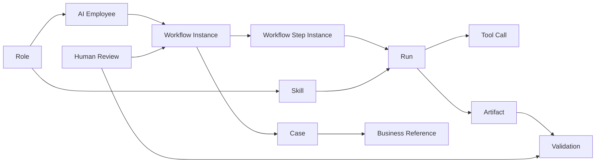

# AI 岗位与领域模型

> **版本**：V0.1
> **状态**：评审基线
> **日期**：2026-07-17

## 1. 文档职责

本文统一定义 AI 岗位、AI 员工及运行对象之间的业务关系。对象的功能要求以[产品需求](需求-01-产品需求.md)为准，实现方式由技术类文档定义。

## 2. 对象总览



核心关系：

- Role 定义岗位应具备什么能力；
- AI Employee 在具体租户和 Scope 内承担岗位责任；
- Workflow 安排业务步骤，Skill 定义 AI 完成任务的方法；
- Run 表示一次 AI 执行，Tool Call 表示一次确定性能力调用；
- Case 跨多次 Workflow 和 Run 跟进同一问题；
- Artifact 保存证据和产物，Validation 判断版本是否达到预期；
- Human Review 负责审批、改判或业务裁决。

## 3. Role

Role 是平台定义的 AI 业务岗位模板，包含：

- 岗位编码、名称和使命；
- 职责与禁止事项；
- 默认 Skill 和允许的 Tool 范围；
- 默认风险等级和人工介入要求；
- 可创建员工的业务边界；
- 版本与启停状态。

首期 Role 只由平台预置并版本化维护。租户不能创建、复制或修改 Role，也不能编辑岗位 Prompt、Schema、Tool 白名单或执行代码。

## 4. AI Employee

AI Employee 是 Role 在具体租户中的业务实例，至少具有：

- 独立 `employee_id`；
- 所属 `enterprise_id`；
- Role 及版本；
- 启用的 Skill 子集；
- `ALL/REGIONS/STORES` 之一的 Scope；
- 人工负责人；
- 服务身份状态；
- 可选的单个 Workflow 完成 Webhook。

AI Employee 不是真实用户的别名，也不长期继承创建人权限。真实用户只作为创建人、人工触发人、负责人、审批人或裁决人出现在审计中。

### 4.1 Scope

- `ALL`：租户内全部当前有效门店；
- `REGIONS`：所选区域、全部下级区域及其当前有效门店；
- `STORES`：明确选择的门店集合。

三种模式互斥。区域树和门店归属变化时重新计算有效 Scope。Scope 收缩后，范围外存量 Case 保留审计并停止自动执行；Scope 扩大不自动扩大已运行 Case 的处理范围。

### 4.2 人工负责人

人工负责人承担异常接管、审批协调和员工停用后的业务接管，但不是员工权限来源。负责人实时数据范围必须覆盖员工 Scope，否则员工暂停新调度和写动作。

### 4.3 生命周期

```text
DRAFT -> ENABLED -> DISABLED
```

- `DRAFT`：配置未完成，不可运行；
- `ENABLED`：可被定时、人工或后续事件触发；
- `DISABLED`：阻断新 Run 和写动作，历史数据只读保留。

## 5. Skill

Skill 是 AI 完成一类业务任务的方法能力。每个 Skill 必须有稳定输入输出、可用 Tool、评估方式和版本。

Skill 不负责：

- 身份和 Scope 校验；
- 数据库自由查询；
- 业务状态机；
- 审批、幂等和写入安全；
- 调度、恢复和预算控制。

这些确定性职责分别属于 Workflow、Tool Gateway 或业务系统。

首期当前 Demo 只实现 `risk_store_analysis`。规划中的责任定位、整改建议和 Case 跟进能力，应在输入输出和评估方法稳定后再拆分为独立 Skill；不能为了表现“多 Agent”提前拆分。

## 6. Workflow

Workflow 是 Agent Service 内部的确定性编排模板，用于安排：

- AI Skill Step；
- System Rule；
- Timer；
- Wait External；
- Human Review；
- 完成、失败、阻断和取消。

Workflow 不复制 UnifyTask、Question、巡店审核、申诉或复核流程。外部业务流程始终由 Java 业务系统维护，Workflow 只保存引用并查询事实。

Workflow Definition 是平台版本化模板；Workflow Instance 是一次运行实例；Workflow Step Instance 是实例中的具体步骤。一个 AI Step 可因重试产生多个 Run。

## 7. Run 与 Tool Call

Run 是一次 AI 执行边界，负责模型调用、Tool Loop、证据检查和结构化输出。Run 完成不代表 Case 或外部业务对象完成。

Tool Call 是 Run 内一次确定性能力调用，包含：

- Tool 和版本；
- 后端注入的身份与 Scope；
- 受控输入和结构化输出；
- 开始、结束、耗时和状态；
- 拒绝或失败原因；
- 业务引用和审计关联。

## 8. Case

Case 是同一业务问题的长期跟进容器，不是工单或任务。

Case 保存：

- 租户、门店、规则和 Workflow 业务键；
- 当前内部阶段和下一次跟进时间；
- 证据摘要和 Case Event；
- Workflow、Run 和业务对象引用；
- 关闭证据和复发关系。

风险门店场景按 `enterprise_id + store_id + rule_id + workflow_code` 归并到同一未关闭 Case。日风险记录分别保存，Case 关闭后再次命中创建复发 Case。

Case 状态不映射外部业务状态。外部对象完成且连续 3 个有效统计日未再命中，只是 Case 进入关闭判断的确定性条件。

## 9. Artifact

Artifact 是执行过程中的输入、输出或证据，常见类型包括：

- 风险记录快照；
- Tool 查询结果摘要；
- 图片受控引用；
- 结构化分析和整改建议；
- 人工审批和裁决结果；
- 验证数据集、逐图结果和指标报告。

Artifact 必须记录归属、版本、来源和访问权限。业务系统或对象存储中的原始文件不因成为 Artifact 而被复制到 Agent Service。

## 10. Validation

Validation 是对标准、Prompt、模型、Skill 或规则版本的可重复验证过程。它至少关联：

- 不可变数据集版本；
- 被验证配置快照；
- 模型和推理参数；
- 逐条结果；
- 指标和失败样例；
- 人工确认与发布决策。

Validation 的“通过”或“推荐”不等于自动发布。生产同步仍需满足权限、审批、冲突检查和业务系统校验。

## 11. Human Review 与 Feedback

Human Review 包括：

- 正式业务动作审批；
- Agent 图片结果裁决；
- 规则版本发布确认；
- 数据集真值确认；
- 异常人员补充和人工接管。

Feedback 是对已完成 Run、Case、业务对象或验证版本的结构化反馈。Feedback 可用于生成候选优化版本，但不能直接修改生产标准或历史结果。

## 12. 首期 AI 风险督导

AI 风险督导负责：

- 读取租户风险记录；
- 调查门店、检查项、历史整改和责任关系；
- 形成证据化风险分析和整改建议；
- 创建并持续跟进 Case；
- 经人工批准后创建或关联 Question；
- 形成日常复盘和后续计划。

AI 风险督导不得：

- 自行定义风险规则；
- 绕过 Scope、审批或 Tool Gateway；
- 修改历史巡店结果或业务状态；
- 自动处罚、罚款、扣分或停售；
- 主动发送催办或独立消息；
- 将模型文本当作业务完成事实。

后续岗位如 AI 食安监察员、AI 店长助手和 AI 运营经理，必须复用同一领域模型，不另建平行的员工、流程、Case、审计或权限体系。
