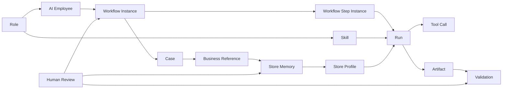

# AI 岗位与领域模型

> **版本**：V0.1
> **状态**：评审基线
> **日期**：2026-07-17

## 1. 文档职责

本文统一定义 AI 岗位、AI 员工及运行对象之间的业务关系。对象的功能要求以[产品需求](需求-01-产品需求.md)为准，实现方式由技术类文档定义。

## 2. 对象总览



核心关系：

- Role 定义岗位应具备什么能力；
- AI Employee 在具体租户和 Scope 内承担岗位责任；
- Workflow 安排业务步骤，Skill 定义 AI 完成任务的方法；
- Run 表示一次 AI 执行，Tool Call 表示一次确定性能力调用；
- Case 跨多次 Workflow 和 Run 跟进同一问题；
- Store Memory 按门店沉淀问题、反馈、复审和解决结果，保留事实来源与版本；
- Store Profile 将分层记忆和当前事实汇总为门店画像读模型；
- Artifact 保存证据和产物，Validation 使用冻结图片数据集比较 AI 检查项版本；
- Human Review 负责审批、改判或业务裁决。

## 3. Role

Role 是平台定义的 AI 业务岗位模板，包含：

- 岗位编码、名称和使命；
- 职责与禁止事项；
- 默认 Skill 和允许的 Tool 范围；
- 默认风险等级和人工介入要求；
- 可创建员工的业务边界；
- 版本与启停状态。

首期 Role 只由平台预置并版本化维护。租户不能创建、复制或修改 Role，也不能编辑岗位 Prompt、Schema、Tool 白名单或执行代码。

## 4. AI Employee

AI Employee 是 Role 在具体租户中的业务实例，至少具有：

- 独立 `employee_id`；
- 所属 `enterprise_id`；
- Role 及版本；
- 启用的 Skill 子集；
- `ALL/REGIONS/STORES` 之一的 Scope；
- 人工负责人及创建时的权限复制记录；
- 服务身份状态；
- 可选的单个 Workflow 完成 Webhook。

`AI_STORE_MANAGER` 还必须配置唯一 `primary_store_id`。该字段确定可查看明细的主门店；其区域 Scope 只提供排行聚合候选集，不自动授予其他门店明细权限。

AI Employee 不是真实用户的别名，也不长期继承创建人权限。真实用户只作为创建人、人工触发人、负责人、审批人或裁决人出现在审计中。

### 4.1 Scope

- `ALL`：租户内全部当前有效门店；
- `REGIONS`：所选区域、全部下级区域及其当前有效门店；
- `STORES`：明确选择的门店集合。

三种模式互斥。创建员工时只能从所选人工负责人当时拥有的数据范围中选择子集，例如某个区域或若干门店；只有负责人当时拥有全租户范围时才能选择 `ALL`。保存后形成员工独立 Scope，不随负责人后续状态或权限变化。区域树和门店归属变化时仍按已保存的 `ALL/REGIONS/STORES` 配置重新计算有效门店。租户管理员显式收缩 Scope 后，范围外存量 Case 保留审计并停止自动执行；扩大 Scope 不自动扩大已运行 Case 的处理范围。

### 4.2 人工负责人

人工负责人承担业务联系、异常接管，并确认 AI Employee 发起的正式业务写动作，同时作为创建员工时可复制权限的上限。Scope 保存后归 AI Employee 独立所有；负责人调岗、离职或权限变化不自动改变员工 Scope，也不自动停用员工。负责人失效或不具备动作审批权限时，只阻断相关写动作。更换负责人或调整员工 Scope 必须由租户管理员显式操作并记录审计。

### 4.3 生命周期

```text
DRAFT -> ENABLED -> DISABLED
```

- `DRAFT`：配置未完成，不可运行；
- `ENABLED`：首期可被定时或人工触发；
- `DISABLED`：阻断新 Run 和写动作，历史数据只读保留。

## 5. Skill

Skill 是 AI 完成一类业务任务的方法能力。每个 Skill 必须有稳定输入输出、可用 Tool、评估方式和版本。

Skill 不负责：

- 身份和 Scope 校验；
- 数据库自由查询；
- 业务状态机；
- 审批、幂等和写入安全；
- 调度、恢复和预算控制。

这些确定性职责分别属于 Workflow、Tool Gateway 或业务系统。

当前 POC 代码只实现 `risk_store_analysis`；规划首期发布 `risk_store_analysis` 和 `store_manager_review` 两个 Skill。责任定位、整改建议和 Case 跟进先保留为风险 Workflow 内的受控步骤，只有输入输出和评估方法稳定后才拆分，不能为了表现“多 Agent”提前拆分。

## 6. Workflow

Workflow 是 Agent Service 内部的确定性编排模板，用于安排：

- AI Skill Step；
- System Rule；
- Timer；
- Wait External；
- Human Review；
- 完成、失败、阻断和取消。

Workflow 不复制 UnifyTask、Question、巡店审核、申诉或复核流程。外部业务流程始终由 Java 业务系统维护，Workflow 只保存引用并查询事实。

Workflow Definition 是平台版本化模板；Workflow Instance 是一次运行实例；Workflow Step Instance 是实例中的具体步骤。一个 AI Step 可因重试产生多个 Run。

## 7. Run 与 Tool Call

Run 是一次 AI 执行边界，负责模型调用、Tool Loop、证据检查和结构化输出。Run 完成不代表 Case 或外部业务对象完成。

Tool Call 是 Run 内一次确定性能力调用，包含：

- Tool 和版本；
- 后端注入的身份与 Scope；
- 受控输入和结构化输出；
- 开始、结束、耗时和状态；
- 拒绝或失败原因；
- 业务引用和审计关联。

## 8. Case

Case 是同一业务问题的长期跟进容器，不是工单或任务。

Case 保存：

- 租户、门店、规则和 Workflow 业务键；
- 当前内部阶段和下一次跟进时间；
- 证据摘要和 Case Event；
- Workflow、Run 和业务对象引用；
- 关闭证据和复发关系。

风险门店场景按 `enterprise_id + store_id + rule_id + workflow_code` 归并到同一未关闭 Case。日风险记录分别保存，Case 关闭后再次命中创建复发 Case。

Case 状态不映射外部业务状态。外部对象完成且连续 3 个有效统计日未再命中，只是 Case 进入关闭判断的确定性条件。

## 9. Store Memory

Store Memory 是 Agent Service 根据业务事实和人工裁决沉淀的门店长期记忆层，不是模型的隐式上下文，也不是新的业务状态机。它按租户、门店、`domain_code` 和 `layer_code` 组织，由不可变事件和可查询的当前投影组成。面向岗位和页面的最终读模型称为 Store Profile（门店画像），由记忆投影与当前业务事实确定性汇总生成。

记忆事件至少包括：

- `ISSUE_RAISED`：风险、巡店或异常事实首次形成；
- `STORE_RESPONSE`：门店对问题的返回、说明或整改反馈；
- `REVIEW_CONFIRMED`：人工最终复审确认问题成立；
- `REVIEW_FALSE_POSITIVE`：人工最终复审确认原判断为误报；
- `RESOLVED`：业务对象完成或 Case 满足确定性关闭条件。

每个事件都保存来源对象、门店、规则/检查项、统计日期或发生时间、证据引用、记录人/复审人、原因、`memory_version` 和访问范围。事件只能追加；更正或改判通过新事件生成新投影。`REVIEW_FALSE_POSITIVE` 不删除原 AI 结果，而是让当前投影明确显示误报并保留原判断和复审证据。

首期只启用 `PATROL` 巡店事件层和受控 `TAG` 标签层；`PERFORMANCE`、`TRAFFIC` 等后续领域使用独立命名空间。每个 Run 固化 `profile_snapshot_id`，其中包含记忆和画像版本。AI 风险督导按员工 Scope 读取门店记忆，AI 店长只读取主门店画像；其他门店的记忆不进入模型、页面、Webhook 或普通日志。画像可用于复盘、趋势和建议，但 Java 的风险、Question、审批和整改状态仍是业务事实源。

## 10. Artifact

Artifact 是执行过程中的输入、输出或证据，常见类型包括：

- 风险记录快照；
- Tool 查询结果摘要；
- 图片受控引用；
- 结构化分析和整改建议；
- 人工审批和裁决结果；
- 验证数据集、逐图结果和指标报告。

Artifact 必须记录归属、版本、来源和访问权限。业务系统或对象存储中的原始文件不因成为 Artifact 而被复制到 Agent Service。

## 11. Validation

Validation 是面向当前业务系统 AI 巡店检查项的可重复效果评测实验，不是所有 Agent Skill 的通用测试或发布流程。它至少关联：

- 不可变数据集版本；
- 当前配置或候选 Prompt、标准图、模型、规则配置快照；
- 模型和推理参数；
- 逐条结果；
- 指标和失败样例；
- 人工确认与发布决策。

Validation 的“通过”或“推荐”不等于自动发布。生产同步仍需满足权限、审批、冲突检查和业务系统校验。

## 12. Human Review 与 Feedback

Human Review 包括：

- 正式业务动作审批；
- Agent 图片结果裁决；
- 规则版本发布确认；
- 数据集真值确认；
- 异常人员补充和人工接管。

Feedback 是对已完成 Run、Case、业务对象或验证版本的结构化反馈。人工复审等 Feedback 是 Store Memory Event 的来源之一，记忆只保存来源引用和确定性投影，不复制一套裁决状态。Feedback 可用于生成候选优化版本，但不能直接修改生产标准或历史结果。

## 13. 首期 AI 风险督导

AI 风险督导负责：

- 读取租户风险记录；
- 调查门店、检查项、历史整改和责任关系；
- 形成证据化风险分析和整改建议；
- 创建并持续跟进 Case；
- 经人工批准后创建或关联 Question；
- 形成日常复盘和后续计划。

AI 风险督导不得：

- 自行定义风险规则；
- 绕过 Scope、审批或 Tool Gateway；
- 修改历史巡店结果或业务状态；
- 自动处罚、罚款、扣分或停售；
- 主动发送催办或独立消息；
- 将模型文本当作业务完成事实。

后续岗位如 AI 食安监察员和 AI 运营经理，必须复用同一领域模型，不另建平行的员工、流程、Case、审计或权限体系。

## 14. 首期 AI 店长

`AI_STORE_MANAGER` 是首期只读复盘岗位，使用独立 `employee_id`、唯一 `primary_store_id`、独立 Scope 和 `store_manager_review` Skill。创建时主门店必须属于可选 Scope；为计算排行，创建时所选 Scope 还必须覆盖主门店所属区域及其上上级区域，且该范围必须是人工负责人当时权限的子集。每次 Run 固化实际排行样本范围，但明细权限始终只允许主门店。

AI 店长的业务能力包括：

- 查看主门店的当前风险、巡店、Question、整改和可用巡店指标；Scope 内其他门店只参与后端聚合，不返回明细；
- 比较历史趋势并解释已存在的异常事实；
- 按系统统一周报调度生成草稿，页面查看和下载；
- 计算当前门店在规定区域范围内的描述性排行。

排行先统计门店直接所属区域的当前有效门店数。达到 10 家及以上时使用直接所属区域；少于 10 家时使用上上级区域；上上级区域无论多少家都接受，不再继续向更上层扩展。如果没有可用上上级区域，返回无法形成排行。

排行 Tool 只返回当前门店自己的排名、样本量、百分位、指标、时间范围和数据来源。其他门店的名称、ID、排名、指标值和明细不进入模型上下文、页面、Webhook 或普通日志。

AI 店长不得创建 Case、Question、任务、消息或处罚动作。发现需要整改的风险时，只生成带证据引用的转交 Artifact；AI 风险督导仍由既有定时或人工入口启动。

## 15. 后续 AI 运营经理

AI 运营经理暂不发布 Skill 或 Workflow，只保留 Role Contract 方向：面向区域经营分析、跨店趋势复盘和经营建议，未来使用区域 Scope、聚合查询和草稿能力，不直接修改业务状态、不跨租户访问、不自动发送消息。其具体 Skill、Workflow 和 Case 业务键在首期验证后另行确认。
