# 好多店 AI Native 业务执行系统总体架构设计

> **版本**：V0.1  
> **状态**：总体架构初稿  
> **日期**：2026-07-16  
> **适用对象**：产品、架构、研发、测试、数据、运维、安全、交付  
> **上游文档**：《好多店 AI Native 业务执行系统需求文档 V0.1》  
> **下游文档**：《好多店 AI Native 业务执行系统详细设计文档 V0.1》  
> **第一阶段核心场景**：AI 巡店督导——风险门店调查与整改跟进

---

## 0. 文档摘要

好多店 AI Native 业务执行系统不是聊天机器人、BI 问答页面或单一风险分析 Skill，而是一套让 AI 以业务员工身份进入组织、流程和业务闭环的执行系统。

系统采用以下统一概念：

> **岗位定义“这个角色能做什么、应该怎么做、不能做什么”。**  
> **员工定义“谁在什么范围内承担这个岗位”。**  
> **流程定义“什么时候让谁完成哪一步”。**  
> **Skill 定义“这一类任务如何完成”。**  
> **Harness 保证执行过程受控、可恢复、可审批和可审计。**

总体架构由七层组成：

1. 业务角色层；
2. 流程编排层；
3. Skill 层；
4. Harness 运行层；
5. 工具层；
6. 数据与业务系统层；
7. 治理与可观测层。

Hologres 是 Agent 的业务感知层；好多店业务系统仍然是任务、工单、消息和业务状态的权威源；MySQL 保存 Role、Employee、Workflow、Case、Run、Approval 和审计索引；Agent Runtime 负责模型运行与 Skill 执行；Tool Gateway 是权限和工具执行的安全边界；Workflow 与 Case Engine 负责长流程、暂停、恢复和持续跟进。

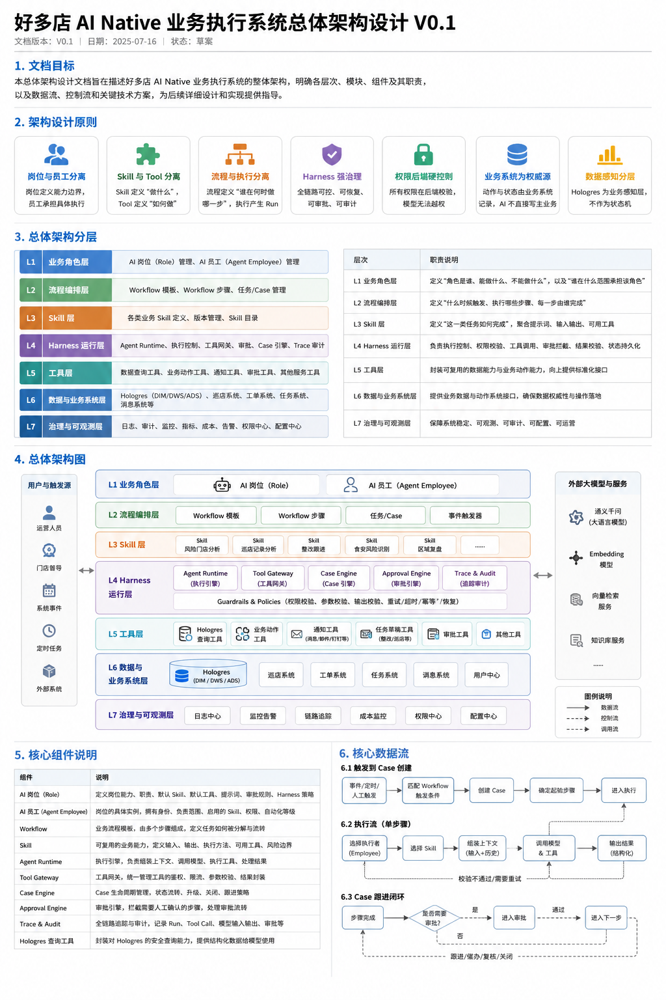

> 配图用于帮助快速理解总体分层，正式模块、字段和接口以本文文字与 Mermaid 图为准。

---

## 1. 架构目标与范围

### 1.1 架构目标

总体架构需要满足以下目标：

| 目标 | 架构含义 |
|---|---|
| 业务岗位化 | 不以聊天入口或单个 Skill 为最高层，而以 AI 岗位和 AI 员工承载责任 |
| 事件驱动 | 支持定时、业务事件、数仓刷新事件和人工任务唤醒 |
| 数据可感知 | 通过受控工具读取 Hologres DIM、DWS、ADS 数据产品 |
| 动作可执行 | 通过业务 API 创建草稿、任务、工单、消息、复检和升级动作 |
| 流程可持续 | 业务问题以 Case 持久化，可跨多次 Run 持续推进 |
| 风险可治理 | 权限、审批、幂等、超时、重试和降级由 Harness 强制执行 |
| 结果可审计 | Role、Employee、Skill、Prompt、Tool、Run、Approval、Case 全链路留痕 |
| 能力可复用 | 新增岗位和场景时复用 Tool Gateway、Case、Approval、Trace 等底座 |
| 技术可替换 | 模型 Provider 和 Agent Runtime 可适配，不把业务语义绑定到单一模型 |

### 1.2 架构范围

本文覆盖：

- AI 岗位与 AI 员工；
- Skill 与工具；
- Workflow、Step、Case、Run；
- Agent Runtime 与 Harness；
- 事件触发、调度、审批和持续跟进；
- Hologres 数据感知；
- 好多店业务系统写入边界；
- 权限、安全、审计、可观测；
- 部署和演进路线。

本文暂不展开：

- 每张表完整字段；
- 每个 API 完整请求响应；
- Skill Prompt 全文；
- 具体业务系统真实接口映射；
- 前端页面详细交互；
- 模型参数和容量压测结论。

这些内容进入详细系统设计。

---

## 2. 架构设计原则

### 2.1 岗位与员工分离

Role 是岗位模板，定义职责、默认 Skill、工具、提示词、审批和 Harness Policy。

Agent Employee 是具体执行者，绑定：

- 租户；
- 区域和门店范围；
- 启用 Skill；
- 工具权限；
- 自动化等级；
- 人工负责人；
- 工作时间与事件订阅。

一个 Role 可以创建多个 Agent Employee。

### 2.2 Skill 与 Tool 分离

Skill 定义“怎样完成一类业务任务”，Tool 定义“怎样执行一个确定性查询或动作”。

例如：

```text
风险门店分析 Skill
    ├─ get_high_risk_stores
    ├─ get_store_risk_context
    ├─ get_open_remediations
    └─ get_store_responsible_people
```

Skill 可以包含模型推理、证据要求和结构化输出；Tool 必须有严格输入、权限、幂等和审计。

### 2.3 流程与执行分离

Workflow 定义稳定的业务步骤、条件、审批和流转。

AI 员工在步骤内调用 Skill 完成不确定性任务。确定性状态转换、等待、定时器、审批和补偿由 Workflow 与 Case Engine 控制，不交给模型自由决定。

### 2.4 Case 与 Run 分离

Case 是需要持续推进的业务问题。

Run 是某个 AI 员工在某个步骤中的一次执行。

```text
一个 Case
    ├─ Run 1：发现与调查
    ├─ Run 2：生成整改建议
    ├─ Run 3：到期复查
    ├─ Run 4：催办与升级
    └─ Run 5：验证并关闭
```

不得用长期聊天 Session 代替 Case。

### 2.5 Prompt 与 Harness 分离

Prompt 可以指导模型，但不能成为安全边界。

必须由 Harness 强制执行：

- 租户和 Scope；
- 工具白名单；
- 参数边界；
- 结果 Schema；
- 最大轮次；
- 超时和重试；
- 审批；
- 幂等；
- 状态持久化；
- 审计。

### 2.6 数据感知与业务写入分离

Hologres 主要负责分析和感知。

好多店业务系统负责：

- 任务；
- 工单；
- 消息；
- 复检；
- 审批；
- 状态更新；
- 业务最终事实。

Agent 不直接写 Hologres 代替业务动作，也不直接修改业务数据库。

### 2.7 后端权限强控制

模型不能决定：

- `enterprise_id`；
- `user_id`；
- `agent_employee_id`；
- 数据 Scope；
- 是否有权调用某个工具；
- 是否可以绕过审批。

这些上下文由后端从身份、员工配置、流程步骤和 Case 中装配。

### 2.8 先业务闭环，后平台泛化

第一阶段优先完成 AI 巡店督导闭环，不先建设：

- 通用低代码 Agent 平台；
- 客户任意画布；
- 任意 Prompt 市场；
- 任意 SQL；
- 大规模多 Agent 自治协商。

---

## 3. 总体架构分层

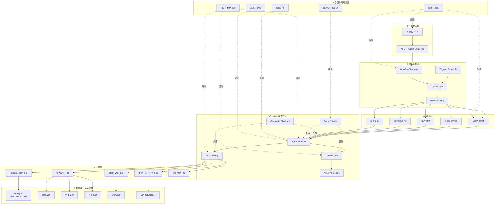

### 3.1 L1：业务角色层

负责“谁在组织中承担什么岗位”。

核心对象：

- Role；
- Role Version；
- Agent Employee；
- Employee Assignment；
- Employee Skill Binding；
- Employee Tool Policy；
- Employee Automation Level。

### 3.2 L2：流程编排层

负责“什么时候让谁完成哪一步”。

核心对象：

- Workflow Template；
- Workflow Version；
- Workflow Step；
- Transition Rule；
- Trigger Subscription；
- Workflow Instance；
- Case；
- Timer / Follow-up Schedule。

### 3.3 L3：Skill 层

负责“一类任务如何完成”。

核心对象：

- Skill；
- Skill Version；
- Input Schema；
- Output Schema；
- Prompt Template；
- Required Evidence；
- Allowed Tools；
- Evaluation Rule。

### 3.4 L4：Harness 运行层

负责“怎样安全、可靠、可恢复地运行”。

核心组件：

- Agent Runtime；
- Context Assembler；
- Tool Gateway；
- Case Engine；
- Workflow Executor；
- Approval Engine；
- Guardrails；
- Output Validator；
- Retry / Timeout / Budget；
- Trace & Audit。

### 3.5 L5：工具层

负责封装确定性的能力：

- Hologres 数据查询；
- 业务动作；
- 消息通知；
- 人工审批；
- 知识检索；
- 文件和证据管理；
- 外部服务。

### 3.6 L6：数据与业务系统层

负责提供事实与动作：

- Hologres：分析与感知；
- 巡店、任务、工单、消息等业务系统：动作与状态权威源；
- 用户权限中心：人员、角色、组织、授权；
- 对象存储：图片、视频、整改证据和报告。

### 3.7 L7：治理与可观测层

负责平台运营：

- 日志；
- Trace；
- 指标；
- 告警；
- 成本；
- 配额；
- 配置；
- 版本；
- Evals；
- 业务效果。

---

## 4. 核心领域对象关系

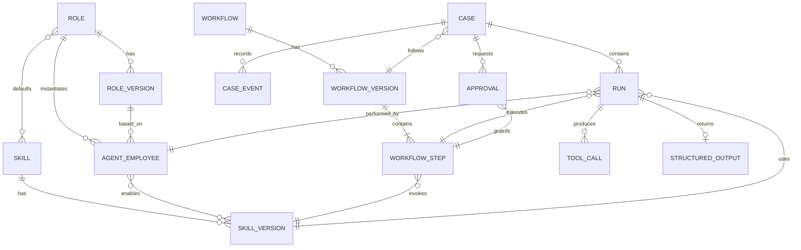

### 4.1 版本原则

以下配置必须版本化：

- Role；
- Skill；
- Workflow；
- Prompt；
- Tool Schema；
- Approval Policy；
- Harness Policy。

Run 必须记录实际使用的版本，避免配置修改后无法解释历史结果。

### 4.2 生效能力计算

某一步中 AI 员工最终可用的 Skill 和工具不是简单继承，而是取交集：

```text
岗位版本允许
∩ 员工启用
∩ 流程步骤允许
∩ Skill 版本允许
∩ 当前权限 Scope
∩ 风险与审批策略
∩ 系统级安全策略
```

---

## 5. Role 与 Agent Employee 架构


### 5.1 Role Service

职责：

- 创建和维护岗位模板；
- 版本管理；
- 默认 Skill、工具、Prompt 和 Harness Policy；
- 发布、暂停和停用；
- 岗位兼容性校验。

Role Service 不负责执行模型。

### 5.2 Employee Service

职责：

- 基于 Role 创建 AI 员工；
- 绑定租户和负责范围；
- 启用或收窄 Skill；
- 配置工具权限和自动化等级；
- 指定人工负责人；
- 配置事件订阅和运行日历；
- 暂停、恢复和停用；
- 计算运行时 Employee Context。

### 5.3 AI 员工身份

建议每个 AI 员工具有独立身份：

```text
agent_employee_id
enterprise_id
role_id / role_version_id
employee_name
human_owner_id
scope_type
authorized_region_ids
authorized_store_ids
automation_level
status
```

它不是传统系统用户的简单复制，但可以通过“服务身份 + 受托责任范围”调用业务工具。

### 5.4 人工用户与 AI 员工关系

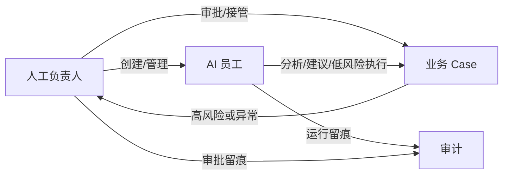

---

## 6. Workflow、Step、Case 与 Run 架构

### 6.1 四个对象的边界

| 对象 | 主要职责 |
|---|---|
| Workflow Template | 定义标准流程 |
| Workflow Instance | 表示某次流程执行实例 |
| Case | 表示持续推进的业务问题和业务状态 |
| Run | 表示某个步骤的一次 AI 执行 |

首期实现可以让 Workflow Instance 与 Case 一对一或合并存储，但领域语义必须保留。

### 6.2 流程步骤结构

每个步骤应包含：

```text
step_code
step_name
executor_selector
skill_version_id
allowed_tools
input_mapping
output_schema
entry_condition
success_condition
approval_policy
timeout_policy
retry_policy
transition_rules
```

### 6.3 任务创建流程

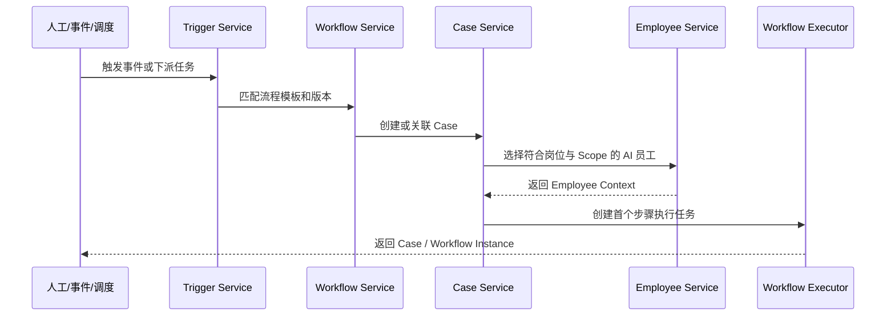

### 6.4 Case 生命周期

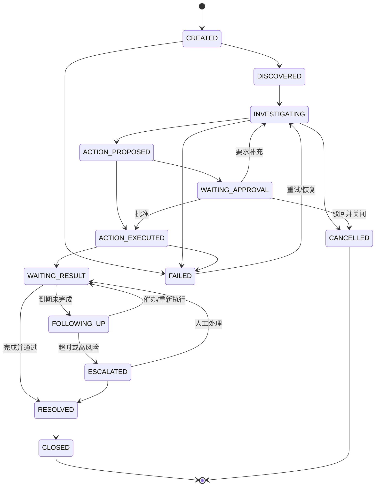

### 6.5 Run 状态

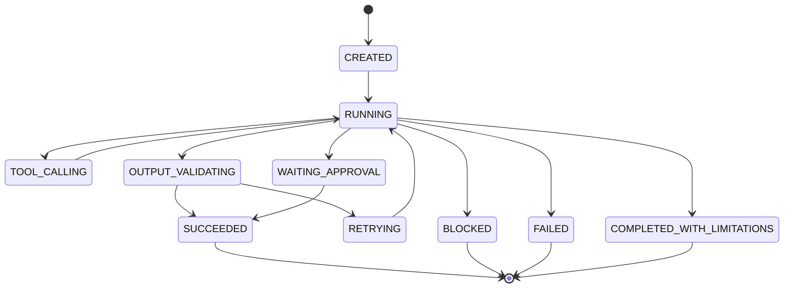

---

## 7. Skill 架构

### 7.1 Skill 定义

Skill 是可版本化的业务能力包，建议包含：

```text
skill_code
skill_version
name
description
applicable_roles
input_schema
output_schema
system_instructions
context_policy
allowed_tools
required_evidence
execution_policy
failure_policy
evaluation_policy
```

### 7.2 Skill 执行包

执行时，Context Assembler 组装：

```text
岗位 Prompt
+ AI 员工身份和负责范围
+ 当前 Workflow / Step 指令
+ Skill 指令和版本
+ Case 当前状态与历史摘要
+ 上一步结构化输出
+ 当前事件
+ 可用工具 Schema
+ 数据新鲜度和权限上下文
+ Harness 限制
```

### 7.3 Skill 与 Workflow 的关系

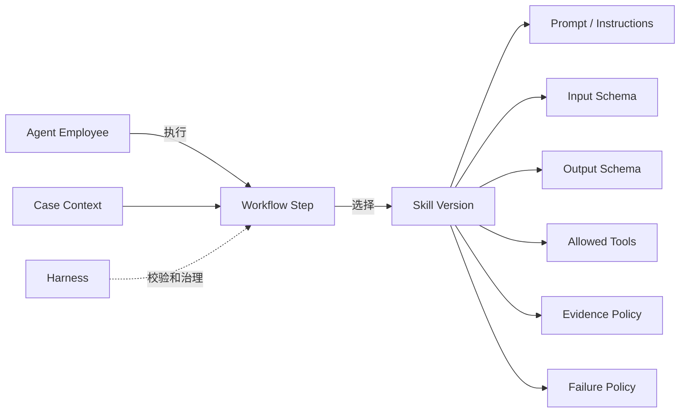

### 7.4 第一阶段 Skill

| Skill | 主要输入 | 主要输出 |
|---|---|---|
| 风险门店分析 | Scope、日期、候选条件 | 风险门店候选 |
| 巡店记录分析 | 门店、巡店记录、检查项、工单 | 风险原因和证据 |
| 整改跟进 | 风险结论、责任人、历史整改 | 任务草稿、期限、跟进规则 |
| Case 跟进 | Case、业务动作状态、当前时间 | 关闭、催办、升级或转人工 |
| 区域复盘 | 区域风险、Case 结果、趋势 | 区域总结与建议 |

现有 `risk_store_analysis` POC 可演进为“风险门店分析 + 部分巡店记录分析”的早期实现。

---

## 8. Harness 总体架构

### 8.1 Harness 组件

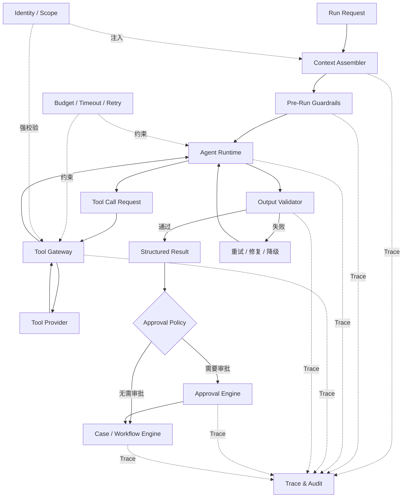

### 8.2 Agent Runtime

职责：

- 加载 Skill；
- 调用模型；
- 执行 Agent Loop；
- 解析 Tool Call；
- 接收工具结果；
- 生成结构化输出；
- 记录模型和响应信息；
- 遵守 Harness 限制。

建议通过统一接口隔离具体实现：

```text
AgentRuntimeAdapter
    ├─ OpenAIAgentsSdkRuntime
    ├─ ResponsesCompatibleRuntime
    └─ FutureRuntimeAdapter
```

总体规划推荐以 OpenAI Agents SDK 作为目标运行时，但业务能力不能绑定到 SDK 内部对象。当前自研 ResponsesRuntime 可作为过渡适配器或迁移参考。

### 8.3 Context Assembler

职责：

- 加载 Role 和版本；
- 加载 Employee 和 Scope；
- 加载 Skill 和版本；
- 加载 Workflow Step；
- 加载 Case 摘要；
- 选择必要历史；
- 装配工具 Schema；
- 计算 Token 预算；
- 注入数据新鲜度和安全提示。

### 8.4 Tool Gateway

Tool Gateway 是执行边界，必须统一处理：

- Run、Case、Employee 是否有效；
- Tool 是否同时被 Role、Employee、Step、Skill 允许；
- 租户和 Scope；
- 保留参数；
- 参数 Schema；
- 日期和行数限制；
- 数据新鲜度；
- 动作风险；
- 审批要求；
- 幂等键；
- 审计；
- 结果裁剪。

### 8.5 Output Validator

所有关键 Skill 结果必须满足结构化 Schema。

校验失败可以按策略：

1. 让模型修复；
2. 使用降级模型；
3. 返回限制性结果；
4. 转人工；
5. 标记 Run 失败。

### 8.6 Approval Engine

职责：

- 计算是否需要审批；
- 找到审批人；
- 保存审批上下文；
- 暂停 Workflow；
- 处理批准、修改、驳回、补查和转交；
- 审批超时升级；
- 恢复下一步骤。

### 8.7 Case Engine

职责：

- 创建、恢复、合并和关闭 Case；
- 持久化当前状态；
- 调度未来检查；
- 处理重复事件；
- 维护业务键和关联对象；
- 调用 Workflow Executor；
- 服务重启后恢复等待中的 Case。

---

## 9. 数据架构

### 9.1 Hologres 的架构位置

现有 Hologres 已经形成 ODS、DIM、DWD、DWS、ADS 分层，Agent 应遵守既有数据边界：

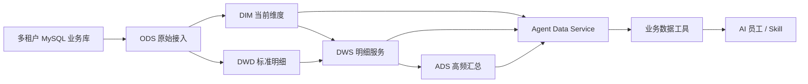

### 9.2 查询原则

- 总览、风险候选和排行优先 ADS；
- 证据和下钻优先 DWS；
- 门店、区域、岗位、检查表和检查项使用 DIM；
- 不允许模型直接扫描 ODS；
- 不允许模型生成自由 SQL；
- SQL 必须绑定 `enterprise_id`；
- 查询结果必须包含数据新鲜度元信息。

### 9.3 面向 Agent 的逻辑数据产品

后续建议增加 View、ADS 或服务接口：

| 数据产品 | 用途 |
|---|---|
| `agent_store_responsibility_current` | 门店店长、督导、区域负责人等责任关系 |
| `agent_store_risk_profile` | 门店综合风险画像 |
| `agent_trigger_candidate` | 规则计算后的 Agent 触发候选 |
| `agent_employee_workload` | AI 或人工责任人当前工作量 |
| `agent_data_freshness` | 数仓层级刷新状态和截止时间 |
| `agent_case_effect_snapshot` | Agent Case 业务效果分析 |

这些名称是架构建议，不代表当前已经存在。

### 9.4 数据工具契约

统一返回结构建议：

```json
{
  "data": {},
  "metadata": {
    "enterprise_id": "E001",
    "scope_type": "partial",
    "data_as_of": "2026-07-16T05:00:00+08:00",
    "warehouse_layer": "ADS",
    "refresh_status": "success",
    "is_partial": false,
    "is_truncated": false,
    "query_trace_id": "..."
  }
}
```

### 9.5 数据一致性边界

Hologres 数据可能存在刷新延迟。

因此：

- 日报、趋势、风险候选可以基于 Hologres；
- 执行真实业务动作前，可按风险策略回查业务系统当前状态；
- 高风险动作必须确认数据新鲜度；
- 空结果不能自动解释为“没有风险”；
- 数仓补数、失败或部分刷新时应阻断自动动作或降级为人工建议。

---

## 10. 工具架构

### 10.1 工具分类

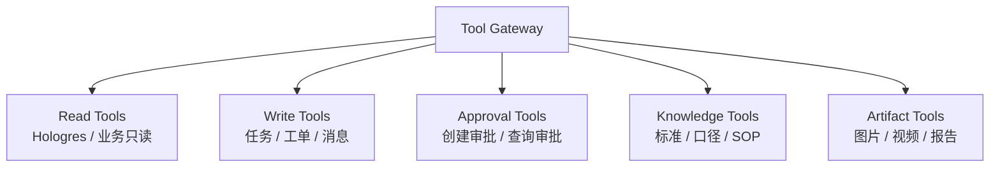

### 10.2 读工具

第一阶段建议：

- `get_authorized_store_scope`
- `get_store_responsible_people`
- `get_high_risk_stores`
- `get_store_risk_context`
- `get_store_recent_patrols`
- `get_store_repeated_failures`
- `get_open_remediations`
- `get_overdue_remediations`
- `get_common_failed_items`
- `get_supervisor_risk_summary`

### 10.3 写工具

分阶段接入：

- `create_remediation_draft`
- `create_remediation_order`
- `send_reminder`
- `send_business_message`
- `create_recheck_task`
- `escalate_case`
- `get_business_action_status`

### 10.4 工具通用约束

每个工具必须声明：

- 工具代码和版本；
- 风险级别；
- 输入、输出 Schema；
- 是否只读；
- 是否需要审批；
- Scope 规则；
- 日期和行数上限；
- 幂等要求；
- 超时和重试；
- 脱敏规则；
- 审计摘要；
- 补偿或人工恢复方案。

---

## 11. 事件与调度架构

### 11.1 触发来源

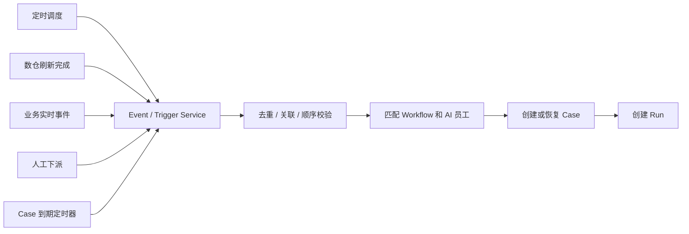

### 11.2 事件信封

建议统一事件格式：

```json
{
  "event_id": "...",
  "event_type": "patrol.submitted",
  "occurred_at": "...",
  "enterprise_id": "...",
  "source": "patrol-system",
  "aggregate_type": "store",
  "aggregate_id": "S001",
  "actor": {},
  "correlation_id": "...",
  "causation_id": "...",
  "payload_ref": "...",
  "schema_version": "1.0"
}
```

### 11.3 事件处理原则

- `event_id` 去重；
- `business_key` 关联已有 Case；
- 处理乱序事件；
- 避免重复创建任务或工单；
- 事件上下文必须携带或恢复租户和业务对象；
- 后台事件没有 HTTP 用户上下文，不能依赖线程变量推断身份；
- 高风险实时事件可直连业务系统，普通趋势类事件可基于 Hologres。

---

## 12. 权限与安全架构

### 12.1 权限模型

最终权限由以下因素共同决定：

```text
平台系统权限
∩ 租户权限
∩ Role 默认权限
∩ Agent Employee 负责范围
∩ Workflow Step 权限
∩ Skill 工具白名单
∩ 当前操作者授权
∩ 动作风险与审批策略
```

### 12.2 权限校验链

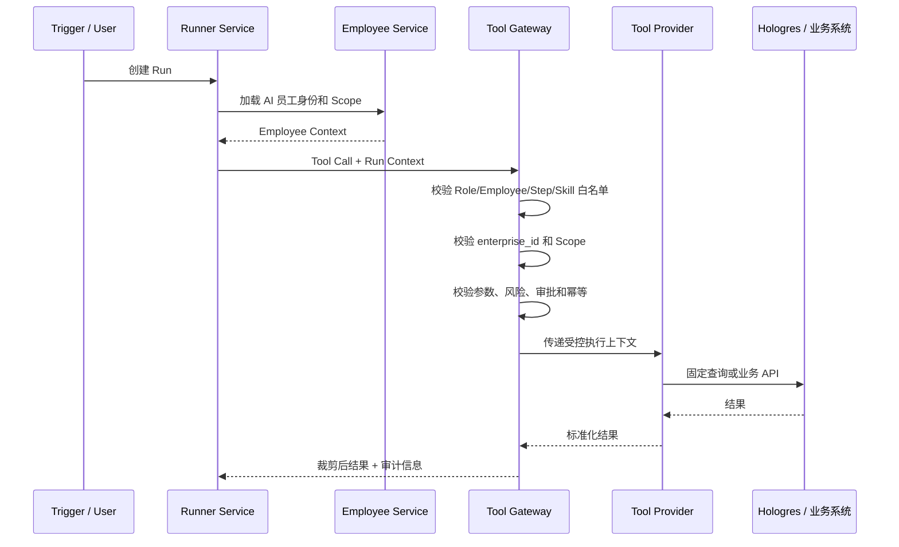

### 12.3 AI 员工的服务身份

事件触发的 AI 员工建议采用：

```text
agent service identity
+ enterprise_id
+ agent_employee_id
+ role_version
+ delegated scope
+ human_owner
```

不应随意模拟某个普通用户，也不能在无授权情况下继承人工负责人全部权限。

### 12.4 敏感信息与审计

- 原始 Token 不传给模型；
- 工具输出按最小必要原则裁剪；
- Tool Call 审计保存摘要，敏感字段脱敏；
- 高风险动作保存完整审批依据；
- 跨租户、越权和被拦截操作全部记录；
- Prompt 和模型输出不是最终权限依据。

---

## 13. 人工审批与人机协同

### 13.1 审批矩阵

示例：

| 动作 | 默认策略 |
|---|---|
| 查询业务数据 | 自动，受 Scope 限制 |
| 生成风险报告 | 自动 |
| 生成整改草稿 | 自动 |
| 发送普通提醒 | L1 人审，L2 可自动 |
| 创建普通整改任务 | 人审后执行，后续按规则灰度 |
| 催办已存在任务 | 可按规则自动 |
| 升级区域经理 | 人审或明确规则 |
| 处罚、罚款、扣分 | 强制人审 |
| 停售、停业 | 强制人审 |
| 修改标准 | 强制人审 |

### 13.2 审批对象

审批项应包含：

- Case；
- 风险证据；
- AI 建议；
- 影响范围；
- 拟调用工具及参数；
- 预计结果；
- 数据截止时间；
- 可选操作；
- 审批超时和默认处理。

### 13.3 暂停与恢复

审批期间 Workflow 必须持久化暂停。

批准后恢复原步骤或进入下一步；要求补充时重新创建调查 Run；驳回时按审批策略关闭或转人工。

---

## 14. 模型与 Runtime 架构

### 14.1 多模型适配

业务层只依赖统一模型能力接口：

```text
ModelProviderAdapter
    ├─ Responses API Adapter
    ├─ OpenAI-compatible Chat Completions Adapter
    └─ Future Provider Adapter
```

需要隔离：

- 工具调用格式；
- Structured Output；
- Usage；
- Trace；
- 错误码；
- 重试；
- 模型能力差异。

### 14.2 Runtime 选择

目标架构推荐：

- OpenAI Agents SDK：负责 Agent Loop、工具调用、Session/Tracing 等运行能力；
- 自有 Harness：负责 Role、Employee、Workflow、Case、权限、审批、业务审计；
- 自有 Tool Gateway：负责工具安全；
- Model Provider Adapter：支持 DeepSeek 等模型。

原则：

> Agents SDK 是运行时，不是好多店业务平台；不能把权限、Case、审批和业务状态寄托于 SDK 自动解决。

### 14.3 当前 POC 迁移

当前自研 ResponsesRuntime 可按以下方式处理：

1. 抽象 `AgentRuntimeAdapter`；
2. 将当前 Runtime 纳入适配器；
3. 保留现有 Tool Gateway、固定 SQL、审计和 Trace 思路；
4. 增加 OpenAI Agents SDK Runtime；
5. 对相同 Skill 做行为和成本评测；
6. 逐步迁移，不要求一次推翻 Demo。

---

## 15. 可观测、审计与评价架构

### 15.1 Trace 模型

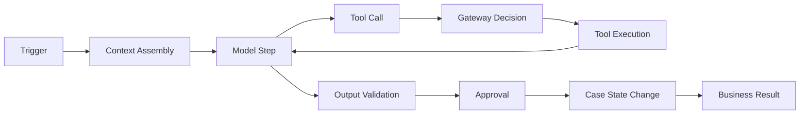

Trace 不是模型隐藏思维链，而是可观察的系统事件。

### 15.2 审计对象

必须审计：

- Role 和版本；
- Employee 和负责范围；
- Workflow 和 Step；
- Skill、Prompt 和模型版本；
- Run；
- Tool Call；
- Gateway 拦截；
- Approval；
- Case Event；
- 业务动作结果；
- Final Structured Output；
- 成本和耗时。

### 15.3 指标体系

#### 系统指标

- Run 成功率；
- Tool 成功率；
- Gateway 拦截量；
- P95 时延；
- 重试率；
- Case 恢复成功率；
- 单 Run 成本。

#### AI 质量指标

- 人工采纳率；
- 人工改判率；
- 结构化输出通过率；
- 必需证据完整率；
- 无依据结论率；
- 错误责任人率。

#### 业务指标

- Case 关闭率；
- 平均关闭时长；
- 整改超时率；
- 问题复发率；
- 自动化处理率；
- 人工工作量节省。

---

## 16. 部署架构

### 16.1 逻辑部署

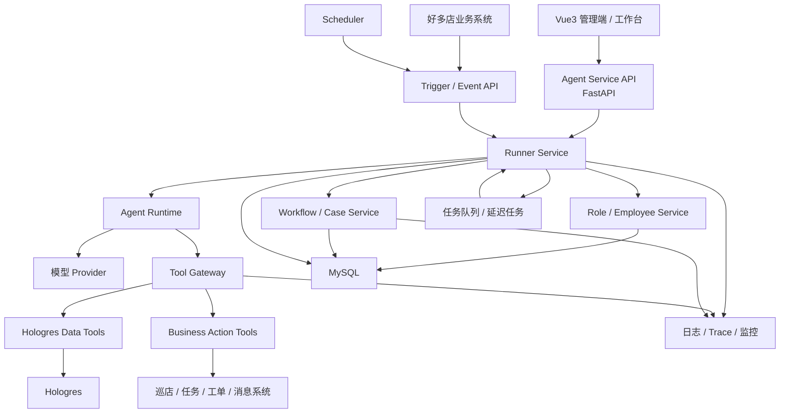

### 16.2 建议服务边界

第一阶段可采用模块化单体，避免过早微服务化：

```text
Agent Service
├─ API
├─ Role & Employee
├─ Skill Registry
├─ Workflow & Case
├─ Runtime Adapter
├─ Tool Gateway
├─ Approval
├─ Trigger & Scheduler
└─ Audit & Trace
```

Hologres 查询和业务 API Connector 可以独立模块，边界稳定后再拆服务。

### 16.3 异步执行

以下场景建议异步：

- 多轮模型调用；
- 大范围风险扫描；
- 等待审批；
- 等待业务结果；
- 延迟复查；
- 批量门店流程；
- 报告生成。

创建任务后返回 `case_id` / `run_id`，前端通过轮询、SSE 或 WebSocket 获取进度。

---

## 17. 数据存储边界

| 存储 | 保存内容 |
|---|---|
| MySQL | Role、Employee、Skill 配置、Workflow、Case、Run、Approval、Tool Call、触发记录、状态和审计索引 |
| Hologres | DIM、DWS、ADS 业务感知数据；Agent 效果汇总与分析数据 |
| 业务系统数据库 | 任务、工单、消息、巡店、整改和最终业务状态 |
| 对象存储 | 图片、视频、整改证据、生成报告和大体积 Artifact |
| 日志/Trace 平台 | 技术日志、指标、分布式 Trace 和告警 |

### 17.1 为什么 Case 不放 Hologres

Case 需要：

- 事务；
- 实时状态；
- 乐观锁；
- 定时恢复；
- 幂等；
- 审批；
- 高频小更新。

因此应放事务数据库。

Hologres 可同步 Case 结果用于分析，但不作为实时状态机。

---

## 18. 可靠性与恢复设计

### 18.1 幂等层级

| 层级 | 幂等键示例 |
|---|---|
| 事件 | `event_id` |
| Case | `enterprise_id + case_type + business_key` |
| Run | `case_id + step_id + execution_seq` |
| 工具调用 | `run_id + tool_code + action_key` |
| 业务写动作 | `case_id + action_type + target_id + version` |

### 18.2 失败处理

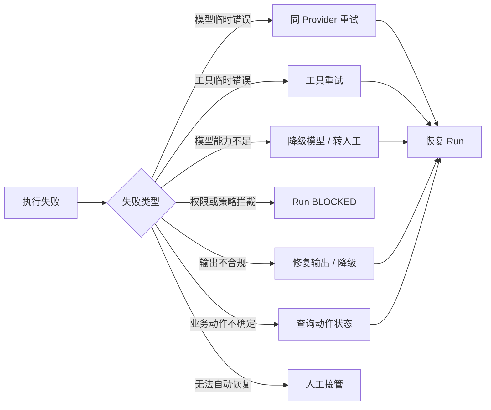

### 18.3 服务重启恢复

服务启动后扫描：

- `RUNNING` 且超过租约的 Run；
- `WAITING_APPROVAL` 的 Case；
- `WAITING_RESULT` 且到期的 Case；
- 未完成的业务动作；
- 失败但允许重试的任务。

采用租约或乐观锁避免多个 Worker 重复恢复。

---

## 19. 第一阶段实施架构

### 19.1 第一阶段最小链路

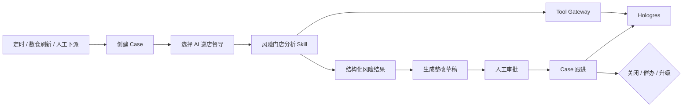

### 19.2 第一阶段复用当前 POC

保留：

- FastAPI 和 Vue3 基础；
- Hologres 只读查询；
- 固定业务工具；
- Tool Gateway；
- Token 与租户 Scope；
- Run、Tool Call、Final Answer 审计；
- 证据检查和 Trace。

新增：

- Role；
- Agent Employee；
- Workflow；
- Case；
- Trigger；
- Skill 版本；
- Structured Output；
- Approval；
- Follow-up Schedule；
- Runtime Adapter；
- 业务动作草稿和后续写工具。

### 19.3 不建议第一阶段重做

- Hologres 数仓分层；
- 已验证的固定 SQL 工具；
- 现有租户和门店权限校验；
- Trace 的证据链思路；
- 当前 Vue3 Demo 的运行回放基础。

---

## 20. 关键架构决策

### ADR-001：以 AI 岗位和 AI 员工作为产品最高层

**决策**：Skill 不作为产品最高层。  
**原因**：客户需要的是承担责任的业务岗位，而非一组零散能力。

### ADR-002：Hologres 作为感知层，不作为工作流状态库

**决策**：Hologres 提供分析数据；Case 和 Run 存 MySQL。  
**原因**：两类系统对事务、时效和更新方式要求不同。

### ADR-003：Tool Gateway 是统一工具执行边界

**决策**：所有模型工具调用都经过 Gateway。  
**原因**：Prompt 和模型不能承担权限与安全责任。

### ADR-004：Workflow 管确定性流程，Agent 管不确定性任务

**决策**：状态转换、审批、等待、超时和恢复由 Workflow/Case Engine 控制。  
**原因**：降低不可预测性，提高可恢复性。

### ADR-005：模型不能生成自由 SQL

**决策**：使用固定业务工具和固定查询。  
**原因**：保证口径、权限、性能和审计。

### ADR-006：运行时可替换，业务 Harness 自建

**决策**：通过 Adapter 支持 OpenAI Agents SDK 和兼容 Runtime。  
**原因**：不把业务对象绑定到单一 SDK 或 Provider。

### ADR-007：第一阶段模块化单体优先

**决策**：Agent Service 内部模块化，不急于拆多个微服务。  
**原因**：边界尚在验证，过早拆分会增加交付复杂度。

---

## 21. 架构风险与应对

| 风险 | 影响 | 应对 |
|---|---|---|
| 数仓数据延迟 | 使用旧数据做出动作 | 返回新鲜度；高风险动作回查业务系统 |
| 责任人映射不准确 | 找错店长或督导 | 建设责任关系数据产品；动作前校验 |
| 模型重复调用工具 | 成本增加、重复动作 | 重复检测；写工具幂等 |
| Skill 过度泛化 | 输出不稳定 | Skill 小而明确；严格 Schema 和 Evals |
| Workflow 过度智能化 | 流程不可恢复 | 确定性流转由引擎控制 |
| 权限仅写 Prompt | 越权风险 | Gateway、SQL、业务 API 多层校验 |
| 当前 POC 与目标架构差距 | 迁移成本 | Adapter 和增量改造 |
| 一开始多 Agent 化 | 复杂度暴增 | 首期一个主岗位，专业复核可先人工 |
| Case 重复创建 | 重复催办和工单 | 业务键、关联键和事件去重 |
| 审批体验差 | 人工成为瓶颈 | 风险分级、批量审批和超时升级 |
| 成本不可控 | 商业化困难 | 预算、抽样、缓存、ADS 候选筛选 |

---

## 22. 后续详细设计输入

下一份《详细系统设计文档》需要在本架构上展开：

1. 数据库表结构；
2. 核心对象字段；
3. API 契约；
4. Workflow Definition Schema；
5. Skill Definition Schema；
6. Tool Definition Schema；
7. Case 和 Run 状态转换规则；
8. 审批策略表达；
9. 事件格式和调度；
10. Runtime Adapter 接口；
11. Prompt Assembly；
12. Tool Gateway 校验顺序；
13. Hologres 工具 SQL 映射；
14. 业务写 API 映射；
15. 前端页面和 Trace 数据结构；
16. 测试、Evals 和验收案例；
17. 部署配置和运维方案。

---

## 23. 总结

好多店 AI Native 业务执行系统的总体架构可以归纳为：

```text
AI 岗位定义职责和边界
        ↓
AI 员工承担租户和区域责任
        ↓
Workflow 决定什么时候由谁完成哪一步
        ↓
Skill 决定一类任务怎样完成
        ↓
Tool 提供数据查询和业务动作
        ↓
Case 跨多次 Run 持续推进业务问题
        ↓
Harness 保证权限、审批、恢复、幂等和审计
```

第一阶段不以“构建通用 Agent 平台”为目标，而以 AI 巡店督导为唯一主线，将现有 Hologres 数据感知能力和风险分析 POC 中已经验证的 Tool Gateway、固定查询、权限 Scope 和审计能力，升级为能够主动触发、进入流程、持续跟进和形成闭环的 AI 员工系统。

---

## 参考材料

- 《好多店 AI Native 业务执行系统需求文档 V0.1》
- 《HDD Hologres 数仓总体设计文档》
- 《好多店 Agent Service POC 项目总体大杂烩问答》
- 《好多店 Agent 场景地图与内部子 Agent 梳理》
- 《Agent 底座抽象与验证指南》
- 《Harness Engineering 思路下的好多店 Agent Native 产品底座初始化设计》
