# 好多店 AI Native 业务执行系统详细设计文档

> **版本**：V0.1  
> **状态**：详细设计初稿  
> **日期**：2026-07-16  
> **适用对象**：架构、后端、前端、数据、测试、运维、安全  
> **上游文档**：  
> - 《好多店 AI Native 业务执行系统需求文档 V0.1》  
> - 《好多店 AI Native 业务执行系统总体架构设计 V0.1》  
>
> **第一阶段核心场景**：AI 巡店督导——风险门店调查、整改建议、人审和持续跟进  
> **说明**：本文中的新表名、接口名、状态和配置结构均为建议设计；未标注“现有”的能力不代表当前代码已经实现。

---

## 0. 设计摘要

本系统采用“岗位—员工—流程—Skill—Run—Case—Harness”的统一模型：

> **岗位定义“这个角色能做什么、应该怎么做、不能做什么”。**  
> **员工定义“谁在什么范围内承担这个岗位”。**  
> **流程定义“什么时候让谁完成哪一步”。**  
> **Skill 定义“这一类任务如何完成”。**  
> **Harness 保证执行过程受控、可恢复、可审批和可审计。**

详细设计的核心落点是：

- Role、Skill 和 Workflow 全部版本化；
- Agent Employee 绑定租户、责任范围、能力和自动化等级；
- Case 作为长期业务问题，Run 作为一次步骤执行；
- Workflow Engine 管理确定性状态和流转；
- Agent Runtime 完成步骤中的模型推理和工具规划；
- Tool Gateway 统一执行数据、权限、参数、风险、审批和幂等校验；
- Hologres 作为业务感知层；
- 巡店、任务、工单、消息等业务系统作为动作和状态的权威源；
- MySQL 保存配置、流程、Case、Run、审批和审计；
- 事件、定时器和人工任务均可创建或恢复 Case。

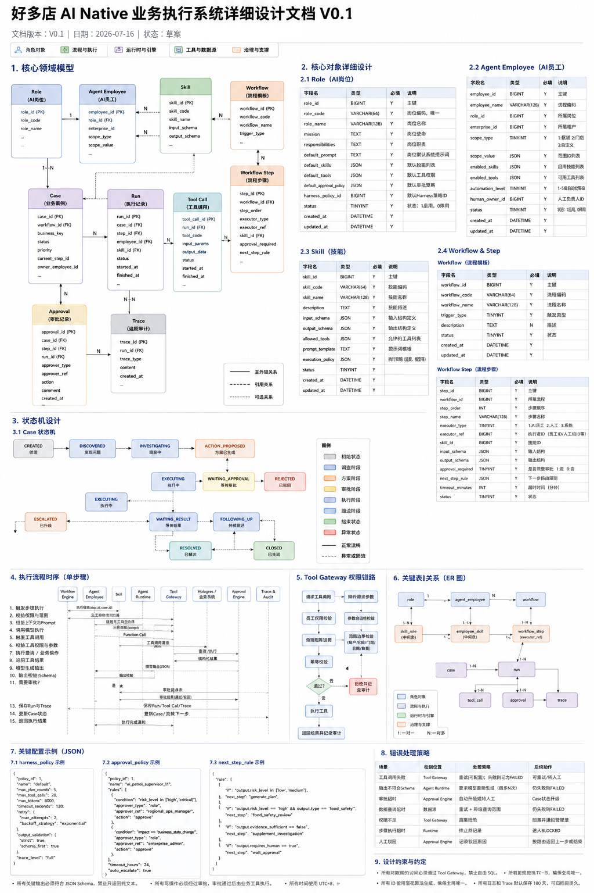

> 该配图用于快速介绍核心对象、状态机和执行链路。字段、状态和接口的正式定义以本文为准。

---

## 1. 设计范围与技术约束

### 1.1 本文覆盖

1. 核心领域模型；
2. MySQL 表设计建议；
3. Role、Employee、Skill、Workflow 配置结构；
4. Case 与 Run 状态机；
5. Workflow 执行机制；
6. Agent Runtime Adapter；
7. Context Assembly；
8. Tool Gateway 校验顺序；
9. Hologres 数据工具；
10. 业务动作工具；
11. 事件与调度；
12. 人工审批；
13. API 契约；
14. 权限、安全、幂等和恢复；
15. Trace、审计和业务评价；
16. 前后端模块划分；
17. 测试、迁移和实施顺序。

### 1.2 技术约束

第一阶段建议延续：

| 类别 | 技术建议 |
|---|---|
| 后端语言 | Python 3.12 |
| Web 框架 | FastAPI |
| Agent Runtime | OpenAI Agents SDK 目标实现；现有 ResponsesRuntime 作为过渡 Adapter |
| 模型接入 | 统一 Provider Adapter；首期支持 OpenAI-compatible Responses |
| 事务数据库 | MySQL 8.0 |
| 分析数据库 | Hologres |
| 队列 | 可选 Kafka、阿里云 MNS、Redis Stream 或任务队列 |
| 延迟任务 | APScheduler、Celery Beat 或队列延迟消息 |
| 缓存与分布式锁 | Redis |
| 对象存储 | OSS |
| 前端 | Vue3、TypeScript、Vite、Element Plus |
| 监控 | Prometheus、Grafana、日志平台、Trace 平台 |
| 部署 | Docker；生产可运行在 Kubernetes 或现有容器平台 |

第一阶段可先采用模块化单体，不强制拆分微服务。

---

## 2. 核心领域模型

### 2.1 领域对象关系

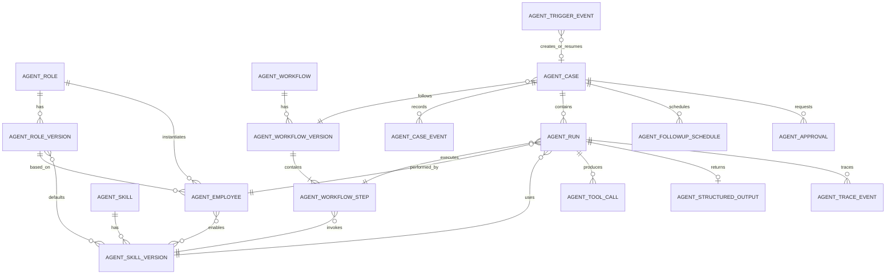

### 2.2 核心对象职责

| 对象 | 职责 |
|---|---|
| AgentRole | AI 岗位稳定身份 |
| AgentRoleVersion | 岗位某个可发布版本 |
| AgentEmployee | 具体 AI 员工实例 |
| AgentSkill | Skill 稳定身份 |
| AgentSkillVersion | Skill 某个执行版本 |
| AgentWorkflow | 流程模板稳定身份 |
| AgentWorkflowVersion | 流程某个可发布版本 |
| AgentWorkflowStep | 流程步骤和路由规则 |
| AgentCase | 长期业务问题与流程实例 |
| AgentRun | 一次步骤执行 |
| AgentToolCall | 一次工具调用 |
| AgentApproval | 一次人工审批 |
| AgentCaseEvent | Case 状态变化和业务事件 |
| FollowupSchedule | Case 未来唤醒计划 |
| TraceEvent | 可观察运行事件 |
| TriggerEvent | 外部或内部触发事件 |

---

## 3. MySQL 表设计总览

### 3.1 表分类

| 分类 | 表 |
|---|---|
| 岗位 | `agent_role`、`agent_role_version` |
| AI 员工 | `agent_employee`、`agent_employee_skill`、`agent_employee_tool_policy` |
| Skill | `agent_skill`、`agent_skill_version` |
| Workflow | `agent_workflow`、`agent_workflow_version`、`agent_workflow_step` |
| Case | `agent_case`、`agent_case_event`、`agent_followup_schedule` |
| Run | `agent_run`、`agent_structured_output` |
| 工具 | `agent_tool_definition`、`agent_tool_call` |
| 审批 | `agent_approval`、`agent_approval_action` |
| 触发 | `agent_trigger_subscription`、`agent_trigger_event` |
| Harness | `agent_harness_policy`、`agent_approval_policy` |
| Trace | `agent_trace_event` |
| 幂等 | `agent_idempotency_record` |

### 3.2 通用字段约定

所有核心表建议包含：

```text
id / 业务主键
enterprise_id
status
version
created_at
created_by
updated_at
updated_by
```

时间统一保存 UTC 或明确统一时区；对外展示使用租户或用户时区。

JSON 字段应只保存灵活配置，不应替代高频查询字段和外键。

---

## 4. Role 详细设计

### 4.1 `agent_role`

岗位稳定身份。

| 字段 | 类型 | 必填 | 说明 |
|---|---|---:|---|
| `role_id` | BIGINT | 是 | 主键 |
| `role_code` | VARCHAR(64) | 是 | 全局或租户内唯一编码 |
| `role_name` | VARCHAR(128) | 是 | 岗位名称 |
| `role_category` | VARCHAR(64) | 否 | 巡店、食安、运营、客户成功等 |
| `owner_type` | VARCHAR(16) | 是 | `platform` / `tenant` |
| `enterprise_id` | VARCHAR(64) | 否 | 租户自定义岗位时使用 |
| `current_version_id` | BIGINT | 否 | 当前发布版本 |
| `status` | VARCHAR(16) | 是 | draft/enabled/paused/disabled |
| `created_at` | DATETIME(3) | 是 | 创建时间 |
| `updated_at` | DATETIME(3) | 是 | 更新时间 |

索引：

```text
UNIQUE(owner_type, enterprise_id, role_code)
INDEX(status)
```

### 4.2 `agent_role_version`

| 字段 | 类型 | 必填 | 说明 |
|---|---|---:|---|
| `role_version_id` | BIGINT | 是 | 主键 |
| `role_id` | BIGINT | 是 | 所属岗位 |
| `version_no` | INT | 是 | 递增版本 |
| `mission` | TEXT | 是 | 岗位使命 |
| `responsibilities_json` | JSON | 是 | 职责 |
| `service_targets_json` | JSON | 否 | 服务对象 |
| `system_prompt` | MEDIUMTEXT | 是 | 稳定岗位指令 |
| `default_skill_versions_json` | JSON | 是 | 默认 Skill 版本 |
| `default_tool_codes_json` | JSON | 是 | 默认工具 |
| `default_approval_policy_id` | BIGINT | 否 | 默认审批策略 |
| `default_harness_policy_id` | BIGINT | 是 | Harness 策略 |
| `forbidden_actions_json` | JSON | 是 | 禁止事项 |
| `output_principles_json` | JSON | 否 | 通用输出要求 |
| `publish_status` | VARCHAR(16) | 是 | draft/published/retired |
| `published_at` | DATETIME(3) | 否 | 发布时间 |
| `created_at` | DATETIME(3) | 是 | 创建时间 |

约束：

```text
UNIQUE(role_id, version_no)
```

### 4.3 Role 配置示例

```json
{
  "role_code": "patrol_supervisor",
  "role_name": "AI巡店督导",
  "mission": "发现授权范围内的门店标准执行问题并推动整改闭环",
  "responsibilities": [
    "扫描风险门店",
    "补充调查巡店和整改证据",
    "生成受控整改建议",
    "持续跟进Case",
    "按规则升级人工负责人"
  ],
  "default_skills": [
    "risk_store_analysis:1",
    "patrol_record_analysis:1",
    "rectification_followup:1",
    "case_followup:1"
  ],
  "default_tools": [
    "get_high_risk_stores",
    "get_store_risk_context",
    "get_open_remediations",
    "get_store_responsible_people",
    "create_remediation_draft"
  ],
  "forbidden_actions": [
    "cross_tenant_access",
    "modify_patrol_history",
    "automatic_punishment",
    "automatic_store_shutdown"
  ],
  "default_harness_policy": "default_business_agent_v1",
  "default_approval_policy": "patrol_supervisor_l1"
}
```

---

## 5. Agent Employee 详细设计

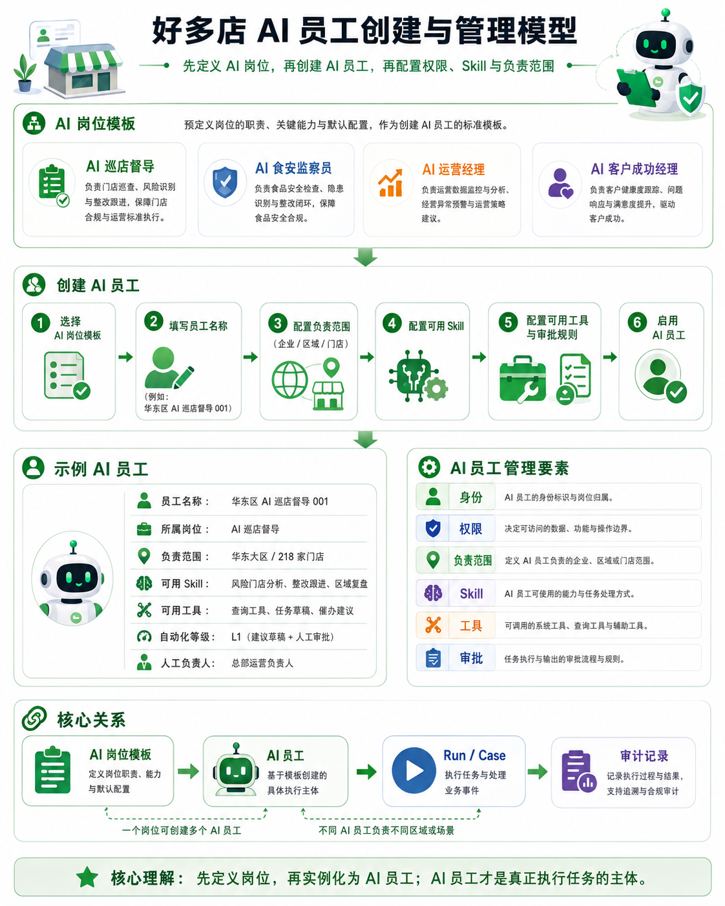

### 5.1 `agent_employee`

| 字段 | 类型 | 必填 | 说明 |
|---|---|---:|---|
| `employee_id` | BIGINT | 是 | 主键 |
| `employee_code` | VARCHAR(64) | 是 | 租户内唯一 |
| `employee_name` | VARCHAR(128) | 是 | 员工名称 |
| `enterprise_id` | VARCHAR(64) | 是 | 所属租户 |
| `role_id` | BIGINT | 是 | 所属岗位 |
| `role_version_id` | BIGINT | 是 | 当前岗位版本 |
| `scope_type` | VARCHAR(16) | 是 | enterprise/region/store |
| `scope_value_json` | JSON | 是 | 区域或门店集合 |
| `automation_level` | VARCHAR(8) | 是 | L0-L4 |
| `human_owner_user_id` | VARCHAR(64) | 是 | 人工负责人 |
| `work_calendar_json` | JSON | 否 | 工作时间和节假日 |
| `runtime_profile_json` | JSON | 否 | 默认模型、预算等覆盖项 |
| `status` | VARCHAR(16) | 是 | draft/enabled/paused/disabled |
| `created_at` | DATETIME(3) | 是 | 创建时间 |
| `updated_at` | DATETIME(3) | 是 | 更新时间 |

约束：

```text
UNIQUE(enterprise_id, employee_code)
INDEX(enterprise_id, role_id, status)
```

### 5.2 `agent_employee_skill`

| 字段 | 类型 | 必填 | 说明 |
|---|---|---:|---|
| `id` | BIGINT | 是 | 主键 |
| `employee_id` | BIGINT | 是 | AI 员工 |
| `skill_id` | BIGINT | 是 | Skill |
| `skill_version_id` | BIGINT | 是 | 启用版本 |
| `enabled` | TINYINT | 是 | 是否启用 |
| `config_override_json` | JSON | 否 | 员工级收窄配置 |
| `created_at` | DATETIME(3) | 是 | 创建时间 |

约束：

```text
UNIQUE(employee_id, skill_id)
```

### 5.3 `agent_employee_tool_policy`

用于在岗位默认工具基础上收窄或覆盖风险策略。

| 字段 | 类型 | 必填 | 说明 |
|---|---|---:|---|
| `id` | BIGINT | 是 | 主键 |
| `employee_id` | BIGINT | 是 | AI 员工 |
| `tool_code` | VARCHAR(128) | 是 | 工具编码 |
| `enabled` | TINYINT | 是 | 是否启用 |
| `max_risk_level` | VARCHAR(16) | 否 | 可自动执行最高风险等级 |
| `approval_policy_id` | BIGINT | 否 | 工具审批策略 |
| `parameter_limits_json` | JSON | 否 | 参数限制 |
| `created_at` | DATETIME(3) | 是 | 创建时间 |

### 5.4 AI 员工生效 Scope

运行时生效 Scope：

```text
员工配置 Scope
∩ 当前租户可用数据
∩ 创建人或授权人的委托范围
∩ Workflow/Step 约束
∩ 业务对象关联范围
```

后台事件触发时不使用 HTTP 当前用户扩大权限。

---

## 6. Skill 详细设计

### 6.1 `agent_skill`

| 字段 | 类型 | 必填 | 说明 |
|---|---|---:|---|
| `skill_id` | BIGINT | 是 | 主键 |
| `skill_code` | VARCHAR(64) | 是 | 唯一编码 |
| `skill_name` | VARCHAR(128) | 是 | 名称 |
| `skill_category` | VARCHAR(64) | 否 | 分析、跟进、复盘等 |
| `owner_type` | VARCHAR(16) | 是 | platform/tenant |
| `enterprise_id` | VARCHAR(64) | 否 | 租户 Skill |
| `current_version_id` | BIGINT | 否 | 当前版本 |
| `status` | VARCHAR(16) | 是 | 状态 |
| `created_at` | DATETIME(3) | 是 | 创建时间 |

### 6.2 `agent_skill_version`

| 字段 | 类型 | 必填 | 说明 |
|---|---|---:|---|
| `skill_version_id` | BIGINT | 是 | 主键 |
| `skill_id` | BIGINT | 是 | Skill |
| `version_no` | INT | 是 | 版本 |
| `description` | TEXT | 是 | 任务说明 |
| `system_instructions` | MEDIUMTEXT | 是 | Skill 指令 |
| `input_schema_json` | JSON | 是 | 输入 Schema |
| `output_schema_json` | JSON | 是 | 输出 Schema |
| `allowed_tools_json` | JSON | 是 | 允许工具 |
| `required_evidence_json` | JSON | 否 | 证据要求 |
| `context_policy_json` | JSON | 是 | 上下文选择规则 |
| `execution_policy_json` | JSON | 是 | 模型、轮次、失败策略 |
| `evaluation_policy_json` | JSON | 否 | 离线和在线评价 |
| `publish_status` | VARCHAR(16) | 是 | 状态 |
| `created_at` | DATETIME(3) | 是 | 创建时间 |

### 6.3 风险门店分析 Skill 示例

```json
{
  "skill_code": "risk_store_analysis",
  "version": 1,
  "description": "在授权范围内筛选并解释风险门店候选",
  "input_schema": {
    "type": "object",
    "required": ["date_range"],
    "properties": {
      "date_range": {
        "type": "object",
        "required": ["start_date", "end_date"]
      },
      "candidate_limit": {
        "type": "integer",
        "minimum": 1,
        "maximum": 50
      },
      "risk_filters": {
        "type": "array",
        "items": {"type": "string"}
      }
    }
  },
  "output_schema": {
    "type": "object",
    "required": ["summary", "candidates", "data_limitations"],
    "properties": {
      "summary": {"type": "string"},
      "candidates": {
        "type": "array",
        "items": {
          "type": "object",
          "required": [
            "store_id",
            "risk_level",
            "risk_reasons",
            "evidence_refs",
            "recommended_next_step"
          ]
        }
      },
      "data_limitations": {
        "type": "array",
        "items": {"type": "string"}
      }
    }
  },
  "allowed_tools": [
    "get_high_risk_stores",
    "get_store_risk_context",
    "get_open_remediations",
    "get_store_responsible_people"
  ],
  "required_evidence": {
    "candidate_list": ["get_high_risk_stores"],
    "store_context": ["get_store_risk_context"]
  },
  "execution_policy": {
    "max_model_turns": 5,
    "max_tool_calls": 12,
    "final_output_must_be_structured": true,
    "allow_partial_result": true
  }
}
```

### 6.4 Skill 输出原则

关键业务输出必须结构化，自由文本只作为辅助说明。

```json
{
  "store_id": "S001",
  "risk_level": "high",
  "risk_types": [
    "repeated_failure",
    "overdue_rectification"
  ],
  "risk_reasons": [
    "近30天同一检查项连续3次不合格",
    "当前整改工单超时2天"
  ],
  "evidence_refs": [
    {
      "source": "dws_check_item_result",
      "record_ids": ["IR101", "IR202", "IR303"]
    },
    {
      "source": "dws_question_record",
      "record_ids": ["Q9001"]
    }
  ],
  "responsible_people": {
    "store_manager_user_id": "U100",
    "supervisor_user_id": "U200"
  },
  "recommended_next_step": "generate_rectification_plan",
  "requires_human_review": false,
  "data_as_of": "2026-07-16T05:00:00+08:00"
}
```

---

## 7. Workflow 与 Step 详细设计

### 7.1 `agent_workflow`

| 字段 | 类型 | 必填 | 说明 |
|---|---|---:|---|
| `workflow_id` | BIGINT | 是 | 主键 |
| `workflow_code` | VARCHAR(64) | 是 | 编码 |
| `workflow_name` | VARCHAR(128) | 是 | 名称 |
| `owner_type` | VARCHAR(16) | 是 | platform/tenant |
| `enterprise_id` | VARCHAR(64) | 否 | 租户流程 |
| `current_version_id` | BIGINT | 否 | 当前版本 |
| `status` | VARCHAR(16) | 是 | 状态 |
| `created_at` | DATETIME(3) | 是 | 创建时间 |

### 7.2 `agent_workflow_version`

| 字段 | 类型 | 必填 | 说明 |
|---|---|---:|---|
| `workflow_version_id` | BIGINT | 是 | 主键 |
| `workflow_id` | BIGINT | 是 | 流程 |
| `version_no` | INT | 是 | 版本 |
| `description` | TEXT | 否 | 描述 |
| `trigger_policy_json` | JSON | 是 | 允许触发方式 |
| `case_policy_json` | JSON | 是 | 去重、关闭和恢复策略 |
| `default_employee_selector_json` | JSON | 否 | 默认 AI 员工路由 |
| `publish_status` | VARCHAR(16) | 是 | 状态 |
| `created_at` | DATETIME(3) | 是 | 创建时间 |

### 7.3 `agent_workflow_step`

| 字段 | 类型 | 必填 | 说明 |
|---|---|---:|---|
| `step_id` | BIGINT | 是 | 主键 |
| `workflow_version_id` | BIGINT | 是 | 流程版本 |
| `step_code` | VARCHAR(64) | 是 | 步骤编码 |
| `step_name` | VARCHAR(128) | 是 | 名称 |
| `step_order` | INT | 是 | 默认顺序 |
| `executor_type` | VARCHAR(16) | 是 | employee/role/human/system |
| `executor_ref_json` | JSON | 否 | 指定或动态路由 |
| `skill_version_id` | BIGINT | 否 | AI 步骤使用 Skill |
| `input_mapping_json` | JSON | 是 | 输入映射 |
| `output_schema_json` | JSON | 否 | 步骤输出 |
| `allowed_tools_json` | JSON | 否 | 步骤级工具收窄 |
| `entry_condition_json` | JSON | 否 | 进入条件 |
| `approval_policy_id` | BIGINT | 否 | 审批策略 |
| `timeout_seconds` | INT | 否 | 超时 |
| `retry_policy_json` | JSON | 否 | 重试 |
| `next_step_rule_json` | JSON | 是 | 路由 |
| `status` | VARCHAR(16) | 是 | 状态 |

### 7.4 流程定义示例

```json
{
  "workflow_code": "risk_store_rectification",
  "version": 1,
  "trigger_policy": {
    "allowed_types": [
      "schedule",
      "warehouse_refresh",
      "manual",
      "case_timer"
    ]
  },
  "case_policy": {
    "business_key_template": "${enterprise_id}:${store_id}:${risk_type}",
    "reuse_open_case": true,
    "allow_parallel_case_types": true
  },
  "steps": [
    {
      "step_code": "risk_screening",
      "executor_type": "role",
      "executor_ref": {"role_code": "patrol_supervisor"},
      "skill_code": "risk_store_analysis",
      "next_step_rule": {
        "default": "evidence_investigation"
      }
    },
    {
      "step_code": "evidence_investigation",
      "executor_type": "case_owner_employee",
      "skill_code": "patrol_record_analysis",
      "next_step_rule": {
        "rules": [
          {
            "if": "output.requires_professional_review == true",
            "next_step": "professional_review"
          },
          {
            "if": "output.evidence_sufficient == false",
            "next_step": "evidence_investigation"
          }
        ],
        "default": "rectification_plan"
      }
    },
    {
      "step_code": "professional_review",
      "executor_type": "role_or_human",
      "executor_ref": {
        "role_code": "food_safety_inspector",
        "fallback_human_role": "food_safety_manager"
      },
      "skill_code": "food_safety_review",
      "next_step_rule": {
        "default": "rectification_plan"
      }
    },
    {
      "step_code": "rectification_plan",
      "executor_type": "case_owner_employee",
      "skill_code": "rectification_followup",
      "approval_policy": "patrol_supervisor_l1",
      "next_step_rule": {
        "default": "wait_result"
      }
    },
    {
      "step_code": "wait_result",
      "executor_type": "system",
      "next_step_rule": {
        "on_timer": "case_followup",
        "on_business_event": "case_followup"
      }
    },
    {
      "step_code": "case_followup",
      "executor_type": "case_owner_employee",
      "skill_code": "case_followup",
      "next_step_rule": {
        "rules": [
          {"if": "output.status == 'resolved'", "next_step": "close_case"},
          {"if": "output.status == 'escalate'", "next_step": "human_escalation"}
        ],
        "default": "wait_result"
      }
    }
  ]
}
```

### 7.5 AI 员工进入流程步骤

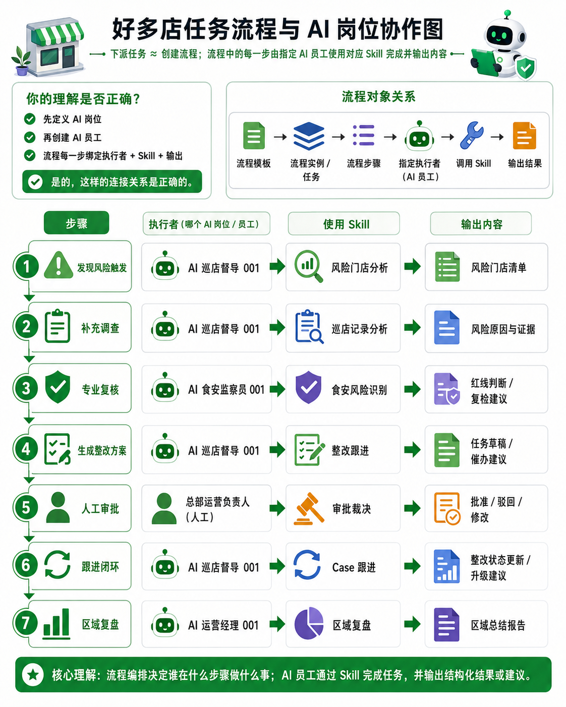

---

## 8. Case 详细设计

### 8.1 `agent_case`

| 字段 | 类型 | 必填 | 说明 |
|---|---|---:|---|
| `case_id` | CHAR(26) | 是 | ULID |
| `case_code` | VARCHAR(64) | 是 | 展示编码 |
| `enterprise_id` | VARCHAR(64) | 是 | 租户 |
| `case_type` | VARCHAR(64) | 是 | 类型 |
| `business_key` | VARCHAR(256) | 是 | 去重业务键 |
| `workflow_id` | BIGINT | 是 | 流程 |
| `workflow_version_id` | BIGINT | 是 | 流程版本 |
| `current_step_id` | BIGINT | 否 | 当前步骤 |
| `status` | VARCHAR(32) | 是 | Case 状态 |
| `priority` | VARCHAR(16) | 是 | low/medium/high/critical |
| `owner_employee_id` | BIGINT | 是 | 主责 AI 员工 |
| `human_owner_user_id` | VARCHAR(64) | 是 | 人工负责人 |
| `target_type` | VARCHAR(32) | 是 | store/region/order 等 |
| `target_id` | VARCHAR(128) | 是 | 目标对象 |
| `context_snapshot_json` | JSON | 是 | 创建时关键上下文 |
| `latest_summary` | TEXT | 否 | 最新摘要 |
| `next_check_at` | DATETIME(3) | 否 | 下次检查 |
| `version_no` | BIGINT | 是 | 乐观锁 |
| `created_at` | DATETIME(3) | 是 | 创建时间 |
| `updated_at` | DATETIME(3) | 是 | 更新时间 |
| `resolved_at` | DATETIME(3) | 否 | 解决时间 |
| `closed_at` | DATETIME(3) | 否 | 关闭时间 |

约束：

```text
UNIQUE(enterprise_id, case_type, business_key, active_flag)
INDEX(enterprise_id, owner_employee_id, status, next_check_at)
INDEX(target_type, target_id)
```

MySQL 不便使用条件唯一索引时，可维护 `active_business_key`：

- 活跃 Case 保存真实业务键；
- 关闭后置空或添加关闭版本。

### 8.2 `agent_case_event`

| 字段 | 类型 | 必填 | 说明 |
|---|---|---:|---|
| `case_event_id` | CHAR(26) | 是 | ULID |
| `case_id` | CHAR(26) | 是 | Case |
| `event_type` | VARCHAR(64) | 是 | 状态、业务、审批等 |
| `source_type` | VARCHAR(32) | 是 | system/employee/human/tool/external |
| `source_ref` | VARCHAR(128) | 否 | 来源 ID |
| `from_status` | VARCHAR(32) | 否 | 原状态 |
| `to_status` | VARCHAR(32) | 否 | 新状态 |
| `payload_json` | JSON | 否 | 事件内容 |
| `occurred_at` | DATETIME(3) | 是 | 发生时间 |
| `created_at` | DATETIME(3) | 是 | 入库时间 |

Case 历史以事件为准，`agent_case` 保存当前快照。

### 8.3 `agent_followup_schedule`

| 字段 | 类型 | 必填 | 说明 |
|---|---|---:|---|
| `schedule_id` | CHAR(26) | 是 | ULID |
| `case_id` | CHAR(26) | 是 | Case |
| `step_id` | BIGINT | 是 | 到期执行步骤 |
| `scheduled_at` | DATETIME(3) | 是 | 执行时间 |
| `schedule_type` | VARCHAR(32) | 是 | followup/reminder/escalation |
| `status` | VARCHAR(16) | 是 | pending/leased/done/cancelled |
| `lease_owner` | VARCHAR(128) | 否 | Worker |
| `lease_until` | DATETIME(3) | 否 | 租约 |
| `attempt_count` | INT | 是 | 尝试次数 |
| `payload_json` | JSON | 否 | 调度参数 |
| `created_at` | DATETIME(3) | 是 | 创建时间 |

### 8.4 Case 状态机

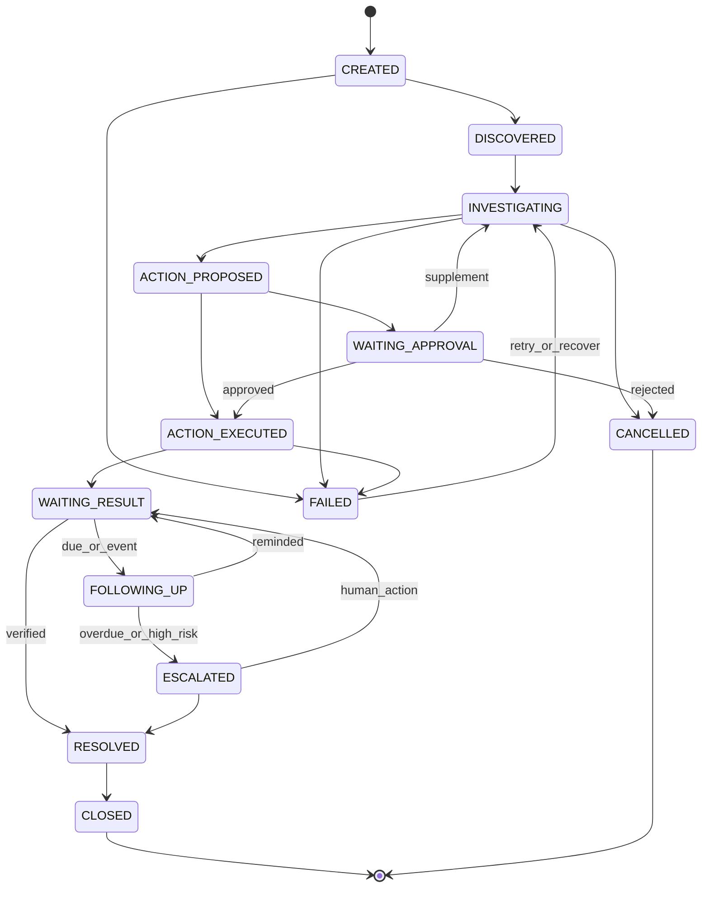

### 8.5 状态转换规则

所有状态变化必须经 Case Service：

```text
validate expected current status
validate transition allowed
validate actor permission
write case_event
optimistic update agent_case.version_no
commit
publish internal event
```

不得由模型直接写状态。

---

## 9. Run 与执行记录设计

### 9.1 `agent_run`

| 字段 | 类型 | 必填 | 说明 |
|---|---|---:|---|
| `run_id` | CHAR(26) | 是 | ULID |
| `enterprise_id` | VARCHAR(64) | 是 | 租户 |
| `case_id` | CHAR(26) | 否 | Case |
| `workflow_version_id` | BIGINT | 是 | 流程版本 |
| `step_id` | BIGINT | 是 | 步骤 |
| `employee_id` | BIGINT | 否 | AI 员工 |
| `skill_version_id` | BIGINT | 否 | Skill 版本 |
| `trigger_event_id` | CHAR(26) | 否 | 触发事件 |
| `status` | VARCHAR(32) | 是 | Run 状态 |
| `model_provider` | VARCHAR(64) | 否 | Provider |
| `model_name` | VARCHAR(128) | 否 | 模型 |
| `input_json` | JSON | 是 | 受控输入 |
| `context_summary_json` | JSON | 否 | 上下文摘要 |
| `effective_scope_json` | JSON | 是 | 固化 Scope |
| `harness_policy_snapshot_json` | JSON | 是 | Harness 快照 |
| `response_id` | VARCHAR(256) | 否 | Provider 响应 |
| `runtime_status` | VARCHAR(64) | 否 | Runtime 内部状态 |
| `started_at` | DATETIME(3) | 否 | 开始 |
| `finished_at` | DATETIME(3) | 否 | 结束 |
| `error_code` | VARCHAR(64) | 否 | 错误 |
| `error_message` | TEXT | 否 | 错误信息 |
| `created_at` | DATETIME(3) | 是 | 创建时间 |

### 9.2 `agent_structured_output`

| 字段 | 类型 | 必填 | 说明 |
|---|---|---:|---|
| `output_id` | CHAR(26) | 是 | 主键 |
| `run_id` | CHAR(26) | 是 | Run |
| `schema_name` | VARCHAR(128) | 是 | Schema 名称 |
| `schema_version` | INT | 是 | Schema 版本 |
| `output_json` | JSON | 是 | 结构化输出 |
| `display_markdown` | MEDIUMTEXT | 否 | 展示文本 |
| `validation_status` | VARCHAR(16) | 是 | valid/invalid/partial |
| `validation_errors_json` | JSON | 否 | 错误 |
| `created_at` | DATETIME(3) | 是 | 创建时间 |

### 9.3 Run 状态机

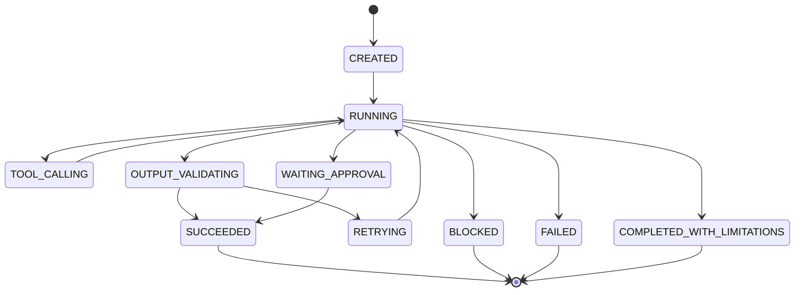

---

## 10. Agent Runtime 详细设计

### 10.1 Runtime 接口

```python
from typing import Protocol

class AgentRuntimeAdapter(Protocol):
    async def execute(self, request: "RuntimeRequest") -> "RuntimeResult":
        '''执行一次受 Harness 管理的 Skill Run。'''
```

`RuntimeRequest` 建议包含：

```text
run_id
role_context
employee_context
workflow_context
case_context
skill_definition
input_payload
available_tools
model_profile
harness_policy
trace_context
```

`RuntimeResult`：

```text
runtime_status
structured_output
display_markdown
model_steps
usage
provider_response_id
limitations
error
```

### 10.2 Runtime 实现

```text
AgentRuntimeAdapter
├─ OpenAIAgentsSdkRuntime
├─ ResponsesCompatibleRuntime
└─ TestFakeRuntime
```

`TestFakeRuntime` 用于状态机、Gateway 和 Workflow 自动化测试，避免每次依赖真实模型。

### 10.3 执行流程

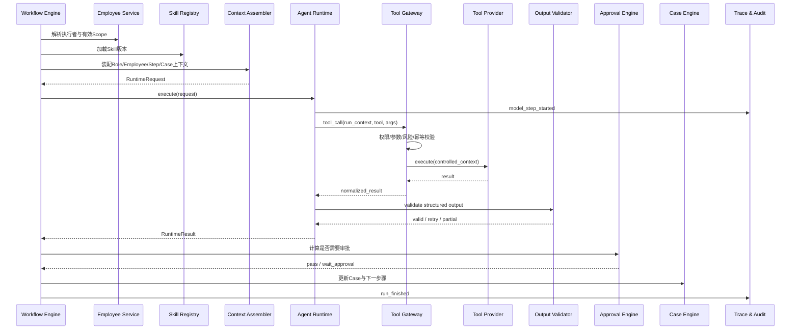

### 10.4 模型职责

模型可以：

- 理解当前步骤目标；
- 决定调用哪些允许工具；
- 组合证据；
- 生成结构化判断和建议；
- 在输出 Schema 内表达不确定性。

模型不能：

- 决定租户身份；
- 扩大 Scope；
- 调用未授权工具；
- 直接修改 Case 状态；
- 绕过审批；
- 生成自由 SQL；
- 伪造业务动作已成功。

---

## 11. Context Assembler 详细设计

### 11.1 上下文来源

| 来源 | 内容 |
|---|---|
| Role Version | 使命、职责、禁止事项、通用输出原则 |
| Employee | 租户、负责范围、自动化等级、人工负责人 |
| Workflow Step | 当前步骤目标、输入映射、输出和工具限制 |
| Skill Version | Skill 指令、工具、证据和 Schema |
| Case | 当前状态、业务对象、历史摘要、未完成事项 |
| Previous Outputs | 上一步结构化输出 |
| Trigger Event | 触发原因和关联业务键 |
| Data Freshness | Hologres 最新刷新状态 |
| Harness | 轮次、预算、审批和安全约束 |

### 11.2 上下文选择原则

- 只加载完成当前步骤必要的信息；
- 历史 Run 以结构化摘要为主；
- 不把全部工具原始结果重复塞入长期上下文；
- 大证据使用引用或 Artifact；
- 数据时间和限制必须明确；
- 涉及敏感信息时最小化暴露；
- 超过 Token 预算时按优先级裁剪。

### 11.3 Context Snapshot

```json
{
  "role_version_id": 101,
  "employee_id": 2001,
  "workflow_version_id": 301,
  "step_id": 401,
  "skill_version_id": 501,
  "case_status": "INVESTIGATING",
  "effective_scope_hash": "...",
  "tool_catalog_version": "2026-07-16",
  "data_freshness": {
    "ads_store_execute_day": "2026-07-16T05:00:00+08:00"
  },
  "context_sections": [
    "role",
    "employee",
    "workflow_step",
    "case_summary",
    "previous_output"
  ]
}
```

---

## 12. Tool Gateway 详细设计

### 12.1 校验顺序

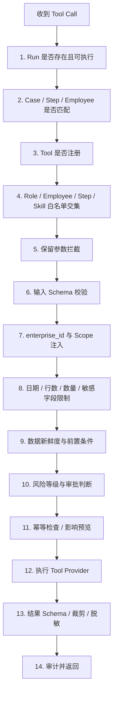

任一步失败均返回标准错误，并尽量写入 `agent_tool_call`。

### 12.2 保留参数

模型不得传入：

```text
enterprise_id
user_id
agent_employee_id
role_id
case_id
run_id
skill_code
auth_token
token
effective_scope
approval_status
```

这些参数由后端 Context 注入。

### 12.3 `agent_tool_definition`

| 字段 | 类型 | 说明 |
|---|---|---|
| `tool_code` | VARCHAR(128) | 唯一编码 |
| `tool_version` | INT | 版本 |
| `tool_type` | VARCHAR(32) | read/write/approval/artifact |
| `provider_type` | VARCHAR(32) | builtin/http/mcp |
| `input_schema_json` | JSON | 模型可见输入 |
| `output_schema_json` | JSON | 标准输出 |
| `risk_level` | VARCHAR(16) | low/medium/high/critical |
| `requires_approval` | TINYINT | 默认是否审批 |
| `idempotency_policy_json` | JSON | 幂等 |
| `timeout_ms` | INT | 超时 |
| `retry_policy_json` | JSON | 重试 |
| `audit_policy_json` | JSON | 审计和脱敏 |
| `status` | VARCHAR(16) | 状态 |

### 12.4 `agent_tool_call`

| 字段 | 类型 | 说明 |
|---|---|---|
| `tool_call_id` | CHAR(26) | 主键 |
| `run_id` | CHAR(26) | Run |
| `case_id` | CHAR(26) | Case |
| `tool_code` | VARCHAR(128) | 工具 |
| `tool_version` | INT | 版本 |
| `call_sequence` | INT | 调用顺序 |
| `input_json` | JSON | 模型输入，已过滤 |
| `effective_input_json` | JSON | 注入身份和 Scope 后的受控输入摘要 |
| `output_summary_json` | JSON | 输出摘要 |
| `status` | VARCHAR(16) | success/blocked/failed |
| `risk_level` | VARCHAR(16) | 风险 |
| `approval_id` | CHAR(26) | 审批 |
| `idempotency_key` | VARCHAR(256) | 幂等 |
| `started_at` | DATETIME(3) | 开始 |
| `finished_at` | DATETIME(3) | 结束 |
| `duration_ms` | INT | 耗时 |
| `error_code` | VARCHAR(64) | 错误码 |
| `error_message` | TEXT | 错误 |

---

## 13. Hologres 数据工具设计

### 13.1 数据服务分层

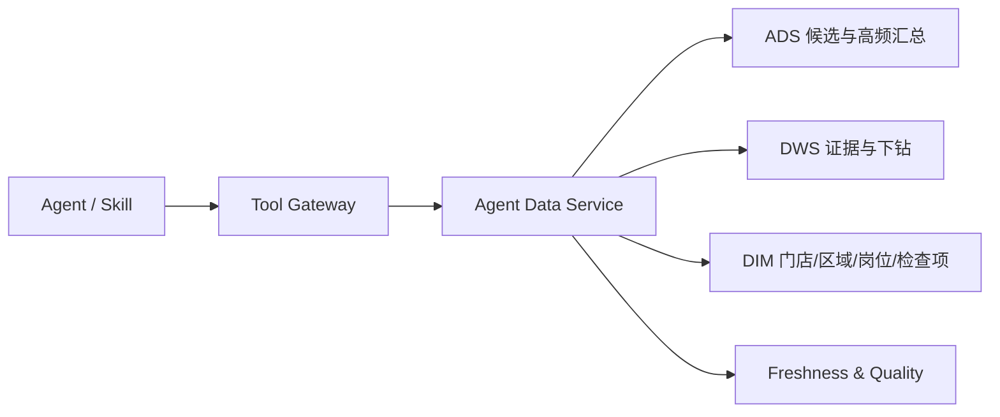

### 13.2 现有可复用数据

第一阶段主要使用：

```text
dim_store_current
dim_region_current
dim_store_user_post_current
dim_check_table
dim_check_item
dws_patrol_table
dws_check_item_result
dws_question_record
dws_risk_store_warning_hit
ads_store_execute_day
```

### 13.3 工具定义建议

#### `get_high_risk_stores`

```json
{
  "date_range": {
    "start_date": "2026-07-01",
    "end_date": "2026-07-16"
  },
  "risk_levels": ["high", "critical"],
  "limit": 20
}
```

后端注入：

```text
enterprise_id
authorized_store_ids
authorized_region_ids
max_result_rows
```

输出：

```json
{
  "stores": [],
  "summary": {},
  "metadata": {
    "data_as_of": "...",
    "warehouse_layer": "ADS",
    "refresh_status": "success",
    "is_partial": false,
    "is_truncated": false
  }
}
```

#### `get_store_risk_context`

组合：

- 门店维度；
- 最近巡店；
- 重复失败项；
- 风险规则；
- 未关闭和超时工单；
- 责任人；
- 数据新鲜度。

### 13.4 SQL 安全要求

- 只允许 `SELECT` / `WITH`；
- 单条 SQL；
- 必须显式绑定 `enterprise_id`；
- 不接受模型生成 SQL；
- Scope 由服务追加；
- 设置只读事务；
- 设置 statement timeout；
- 限制返回行数；
- 所有动态排序字段白名单化；
- 大列表使用数组参数或临时安全结构；
- 查询结束回滚并关闭连接。

### 13.5 数据新鲜度

建议维护：

```text
agent_data_freshness
```

字段：

```text
enterprise_id
dataset_code
warehouse_layer
last_success_at
data_as_of
refresh_status
is_partial
error_message
```

高风险动作前：

```text
if refresh_status != success:
    block automatic action

if now - data_as_of > policy.max_data_age:
    require live recheck or human approval
```

---

## 14. 业务动作工具设计

### 14.1 设计原则

- 通过业务 API，不直接写数据库；
- 每个动作有幂等键；
- 动作前查询当前状态；
- 返回业务对象 ID 和权威状态；
- 高风险动作强制审批；
- 失败后支持状态查询和补偿；
- 工具结果不能由模型自行宣称成功。

### 14.2 第一阶段动作

| 工具 | 第一阶段 |
|---|---|
| `create_remediation_draft` | 必须 |
| `send_reminder_draft` | 必须 |
| `submit_action_for_approval` | 必须 |
| `get_business_action_status` | 必须 |
| `create_remediation_order` | 灰度 |
| `send_reminder` | 灰度 |
| `create_recheck_task` | 灰度 |
| `escalate_case` | 灰度 |

### 14.3 幂等键

```text
case_id
+ step_code
+ action_type
+ target_type
+ target_id
+ action_version
```

示例：

```text
01JCASE...:rectification_plan:create_order:store:S001:v1
```

### 14.4 动作结果

```json
{
  "action_status": "accepted",
  "business_object_type": "rectification_order",
  "business_object_id": "Q10001",
  "idempotency_key": "...",
  "authoritative_source": "coolstore-workorder",
  "executed_at": "2026-07-16T10:30:00+08:00"
}
```

---

## 15. Approval 详细设计

### 15.1 `agent_approval_policy`

| 字段 | 说明 |
|---|---|
| `approval_policy_id` | 主键 |
| `policy_code` | 编码 |
| `policy_name` | 名称 |
| `conditions_json` | 触发条件 |
| `approver_selector_json` | 审批人路由 |
| `allowed_actions_json` | 审批操作 |
| `timeout_hours` | 超时 |
| `timeout_action` | escalate/cancel/manual |
| `status` | 状态 |

### 15.2 审批策略示例

```json
{
  "policy_code": "patrol_supervisor_l1",
  "conditions": [
    {
      "if": "action.type in ['create_remediation_order', 'send_message']",
      "require_approval": true
    },
    {
      "if": "risk_level in ['critical']",
      "require_approval": true
    },
    {
      "if": "action.type in ['punishment', 'store_shutdown']",
      "forbidden": true
    }
  ],
  "approver_selector": {
    "type": "case_human_owner"
  },
  "allowed_actions": [
    "approve",
    "approve_with_changes",
    "reject",
    "request_supplement",
    "transfer"
  ],
  "timeout_hours": 24,
  "timeout_action": "escalate"
}
```

### 15.3 `agent_approval`

| 字段 | 说明 |
|---|---|
| `approval_id` | ULID |
| `enterprise_id` | 租户 |
| `case_id` | Case |
| `run_id` | Run |
| `step_id` | 步骤 |
| `approval_policy_id` | 策略 |
| `approval_type` | action/result/close/escalation |
| `request_json` | 证据、建议、工具和参数 |
| `status` | pending/approved/rejected/supplement/transferred/expired |
| `approver_user_id` | 当前审批人 |
| `due_at` | 截止 |
| `resolved_at` | 完成 |
| `created_at` | 创建 |

### 15.4 审批恢复

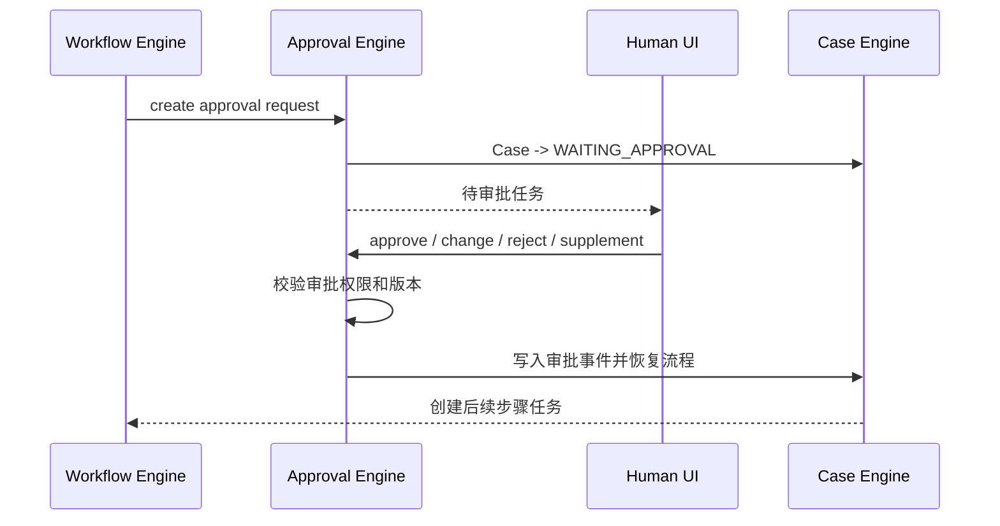

---

## 16. Trigger 与 Scheduler 详细设计

### 16.1 `agent_trigger_subscription`

| 字段 | 说明 |
|---|---|
| `subscription_id` | 主键 |
| `enterprise_id` | 租户 |
| `employee_id` | AI 员工 |
| `workflow_version_id` | 流程 |
| `trigger_type` | cron/event/warehouse/manual |
| `trigger_config_json` | Cron、事件类型、数据集等 |
| `filter_json` | 过滤条件 |
| `status` | 状态 |
| `created_at` | 创建 |

### 16.2 `agent_trigger_event`

| 字段 | 说明 |
|---|---|
| `trigger_event_id` | ULID |
| `event_id` | 外部唯一事件 ID |
| `event_type` | 类型 |
| `enterprise_id` | 租户 |
| `source` | 来源 |
| `aggregate_type` | 业务对象类型 |
| `aggregate_id` | 业务对象 |
| `correlation_id` | 关联 |
| `causation_id` | 因果 |
| `payload_json` | 事件内容 |
| `occurred_at` | 发生时间 |
| `status` | received/processed/ignored/failed |
| `case_id` | 关联 Case |
| `created_at` | 入库时间 |

约束：

```text
UNIQUE(source, event_id)
```

### 16.3 触发处理

```text
receive event
→ validate schema
→ persist event
→ deduplicate
→ find subscriptions
→ calculate business_key
→ find active case
→ create or resume case
→ select employee
→ create run task
→ update trigger status
```

### 16.4 数仓刷新触发

```json
{
  "event_type": "warehouse.dataset.refreshed",
  "enterprise_id": "E001",
  "dataset_code": "ads_store_execute_day",
  "data_as_of": "2026-07-15",
  "refresh_status": "success",
  "is_partial": false
}
```

只有刷新成功并满足数据质量要求时，才启动自动风险扫描。

---

## 17. API 设计

### 17.1 API 风格

- REST 为主；
- 异步任务返回 `case_id` 和 `run_id`；
- 所有接口从认证上下文获取 `enterprise_id`；
- 管理接口与运行接口分组；
- 所有写接口支持幂等键；
- 错误返回统一 `code/message/details/trace_id`。

### 17.2 Role API

```text
POST   /api/v1/agent/roles
GET    /api/v1/agent/roles
GET    /api/v1/agent/roles/{role_id}
POST   /api/v1/agent/roles/{role_id}/versions
POST   /api/v1/agent/roles/{role_id}/versions/{version_id}/publish
POST   /api/v1/agent/roles/{role_id}/pause
POST   /api/v1/agent/roles/{role_id}/disable
```

### 17.3 Employee API

```text
POST   /api/v1/agent/employees
GET    /api/v1/agent/employees
GET    /api/v1/agent/employees/{employee_id}
PUT    /api/v1/agent/employees/{employee_id}
POST   /api/v1/agent/employees/{employee_id}/enable
POST   /api/v1/agent/employees/{employee_id}/pause
POST   /api/v1/agent/employees/{employee_id}/disable
GET    /api/v1/agent/employees/{employee_id}/effective-capabilities
```

### 17.4 Skill API

```text
POST   /api/v1/agent/skills
GET    /api/v1/agent/skills
GET    /api/v1/agent/skills/{skill_id}
POST   /api/v1/agent/skills/{skill_id}/versions
POST   /api/v1/agent/skills/{skill_id}/versions/{version_id}/validate
POST   /api/v1/agent/skills/{skill_id}/versions/{version_id}/publish
```

### 17.5 Workflow API

```text
POST   /api/v1/agent/workflows
GET    /api/v1/agent/workflows
GET    /api/v1/agent/workflows/{workflow_id}
POST   /api/v1/agent/workflows/{workflow_id}/versions
POST   /api/v1/agent/workflows/{workflow_id}/versions/{version_id}/validate
POST   /api/v1/agent/workflows/{workflow_id}/versions/{version_id}/publish
```

### 17.6 Case API

```text
POST   /api/v1/agent/cases
GET    /api/v1/agent/cases
GET    /api/v1/agent/cases/{case_id}
GET    /api/v1/agent/cases/{case_id}/events
GET    /api/v1/agent/cases/{case_id}/runs
POST   /api/v1/agent/cases/{case_id}/resume
POST   /api/v1/agent/cases/{case_id}/cancel
POST   /api/v1/agent/cases/{case_id}/close
```

人工下派：

```json
{
  "workflow_code": "risk_store_rectification",
  "target": {
    "type": "store",
    "id": "S001"
  },
  "employee_id": 2001,
  "input": {
    "date_range": {
      "start_date": "2026-07-01",
      "end_date": "2026-07-16"
    }
  }
}
```

响应：

```json
{
  "case_id": "01J...",
  "case_code": "CASE-20260716-0001",
  "status": "CREATED",
  "run_id": "01R..."
}
```

### 17.7 Run 与 Trace API

```text
GET /api/v1/agent/runs/{run_id}
GET /api/v1/agent/runs/{run_id}/tool-calls
GET /api/v1/agent/runs/{run_id}/trace
GET /api/v1/agent/runs/{run_id}/output
```

### 17.8 Approval API

```text
GET  /api/v1/agent/approvals
GET  /api/v1/agent/approvals/{approval_id}
POST /api/v1/agent/approvals/{approval_id}/approve
POST /api/v1/agent/approvals/{approval_id}/approve-with-changes
POST /api/v1/agent/approvals/{approval_id}/reject
POST /api/v1/agent/approvals/{approval_id}/request-supplement
POST /api/v1/agent/approvals/{approval_id}/transfer
```

审批使用乐观锁：

```json
{
  "expected_version": 3,
  "comment": "同意生成普通整改任务",
  "changes": {}
}
```

---

## 18. 权限设计

### 18.1 权限主体

- 平台管理员；
- 租户管理员；
- 运营负责人；
- 审批人；
- 普通用户；
- AI 员工服务身份；
- 系统调度身份。

### 18.2 权限维度

| 维度 | 示例 |
|---|---|
| 租户 | enterprise_id |
| 数据 | 企业、区域、门店 |
| 业务域 | 巡店、工单、食安、客户成功 |
| 对象 | Role、Employee、Workflow、Case |
| Tool | 查询、草稿、消息、工单 |
| 动作 | 查看、创建、发布、执行、审批、关闭 |
| 风险 | low/medium/high/critical |

### 18.3 AI 员工运行权限

```text
effective_permission =
system_policy
∩ tenant_policy
∩ role_version_policy
∩ employee_policy
∩ workflow_step_policy
∩ skill_policy
∩ tool_policy
∩ current_case_scope
```

### 18.4 数据权限

当前已有数仓权限 Scope 可复用，但详细实现需特别区分：

- 人工用户在页面中可见范围；
- AI 员工被委托的长期负责范围；
- 当前 Case 的目标范围；
- 当前步骤允许处理的范围。

---

## 19. Trace 与审计设计

### 19.1 `agent_trace_event`

| 字段 | 说明 |
|---|---|
| `trace_event_id` | ULID |
| `trace_id` | 整条链路 |
| `parent_event_id` | 父事件 |
| `case_id` | Case |
| `run_id` | Run |
| `event_type` | 类型 |
| `event_name` | 名称 |
| `status` | 状态 |
| `payload_summary_json` | 摘要 |
| `started_at` | 开始 |
| `finished_at` | 结束 |
| `duration_ms` | 耗时 |
| `created_at` | 创建 |

### 19.2 Trace 事件类型

```text
trigger_received
case_created
case_resumed
workflow_step_started
employee_selected
context_assembled
model_request_started
model_tool_call
tool_gateway_allowed
tool_gateway_blocked
tool_execution_started
tool_execution_finished
output_validation
approval_requested
approval_resolved
case_state_changed
run_finished
workflow_finished
```

### 19.3 审计原则

- Trace 展示系统事件，不展示模型隐藏思维链；
- Prompt 全文可按安全策略保存版本引用，不一定复制到每个 Run；
- 工具输入输出保存受控摘要；
- 高风险审批保存完整证据和动作参数；
- 数据结果保存来源、截止时间和记录引用；
- 审计记录不可由模型修改。

---

## 20. 错误码与恢复策略

### 20.1 通用错误格式

```json
{
  "code": "TOOL_PERMISSION_DENIED",
  "message": "当前AI员工无权调用该工具",
  "details": {},
  "trace_id": "..."
}
```

### 20.2 建议错误码

| 错误码 | 含义 | Run 处理 |
|---|---|---|
| `RUN_NOT_FOUND` | Run 不存在 | FAILED |
| `RUN_NOT_EXECUTABLE` | 状态不可执行 | BLOCKED |
| `EMPLOYEE_DISABLED` | AI 员工停用 | BLOCKED |
| `SKILL_NOT_ALLOWED` | Skill 不允许 | BLOCKED |
| `TOOL_NOT_ALLOWED` | 工具不在交集 | BLOCKED |
| `RESERVED_PARAMETER_NOT_ALLOWED` | 模型传保留参数 | BLOCKED |
| `PERMISSION_DENIED` | Scope 越权 | BLOCKED |
| `INPUT_SCHEMA_INVALID` | 输入无效 | 可修复或 FAILED |
| `OUTPUT_SCHEMA_INVALID` | 输出无效 | 重试后 FAILED |
| `DATA_NOT_FRESH` | 数据过期 | 降级或 WAITING_APPROVAL |
| `DATA_PARTIAL` | 数据不完整 | COMPLETED_WITH_LIMITATIONS |
| `TOOL_TIMEOUT` | 工具超时 | 重试 |
| `MODEL_TIMEOUT` | 模型超时 | 重试或降级 |
| `APPROVAL_REQUIRED` | 需要审批 | WAITING_APPROVAL |
| `IDEMPOTENCY_CONFLICT` | 重复动作 | 查询历史结果 |
| `BUSINESS_ACTION_UNKNOWN` | 动作状态不确定 | 查询业务状态并人工接管 |

### 20.3 恢复策略

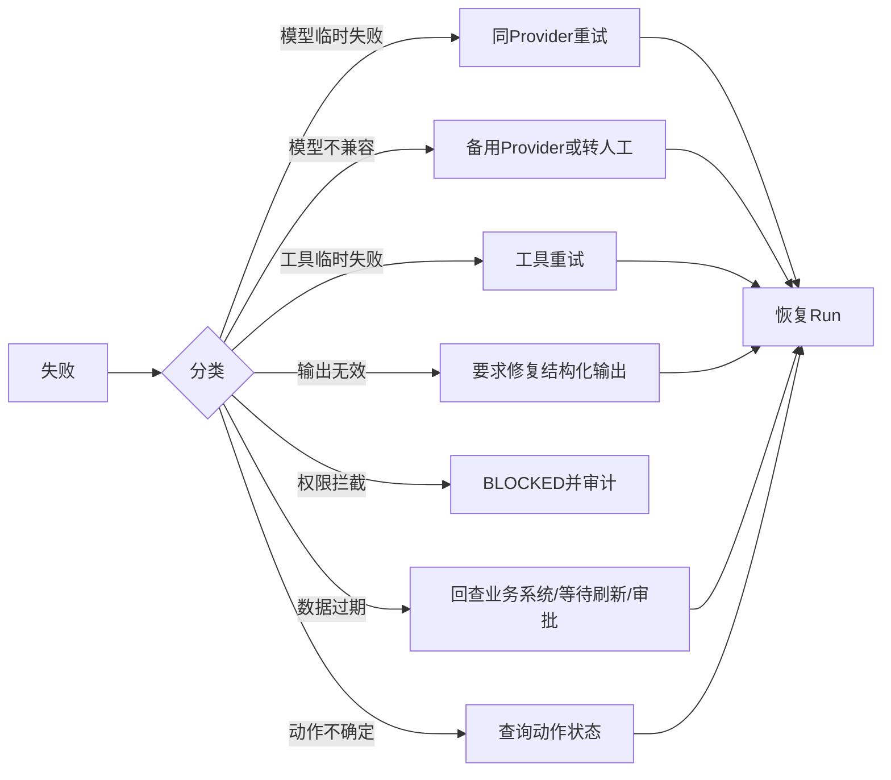

---

## 21. 幂等、并发与锁

### 21.1 幂等记录

`agent_idempotency_record`：

| 字段 | 说明 |
|---|---|
| `idempotency_key` | 唯一键 |
| `operation_type` | 操作 |
| `case_id` | Case |
| `run_id` | Run |
| `request_hash` | 请求摘要 |
| `status` | processing/succeeded/failed/unknown |
| `result_ref` | 结果引用 |
| `expires_at` | 过期 |
| `created_at` | 创建 |
| `updated_at` | 更新 |

### 21.2 Case 乐观锁

```sql
UPDATE agent_case
SET status = :to_status,
    current_step_id = :next_step_id,
    version_no = version_no + 1,
    updated_at = NOW(3)
WHERE case_id = :case_id
  AND version_no = :expected_version
  AND status = :expected_status;
```

影响行数为 0 时重新加载并判断。

### 21.3 调度租约

多个 Worker 领取到期任务时使用：

```text
status = pending
AND scheduled_at <= now
AND (lease_until IS NULL OR lease_until < now)
```

领取后设置 `leased`、`lease_owner` 和 `lease_until`。

---

## 22. 前端模块设计

### 22.1 页面规划

| 页面 | 功能 |
|---|---|
| AI 岗位 | Role 列表、版本、Skill、工具和 Harness |
| AI 员工 | 创建、范围、能力、自动化等级、启停 |
| 流程模板 | 步骤、执行者、Skill、审批和路由 |
| Case 工作台 | Case 列表、状态、责任人、下次检查 |
| Case 详情 | 证据、流程、Run、审批、动作和历史 |
| Run Trace | 模型步骤、工具、Gateway、输出校验 |
| 人工审批 | 审批、修改、补查、转交 |
| Skill 管理 | Schema、工具、版本和评测 |
| 监控 | 运行质量、成本、业务效果和错误 |

### 22.2 Case 详情布局

建议顺序：

1. Case 摘要；
2. 当前状态和责任人；
3. 风险与证据；
4. 流程步骤；
5. 待办和审批；
6. 已执行业务动作；
7. Run Trace；
8. 历史事件；
9. 最终结果与复盘。

### 22.3 Trace 展示

沿用现有 Demo “先看执行过程，再看最终结果”的原则，但增加：

- AI 员工身份；
- Role 和 Skill 版本；
- Workflow Step；
- Case 状态变化；
- 审批暂停和恢复；
- 数据截止时间；
- 业务动作状态。

---

## 23. 后端代码模块建议

```text
backend/app/
├─ api/
│  ├─ roles.py
│  ├─ employees.py
│  ├─ skills.py
│  ├─ workflows.py
│  ├─ cases.py
│  ├─ runs.py
│  ├─ approvals.py
│  └─ triggers.py
├─ domain/
│  ├─ role/
│  ├─ employee/
│  ├─ skill/
│  ├─ workflow/
│  ├─ case/
│  ├─ approval/
│  └─ tool/
├─ runtime/
│  ├─ adapter.py
│  ├─ openai_agents_runtime.py
│  ├─ responses_runtime.py
│  ├─ context_assembler.py
│  └─ output_validator.py
├─ harness/
│  ├─ policies.py
│  ├─ guardrails.py
│  ├─ retry.py
│  ├─ budget.py
│  └─ recovery.py
├─ tools/
│  ├─ gateway.py
│  ├─ registry.py
│  ├─ context.py
│  ├─ hologres/
│  ├─ business/
│  └─ approval/
├─ services/
│  ├─ role_service.py
│  ├─ employee_service.py
│  ├─ workflow_service.py
│  ├─ case_service.py
│  ├─ runner_service.py
│  ├─ trigger_service.py
│  └─ approval_service.py
├─ repositories/
├─ events/
├─ scheduler/
├─ observability/
└─ tests/
```

现有 POC 文件可逐步映射，不要求立即重排所有目录。

---

## 24. 配置与环境变量

### 24.1 配置分类

- MySQL；
- Hologres；
- Redis；
- 队列；
- 模型 Provider；
- Runtime；
- Tool Gateway；
- Harness 默认值；
- 对象存储；
- Trace；
- 安全密钥。

### 24.2 关键环境变量示例

```text
MYSQL_DSN
HOLOGRES_DSN
REDIS_URL
QUEUE_PROVIDER
MODEL_PROVIDER_CONFIG_PATH
DEFAULT_RUNTIME_ADAPTER
AGENT_MAX_MODEL_TURNS
AGENT_MAX_TOOL_CALLS
AGENT_RUN_TIMEOUT_SECONDS
AGENT_TOOL_TIMEOUT_MS
AGENT_DEFAULT_BUDGET
AGENT_TRACE_ENABLED
AGENT_ACTION_WRITE_ENABLED
AGENT_SCHEDULER_ENABLED
OSS_ENDPOINT
OSS_BUCKET
```

生产密钥不写入 Role、Skill 或 Workflow 配置。

---

## 25. 测试与 Evals 设计

### 25.1 单元测试

- 状态转换；
- Scope 交集；
- Tool 白名单交集；
- 保留参数；
- JSON Schema；
- 路由规则；
- 审批策略；
- 幂等键；
- Context 裁剪；
- 数据新鲜度。

### 25.2 集成测试

- Hologres 固定查询；
- Tool Gateway；
- 业务动作 Mock；
- Workflow + Case；
- 审批暂停恢复；
- 调度租约；
- Runtime Adapter；
- MySQL 事务和乐观锁。

### 25.3 安全测试

必须覆盖：

```text
跨租户
跨区域
跨门店
伪造enterprise_id
伪造employee_id
模型传auth_token
非法工具
超日期范围
超结果行数
绕过审批
重复业务动作
已停用员工执行
过期数据自动动作
```

### 25.4 Skill Evals

每个 Skill 建立数据集：

- 正常案例；
- 无数据；
- 部分数据；
- 冲突证据；
- 越权参数；
- 高风险；
- 责任人缺失；
- 重复问题；
- 工单已关闭；
- 数据过期。

评价：

- 输出 Schema 通过；
- 证据引用正确；
- 风险等级合理；
- 不编造；
- 下一步路由正确；
- 是否错误触发审批；
- 成本和工具调用数。

### 25.5 Workflow 验收案例

第一阶段至少有：

1. 普通风险 → 草稿 → 人工批准 → 等待结果 → 关闭；
2. 证据不足 → 补查 → 继续；
3. 食安红线 → 专业复核 → 人工审批；
4. 整改超时 → 催办 → 升级；
5. 重复事件 → 恢复已有 Case；
6. 工具越权 → BLOCKED；
7. 数据过期 → 降级为人工建议；
8. 服务重启 → 恢复待跟进 Case；
9. 重复动作 → 返回历史结果；
10. 人工驳回 → 关闭或返回调查。

---

## 26. 当前 POC 迁移方案

### 26.1 保留能力

- FastAPI；
- Vue3；
- HologresService；
- 固定 SQL；
- Tool Gateway 核心思路；
- Token 与 Scope；
- `agent_run`、`agent_tool_call`、`agent_final_answer`；
- 证据完整性检查；
- Trace 页面；
- 模型 Provider 配置。

### 26.2 结构升级

```text
risk_store_analysis
    ↓
AgentSkillVersion

当前 demo run
    ↓
AgentRun

当前用户提问入口
    ↓
Manual Trigger

当前工具列表
    ↓
Tool Registry + Step/Skill/Employee 交集

当前 final answer
    ↓
Structured Output + Display Markdown

新增：
Role
Employee
Workflow
Case
Approval
Trigger
FollowupSchedule
RuntimeAdapter
```

### 26.3 迁移顺序

1. 为现有 Skill 增加输入输出 Schema；
2. 抽象 Runtime Adapter；
3. 新增 Role 和 Employee；
4. 将现有 Run 绑定 Employee 和 Skill Version；
5. 新增 Case，先支持人工创建；
6. 增加单一 Workflow；
7. 增加 Follow-up Schedule；
8. 增加人工审批；
9. 接一个草稿动作工具；
10. 灰度真实写工具；
11. 接数仓刷新事件；
12. 评估 OpenAI Agents SDK Runtime。

---

## 27. 第一阶段迭代拆分

### 迭代 1：对象和只读链路

- Role；
- Employee；
- Skill Version；
- Workflow Version；
- Case；
- 现有 POC Run 绑定；
- 风险门店调查结构化输出。

### 迭代 2：流程和持续跟进

- Workflow Executor；
- Case 状态机；
- Follow-up Schedule；
- 人工下派；
- 到期恢复；
- Case 页面。

### 迭代 3：审批与草稿动作

- Approval Policy；
- Approval Engine；
- 整改任务草稿；
- 催办消息草稿；
- 审批页面；
- Trace 扩展。

### 迭代 4：低风险真实动作

- 业务 API 接入；
- 幂等；
- 状态回查；
- 低风险提醒；
- 普通整改任务灰度；
- 业务效果指标。

### 迭代 5：岗位扩展验证

- AI 食安监察员或 AI 运营经理；
- 验证 Skill、Case、Approval、Tool Gateway 的复用；
- 验证第二岗位无需重做公共底座。

---

## 28. 详细设计结论

好多店 AI Native 业务执行系统的落地重点不是增加更多 Prompt，而是建立完整、清晰的业务执行对象：

```text
Role Version
    ↓ 定义职责和边界
Agent Employee
    ↓ 承担租户和区域责任
Workflow Step
    ↓ 安排当前任务
Skill Version
    ↓ 完成不确定性业务判断
Tool Gateway
    ↓ 安全调用数据和业务动作
Run
    ↓ 记录一次执行
Case
    ↓ 跨多次Run持续推进
Approval / Harness / Trace
    ↓ 保证安全、恢复和审计
```

第一阶段应在现有风险门店分析 POC 基础上增量建设，而不是推倒重来。真正的完成标志不是“模型能回答风险问题”，而是：

> **AI 巡店督导能够被任务或事件唤醒，在授权范围内调查风险，形成结构化结果，生成受控整改动作，经过必要审批，并在未来持续跟进到 Case 关闭。**

---

## 参考材料

- 《好多店 AI Native 业务执行系统需求文档 V0.1》
- 《好多店 AI Native 业务执行系统总体架构设计 V0.1》
- 《HDD Hologres 数仓总体设计文档》
- 《好多店 Agent Service POC 项目总体大杂烩问答》
- 《好多店 Agent 场景地图与内部子 Agent 梳理》
- 《Agent 底座抽象与验证指南》
