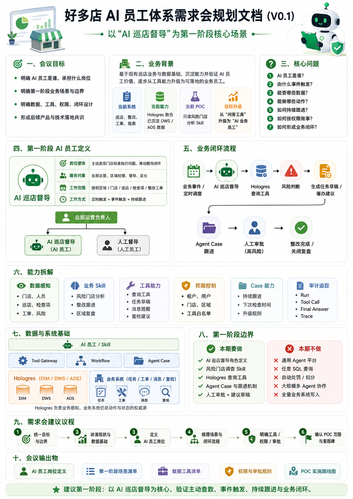
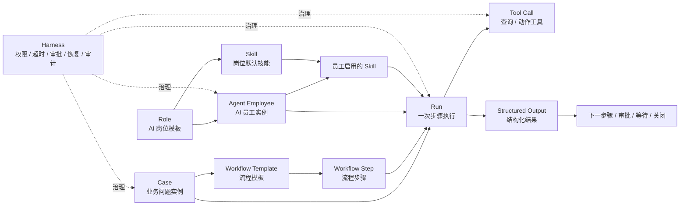
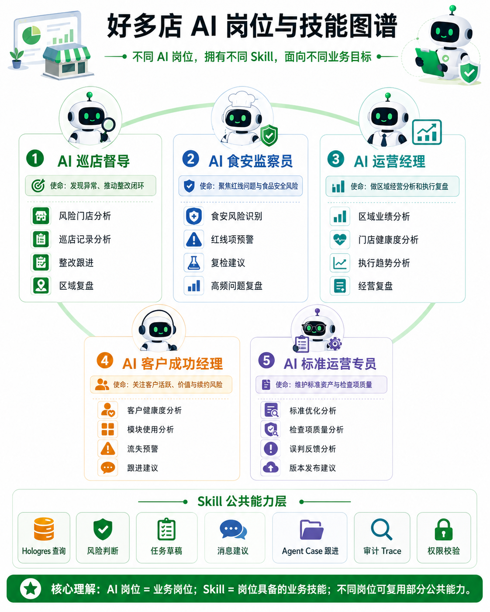
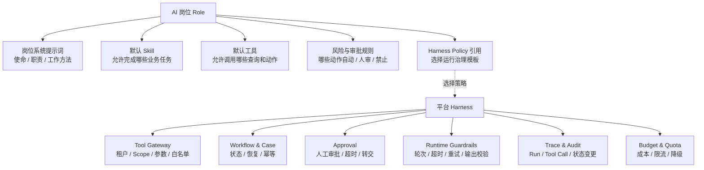
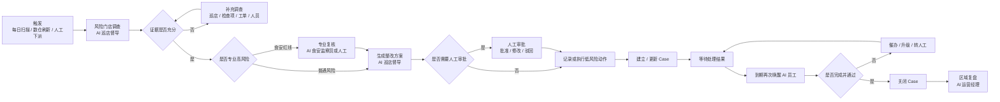

# 好多店 AI Native 业务执行系统需求文档

> **版本**：V0.1  
> **状态**：需求规划初稿  
> **日期**：2026-07-16  
> **适用对象**：产品、架构、研发、测试、数据、交付、运营  
> **第一阶段核心场景**：AI 巡店督导  
> **文档定位**：定义好多店 AI 员工体系的业务目标、核心对象、产品能力、首期范围和验收标准。本文不替代总体架构设计与详细系统设计。

---

## 0. 执行摘要

好多店已经具备门店、区域、人员岗位、巡店、检查项、整改工单、风险门店等业务对象，并通过 Hologres 数仓形成 DIM、DWD、DWS、ADS 分层数据产品。现有 Agent Service POC 已验证模型工具规划、Hologres 只读查询、租户与门店权限、固定 SQL、工具审计、证据检查和最终解读等基础能力。

下一阶段不再把系统定位为“聊天问数”或“风险分析页面”，而是建设：

> **能够承担业务岗位、由事件唤醒、主动查数、调用工具、持续跟进并推动结果关闭的 AI Native 业务执行系统。**

首期以 **AI 巡店督导** 为第一个 AI 岗位，通过“风险发现—补充调查—生成整改建议—人工审批—持续跟进—关闭复盘”的完整链路，验证 AI 员工是否能够真正承担好多店组织中的业务责任。



---

## 1. 项目背景

### 1.1 当前业务基础

好多店现有业务系统已经沉淀了较完整的连锁门店管理能力，包括但不限于：

- 企业、品牌、区域、门店；
- 店长、督导、区域经理及岗位关系；
- 巡店任务、巡店记录、检查表、检查项；
- 店务任务、陈列任务及执行记录；
- 不合格问题、整改工单、复核和关闭状态；
- 风险门店、连续未巡、重复不合格、工单超时等管理指标；
- 多租户、区域、门店和用户数据权限。

现有 Hologres 数仓已经形成 ODS、DIM、DWD、DWS、ADS 分层，能够为 Agent 提供稳定、可解释、可下钻的业务数据。

### 1.2 当前 POC 的价值与局限

当前 `risk_store_analysis` POC 可以理解为未来 AI 巡店督导的一项 **“风险门店调查 Skill”**，它已经验证：

- 模型可以选择固定业务工具；
- Hologres 可以作为 Agent 的数据感知来源；
- Tool Gateway 可以限制租户、用户、门店、区域、日期和工具范围；
- 模型不能直接访问数据库或生成自由 SQL；
- Run、Tool Call、最终回答可以被审计和回放；
- 证据获取与最终解释可以分阶段执行。

当前 POC 仍然存在明确边界：

- 主要由用户提问触发；
- 只有一个只读 Skill；
- 不创建工单、不发送消息、不修改业务状态；
- 一次 Run 完成后即结束；
- 没有长期 Case、持续跟进和恢复机制；
- 尚未形成明确的 AI 岗位与 AI 员工体系。

因此，本次规划不会照搬 POC 的边界，而是复用其中已经验证的安全查询、工具治理和审计能力。

---

## 2. 建设目标

### 2.1 总体目标

建设好多店自己的 AI Native 业务执行系统，使 AI 能够以“业务员工”的形式进入组织和业务流程。

系统需要支持：

1. 定义不同 AI 岗位；
2. 基于岗位创建具体 AI 员工；
3. 为 AI 员工配置负责范围、Skill、工具、权限和审批等级；
4. 通过定时任务、业务事件、数仓刷新事件和人工任务唤醒 AI 员工；
5. 在流程步骤中指定 AI 员工使用对应 Skill 完成任务；
6. 通过结构化输出推动流程流转；
7. 对长期业务问题建立 Case，跨多次 Run 持续跟进；
8. 在高风险节点由人工审批或裁决；
9. 对全过程进行权限控制、恢复、审计和评价。

### 2.2 第一阶段目标

第一阶段以 **AI 巡店督导** 为核心，验证以下七项能力：

| 验证项 | 第一阶段目标 |
|---|---|
| AI 业务岗位 | 定义 AI 巡店督导的使命、职责、边界和 KPI |
| AI 员工实例 | 创建指定租户、区域和门店范围的 AI 巡店督导员工 |
| 主动触发 | 支持定时触发、数仓刷新完成触发和人工下派任务 |
| 自主查数 | 按需查询风险门店、巡店记录、检查项、工单和责任人 |
| 流程执行 | 在流程步骤中使用 Skill，输出结构化结果 |
| 持续跟进 | 建立 Case，并在未来时间再次唤醒和推进 |
| 人机协同 | 普通建议可自动生成，高风险动作必须人工审批 |

### 2.3 项目价值

对总部运营和区域管理人员：

- 减少重复查询、汇总、催办和复盘工作；
- 提高风险发现及时性；
- 提高整改闭环率；
- 缩短问题平均处理时间；
- 降低高频问题复发率；
- 让管理过程有证据、有记录、可追溯。

对好多店产品：

- 从“巡店和任务工具”升级为“标准执行与业务闭环平台”；
- 形成可持续扩展的 AI 岗位与 Skill 产品体系；
- 为图片检测、食安、陈列、运营分析、客户成功等场景提供共用底座。

---

## 3. 核心定义

整个项目统一采用以下五句话，不再混用“岗位、Agent、Skill、Workflow、Run、Case”等概念：

> **岗位定义“这个角色能做什么、应该怎么做、不能做什么”。**  
> **员工定义“谁在什么范围内承担这个岗位”。**  
> **流程定义“什么时候让谁完成哪一步”。**  
> **Skill 定义“这一类任务如何完成”。**  
> **Harness 保证执行过程受控、可恢复、可审批和可审计。**

### 3.1 核心对象

| 对象 | 定义 | 示例 |
|---|---|---|
| Role | AI 岗位模板，定义使命、职责、默认 Skill、工具和规则 | AI 巡店督导 |
| Agent Employee | Role 实例化后的具体执行主体 | 华东区 AI 巡店督导 001 |
| Skill | 完成一类业务任务的方法、提示、工具和输出契约 | 风险门店分析 |
| Workflow | 定义任务由哪些步骤组成，以及每一步由谁完成 | 风险门店整改闭环流程 |
| Workflow Step | 流程中可执行、可校验、可流转的单一步骤 | 补充调查 |
| Case | 一件需要持续推进到关闭的业务问题实例 | 西湖店后厨卫生整改 |
| Run | 某个 AI 员工执行某一步的一次运行 | 2026-07-16 09:00 风险调查 |
| Tool | 确定性的数据查询或业务动作 | 查询工单、生成任务草稿 |
| Harness | 包围模型执行的运行治理能力 | 权限、审批、恢复、审计 |

### 3.2 全对象关系



---

## 4. AI 岗位体系

### 4.1 AI 岗位与 Skill 图谱



### 4.2 首批岗位规划

| 优先级 | AI 岗位 | 岗位使命 | 主要 Skill |
|---|---|---|---|
| P0 | AI 巡店督导 | 发现标准执行问题，推动整改闭环 | 风险门店分析、巡店记录分析、整改跟进、区域复盘 |
| P1 | AI 食安监察员 | 聚焦食品安全红线和高风险问题 | 食安风险识别、红线预警、复检建议、高频问题复盘 |
| P1 | AI 运营经理 | 进行区域执行和经营复盘 | 区域业绩分析、门店健康度、执行趋势、经营复盘 |
| P2 | AI 客户成功经理 | 关注客户活跃、产品价值与续约风险 | 客户健康度、模块使用、流失预警、跟进建议 |
| P2 | AI 标准运营专员 | 维护标准资产和检查项质量 | 标准优化、检查项质量、误判反馈、版本发布建议 |

### 4.3 Role 与 Harness 的关系

Role 中可以配置默认系统提示词和默认运行策略，但 **Harness 不能只存在于提示词中**。



---

## 5. AI 员工创建与管理

### 5.1 基本原则

Role 是岗位模板，Agent Employee 才是实际执行主体。

一个 Role 可以创建多个 AI 员工，例如：

- 华东区 AI 巡店督导 001；
- 华南区 AI 巡店督导 002；
- 全国直营门店 AI 巡店督导 003。

它们岗位相同，但负责范围、启用 Skill、工具权限、自动化等级和人工负责人可以不同。


### 5.2 创建 AI 员工时必须配置

| 配置项 | 说明 |
|---|---|
| 员工名称 | 租户内可识别的具体 AI 员工名称 |
| 所属岗位 | 选择 Role 模板 |
| 所属租户 | AI 员工只能服务一个明确租户 |
| 负责范围 | 企业全部、区域集合或门店集合 |
| 启用 Skill | 从岗位默认 Skill 中启用或收窄 |
| 可用工具 | 查询、草稿、消息、任务、复检等白名单 |
| 自动化等级 | 只读、草稿、人审后执行、低风险自动执行 |
| 人工负责人 | AI 员工的业务管理和升级责任人 |
| 运行时间 | 定时计划、事件订阅和工作时间 |
| 状态 | 草稿、启用、暂停、停用 |

### 5.3 Skill 继承与收窄

AI 员工默认继承岗位 Skill，但不能自动扩大能力。

```text
岗位默认 Skill
    ↓ 继承
AI 员工启用 Skill
    ↓ 根据租户、区域、门店和风险策略收窄
流程步骤允许使用的 Skill
```

最终生效能力应取以下交集：

```text
岗位允许
∩ 员工启用
∩ 流程步骤允许
∩ 当前权限允许
∩ 当前风险策略允许
```

---

## 6. 第一阶段 AI 岗位：AI 巡店督导

### 6.1 岗位定义

**岗位名称**：AI 巡店督导  
**长期定位**：AI 标准执行督导  
**第一阶段范围**：巡店异常发现与整改跟进

**岗位使命**：

> 在授权的企业、区域和门店范围内，持续发现巡店执行和整改风险，定位责任人，生成或执行受控动作，并持续跟进到业务问题关闭。

### 6.2 服务对象

- 总部运营负责人；
- 区域经理；
- 人工督导；
- 门店店长；
- 食安、稽核等专业人员。

### 6.3 工作职责

1. 扫描风险门店和异常候选；
2. 下钻巡店、检查项、整改和责任关系；
3. 判断风险类型、等级、证据完整性和影响范围；
4. 生成整改任务草稿、催办建议或升级建议；
5. 建立 Case 并持续跟进；
6. 在指定时间重新查询处理状态；
7. 关闭、催办、升级或转人工；
8. 生成日、周、区域复盘。

### 6.4 可做与不可做

| 可以做 | 默认不可直接做 |
|---|---|
| 查询授权范围内的数据 | 跨租户、跨授权区域查询 |
| 定位店长、督导和责任人 | 修改历史巡店事实 |
| 生成风险判断和证据摘要 | 自动处罚、罚款或扣分 |
| 生成整改任务草稿 | 自动停售或重大责任定性 |
| 发送低风险提醒建议 | 修改总部标准 |
| 持续跟进 Case | 绕过业务 API 直接改数据库 |
| 按规则升级人工负责人 | 无证据关闭问题 |

### 6.5 岗位 KPI

| KPI | 说明 |
|---|---|
| 有效风险发现率 | AI 发现的问题中被人工或后续事实确认的比例 |
| 人工改判率 | AI 风险结论被人工修改的比例 |
| 整改关闭率 | AI 跟进 Case 最终关闭比例 |
| 平均关闭时长 | 从 Case 创建到关闭的平均时间 |
| 整改超时率 | AI 管理 Case 中超时比例 |
| 问题复发率 | 关闭后同类问题再次发生比例 |
| 自动化处理率 | 无需人工介入完成的低风险步骤比例 |
| 越权动作数 | 必须为 0 |
| 无依据结论率 | 缺少真实数据支撑的结论比例 |

---

## 7. 业务流程与任务模型

### 7.1 下派任务的定义

在本系统中，“下派任务”不是简单创建一条待办，而是：

> **根据流程模板创建一个流程实例，并在需要持续跟进时建立一个业务 Case。**

流程模板定义“应该怎样做”，流程实例表示“这一次正在做”，Case 表示“这件业务问题需要持续推进到关闭”。

### 7.2 流程步骤执行模型

流程中的每一步必须明确：

- 步骤目标；
- 执行者：具体 AI 员工、岗位动态路由或人工角色；
- 使用 Skill；
- 输入数据；
- 可用工具；
- 输出 Schema；
- 成功和失败条件；
- 审批条件；
- 下一步路由；
- 超时、重试和升级策略。


### 7.3 第一阶段示例流程



---

## 8. 功能需求

以下编号作为后续架构、设计、研发和验收的统一引用。

### 8.1 AI 岗位管理

#### FR-ROLE-001 创建 AI 岗位

系统应支持创建 AI 岗位模板，并维护：

- 岗位名称、编码和说明；
- 岗位使命、职责和服务对象；
- 默认系统提示词；
- 默认 Skill；
- 默认工具白名单；
- 默认风险与审批规则；
- 默认 Harness Policy；
- 适用场景和状态。

#### FR-ROLE-002 岗位版本管理

岗位定义发生变化时应保留版本，已运行的 Run 和 Case 必须能够追溯到当时使用的岗位版本。

#### FR-ROLE-003 岗位启停

岗位可处于草稿、启用、暂停和停用状态。停用岗位不得创建新员工，既有 Case 的处理方式由停用策略决定。

---

### 8.2 AI 员工管理

#### FR-EMP-001 基于岗位创建 AI 员工

系统应支持从 Role 创建具体 AI 员工，并保存岗位版本关系。

#### FR-EMP-002 配置负责范围

支持：

- 企业全量；
- 区域集合；
- 门店集合；
- 后续可扩展品牌、加盟商或业务域。

员工实际数据范围不能超过创建人和租户允许的权限范围。

#### FR-EMP-003 配置 Skill 和工具

AI 员工只能从所属岗位允许的 Skill 和工具中启用子集，不得扩大岗位边界。

#### FR-EMP-004 配置自动化等级

建议支持：

| 等级 | 行为 |
|---|---|
| L0 | 只读分析，不生成业务动作 |
| L1 | 生成建议或业务草稿，必须人工确认 |
| L2 | 普通低风险动作可自动执行，高风险人审 |
| L3 | 自动催办和按规则升级，关键动作人审 |
| L4 | 高自动化，仅限明确授权的低风险场景 |

第一阶段默认 L1，部分纯提醒类动作可灰度到 L2。

#### FR-EMP-005 人工负责人

每个启用的 AI 员工必须配置人工负责人，用于审批、升级、异常处理和停用接管。

---

### 8.3 Skill 管理

#### FR-SKILL-001 Skill 定义

每个 Skill 应包含：

- Skill 名称、编码和版本；
- 任务目标和适用条件；
- 输入 Schema；
- 执行指令和上下文组装规则；
- 可用工具；
- 必需证据规则；
- 输出 Schema；
- 失败、降级和转人工规则；
- 质量评价指标。

#### FR-SKILL-002 结构化输出

Skill 不应只返回自由文本。关键结果必须满足 JSON Schema 或等价结构化契约。

#### FR-SKILL-003 Skill 复用

同一 Skill 可以被多个岗位复用，但不同岗位可以配置不同提示、工具、输出策略和审批规则。

#### FR-SKILL-004 当前 POC 能力迁移

现有 `risk_store_analysis` 应作为 **风险门店调查 Skill** 纳入体系，而不是继续作为系统最高层。

---

### 8.4 流程管理

#### FR-WF-001 流程模板

支持创建流程模板，定义：

- 触发类型；
- 流程步骤；
- 步骤顺序和分支；
- 执行者绑定方式；
- Skill；
- 输入输出；
- 审批节点；
- 超时和升级；
- 结束条件。

#### FR-WF-002 执行者绑定

流程步骤支持以下执行者：

- 指定 AI 员工；
- 按岗位和负责范围动态选择 AI 员工；
- 指定人工用户；
- 按角色或岗位路由人工审批人。

#### FR-WF-003 流程版本

已启动的流程实例继续使用创建时的模板版本，新版本不得无审计地改变正在执行的流程。

#### FR-WF-004 条件流转

步骤完成后，系统应基于结构化输出、规则和审批结果决定：

- 进入下一步骤；
- 返回补充调查；
- 等待未来事件；
- 等待人工审批；
- 升级；
- 关闭；
- 失败终止。

---

### 8.5 Case 与持续跟进

#### FR-CASE-001 建立业务 Case

当问题需要跨时间持续推进时，应建立 Case。Case 至少保存：

- 业务类型和业务键；
- 企业、区域、门店；
- 当前状态和当前步骤；
- 风险等级和证据；
- 责任人、AI 员工和人工负责人；
- 已执行动作；
- 下一次检查时间；
- 关闭和升级条件；
- 关联 Run。

#### FR-CASE-002 Case 去重与关联

同一业务问题不能因重复事件无限创建 Case。系统应通过业务键、事件关联键和状态判断创建、恢复或合并。

#### FR-CASE-003 定时恢复

到达 `next_check_at` 后，系统应重新唤醒对应 AI 员工，读取 Case 状态并执行下一次 Run。

#### FR-CASE-004 Case 状态

建议第一阶段支持：

```text
CREATED
DISCOVERED
INVESTIGATING
ACTION_PROPOSED
WAITING_APPROVAL
ACTION_EXECUTED
WAITING_RESULT
FOLLOWING_UP
ESCALATED
RESOLVED
CLOSED
CANCELLED
FAILED
```

---

### 8.6 事件与触发

#### FR-TRIGGER-001 定时触发

支持每日风险扫描、Case 到期复查、每周区域复盘等定时任务。

#### FR-TRIGGER-002 数仓触发

支持在 Hologres 指定分层刷新完成且数据质量检查通过后触发 Agent 任务。

#### FR-TRIGGER-003 业务事件

后续支持：

- 巡店提交；
- 红线项命中；
- 工单即将或已经超时；
- 整改证据提交；
- 整改驳回；
- 复检失败；
- 人工要求继续调查。

#### FR-TRIGGER-004 人工下派

人工可以选择流程模板、业务对象和负责 AI 员工创建流程实例或 Case。

---

### 8.7 Hologres 数据工具

#### FR-DATA-001 数据查询边界

Agent 不得直接连接数据库，不得生成自由 SQL。所有查询必须通过固定业务工具或受控查询服务。

#### FR-DATA-002 业务问题式工具

工具应按业务问题设计，而不是按表名设计，例如：

- `get_authorized_store_scope`
- `get_store_responsible_people`
- `get_high_risk_stores`
- `get_store_risk_context`
- `get_store_recent_patrols`
- `get_store_repeated_failures`
- `get_open_remediations`
- `get_overdue_remediations`
- `get_supervisor_risk_summary`
- `get_common_failed_items`

#### FR-DATA-003 数据新鲜度

每个数据工具应返回：

- 数据截止时间；
- 数仓层级或数据源；
- 刷新状态；
- 是否部分数据；
- 是否截断；
- 查询追踪 ID。

数据过期、刷新失败或结果不完整时，不得自动执行高风险动作。

#### FR-DATA-004 分层使用原则

- 高频总览和候选筛选优先 ADS；
- 明细、证据和下钻优先 DWS；
- 维度、责任关系和检查标准使用 DIM；
- Agent 不直接扫描 ODS 大表。

---

### 8.8 业务动作与人工审批

#### FR-ACTION-001 首期动作范围

第一阶段优先支持逻辑动作：

- 生成整改任务草稿；
- 生成催办消息草稿；
- 提交人工审批；
- 创建复检建议；
- Case 升级建议；
- 查询业务动作状态。

具体业务 API 在详细设计阶段与现有业务系统映射。

#### FR-ACTION-002 写动作安全

所有写动作必须经过 Tool Gateway，并实施：

- 租户与 Scope 校验；
- 工具权限；
- 参数校验；
- 幂等键；
- 影响预览；
- 审批判断；
- 执行审计；
- 失败补偿或人工接管。

#### FR-APPROVAL-001 人工审批

人工审批应支持：

- 批准；
- 修改后批准；
- 驳回；
- 要求补充调查；
- 转交；
- 关闭；
- 超时升级。

#### FR-APPROVAL-002 强制审批范围

以下动作第一阶段必须人工审批：

- 处罚、罚款和扣分；
- 停售、停业或重大业务限制；
- 重大食安责任定性；
- 修改总部标准；
- 影响员工考核；
- 跨区域或跨权限范围动作；
- 数据不完整或结论冲突的动作。

---

### 8.9 Run、Trace 与审计

#### FR-RUN-001 Run 记录

每次 Run 必须记录：

- 触发来源；
- Role、Employee、Skill、Workflow、Step、Case；
- 输入和权限 Scope 快照；
- 岗位、Skill、模型和提示版本；
- 数据截止时间；
- 工具调用；
- 结构化输出；
- 状态、耗时、成本和错误。

#### FR-TRACE-001 可观察 Trace

Trace 展示的是应用可观察事件，不是模型隐藏思维链，包括：

- 触发；
- 上下文装配；
- 模型请求；
- 明确工具调用；
- Gateway 校验；
- 工具执行；
- 输出校验；
- 审批；
- Case 状态变化；
- 最终结果。

#### FR-AUDIT-001 审计要求

所有成功、失败和被拦截的工具调用都必须审计。任何跨租户或越权行为必须能够追溯。

---

## 9. Harness 需求

Harness 是平台级运行治理能力，必须通过后端强制执行。

### 9.1 运行控制

- 最大模型轮次；
- 单次和整条流程超时；
- 同 Provider 重试；
- 模型降级策略；
- Token、成本和调用额度；
- 并发和速率限制；
- 重复工具调用检测；
- 终止条件。

### 9.2 权限与 Guardrails

- Token 和租户身份由后端注入；
- AI 员工负责范围固化；
- 工具白名单；
- 保留参数拦截；
- 输入和输出 Schema；
- 敏感动作拦截；
- 数据完整性和新鲜度检查；
- 需要审批时阻断自动执行。

### 9.3 持久化与恢复

- Run 状态持久化；
- Case 状态持久化；
- 流程步骤状态持久化；
- 等待审批和等待事件时暂停；
- 服务重启后恢复；
- 工具幂等；
- 重复事件去重；
- 失败重试和人工接管。

### 9.4 可观测与评测

- Trace；
- 业务审计；
- 运行指标；
- 单次成本；
- 线上质量；
- 人工改判；
- 业务结果；
- 回归评测。

---

## 10. 数据与系统边界

### 10.1 Hologres 的角色

Hologres 是 Agent 的主要 **业务感知层**，负责：

- 门店、区域、人员和岗位；
- 巡店、店务、检查项；
- 整改工单和风险命中；
- 门店日执行、风险画像和趋势；
- Agent 候选触发数据；
- 后续 Agent 效果分析。

### 10.2 Hologres 不承担

- 业务动作的权威写入；
- 流程实时状态机；
- Case 实时持久化；
- 审批状态；
- 工具执行事务。

### 10.3 业务系统的角色

现有业务系统仍是以下对象的权威源：

- 任务；
- 工单；
- 消息；
- 巡店和整改状态；
- 审批；
- 复检；
- 业务最终结果。

### 10.4 Agent Runtime 数据

建议由 MySQL 或等价事务数据库保存：

- Role 和版本；
- Agent Employee；
- Skill 和版本；
- Workflow 和版本；
- Case；
- Run；
- Tool Call；
- Approval；
- Trace 索引；
- 触发和调度。

---

## 11. 非功能需求

### 11.1 安全

- 多租户完全隔离；
- 所有业务查询显式绑定 `enterprise_id`；
- 普通用户和 AI 员工不得通过请求参数扩大 Scope；
- 原始 Token 不进入模型和工具参数；
- 写操作必须审计和幂等；
- 越权动作数量必须为 0。

### 11.2 可靠性

- 长流程可暂停和恢复；
- 服务重启不丢 Case；
- 重复事件不重复执行高风险动作；
- 工具失败可重试、降级或转人工；
- 模型失败不能破坏业务状态；
- 业务动作执行结果必须以业务系统返回为准。

### 11.3 性能

第一阶段建议目标：

- 常规只读 Skill P95 在可接受演示和业务使用范围内；
- 大范围查询优先使用 ADS 候选筛选；
- 工具结果严格控制行数和大小；
- 不允许模型扫描全量明细；
- 长耗时任务支持异步执行和状态查询。

具体性能数值在架构设计中结合部署规格确定。

### 11.4 可扩展性

新增岗位或 Skill 时，不应重复建设：

- 权限；
- Tool Gateway；
- Case；
- Run；
- 审批；
- Trace；
- 调度；
- 数据新鲜度；
- 成本控制。

### 11.5 可解释性

每个业务结论必须能说明：

- 使用了哪些数据；
- 数据截至什么时候；
- 命中了什么规则或证据；
- 哪个 AI 员工和 Skill 生成；
- 哪些动作由人工批准；
- 最终业务结果是什么。

---

## 12. 第一阶段范围

### 12.1 本期必须完成

- AI 岗位基础定义；
- AI 员工创建、启停和负责范围；
- AI 巡店督导岗位；
- 风险门店调查 Skill；
- 巡店记录补充调查 Skill；
- 整改跟进 Skill；
- 流程模板和步骤执行；
- Case 创建、状态和定时恢复；
- Hologres 只读查询工具；
- 任务草稿和催办建议；
- 人工审批；
- Run、Tool Call、Case、审批和 Trace 审计；
- 数据新鲜度和权限校验。

### 12.2 本期建议灰度验证

- 低风险提醒自动发送；
- 普通整改任务的真实创建；
- 数仓刷新完成事件触发；
- AI 食安监察员参与专业复核；
- AI 运营经理完成区域复盘。

### 12.3 本期不做

- 通用低代码 Agent 平台；
- 客户自由编写任意 Prompt 和任意 SQL；
- 大规模多 Agent 自治协商；
- 自动处罚、罚款、扣分和停售；
- 让模型直接修改数据库；
- 全部业务系统写接口一次性接入；
- 用一个长期聊天 Session 代替 Case；
- 把每个确定性步骤拆成独立 Agent。

---

## 13. POC 建议场景

### 13.1 场景名称

**AI 巡店督导：风险门店整改跟进**

### 13.2 触发

首期支持：

- 每日指定时间；
- Hologres ADS 刷新成功后；
- 人工选择区域或门店下派；
- Case 到期复查。

### 13.3 风险候选

- 连续多日未巡；
- 最近巡店得分明显下降；
- 同一检查项重复不合格；
- 红线或否决项；
- 未关闭整改工单；
- 整改工单超时；
- 整改后再次复发；
- 督导负责范围内风险门店集中增加。

### 13.4 核心步骤

| 步骤 | 执行者 | Skill | 结构化输出 |
|---|---|---|---|
| 风险筛选 | AI 巡店督导 | 风险门店分析 | 风险门店候选 |
| 补充调查 | AI 巡店督导 | 巡店记录分析 | 风险原因与证据 |
| 专业复核 | AI 食安监察员或人工 | 食安风险识别 | 红线判断和复检建议 |
| 整改方案 | AI 巡店督导 | 整改跟进 | 任务草稿和截止时间 |
| 审批 | 人工负责人 | 审批裁决 | 批准、修改或驳回 |
| 跟进 | AI 巡店督导 | Case 跟进 | 状态、催办或升级 |
| 复盘 | AI 运营经理 | 区域复盘 | 区域总结报告 |

---

## 14. 验收标准

### 14.1 业务验收

1. 能创建 AI 巡店督导岗位；
2. 能创建至少一个具体 AI 员工；
3. AI 员工有明确租户、区域和门店负责范围；
4. 能通过定时、人工或数仓事件创建流程实例；
5. 流程步骤能绑定具体 AI 员工和 Skill；
6. AI 能自主选择必要数据工具完成调查；
7. 每一步产生满足 Schema 的结构化结果；
8. 高风险结果能进入人工审批；
9. Case 可以跨多次 Run 继续推进；
10. Case 能够关闭、升级、取消或转人工；
11. 整个过程可在 Trace 和审计中还原；
12. 任意越权工具调用均被阻断并记录。

### 14.2 数据验收

- 查询结果仅限当前租户和有效 Scope；
- 数据工具返回截止时间和刷新状态；
- 空结果不会被直接解释为“没有风险”；
- DWS 和 ADS 查询口径与现有数仓一致；
- Agent 不直接查询 ODS 和生成自由 SQL。

### 14.3 安全验收

必须通过：

- 跨租户查询测试；
- 超范围门店查询测试；
- 非白名单工具测试；
- 模型传入保留参数测试；
- 重复事件幂等测试；
- 人工审批绕过测试；
- 高风险动作直接执行测试；
- 服务重启后的 Case 恢复测试。

### 14.4 业务效果评估

POC 上线后统计：

- 有效风险发现率；
- 人工改判率；
- Case 关闭率；
- 平均关闭时长；
- 整改超时率；
- 问题复发率；
- 人工操作节省量；
- 单 Case 模型成本；
- 工具成功率；
- 越权和错误动作数。

第一轮目标值由试点客户和历史基线共同确定，本需求文档不虚构未经验证的百分比指标。

---

## 15. 分阶段路线

### 阶段 0：需求与底座收敛

- 固定对象定义和术语；
- 完成岗位、员工、Skill、流程、Run、Case、Harness 设计；
- 盘点 Hologres 数据工具；
- 盘点业务写 API；
- 选择试点租户和范围。

### 阶段 1：只读 AI 员工

- 创建 AI 巡店督导；
- 由定时或人工任务触发；
- 使用风险门店调查和巡店分析 Skill；
- 创建 Case；
- 输出建议和跟进计划；
- 不执行真实写动作。

### 阶段 2：人审闭环

- 生成整改任务草稿；
- 人工批准后调用业务接口；
- 记录动作结果；
- Case 到期持续复查；
- 支持催办和升级。

### 阶段 3：低风险自动执行

- 普通提醒自动发送；
- 明确规则下创建普通整改任务；
- 高风险继续人工审批；
- 建立业务效果评价。

### 阶段 4：岗位与 Skill 扩展

- AI 食安监察员；
- AI 运营经理；
- 图片检测 Skill；
- 陈列验收 Skill；
- 客户成功与标准运营场景。

---

## 16. 待确认事项

以下内容需要在总体架构和详细设计前进一步确认：

1. 第一批试点租户、区域和门店规模；
2. AI 巡店督导的人工负责人如何确定；
3. 哪些业务动作已有稳定 API；
4. 整改任务、工单、统一任务之间的首期选择；
5. 首期是否允许真实发送消息；
6. 数仓刷新完成事件如何产生；
7. 实时业务事件首期是否接入；
8. Role、Skill 和 Workflow 是否需要客户自定义，还是首期由平台预置；
9. AI 员工负责范围与现有用户权限的继承关系；
10. Case 关闭是否必须依赖人工复核；
11. 当前 POC Runtime 是逐步改造还是替换；
12. 模型 Provider 和运行时适配策略。

---

## 17. 术语表

| 术语 | 中文含义 |
|---|---|
| Role | AI 岗位模板 |
| Agent Employee | AI 员工实例 |
| Skill | 业务技能 |
| Workflow | 流程模板 |
| Workflow Instance | 流程实例 |
| Workflow Step | 流程步骤 |
| Case | 长期业务问题实例 |
| Run | 一次步骤执行 |
| Tool | 数据查询或业务动作工具 |
| Harness | 运行治理体系 |
| Scope | 租户、区域、门店等数据范围 |
| Human-in-the-loop | 人工审批或裁决 |
| Structured Output | 结构化输出 |
| Trace | 可观察执行轨迹 |

---

## 18. 文档结论

好多店 AI Native 业务执行系统的核心不是建设更多聊天入口，也不是把每个业务步骤拆成一个 Agent，而是建立清晰的组织与执行模型：

> **岗位定义能力与边界，员工承担具体责任，流程安排员工完成步骤，Skill 提供完成任务的方法，Case 承载长期业务问题，Run 表示一次执行，Harness 保证全过程安全、可恢复、可审批和可审计。**

第一阶段应以 **AI 巡店督导** 为核心，通过已有 Hologres 数据感知能力和现有 POC 已验证的 Tool Gateway、权限 Scope、固定工具和审计能力，补齐事件、流程、Case、审批和业务动作，真正验证 AI 员工能否推动门店问题从发现走向关闭。

---

## 参考材料

- 《HDD Hologres 数仓总体设计文档》
- 《好多店 Agent Service POC 项目总体大杂烩问答》
- 《好多店 Agent 场景地图与内部子 Agent 梳理》
- 《Agent 底座抽象与验证指南》
- 《Harness Engineering 思路下的好多店 Agent Native 产品底座初始化设计》
